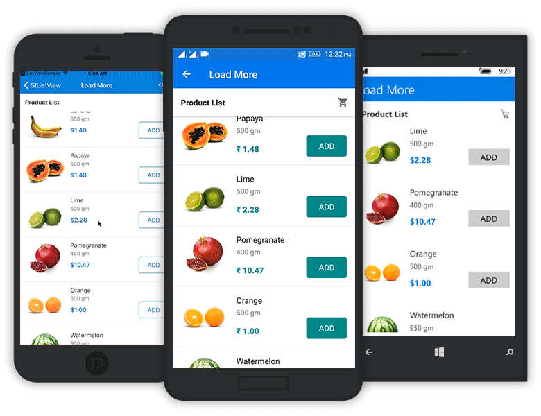
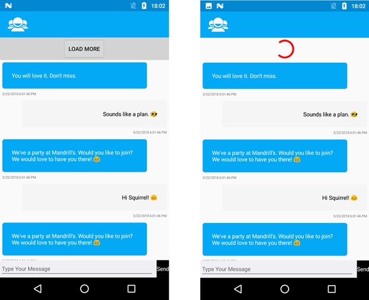

# Load More

The SfListView enables `Load More` view by setting the [SfListView.LoadMoreOption](https://help.syncfusion.com/cr/cref_files/xamarin/sflistview/Syncfusion.SfListView.XForms~Syncfusion.ListView.XForms.SfListView~LoadMoreOption.html), [SfListView.LoadMoreCommand](https://help.syncfusion.com/cr/cref_files/xamarin/sflistview/Syncfusion.SfListView.XForms~Syncfusion.ListView.XForms.SfListView~LoadMoreCommand.html), and [IsBusy](https://help.syncfusion.com/cr/cref_files/xamarin/sflistview/Syncfusion.SfListView.XForms~Syncfusion.ListView.XForms.SfListView~IsBusy.html) properties. The `Load More` view will be displayed when reaching the end of the list and provides option to add the items at runtime.

The `SfListView.LoadMoreOption` property has three different modes of operation listed as follows:

 * None: Disables the load more button. This is the default value.
 * Manual: Displays the load more button when reaching the end of the list and execute `SfListView.LoadMoreCommand` when tapping the button.
 * Auto: Automatically execute the `SfListView.LoadMoreCommand` when reaching end of the list.

## Load more automatically

To automatically load more items using the [SfListView.LoadMoreCommand](https://help.syncfusion.com/cr/cref_files/xamarin/sflistview/Syncfusion.SfListView.XForms~Syncfusion.ListView.XForms.SfListView~LoadMoreCommand.html) and [SfListView.LoadMoreCommandParameter](https://help.syncfusion.com/cr/cref_files/xamarin/sflistview/Syncfusion.SfListView.XForms~Syncfusion.ListView.XForms.SfListView~LoadMoreCommandParameter.html) when reaching end of the list, set the [SfListView.LoadMoreOption](https://help.syncfusion.com/cr/cref_files/xamarin/sflistview/Syncfusion.SfListView.XForms~Syncfusion.ListView.XForms.SfListView~LoadMoreOption.html) property as `Auto`.



<?xml version="1.0" encoding="utf-8" ?>
<ContentPage xmlns:syncfusion="clr-namespace:Syncfusion.ListView.XForms;assembly=Syncfusion.SfListView.XForms">

  <syncfusion:SfListView x:Name="listView"
                 ItemSize="120"
                 LoadMoreOption="Auto"
                 LoadMoreCommand="{Binding LoadMoreItemsCommand}"
                 LoadMoreCommandParameter="{Binding Source={x:Reference listView}}"
                 IsBusy="{Binding IsBusy}"
                 ItemsSource="{Binding Products}"/>
</ContentPage>


listView.LoadMoreOption = LoadMoreOption.Auto;
listView.LoadMoreCommand = viewModel.LoadMoreItemsCommand;
listView.SetBinding(SfListView.IsBusyProperty, new Binding("IsBusy"));

//ViewModel.cs
private bool isBusy;
public bool IsBusy
{
   get { return isBusy; }
   set
   {
       this.isBusy = value;
       RaisePropertyChanged("IsBusy");
   }
}
LoadMoreItemsCommand = new Command<object>(LoadMoreItems, CanLoadMoreItems);

private bool CanLoadMoreItems(object obj)
{
    if (Products.Count >= totalItems)
        return false;
    return true;
}

private async void LoadMoreItems(object obj)
{
    var listView = obj as Syncfusion.ListView.XForms.SfListView;
    IsBusy = true;
    await Task.Delay(2500);
    var index = Products.Count;
    var count = index + 3 >= totalItems ? totalItems - index : 3;
    AddProducts(index, count);
    IsBusy = false;
}

private void AddProducts(int index, int count)
{
    for (int i = index; i < index + count; i++)
    {
        var name = Names[i];
        var p = new Product()
        {
            Name = name,
            Weight = Weights[i],
            Price = Prices[i],
            Image = ImageSource.FromResource("LoadMoreUG.LoadMore." + name.Replace(" ", string.Empty) + ".jpg")
        };
    
    Products.Add(p);
    }
}



## Load more manually

To load more items manually using the [SfListView.LoadMoreCommand](https://help.syncfusion.com/cr/cref_files/xamarin/sflistview/Syncfusion.SfListView.XForms~Syncfusion.ListView.XForms.SfListView~LoadMoreCommand.html) and [SfListView.LoadMoreCommandParameter](https://help.syncfusion.com/cr/cref_files/xamarin/sflistview/Syncfusion.SfListView.XForms~Syncfusion.ListView.XForms.SfListView~LoadMoreCommandParameter.html) when tapping the load more button at end of the list, set the [SfListView.LoadMoreOption](https://help.syncfusion.com/cr/cref_files/xamarin/sflistview/Syncfusion.SfListView.XForms~Syncfusion.ListView.XForms.SfListView~LoadMoreOption.html) property as `Manual`.



<?xml version="1.0" encoding="utf-8" ?>
<ContentPage xmlns:syncfusion="clr-namespace:Syncfusion.ListView.XForms;assembly=Syncfusion.SfListView.XForms">

  <syncfusion:SfListView x:Name="listView"
                 ItemSize="120"
                 LoadMoreOption="Manual"
                 LoadMoreCommand="{Binding LoadMoreItemsCommand}"
                 LoadMoreCommandParameter="{Binding Source={x:Reference listView}}"
                 IsBusy="{Binding IsBusy}"
                 ItemsSource="{Binding Products}"/>
</ContentPage>


listView.LoadMoreOption = LoadMoreOption.Manual;
listView.LoadMoreCommand = viewModel.LoadMoreItemsCommand;
listView.SetBinding(SfListView.IsBusyProperty, new Binding("IsBusy"));

//ViewModel.cs
private bool isBusy;
public bool IsBusy
{
   get { return isBusy; }
   set
   {
       this.isBusy = value;
       RaisePropertyChanged("IsBusy");
   }
}

LoadMoreItemsCommand = new Command<object>(LoadMoreItems, CanLoadMoreItems);

private bool CanLoadMoreItems(object obj)
{
    if (Products.Count >= totalItems)
        return false;
    return true;
}

private async void LoadMoreItems(object obj)
{
    var listView = obj as Syncfusion.ListView.XForms.SfListView;
    IsBusy = true;
    await Task.Delay(2500);
    var index = Products.Count;
    var count = index + 3 >= totalItems ? totalItems - index : 3;
    AddProducts(index, count);
    IsBusy = false;
}

private void AddProducts(int index, int count)
{
    for (int i = index; i < index + count; i++)
    {
        var name = Names[i];
        var p = new Product()
        {
            Name = name,
            Weight = Weights[i],
            Price = Prices[i],
            Image = ImageSource.FromResource("LoadMoreUG.LoadMore." + name.Replace(" ", string.Empty) + ".jpg")
        };
    
    Products.Add(p);
    }
}



## Show loading indicator

The [SfListView.LoadMoreIndicator](https://help.syncfusion.com/cr/cref_files/xamarin/sflistview/Syncfusion.SfListView.XForms~Syncfusion.ListView.XForms.LoadMoreIndicator.html) will be displayed when loading more items into the list. Before loading more items, change the visibility of `LoadMoreIndicator` by setting the [SfListView.IsBusy](https://help.syncfusion.com/cr/cref_files/xamarin/sflistview/Syncfusion.SfListView.XForms~Syncfusion.ListView.XForms.SfListView~IsBusy.html) property to `true`. After loading more items, reset to `false`. 



private async void LoadMoreItems(object obj)
{
    var listView = obj as Syncfusion.ListView.XForms.SfListView;
    IsBusy = true;
    await Task.Delay(2500);
    var index = Products.Count;
    var count = index + 3 >= totalItems ? totalItems - index : 3;
    AddProducts(index, count);
    IsBusy = false;
}



Download the entire source code of this demo from [here](http://www.syncfusion.com/downloads/support/directtrac/general/ze/LoadMoreUG978011112).

## Load more view customization

The SfListView allows customizing User Interface(UI) of `Load More` view.

### Load more button

To customize the load more button, add the custom UI in the [SfListView.LoadMoreTemplate](https://help.syncfusion.com/cr/cref_files/xamarin/sflistview/Syncfusion.SfListView.XForms~Syncfusion.ListView.XForms.SfListView~LoadMoreTemplate.html) property. 



<ContentPage xmlns="http://xamarin.com/schemas/2014/forms"
             xmlns:x="http://schemas.microsoft.com/winfx/2009/xaml"
             x:Class="Sample.MainPage"
             xmlns:helper="clr-namespace:Syncfusion.ListView.XForms.Helpers;assembly=Syncfusion.SfListView.XForms"
             xmlns:syncfusion="clr-namespace:Syncfusion.ListView.XForms;assembly=Syncfusion.SfListView.XForms">
    <ContentPage.BindingContext>
        <local:LoadMoreViewModel/>
    </ContentPage.BindingContext>
    <ContentPage.Resources>
        <ResourceDictionary>
            <helper:InverseBoolConverter x:Key="inverseBoolConverter"/>
        </ResourceDictionary>
    </ContentPage.Resources>
    <syncfusion:SfListView x:Name="listView" 
                           ItemSize="120"
                           LoadMoreOption="Manual"
                           LoadMoreCommand="{Binding LoadMoreItemsCommand}"
                           LoadMoreCommandParameter="{Binding Source={x:Reference listView}}"
                           IsBusy="{Binding IsBusy}"
                           ItemsSource="{Binding Products}">
        <syncfusion:SfListView.LoadMoreTemplate>
            <DataTemplate>
                <Grid>
                    <Label Text="Load More Items..." TextColor="Black" HorizontalTextAlignment="Center" VerticalTextAlignment="Center" IsVisible="{Binding IsBusy, Converter={StaticResource inverseBoolConverter}}" />
                </Grid>
            </DataTemplate>
        </syncfusion:SfListView.LoadMoreTemplate>
    </syncfusion:SfListView>
</ContentPage>


listView.LoadMoreTemplate = new DataTemplate(() =>
{
    var grid = new Grid();
    var label = new Label
    {
        Text = "Load More Items...",
        FontSize = 20,
        BackgroundColor = Color.AliceBlue,
        HorizontalTextAlignment = TextAlignment.Center,
        VerticalTextAlignment = TextAlignment.Center
    };
    label.SetBinding(Label.IsVisibleProperty, new Binding("IsBusy", BindingMode.Default, new InverseBoolConverter()));
    grid.Children.Add(label);
    return grid;
});



### Loading Indicator

To customize the loading indicator, add the custom UI in the [SfListView.LoadMoreTemplate](https://help.syncfusion.com/cr/cref_files/xamarin/sflistview/Syncfusion.SfListView.XForms~Syncfusion.ListView.XForms.SfListView~LoadMoreTemplate.html) property.



<ContentPage xmlns="http://xamarin.com/schemas/2014/forms"
             xmlns:x="http://schemas.microsoft.com/winfx/2009/xaml"
             x:Class="Sample.MainPage"
             xmlns:helper="clr-namespace:Syncfusion.ListView.XForms.Helpers;assembly=Syncfusion.SfListView.XForms"
             xmlns:syncfusion="clr-namespace:Syncfusion.ListView.XForms;assembly=Syncfusion.SfListView.XForms">
    <ContentPage.BindingContext>
        <local:LoadMoreViewModel/>
    </ContentPage.BindingContext>
    <ContentPage.Resources>
        <ResourceDictionary>
            <helper:InverseBoolConverter x:Key="inverseBoolConverter"/>
        </ResourceDictionary>
    </ContentPage.Resources>
    <syncfusion:SfListView x:Name="listView" 
                           ItemSize="120"
                           LoadMoreOption="Manual"
                           LoadMoreCommand="{Binding LoadMoreItemsCommand}"
                           LoadMoreCommandParameter="{Binding Source={x:Reference listView}}"
                           IsBusy="{Binding IsBusy}"
                           ItemsSource="{Binding Products}">
        <syncfusion:SfListView.LoadMoreTemplate>
            <DataTemplate>
                <Grid>
                    <Label Text="Load More Items" TextColor="Black" HorizontalTextAlignment="Center" VerticalTextAlignment="Center" IsVisible="{Binding IsBusy, Converter={StaticResource inverseBoolConverter}}" />
                    <syncfusion:LoadMoreIndicator IsRunning="{Binding IsBusy}" IsVisible="{Binding IsBusy}" Color="Red" VerticalOptions="Center"/>                             
                </Grid>
            </DataTemplate>
        </syncfusion:SfListView.LoadMoreTemplate>
    </syncfusion:SfListView>
</ContentPage>


listView.LoadMoreTemplate = new DataTemplate(() =>
{
    var grid = new Grid();
    var label = new Label
    {
        Text = "Load More Items...",
        FontSize = 20,
        BackgroundColor = Color.AliceBlue,
        HorizontalTextAlignment = TextAlignment.Center,
        VerticalTextAlignment = TextAlignment.Center
    };
    label.SetBinding(Label.IsVisibleProperty, new Binding("IsBusy", BindingMode.Default, new InverseBoolConverter()));
    var loadMoreIndicator = new LoadMoreIndicator();
    loadMoreIndicator.Color = Color.Red;
    loadMoreIndicator.VerticalOptions = LayoutOptions.Center;
    loadMoreIndicator.SetBinding(LoadMoreIndicator.IsRunningProperty, new Binding("IsBusy"));
    loadMoreIndicator.SetBinding(LoadMoreIndicator.IsVisibleProperty, new Binding("IsBusy"));
    grid.Children.Add(label);
    grid.Children.Add(loadMoreIndicator);
    return grid;
});



## Disable load more at runtime

To disable the `Load More` view, return the 'CanExecute' method of the [SfListView.LoadMoreCommand](https://help.syncfusion.com/cr/cref_files/xamarin/sflistview/Syncfusion.SfListView.XForms~Syncfusion.ListView.XForms.SfListView~LoadMoreCommand.html) to `false`.

If you reach maximum count (for example, totalItems = 22) in the list, follow the code example to disable the `Load More` view.



LoadMoreItemsCommand = new Command<object>(LoadMoreItems, CanLoadMoreItems);

private async void LoadMoreItems(object obj)
{
    var listView = obj as Syncfusion.ListView.XForms.SfListView;
    IsBusy = true;
    await Task.Delay(2500);
    var index = Products.Count;
    var count = index + 3 >= totalItems ? totalItems - index : 3;
    AddProducts(index, count);
    IsBusy = false;
}
private bool CanLoadMoreItems(object obj)
{
    if (Products.Count >= totalItems)
        return false;
    return true;
}



## Limitation

The SfListView does not support the [SfListView.LoadMoreOption](https://help.syncfusion.com/cr/cref_files/xamarin/sflistview/Syncfusion.SfListView.XForms~Syncfusion.ListView.XForms.SfListView~LoadMoreOption.html) in `Manual` mode when the [SfListView.Orientation](https://help.syncfusion.com/cr/cref_files/xamarin/sflistview/Syncfusion.SfListView.XForms~Syncfusion.ListView.XForms.Orientation.html) is `Horizontal`.

## How to

### load more on infinite scroll 

The SfListView allows adding more items infinite times either manually or automatically. 



public class LoadMoreViewModel:INotifyPropertyChanged
{
  public ObservableCollection<Product> Products { get; set; }
  public Command<object> LoadMoreItemsCommand { get; set; }

  public LoadMoreViewModel()
  {
     Products = new ObservableCollection<Product>();
     AddProducts(0, 10);
     LoadMoreItemsCommand = new Command<object>(LoadMoreItems);
  }
  private async void LoadMoreItems(object obj)
  {
     IsBusy = true;
     await Task.Delay(2500);
     AddProducts(11, 21);
     IsBusy = false;
  }
  private void AddProducts(int value, int count)
  {
     Random rand= new Random();
     for (int i = value; i < count; i++)
     {
        var name = Names[rand.Next(1,22)];
        var p = new Product()
        {
           Name = name,
           Weight = Weights[i],
           Price = Prices[i],
           Image = ImageSource.FromResource("LoadMoreUG.LoadMore." + name.Replace(" ", string.Empty) + ".jpg")
        };
        Products.Add(p);
     }
  }
}



You can download the entire sample from [here](http://www.syncfusion.com/downloads/support/directtrac/general/ze/LoadMore_Infinitescroll423993966).

### Load more items automatically from up direction

The SfListView allows loading more items automatically when reaching top of the list by showing the busy indicator by loading in the [HeaderTemplate](https://help.syncfusion.com/cr/cref_files/xamarin/sflistview/Syncfusion.SfListView.XForms~Syncfusion.ListView.XForms.SfListView~HeaderTemplate.html).



<?xml version="1.0" encoding="utf-8" ?>
<ContentPage xmlns:syncfusion="clr-namespace:Syncfusion.ListView.XForms;assembly=Syncfusion.SfListView.XForms">

<syncfusion:SfListView x:Name="listView" 
                   ItemsSource="{Binding BookInfo}" />
                   <syncfusion:SfListView x:Name="ListView" IsBusy="True" 
                       ItemsSource="{Binding Messages}" 
                       AutoFitMode="Height">
  <syncfusion:SfListView.HeaderTemplate>
    <DataTemplate>
      <ViewCell>
        <Grid>
          <syncfusion:LoadMoreIndicator Color="Red" IsRunning="True" IsVisible="{Binding IndicatorIsVisible}"/>
        </Grid>
      </ViewCell>
    </DataTemplate>
  </syncfusion:SfListView.HeaderTemplate>
</syncfusion:SfListView>
</ContentPage


public partial class MainPage : ContentPage
{
  MainPageViewModel ViewModel;
  public MainPage()
  {
    InitializeComponent();
    ViewModel = new MainPageViewModel();
    ListView.IsBusy = true;
    ListView.ItemsSource = ViewModel.Messages;
    ListView.AutoFitMode = AutoFitMode.Height;
    ListView.HeaderTemplate = new DataTemplate(() =>
    {
      var grid = new Grid();
      var loadMoreIndicator = new LoadMoreIndicator()
      {
        Color = Color.Red,
        IsRunning = true
      };
      loadMoreIndicator.SetBinding(LoadMoreIndicator.IsVisibleProperty, new Binding("IndicatorIsVisible"));
      grid.Children.Add(loadMoreIndicator);
      return grid;
    });
  }
}



Insert each new item in the 0th position of the underlying collection bound to the `SfListView.ItemsSource` property.



public partial class MainPage : ContentPage
{
  MainPageViewModel ViewModel;
  VisualContainer visualContainer;
  public bool isScrolled;
  HeaderItem headerItem;

  public MainPage()
  {
    InitializeComponent();
    ViewModel = new MainPageViewModel();
    BindingContext = ViewModel;
    ViewModel.ListView = this.ListView;
    ListView.Loaded += ListView_Loaded;
  }

  private void HeaderItem_PropertyChanged(object sender, System.ComponentModel.PropertyChangedEventArgs e)
  {
    if(e.PropertyName=="Visibility")
    {
      if (headerItem.Visibility && isScrolled)
        LoadMoreOnTop();
    }
  }
        
  private async void LoadMoreOnTop()
  {
    //To get the current first item which is visible in the View.
    var firstItem = ListView.DataSource.DisplayItems[0];
    ViewModel.IndicatorIsVisible = true;
    await Task.Delay(4000);
    var r = new Random();

    //To avoid layout calls for arranging each and every items to be added in the View. 
    ListView.DataSource.BeginInit();
    for (int i = 0; i < 5; i++)
    {
      var collection = new Message();
      collection.Text = ViewModel.MessageText[r.Next(0, ViewModel.MessageText.Count() - 1)];
      collection.IsIncoming = i % 2 == 0 ? true : false;
      collection.MessageDateTime = DateTime.Now.ToString();
      ViewModel.Messages.Insert(0, collection);
    }
    ListView.DataSource.EndInit();

    var firstItemIndex = ListView.DataSource.DisplayItems.IndexOf(firstItem);
    var header = (ListView.HeaderTemplate != null && !ListView.IsStickyHeader) ? 1 : 0;
    var totalItems = firstItemIndex + header;
            
    //Need to scroll back to previous position else the ScrollViewer moves to top of the list.
    ListView.LayoutManager.ScrollToRowIndex(totalItems, true);
    ViewModel.IndicatorIsVisible = false;
  }

  private void ListView_Loaded(object sender, Syncfusion.ListView.XForms.ListViewLoadedEventArgs e)
  {
    //To avoid loading items initially when page loaded.
    if (!isScrolled)
      (ListView.LayoutManager as LinearLayout).ScrollToRowIndex(ViewModel.Messages.Count - 1, true);
    headerItem = visualContainer.Children[0] as HeaderItem;
    headerItem.PropertyChanged += HeaderItem_PropertyChanged;
    isScrolled = true;
  }
}



You can download the entire source code of this demo from [here](http://www.syncfusion.com/downloads/support/directtrac/general/ze/DataTemplateSelector1009153684).

### Load more items manually from up direction

The SfListView allows loading more items when tapping the button loaded in the [HeaderTemplate](https://help.syncfusion.com/cr/cref_files/xamarin/sflistview/Syncfusion.SfListView.XForms~Syncfusion.ListView.XForms.SfListView~HeaderTemplate.html) when reaching top of the list and shows the busy indicator till the items are added into the collection.



<?xml version="1.0" encoding="utf-8" ?>
<ContentPage xmlns:syncfusion="clr-namespace:Syncfusion.ListView.XForms;assembly=Syncfusion.SfListView.XForms">
             
<syncfusion:SfListView x:Name="ListView"  IsBusy="True"
                       ItemTemplate="{StaticResource MessageTemplateSelector}" 
                       ItemsSource="{Binding Messages}"
                       ItemSize="100">
  <syncfusion:SfListView.HeaderTemplate>
    <DataTemplate>
      <ViewCell>
        <Grid>
          <Grid BackgroundColor="#d3d3d3" IsVisible="{Binding GridIsVisible}">
            <Button Text="Load More" Clicked="Button_Clicked" HorizontalOptions="CenterAndExpand" VerticalOptions="CenterAndExpand"/>
          </Grid>
          <syncfusion:LoadMoreIndicator Color="Red" IsRunning="True" IsVisible="{Binding IndicatorIsVisible}"/>
        </Grid>
      </ViewCell>
    </DataTemplate>
  </syncfusion:SfListView.HeaderTemplate>
</syncfusion:SfListView>
</ContentPage>


public partial class MainPage : ContentPage
{
  MainPageViewModel ViewModel;
  public MainPage()
  {
    InitializeComponent();
    ViewModel = new MainPageViewModel();
    ListView.IsBusy = true;
    ListView.ItemsSource = ViewModel.Messages;
    ListView.AutoFitMode = AutoFitMode.Height;
    ListView.HeaderTemplate = new DataTemplate(() =>
    {
      var grid = new Grid();
      grid.BackgroundColor = Color.FromHex("#d3d3d3");
      grid.SetBinding(Grid.IsVisibleProperty, new Binding("GridIsVisible"));
      var loadMore = new Button()
      {
        HorizontalOptions = LayoutOptions.CenterAndExpand,
        VerticalOptions = LayoutOptions.CenterAndExpand,
        Text = "LoadMore",
      };
      loadMore.Clicked += Button_Clicked;
      grid.Children.Add(loadMore);
      var grid1 = new Grid();
      var loadMoreIndicator = new LoadMoreIndicator()
      {
        Color = Color.Red,
        IsRunning = true
      };
      loadMoreIndicator.SetBinding(LoadMoreIndicator.IsVisibleProperty, new Binding("IndicatorIsVisible"));
      grid1.Children.Add(loadMoreIndicator);
      grid1.Children.Add(grid);
      return grid1;
    });
  }
}



Insert each new item in the 0th position of the underlying collection bound to the `SfListView.ItemsSource` property.



public partial class MainPage : ContentPage
{
  MainPageViewModel ViewModel;
  VisualContainer visualContainer;

  public MainPage()
  {
    InitializeComponent();
    ViewModel = new MainPageViewModel();
    BindingContext = ViewModel;
    ViewModel.ListView = this.ListView;
    ListView.Loaded += ListView_Loaded;
  }

  private void ListView_Loaded(object sender, Syncfusion.ListView.XForms.ListViewLoadedEventArgs e)
  {
    (ListView.LayoutManager as LinearLayout).ScrollToRowIndex(ViewModel.Messages.Count - 1, true);
  }

  private async void Button_Clicked(object sender, EventArgs e)
  {
    //To get the current first item which is visible in the View.
    var firstItem = ListView.DataSource.DisplayItems[0];
    ViewModel.GridIsVisible = false;
    ViewModel.IndicatorIsVisible = true;
    await Task.Delay(2000);
    var r = new Random();

    //To avoid layout calls for arranging each and every items to be added in the View. 
    ListView.DataSource.BeginInit();
    for (int i = 0; i < 5; i++)
    {
      var collection = new Message();
      collection.Text = ViewModel.MessageText[r.Next(0, ViewModel.MessageText.Count() - 1)];
      collection.IsIncoming = i % 2 == 0 ? true : false;
      collection.MessageDateTime = DateTime.Now.ToString();
      ViewModel.Messages.Insert(0, collection);
    }
    ListView.DataSource.EndInit();
    var firstItemIndex = ListView.DataSource.DisplayItems.IndexOf(firstItem);
    var header = (ListView.HeaderTemplate != null && !ListView.IsStickyHeader) ? 1 : 0;
    var totalItems = firstItemIndex + header;

    //Need to scroll back to previous position else the ScrollViewer moves to top of the list.
    ListView.LayoutManager.ScrollToRowIndex(totalItems, true);
    ViewModel.GridIsVisible = true;
    ViewModel.IndicatorIsVisible = false;
  }
}



You can download the entire source code of this demo from [here](http://www.syncfusion.com/downloads/support/directtrac/general/ze/DataTemplateSelector_Manual1650405033).

