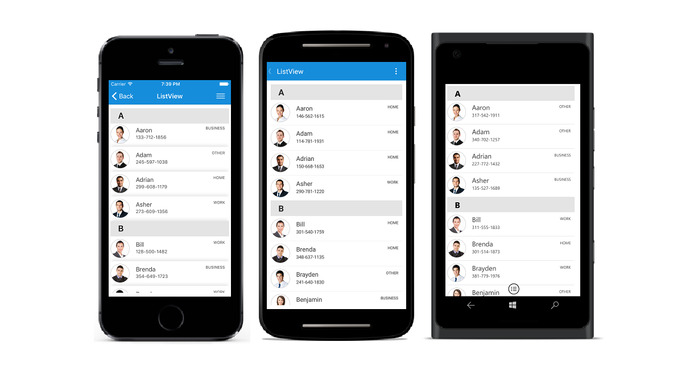

# SfListView

The SfListView for Xamarin.Forms renders set of data items with Xamarin.Forms views or custom templates. Data can be grouped, sorted, and filtered with ease.

## Key features

 * Optimized view reusing strategy for enhanced performance.

 * Item templating for rich UI(User Interface).

 * Supports dynamic selection of UI for each item using the `DataTemplateSelector`.

 * AutoFit items based on the content of 'ItemTemplate'.

 * Supports linear layout and grid layout.

 * Reordering items by dragging and dropping them in a linear layout with displaying custom UI in a template.

 * Orientation support.

 * Data operations such as sorting, grouping, and filtering.

 * Customizable group header with option to stick in view.

 * Selection with different selection modes and gestures.

 * Swiping template for loading views with custom actions.

 * Header and footer with sticky options.

 * Supports load more data automatically or manually at runtime when end of the list is reached.

 * Provides support for macOS platform. 

## Advantages of the SfListView over Xamarin.Forms ListView
 
 * Horizontal orientation support.

 * Support for different layouts such as linear layout and grid layout.

 * Supports for item swiping.
 
 * Supports for reordering items by drag and drop in linear layout.

 * Supports to load more items when reached scroll end.

 * Supports for sorting and filtering the data items.

 * Supports to stick the header, group header, and footer in view.

 * Supports to customize selection background color.

 * Supports to notify the scroll state changes.

