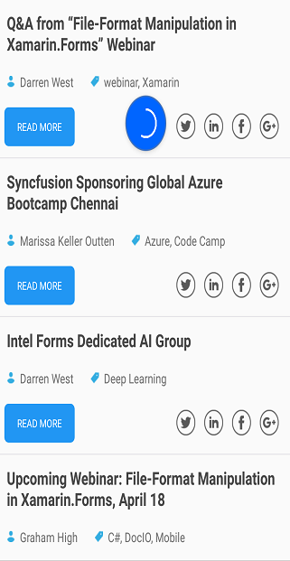

# PullToRefresh 

SfListView lets you to enable the `PullToRefresh` support by loading it directly into the [PullableContent](https://help.syncfusion.com/cr/cref_files/xamarin/sfpulltorefresh/Syncfusion.SfPullToRefresh.XForms~Syncfusion.SfPullToRefresh.XForms.SfPullToRefresh~PullableContent.html) as child element. At runtime, SfListView provides support for refreshing the data in view while performing the pull-to-refresh action.

N> You need to load the SfListView into the PullableContent as first children to render the pulltorefresh action properly. 



<pulltoRefresh:SfPullToRefresh x:Name="pullToRefresh"
                               ProgressBackgroundColor="#428BCA" RefreshContentHeight="50" 
                               RefreshContentWidth="50" TransitionMode="Push" IsRefreshing="False">
  <pulltoRefresh:SfPullToRefresh.PullableContent>
    <syncfusion:SfListView x:Name="listView" ItemSize="120"
                           SelectionMode="None">
    </syncfusion:SfListView>
  </pulltoRefresh:SfPullToRefresh.PullableContent>
</pulltoRefresh:SfPullToRefresh>


public ListViewPullToRefresh()
{
   InitializeComponent();
   //Initializing the PullToRefresh control.
   SfPullToRefresh pulltoRefresh = new SfPullToRefresh();
   pullToRefresh.RefreshContentHeight = 50;
   pullToRefresh.RefreshContentWidth = 50;
   pullToRefresh.TransitionMode = TransitionType.Push;
   pullToRefresh.IsRefreshing = false;
   
   //Initializing the SfListView control.
   var listView = new SfListView();
   listView.ItemSize = 120;
   listView.SelectionMode = SelectionMode.None;
   
   //loading listview into pulltorefresh
   pullToRefresh.PullableContent = listView;
}



### Adding the data into SfListView while progress indicator is being loaded

SfListView lets you refresh the data in view at runtime by using [Refreshing](https://help.syncfusion.com/cr/cref_files/xamarin/sfpulltorefresh/Syncfusion.SfPullToRefresh.XForms~Syncfusion.SfPullToRefresh.XForms.SfPullToRefresh~Refreshing_EV.html) event. The `Refreshing` event gets triggered once the progress bar meets 100 %. You can add the data into the underlying collection and the data gets updated in view once the `Refreshing` event gets completed.



pullToRefresh.Refreshing += PullToRefresh_Refreshing;

private async void PullToRefresh_Refreshing(object sender, EventArgs args)
{
   pullToRefresh.IsRefreshing = true;
   await Task.Delay(2000);
   var blogsTitleCount = pulltoRefreshViewModel.BlogsTitle.Count() - 1;

   if ((pulltoRefreshViewModel.BlogsInfo.Count - 1) == blogsTitleCount)
   {
      pullToRefresh.IsRefreshing = false;
      return;
   }

   var blogsCategoryCount = pulltoRefreshViewModel.BlogsCategory.Count() - 1;
   var blogsAuthorCount = pulltoRefreshViewModel.BlogsAuthers.Count() - 1;
   var blogsReadMoreCount = pulltoRefreshViewModel.BlogsReadMoreInfo.Count() - 1;

   for (int i = 0; i < 3; i++)
   {
      var blogsCount = pulltoRefreshViewModel.BlogsInfo.Count;
      var item = new ListViewBlogsInfo()
      {
         BlogTitle = pulltoRefreshViewModel.BlogsTitle[blogsTitleCount - blogsCount],
         BlogAuthor = pulltoRefreshViewModel.BlogsAuthers[blogsAuthorCount - blogsCount],
         BlogCategory = pulltoRefreshViewModel.BlogsCategory[blogsCategoryCount - blogsCount],
         ReadMoreContent = pulltoRefreshViewModel.BlogsReadMoreInfo[blogsReadMoreCount - blogsCount],
      };
      pulltoRefreshViewModel.BlogsInfo.Insert(0, item);
   }
   pullToRefresh.IsRefreshing = false;
}



Now run the application to render the following output. You can also download the entire source code of this demo from [here](http://files2.syncfusion.com/Xamarin.Forms/Samples/ListView_PullToRefresh.zip).

