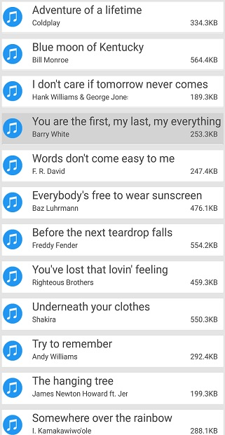
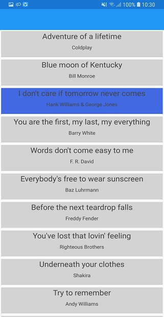
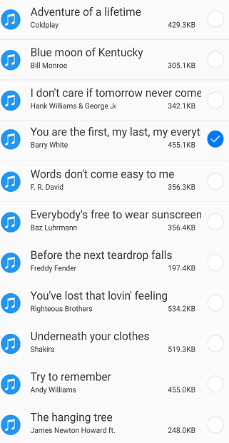

# Selection

This section explains how to perform selection and its related operations in the SfListView.

## UI selection

The SfListView allows selecting items either programmatically or by touch interactions. To enable selection, set the [SfListView.SelectionMode](https://help.syncfusion.com/cr/cref_files/xamarin/sflistview/Syncfusion.SfListView.XForms~Syncfusion.ListView.XForms.SfListView~SelectionMode.html) property value to other than `None`. The control has different selection modes to perform selection operations as listed as follows:

 * None: Allows disabling selection.
 * Single: Allows selecting single item only. When clicking on the selected item, selection not cleared. This is the default value for `SfListView.SelectionMode`.
 * SingleDeselect: Allows selecting single item only. When clicking on the selected item, selection gets cleared.
 * Multiple: Allows selecting more than one item. Selection is not cleared when selecting more than one items. When you click on the selected item, selection gets cleared.

The SfListView allows selecting items on different gestures such as tap, double tap, and hold. This can be achieved by setting the [SfListView.SelectionGesture](https://help.syncfusion.com/cr/cref_files/xamarin/sflistview/Syncfusion.SfListView.XForms~Syncfusion.ListView.XForms.SfListView~SelectionGesture.html). The default value for the `SfListView.SelectionGesture` is [TouchGesture.Tap](https://help.syncfusion.com/cr/cref_files/xamarin/sflistview/Syncfusion.SfListView.XForms~Syncfusion.ListView.XForms.TouchGesture.html).



listView.SelectionMode = SelectionMode.Multiple;
listView.SelectionGesture = TouchGesture.Hold;



The following screenshot shows the output rendered when the selection is performed on the items:

## Programmatic selection

When the [SfListView.SelectionMode](https://help.syncfusion.com/cr/cref_files/xamarin/sflistview/Syncfusion.SfListView.XForms~Syncfusion.ListView.XForms.SfListView~SelectionMode.html) is other than `None`, the item/items in the SfListView can be selected from the code by setting the [SfListView.SelectedItem](https://help.syncfusion.com/cr/cref_files/xamarin/sflistview/Syncfusion.SfListView.XForms~Syncfusion.ListView.XForms.SfListView~SelectedItem.html), or adding items to the [SfListView.SelectedItems](https://help.syncfusion.com/cr/cref_files/xamarin/sflistview/Syncfusion.SfListView.XForms~Syncfusion.ListView.XForms.SfListView~SelectedItems.html) property based on the `SfListView.SelectionMode`.

When the selection mode is `Single`, programmatically select an item by setting the underlying object to the `SfListView.SelectedItem` property. 



//Perform selection using selected item
listView.SelectedItem = viewModel.Items[5];



When the selection mode is `Multiple`, programmatically select more than one item by adding the underlying object to the `SfListView.SelectedItems` property. 


 
//Perform multiple selection using selected items
listView.SelectedItems.Add (viewModel.Items [4]);
listView.SelectedItems.Add (viewModel.Items[5]);



All items of the SfListView can be selected using [SelectAll](https://help.syncfusion.com/cr/cref_files/xamarin/sflistview/Syncfusion.SfListView.XForms~Syncfusion.ListView.XForms.SfListView~SelectAll.html) method.


 
listView.SelectAll();



## Selected items

### Get selected items

The SfListView gets all selected items through the [SfListView.SelectedItems](https://help.syncfusion.com/cr/cref_files/xamarin/sflistview/Syncfusion.SfListView.XForms~Syncfusion.ListView.XForms.SfListView~SelectedItems.html) property. Also gets the single item by using [SfListView.SelectedItem](https://help.syncfusion.com/cr/cref_files/xamarin/sflistview/Syncfusion.SfListView.XForms~Syncfusion.ListView.XForms.SfListView~SelectedItem.html) property.

### Clear selected items

The selected items can be cleared by calling the [SelectedItems.Clear()](https://help.syncfusion.com/cr/cref_files/xamarin/sflistview/Syncfusion.SfListView.XForms~Syncfusion.ListView.XForms.SfListView~SelectedItems.html) method.



listView.SelectedItems.Clear();



### CurrentItem vs SelectedItem

The SfListView gets the selected item by using the [SfListView.SelectedItem](https://help.syncfusion.com/cr/cref_files/xamarin/sflistview/Syncfusion.SfListView.XForms~Syncfusion.ListView.XForms.SfListView~SelectedItem.html) and [SfListView.CurrentItem](https://help.syncfusion.com/cr/cref_files/xamarin/sflistview/Syncfusion.SfListView.XForms~Syncfusion.ListView.XForms.SfListView~CurrentItem.html) properties. Both `SfListView.SelectedItem` and `SfListView.CurrentItem` returns the same data object when single item is selected. When more than one items are selected, then the `SfListView.SelectedItem` property returns the first selected item, and the `SfListView.CurrentItem` property returns the last selected item.

W> If you set any item which is not available in `SfListView.ItemsSource` to `SfListView.SelectedItem` or `SfListView.CurrentItem` property, exception will be thrown.

## Selected item customization 

To customize the selection background color for the selected items by using [SfListView.SelectedItemTemplate](https://help.syncfusion.com/cr/cref_files/xamarin/sflistview/Syncfusion.SfListView.XForms~Syncfusion.ListView.XForms.SfListView~SelectedItemTemplate.html) even when the color is set to the [SfListView.ItemTemplate](https://help.syncfusion.com/cr/cref_files/xamarin/sflistview/Syncfusion.SfListView.XForms~Syncfusion.ListView.XForms.SfListView~ItemTemplate.html).

To differentiate the customization of the selected item, `Gray` color is set to the `SfListView.ItemTemplate` and the `RoaylBlue` color is set to the `SfListView.SelectedItemTemplate`in the below code.



<ContentPage>
  <syncfusion:SfListView x:Name="listView">
   <syncfusion:SfListView.SelectedItemTemplate>
    <DataTemplate>
     <Grid x:Name="grid" BackgroundColor="RoyalBlue">
      <Grid.RowDefinitions>
         <RowDefinition Height="*" />
         <RowDefinition Height="*" />
         <RowDefinition Height="1" />
       </Grid.RowDefinitions>
      <Label Text="{Binding SongTitle}" />
      <Label Text="{Binding SongAuther}" Grid.Row="1"/>
      <Frame Grid.Row="2" HasShadow="True" HeightRequest="1"/>
     </Grid>
    </DataTemplate>
   </syncfusion:SfListView.SelectedItemTemplate>
  </syncfusion:SfListView>
</ContentPage>



You can download the entire sample from [here](http://www.syncfusion.com/downloads/support/directtrac/general/ze/CustomSelection-SelectionBackground715901267). The following output rendered when the background color is set to the selected item:

### Show checked circle on selected items 

To customize the appearance of the selected item/items by using the appearance of [SfListView.SelectedItemTemplate](https://help.syncfusion.com/cr/cref_files/xamarin/sflistview/Syncfusion.SfListView.XForms~Syncfusion.ListView.XForms.SfListView~SelectedItemTemplate.html). The following customizations should give an idea to customize the appearance of selected items in the control: 



<ContentPage>
  <syncfusion:SfListView x:Name="listView">
   <syncfusion:SfListView.SelectedItemTemplate>
    <DataTemplate>
     <Grid x:Name="grid">
      <Grid.ColumnDefinitions>
       <ColumnDefinition Width="40" />
       <ColumnDefinition Width="*" />    
       <ColumnDefinition Width="Auto" />
      </Grid.ColumnDefinitions>
      <Image Source="{Binding SongThumbnail}"/>
      <Grid Grid.Column="1">
       <Grid.RowDefinitions>
        <RowDefinition Height="*" />
        <RowDefinition Height="*" />
       </Grid.RowDefinitions>
       <Label Text="{Binding SongTitle}" />
       <Grid Grid.Row="1">
        <Grid.ColumnDefinitions>
         <ColumnDefinition Width="*" />
         <ColumnDefinition Width="*" />
        </Grid.ColumnDefinitions>
        <Label Text="{Binding SongAuther}" />
        <Label Grid.Column="1" Text="{Binding SongSize}"/>
       </Grid>
      </Grid>
      <Image Grid.Column="2" x:Name="selectionImage" IsVisible="True" Source="Selected.png"/>
     </Grid>
    </DataTemplate>
   </syncfusion:SfListView.SelectedItemTemplate>
  </syncfusion:SfListView>
</ContentPage>



Now run the application to render the following output. You can download the entire source code of this demo from [here](http://www.syncfusion.com/downloads/support/directtrac/general/ze/CustomSelection-New-172474858).

## Selected item style

### Selection background

SfListView allows you change the selection background color for the selected items by using [SfListView.SelectionBackgroundColor](https://help.syncfusion.com/cr/cref_files/xamarin/sflistview/Syncfusion.SfListView.XForms~Syncfusion.ListView.XForms.SfListView~SelectionBackgroundColor.html) property. You can also able to change the selection background color at run time.



listView.SelectionBackgroundColor = Color.Blue;



### Programmatic animation

The SfListView allows programmatic animation in selection at runtime by using the virtual method [AnimateSelectedItem](https://help.syncfusion.com/cr/cref_files/xamarin/sflistview/Syncfusion.SfListView.XForms~Syncfusion.ListView.XForms.SelectionController~AnimateSelectedItem.html) of `SelectionController` class.

To animate selection by override the AnimateSelectedItem method, follow the code example:



listView.SelectionController = new SelectionControllerExt(listView);

public class SelectionControllerExt : SelectionController
{
   public SelectionControllerExt(SfListView listView) : base(listView)
   {
   }
   
   protected override void AnimateSelectedItem(ListViewItem selectedListViewItem)
   {
      base.AnimateSelectedItem(selectedListViewItem);
      selectedListViewItem.Opacity = 0;
      selectedListViewItem.FadeTo(1, 3000, Easing.SinInOut);
   }
}



The screenshot shows the output of programmatic animation in selection. You can download the sample for above source code from [here](http://www.syncfusion.com/downloads/support/directtrac/general/ze/Programatic_Animation1251260296).

## Events

### SelectionChanging event

The [SelectionChanging](https://help.syncfusion.com/cr/cref_files/xamarin/sflistview/Syncfusion.SfListView.XForms~Syncfusion.ListView.XForms.SfListView~SelectionChanging_EV.html) event is raised while selecting an item at the execution time before the item is selected. [ItemSelectionChangingEventArgs](https://help.syncfusion.com/cr/cref_files/xamarin/sflistview/Syncfusion.SfListView.XForms~Syncfusion.ListView.XForms.ItemSelectionChangingEventArgs.html) has the following members which provides the information for `SelectionChanging` event:

 * AddedItems: Gets collection of the underlying data objects where the selection is going to process.
 * RemovedItems: Gets collection of the underlying data objects where the selection is going to remove.

You can cancel the selection process within this event by setting `ItemSelectionChangingEventArgs.Cancel` property to true.

The `SelectionChanging` event used for the following use cases,
 * To disable the selection of the particular item by comparing the corresponding property with every item.

To hook the `SelectionChanging` event, and cancel selection of an item, follow the code example:



listView.SelectionChanging += ListView_SelectionChanging;  

private void ListView_SelectionChanging(object sender, ItemSelectionChangingEventArgs e)
{
  if (e.AddedItems.Count > 0 && e.AddedItems[0] == ViewModel.Items[0])
      e.Cancel = true;
}



### SelectionChanged event

The [SelectionChanged](https://help.syncfusion.com/cr/cref_files/xamarin/sflistview/Syncfusion.SfListView.XForms~Syncfusion.ListView.XForms.SfListView~SelectionChanged_EV.html) event will occur once selection process has been completed for the selected item in the SfListView. [ItemSelectionChangedEventArgs](https://help.syncfusion.com/cr/cref_files/xamarin/sflistview/Syncfusion.SfListView.XForms~Syncfusion.ListView.XForms.ItemSelectionChangedEventArgs.html) has the following members which provides information for `SelectionChanged` event:

 * AddedItems: Gets collection of the underlying data objects where the selection has been processed.
 * RemovedItems: Gets collection of the underlying data objects where the selection has been removed.

 The `SelectionChanged` event used for the following use cases,
  * To clear the selection of the selected item.
  * To remove the selected item.



listView.SelectionChanged += ListView_OnSelectionChanged;  

private void ListView_OnSelectionChanged(object sender, ItemSelectionChangedEventArgs e)
{
   listView.SelectedItems.Clear();
}



N> [SelectionChanging](https://help.syncfusion.com/cr/cref_files/xamarin/sflistview/Syncfusion.SfListView.XForms~Syncfusion.ListView.XForms.SfListView~SelectionChanging_EV.html) and [SelectionChanged](https://help.syncfusion.com/cr/cref_files/xamarin/sflistview/Syncfusion.SfListView.XForms~Syncfusion.ListView.XForms.SfListView~SelectionChanged_EV.html) events will be triggered only on UI interactions.

## How to

### Disable selection on particular item 

The selection of a particular set of items can be disabled based on the [SfListView.SelectedItems](https://help.syncfusion.com/cr/cref_files/xamarin/sflistview/Syncfusion.SfListView.XForms~Syncfusion.ListView.XForms.SfListView~SelectedItems.html) of underlying collections. To disable the selection, follow the code example.



public partial class MainPage : ContentPage
{
  public MainPage()
  {
    InitializeComponent();
  }

  private void listView_SelectionChanging(object sender, Syncfusion.ListView.XForms.ItemSelectionChangingEventArgs e)
  {
  if (e.AddedItems.Count > 0 && (e.AddedItems[0] as Contacts).Category == "Non-Selectable items")
      e.Cancel = true;
  }
}



You can download the entire sample from [here](http://www.syncfusion.com/downloads/support/directtrac/general/ze/SfListViewSample1729548537).

### Automatically scroll to bring a selected item into the view

To bring the [SfListView.SelectedItem](https://help.syncfusion.com/cr/cref_files/xamarin/sflistview/Syncfusion.SfListView.XForms~Syncfusion.ListView.XForms.SfListView~SelectedItem.html) automatically into the view when it changed at runtime by calling the [ScrollToRowIndex](https://help.syncfusion.com/cr/cref_files/xamarin/sflistview/Syncfusion.SfListView.XForms~Syncfusion.ListView.XForms.LayoutBase~ScrollToRowIndex.html) method.  

In linear layout, you can get the row index of `SfListView.SelectedItem` and resolve if header and group header are used. Provide row index to the `ScrollToRowIndex` as like below code snippets.



public partial class MainPage : ContentPage
{
  public MainPage()
  {
    InitializeComponent();
    listView.PropertyChanged += listView_PropertyChanged;
  }

  private void listView_PropertyChanged(object sender, System.ComponentModel.PropertyChangedEventArgs e)
  {
    if (e.PropertyName == "SelectedItem")
    {
       var selectedItemIndex = listView.DataSource.DisplayItems.IndexOf(listView.SelectedItem);
       selectedItemIndex += (listView.HeaderTemplate != null && !listView.IsStickyHeader || !listView.IsStickyGroupHeader) ? 1 : 0;
       selectedItemIndex -= (listView.GroupHeaderTemplate != null && listView.IsStickyGroupHeader) ? 1 : 0;
       (listView.LayoutManager as LinearLayout).ScrollToRowIndex(selectedItemIndex);
    }
  }
}



You can download the entire sample from [here](http://www.syncfusion.com/downloads/support/directtrac/general/ze/SfListViewSample-1451946805).