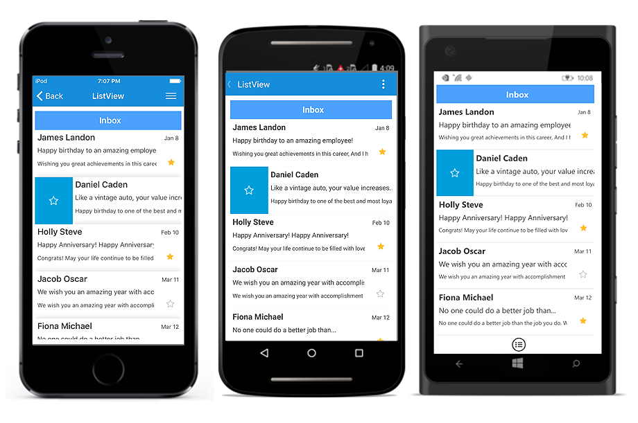
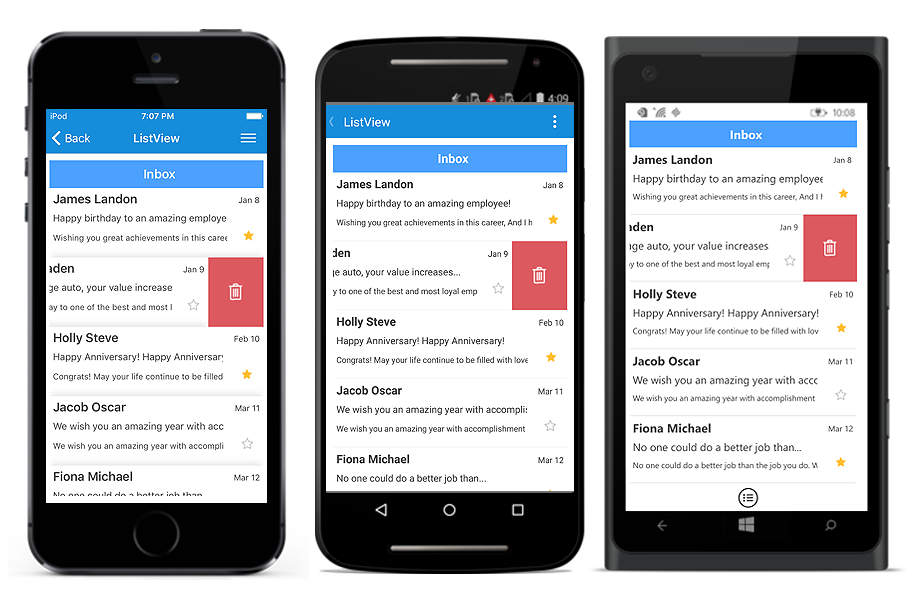

# Swiping

SfListView lets you enable the swiping option by setting the [AllowSwiping](https://help.syncfusion.com/cr/cref_files/xamarin/sflistview/Syncfusion.SfListView.XForms~Syncfusion.ListView.XForms.SfListView~AllowSwiping.html) property to `true`. Swipe views are displayed when swiping from ‘left to right’ or ‘right to left’ (For horizontal orientation, 'top to bottom' or 'bottom to top') on the item. 

It provides customizable swipe templates for swiping on the left and right side. You can restrict the layout of swipe view up to a certain position while swiping the item by setting the [SwipeThreshold](https://help.syncfusion.com/cr/cref_files/xamarin/sflistview/Syncfusion.SfListView.XForms~Syncfusion.ListView.XForms.SfListView~SwipeThreshold.html) property. You can set the size of the swipe views by setting the [SwipeOffset](https://help.syncfusion.com/cr/cref_files/xamarin/sflistview/Syncfusion.SfListView.XForms~Syncfusion.ListView.XForms.SfListView~SwipeOffset.html) property. 

## Defining the Swipe Template

SfListView enables you to load a desired content using the [LeftSwipeTemplate](https://help.syncfusion.com/cr/cref_files/xamarin/sflistview/Syncfusion.SfListView.XForms~Syncfusion.ListView.XForms.SfListView~LeftSwipeTemplate.html) when swiping towards right. The template can be defined either in code or XAML. The contents inside the swipe template are arranged based on the offset values when you swipe an item. You can reset the swiping item or swiped item by calling the [ResetSwipe](https://help.syncfusion.com/cr/cref_files/xamarin/sflistview/Syncfusion.SfListView.XForms~Syncfusion.ListView.XForms.SfListView~ResetSwipe.html) method.



<syncfusion:SfListView x:Name="listView" AllowSwiping="True">
  <syncfusion:SfListView.LeftSwipeTemplate>
    <DataTemplate x:Name="LeftSwipeTemplate">
      <Grid>
        <Grid BackgroundColor="#009EDA" HorizontalOptions="Fill" VerticalOptions="Fill" Grid.Column="0">
          <Grid VerticalOptions="Center" HorizontalOptions="Center">
            <Image Grid.Column="0"
                   Grid.Row="0"
                   BackgroundColor="Transparent"
                   HeightRequest="35"
                   WidthRequest="35"
                   Source="Favorites.png" />
          </Grid>
        </Grid>
      </Grid>
    </DataTemplate>
  </syncfusion:SfListView.LeftSwipeTemplate>
</syncfusion:SfListView>



//Defining left swipe template
listView.LeftSwipeTemplate = new DataTemplate(() =>
{
    var grid = new Grid();

    var grid1 = new Grid() { BackgroundColor = Color.FromHex("#009EDA"), HorizontalOptions = LayoutOptions.Fill, 
                             VerticalOptions = LayoutOptions.Fill };
    var favouritegrid = new Grid() { HorizontalOptions = LayoutOptions.Center, VerticalOptions = LayoutOptions.Center };
    var favouriteImage = new Image() { BackgroundColor = Color.Transparent, HeightRequest = 35, WidthRequest = 35 };
    favouriteImage.Source = ImageSource.FromResource("Swiping.Images.Favorites.png");
    favouritegrid.Children.Add(favouriteImage);
    grid1.Children.Add(favouritegrid);

    grid.Children.Add(grid1);

    return grid;

});



N> Similarly you can load a desired content using the [RightSwipeTemplate](https://help.syncfusion.com/cr/cref_files/xamarin/sflistview/Syncfusion.SfListView.XForms~Syncfusion.ListView.XForms.SfListView~RightSwipeTemplate.html) when swiping towards left.

The following screenshot shows the output rendered when `LeftSwipeTemplate` is applied.

## Swipe Events

### SwipeStarted Event

The [SwipeStarted](https://help.syncfusion.com/cr/cref_files/xamarin/sflistview/Syncfusion.SfListView.XForms~Syncfusion.ListView.XForms.SfListView~SwipeStarted_EV.html) event is raised when the swipe offset changes from its initial value. You can cancel the swipe action by setting the `Cancel` property of the [SwipeStartedEventArgs](https://help.syncfusion.com/cr/cref_files/xamarin/sflistview/Syncfusion.SfListView.XForms~Syncfusion.ListView.XForms.SwipeStartedEventArgs.html) to `true`. 

`SwipeStarted` event provides the following properties in their arguments:

* [ItemIndex](https://help.syncfusion.com/cr/cref_files/xamarin/sflistview/Syncfusion.SfListView.XForms~Syncfusion.ListView.XForms.SwipeStartedEventArgs~ItemIndex.html) - The swiping item index 
* [ItemData](https://help.syncfusion.com/cr/cref_files/xamarin/sflistview/Syncfusion.SfListView.XForms~Syncfusion.ListView.XForms.SwipeStartedEventArgs~ItemData.html) - The underlying data associated with the swiped item as its arguments 
* [SwipeDirection](https://help.syncfusion.com/cr/cref_files/xamarin/sflistview/Syncfusion.SfListView.XForms~Syncfusion.ListView.XForms.SwipeStartedEventArgs~SwipeDirection.html) - The swipe direction of the swiped item



<syncfusion:SfListView x:Name="listView" ItemsSource="{Binding InboxInfo}" 
                     SwipeStarted="ListView_SwipeStarted" />


listView.SwipeStarted += ListView_SwipeStarted;





private void ListView_SwipeStarted(object sender, SwipeStartedEventArgs e)
{
   if (e.ItemIndex == 1)
      e.Cancel = true;
}



### Swiping Event
 
The [Swiping](https://help.syncfusion.com/cr/cref_files/xamarin/sflistview/Syncfusion.SfListView.XForms~Syncfusion.ListView.XForms.SfListView~Swiping_EV.html) event is raised while swiping an item is in progress. This event is triggered with [SwipingEventArgs](https://help.syncfusion.com/cr/cref_files/xamarin/sflistview/Syncfusion.SfListView.XForms~Syncfusion.ListView.XForms.SwipingEventArgs.html).

`Swiping` event provides the following properties in their arguments:

* [ItemIndex](https://help.syncfusion.com/cr/cref_files/xamarin/sflistview/Syncfusion.SfListView.XForms~Syncfusion.ListView.XForms.SwipingEventArgs~ItemIndex.html) - The swiping item index 
* [ItemData](https://help.syncfusion.com/cr/cref_files/xamarin/sflistview/Syncfusion.SfListView.XForms~Syncfusion.ListView.XForms.SwipingEventArgs~ItemData.html) - The underlying data associated with the swiped item as its arguments 
* [SwipeDirection](https://help.syncfusion.com/cr/cref_files/xamarin/sflistview/Syncfusion.SfListView.XForms~Syncfusion.ListView.XForms.SwipingEventArgs~SwipeDirection.html) - The swipe direction of the swiped item
* [SwipeOffSet](https://help.syncfusion.com/cr/cref_files/xamarin/sflistview/Syncfusion.SfListView.XForms~Syncfusion.ListView.XForms.SwipingEventArgs~SwipeOffSet.html) - The current swipe offset of the item being swiped
* [Handled](https://help.syncfusion.com/cr/cref_files/xamarin/sflistview/Syncfusion.SfListView.XForms~Syncfusion.ListView.XForms.SwipingEventArgs~Handled.html) - If `true`, current swipe offset value remain same for the swiped item until the [SwipeEnded](https://help.syncfusion.com/cr/cref_files/xamarin/sflistview/Syncfusion.SfListView.XForms~Syncfusion.ListView.XForms.SfListView~SwipeEnded_EV.html) event is raised.



<syncfusion:SfListView x:Name="listView" ItemsSource="{Binding InboxInfo}" 
                     Swiping="ListView_Swiping" />


listView.Swiping += ListView_Swiping;





private void ListView_Swiping(object sender, SwipingEventArgs e)
{
   if (e.ItemIndex == 1 && e.SwipeOffSet > 70)
       e.Handled = true;
}



### SwipeEnded Event

The [SwipeEnded](https://help.syncfusion.com/cr/cref_files/xamarin/sflistview/Syncfusion.SfListView.XForms~Syncfusion.ListView.XForms.SfListView~SwipeEnded_EV.html) event is fired when the swipe action is completed. This event is triggered with [SwipeEndedEventArgs](https://help.syncfusion.com/cr/cref_files/xamarin/sflistview/Syncfusion.SfListView.XForms~Syncfusion.ListView.XForms.SwipeEndedEventArgs.html).

`SwipeEnded` event provides the following properties in their arguments: 

* [ItemIndex](https://help.syncfusion.com/cr/cref_files/xamarin/sflistview/Syncfusion.SfListView.XForms~Syncfusion.ListView.XForms.SwipeEndedEventArgs~ItemIndex.html) - The swiping item index 
* [ItemData](https://help.syncfusion.com/cr/cref_files/xamarin/sflistview/Syncfusion.SfListView.XForms~Syncfusion.ListView.XForms.SwipeEndedEventArgs~ItemData.html) - The underlying data associated with the swiped item as its arguments 
* [SwipeDirection](https://help.syncfusion.com/cr/cref_files/xamarin/sflistview/Syncfusion.SfListView.XForms~Syncfusion.ListView.XForms.SwipeEndedEventArgs~SwipeDirection.html) - The swipe direction of the swiped item
* [SwipeOffSet](https://help.syncfusion.com/cr/cref_files/xamarin/sflistview/Syncfusion.SfListView.XForms~Syncfusion.ListView.XForms.SwipeEndedEventArgs~SwipeOffset.html) - The current swipe offset of the item being swiped



<syncfusion:SfListView x:Name="listView" ItemsSource="{Binding InboxInfo}" 
                     SwipeEnded="ListView_SwipeEnded" />


listView.SwipeEnded += ListView_SwipeEnded;





private void ListView_SwipeEnded(object sender, SwipeEndedEventArgs e)
{
  if (e.SwipeOffset > 70)
      listView.ResetSwipe();
}



By handling the swipe events, you can make use of these property values from the arguments to perform any desired action such as deleting the item, inserting the data, etc. 

## Swipe Customizations

The following customizations should give you an idea on how to use the swiping event in SfListView.

### Multiple Views

You can use the swipe templates to customize your application by loading any view in the templates and assigning custom actions to them such as deleting the data, adding the data, etc. You can also display multiple views in a template like in the following example where two views are loaded for deleting the item and setting the favorites to the item respectively.


<syncfusion:SfListView x:Name="listView">
  <syncfusion:SfListView.LeftSwipeTemplate>
    <DataTemplate x:Name="LeftSwipeTemplate">
      <Grid>
        <Grid.ColumnDefinitions>
          <ColumnDefinition Width="*" />
          <ColumnDefinition Width="*" />
        </Grid.ColumnDefinitions>
        <Grid BackgroundColor="#009EDA" HorizontalOptions="Fill" VerticalOptions="Fill" Grid.Column="0">
          <Grid VerticalOptions="Center" HorizontalOptions="Center">
            <Image Grid.Column="0"
                   Grid.Row="0"
                   BackgroundColor="Transparent"
                   HeightRequest="35"
                   WidthRequest="35"
                   BindingContextChanged="leftImage_BindingContextChanged"
                   Source="Favorites.png" />
          </Grid>
        </Grid>
        <Grid BackgroundColor="#DC595F" HorizontalOptions="Fill" VerticalOptions="Fill" Grid.Column="1">
          <Grid VerticalOptions="Center" HorizontalOptions="Center">
            <Image Grid.Column="0"
                   Grid.Row="0"
                   HeightRequest="35"
                   WidthRequest="35"
                   BackgroundColor="Transparent"
                   BindingContextChanged="rightImage_BindingContextChanged"
                   Source="Delete.png" />
          </Grid>
        </Grid>
      </Grid>
    </DataTemplate>
  </syncfusion:SfListView.LeftSwipeTemplate>
</syncfusion:SfListView>


The following code snippet illustrates how to delete the item when `Delete` image is tapped and setting favorites to item when `Favorites` image is tapped.



Image leftImage;
Image rightImage;
int itemIndex = -1;
...
private void SetFavorites()
{
   if (itemIndex >= 0)
   {
       var item = viewModel.InboxInfo[itemIndex];
       item.IsFavorite = !item.IsFavorite;
   }
   this.listView.ResetSwipe();
}

private void Delete()
{
   if (itemIndex >= 0)
       viewModel.InboxInfo.RemoveAt(itemIndex);
   this.listView.ResetSwipe();
}

private void ListView_SwipeStarted(object sender, SwipeStartedEventArgs e)
{
   itemIndex = -1;
}

private void ListView_SwipeEnded(object sender, SwipeEndedEventArgs e)
{
   itemIndex = e.ItemIndex;
}

private void leftImage_BindingContextChanged(object sender, EventArgs e)
{
   if (leftImage == null)
   {
      leftImage = sender as Image;
      (leftImage.Parent as View).GestureRecognizers.Add(new TapGestureRecognizer() { Command = new Command(SetFavorites) });
      leftImage.Source = ImageSource.FromResource("Swiping.Images.Favorites.png");
   }
}

private void rightImage_BindingContextChanged(object sender, EventArgs e)
{
   if (rightImage == null)
   {
      rightImage = sender as Image;
      (rightImage.Parent as View).GestureRecognizers.Add(new TapGestureRecognizer() { Command = new Command(Delete) });
      rightImage.Source = ImageSource.FromResource("Swiping.Images.Delete.png");
   }
}



### Swipe Delete

You can perform operations such as deleting an item when swiping the data from one extent to other in the view by setting the [SwipeOffset](https://help.syncfusion.com/cr/cref_files/xamarin/sflistview/Syncfusion.SfListView.XForms~Syncfusion.ListView.XForms.SfListView~SwipeOffset.html) value to the view size and when [SwipeEnded](https://help.syncfusion.com/cr/cref_files/xamarin/sflistview/Syncfusion.SfListView.XForms~Syncfusion.ListView.XForms.SfListView~SwipeEnded_EV.html) event is raised delete the swiping item as like below example.


<syncfusion:SfListView x:Name="listView" 
                 AllowSwiping="True" SelectionMode="None" 
                 SwipeOffset="360" SwipeThreshold="30"
                 SwipeStarted="ListView_SwipeStarted" 
                 SwipeEnded="ListView_SwipeEnded" 
                 Swiping="ListView_Swiping">
  <syncfusion:SfListView.RightSwipeTemplate>
    <DataTemplate x:Name="RightSwipeTemplate">
      <Grid BackgroundColor="#DC595F" HorizontalOptions="Fill" VerticalOptions="Fill">
        <Grid VerticalOptions="Center" HorizontalOptions="Center">
          <Image Grid.Column="0"
                 Grid.Row="0"
                 HeightRequest="35"
                 WidthRequest="35"
                 BackgroundColor="Transparent"
                 Source="Delete.png" />
        </Grid>
      </Grid>
    </DataTemplate>
  </syncfusion:SfListView.RightSwipeTemplate>
</syncfusion:SfListView>




private void ListView_SwipeEnded(object sender, SwipeEndedEventArgs e)
{
  if (e.SwipeOffset >= 360)
  {
     viewModel.InboxInfo.RemoveAt(e.ItemIndex);
     listView.ResetSwipe();
  }
}



