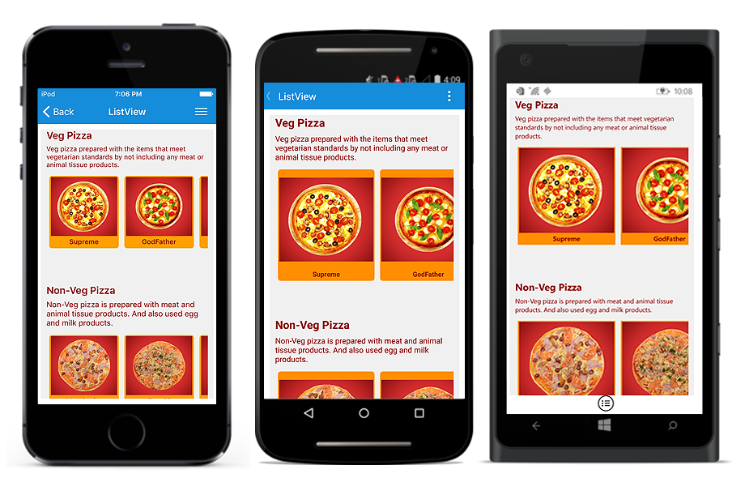
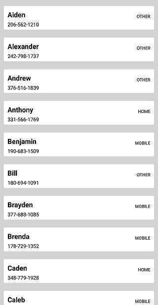
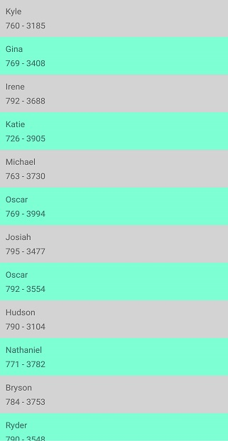
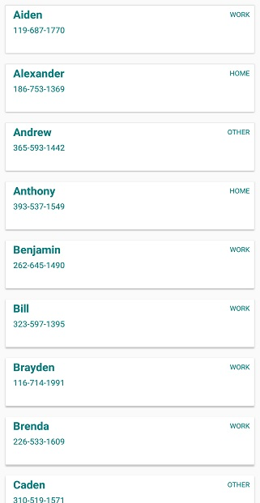
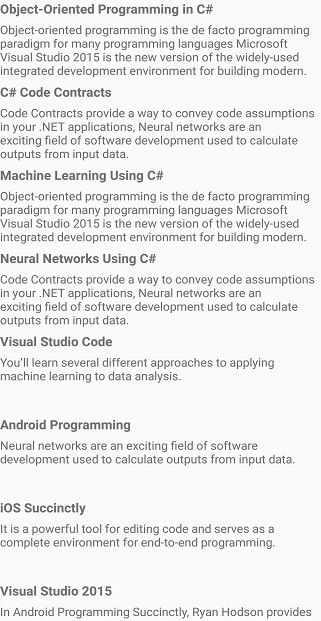
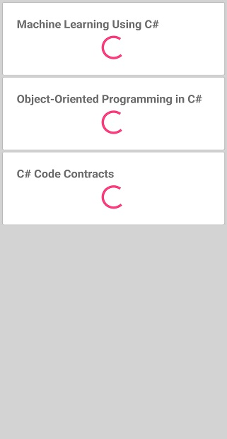

# View Appearance

The SfListView allows customizing appearance of the underlying data, and provides different functionalities to the end-user.

## Item template

A template can be used to present the data in a way that makes sense for the application by using different controls. The SfListView allows customizing appearance of view by setting the [ItemTemplate](https://help.syncfusion.com/cr/cref_files/xamarin/sflistview/Syncfusion.SfListView.XForms~Syncfusion.ListView.XForms.SfListView~ItemTemplate.html) property. By default, the [SfLabel](https://help.syncfusion.com/cr/cref_files/xamarin/sflistview/Syncfusion.SfListView.XForms~Syncfusion.ListView.XForms.SfLabel.html) is used to present the list of data.

## Data template selector

The SfListView allows customizing appearance of each item with different templates based on specific constraints using the [DataTemplateSelector](https://developer.xamarin.com/api/type/Xamarin.Forms.DataTemplateSelector/). You can choose a `DataTemplate` for each item at runtime based on the value of data-bound property using `DataTemplateSelector`.

### Create a data template selector

Create custom class that inherits from `DataTemplateSelector`, and override the `OnSelectTemplate` method to return the `DataTemplate` for that item. At runtime, the SfListView invokes the `OnSelectTemplate` method for each item and passes the data object as parameter.




class MyDataTemplateSelector : Xamarin.Forms.DataTemplateSelector
{

   private readonly DataTemplate incomingDataTemplate;
   private readonly DataTemplate outgoingDataTemplate;

   public MyDataTemplateSelector()
   {
      this.incomingDataTemplate = new DataTemplate(typeof(IncomingViewCell));
      this.outgoingDataTemplate = new DataTemplate(typeof(OutgoingViewCell));      
   }

   protected override DataTemplate OnSelectTemplate(object item, BindableObject container)
   {
      var message = item as Message;
      if (message == null)
         return null;
      return message.IsIncoming ? this.incomingDataTemplate : this.outgoingDataTemplate;
   }

}




### Applying the data template selector

Assign custom `DataTemplateSelector` to the [ItemTemplate](https://help.syncfusion.com/cr/cref_files/xamarin/sflistview/Syncfusion.SfListView.XForms~Syncfusion.ListView.XForms.SfListView~ItemTemplate.html) of the SfListView either in XAML or C#.



<ContentPage xmlns="http://xamarin.com/schemas/2014/forms"
             xmlns:x="http://schemas.microsoft.com/winfx/2009/xaml"
             x:Class="DataTemplateSelector.MainPage"
             xmlns:syncfusion="clr-namespace:Syncfusion.ListView.XForms;assembly=Syncfusion.SfListView.XForms"
             xmlns:local="clr-namespace:DataTemplateSelector;assembly=DataTemplateSelector">
  <ContentPage.Resources>
    <ResourceDictionary>
      <local:MyDataTemplateSelector x:Key="MessageTemplateSelector" />
    </ResourceDictionary>
  </ContentPage.Resources>
  <Grid>
    <syncfusion:SfListView x:Name="ListView"
                           ItemTemplate="{StaticResource MessageTemplateSelector}"
                           ItemsSource="{Binding Messages}"
                           ItemSize="100">
    </syncfusion:SfListView>
  </Grid>
</ContentPage>


public class MainPageCs : ContentPage
{
   public MainPageCs()
   {
      var viewModel = new MainPageViewModel();
      BindingContext = viewModel;
      Content = new SfListView()
      {
          ItemSize = 100,
          ItemsSource = viewModel.Messages,
          ItemTemplate = new MyDataTemplateSelector()
      };
   }
}



You can also download the entire source code of this demo from [here](http://www.syncfusion.com/downloads/support/directtrac/general/ze/Listview_DataTemplateSelector659971950).

## Orientation

The SfListView allows you to layout every item in the [SfListView.ItemsSource](https://help.syncfusion.com/cr/cref_files/xamarin/sflistview/Syncfusion.SfListView.XForms~Syncfusion.ListView.XForms.SfListView~ItemsSource.html) property either in vertical or horizontal orientation by setting the [SfListView.Orientation](https://help.syncfusion.com/cr/cref_files/xamarin/sflistview/Syncfusion.SfListView.XForms~Syncfusion.ListView.XForms.SfListView~Orientation.html). The default orientation is `Vertical`.



<syncfusion:SfListView x:Name="listView" Orientation="Horizontal" />


listView.Orientation = Orientation.Horizontal;



### Navigate across views (like TabView)

The SfListView allows you to layout the items like `TabView` in the horizontal direction by setting the [Orientation](https://help.syncfusion.com/cr/cref_files/xamarin/sflistview/Syncfusion.SfListView.XForms~Syncfusion.ListView.XForms.SfListView~Orientation.html) property as `Horizontal` using the [ItemTapped](https://help.syncfusion.com/cr/cref_files/xamarin/sflistview/Syncfusion.SfListView.XForms~Syncfusion.ListView.XForms.SfListView~ItemTapped_EV.html) event. It brings any desired view above the horizontal list as follows.



<ContentPage xmlns:syncfusion="clr-namespace:Syncfusion.ListView.XForms;assembly=Syncfusion.SfListView.XForms">
    <ContentPage.Content>
        <Grid x:Name="GridView">
            <Label Text="Tap image to expand"/>
            <Grid>
                <Image Source="{Binding ContactImage}" />
                <Label Text="{Binding ContactName}" />
                <Label Text="{Binding ContactNumber}" />
            </Grid>
            <listView:SfListView x:Name="listView" ItemTapped="list_ItemTapped" ItemSize="70" ItemsSource="{Binding ContactsInfo}">
                <listView:SfListView.ItemTemplate>
                    <DataTemplate x:Name="ItemTemplate"  x:Key="ItemTemplate" >
                        <ViewCell>
                            <ViewCell.View>
                                    <Image Source="{Binding ContactImage}" />
                            </ViewCell.View>
                        </ViewCell>
                    </DataTemplate>
                </listView:SfListView.ItemTemplate>
            </listView:SfListView>
        </Grid>
    </ContentPage.Content>
</ContentPage>


public partial class MainPage : ContentPage
{
    public MainPage()
    {
        InitializeComponent();
        list.BindingContext = new ContactsViewModel();

        var grid = new Grid();
        var label = new Label();
        label.Text = "Tap image to expand";
        var grid1 = new Grid();
        var image = new Image();
        image.SetBinding(Image.SourceProperty, new Binding("ContactImage"));
        var label1 = new Label();
        label.SetBinding(Label.TextProperty, new Binding("ContactName"));
        var label2 = new Label();
        label1.SetBinding(Label.TextProperty, new Binding("ContactNumber"));
        grid1.Children.Add(image);
        grid1.Children.Add(label1);
        grid1.Children.Add(label2);

        var listView = new SfListView();
        ContactsViewModel contactsViewModel = new ContactsViewModel();
        listView.ItemsSource = contactsViewModel.ContactsInfo;
        listView.ItemSize = 70;
        listView.ItemTapped += ListView_ItemTapped;
        listView.ItemTemplate = new DataTemplate(() =>
        {
            var viewCell = new ViewCell();
            var image1 = new Image();
            image1.SetBinding(Image.SourceProperty, new Binding("ContactImage"));
            viewCell.View = image1;
            return viewCell;
        });

        grid.Children.Add(label);
        grid.Children.Add(grid1);
        grid.Children.Add(listView);

    }

    private void list_ItemTapped(object sender, Syncfusion.ListView.XForms.ItemTappedEventArgs e)
    {
        GridView.BindingContext = e.ItemData;
    }
}



You can download the entire source code of this demo from [here](http://www.syncfusion.com/downloads/support/directtrac/general/ze/ListViewSample955275458).

### Horizontal list inside vertical list

The SfListView allows you to layout the items in horizontal list inside the vertical list. You can load the nested SfListView by customizing the [ItemTemplate](https://help.syncfusion.com/cr/cref_files/xamarin/sflistview/Syncfusion.SfListView.XForms~Syncfusion.ListView.XForms.SfListView~ItemTemplate.html) of outer SfListView. 

You should define the size for each inner SfListView or set the [AutoFitMode](https://help.syncfusion.com/cr/cref_files/xamarin/sflistview/Syncfusion.SfListView.XForms~Syncfusion.ListView.XForms.SfListView~AutoFitModeProperty.html) of inner SfListView as `Height`, and define the [ItemSize](https://help.syncfusion.com/cr/cref_files/xamarin/sflistview/Syncfusion.SfListView.XForms~Syncfusion.ListView.XForms.SfListView~ItemSize.html) for outer SfListView.




<ContentPage xmlns:syncfusion="clr-namespace:Syncfusion.ListView.XForms;assembly=Syncfusion.SfListView.XForms">
  <ContentPage.BindingContext>
    <local:ListViewModel x:Name="viewModel"/>
  </ContentPage.BindingContext>
    <Grid>
        <syncfusion:SfListView x:Name="listView" ItemsSource="{Binding OuterList}" ItemSize="100">
            <syncfusion:SfListView.ItemTemplate>
                <DataTemplate>
                    <Grid>
                        <Label Text="{Binding Label}" />
                        <syncfusion:SfListView ItemsSource="{Binding InnerList}" ItemSize="100" Orientation="Horizontal">
                            <syncfusion:SfListView.ItemTemplate>
                                <DataTemplate>
                                    <Grid>
                                        <Image Source="{Binding Image}"/>
                                    </Grid>
                                </DataTemplate>
                            </syncfusion:SfListView.ItemTemplate>
                        </syncfusion:SfListView>
                    </Grid>
                </DataTemplate>
            </syncfusion:SfListView.ItemTemplate>
        </syncfusion:SfListView>
    </Grid>
</ContentPage>



public partial class MainPage : ContentPage
{
    public MainPage()
    {
        InitializeComponent();

        var grid = new Grid();
        var label1 = new Label();
        label.SetBinding(Label.TextProperty, new Binding("Label"));
        var listView = new SfListView();
        listView.ItemsSource = OuterList;
        listView.ItemSize = 100;
        listView.ItemTemplate = new DataTemplate(() =>
        {
            var InnerListView = new SfListView();
            InnerListView.ItemSize = 100;
            InnerListView.ItemsSource = InnerList;
            InnerListView.Orientation = Orientation.Horizontal;
            listView.ItemTemplate = new DataTemplate(() =>
            {
                var grid1 = new Grid();
                var image = new Image();
                image.SetBinding(Image.SourceProperty, new Binding("Image"));
                grid1.Children.Add(image);
            }
            
            return InnerListView;
        });

        grid.Children.Add(label1);
        grid.Children.Add(listView);
    }

}



You can download the entire source code of this demo from [here](http://www.syncfusion.com/downloads/support/directtrac/general/ze/ListViewSample1987721770).

## Item appearance

### Item size

The SfListView allows customizing the size of items by setting the [ItemSize](https://help.syncfusion.com/cr/cref_files/xamarin/sflistview/Syncfusion.SfListView.XForms~Syncfusion.ListView.XForms.SfListView~ItemSize.html) property. The default value of this property is 40. This property can be customized at runtime.



<syncfusion:SfListView x:Name="listView" ItemSize="60" />


listView.ItemSize = 60;



N> For vertical orientation, the item size is considered as height. For horizontal orientation, it will be considered as width.

### Item spacing

The SfListView allows specifying space between each item in the list by setting the [ItemSpacing](https://help.syncfusion.com/cr/cref_files/xamarin/sflistview/Syncfusion.SfListView.XForms~Syncfusion.ListView.XForms.SfListView~ItemSpacing.html) property. Generate the space around the item. The default value of this property is 0. This property can be customized at runtime.



<syncfusion:SfListView x:Name="listView" ItemSpacing="5,0,0,0" />


listView.ItemSpacing = new Thickness(5, 0, 0, 0)



### Alternate row styling

The SfListView allows applying alternate row styling for items by finding the index of the underlying object using IValueConverter.




<ContentPage xmlns:syncfusion="clr-namespace:Syncfusion.ListView.XForms;assembly=Syncfusion.SfListView.XForms">
    <ContentPage.Resources>
        <ResourceDictionary>
            <local:IndexToColorConverter x:Key="IndexToColorConverter"/>
        </ResourceDictionary>
    </ContentPage.Resources>
    <ContentPage.Content>
        <listView:SfListView x:Name="listView" ItemsSource="{Binding Items}" ItemSize="50">
            <listView:SfListView.ItemTemplate>
                <DataTemplate>
                    <Grid BackgroundColor="{Binding .,Converter={StaticResource IndexToColorConverter},ConverterParameter={x:Reference Name=listView}}">
                        <Label Text="{Binding ContactName}" />
                        <Label Text="{Binding ContactNumber}" />
                    </Grid>
                </DataTemplate>
            </listView:SfListView.ItemTemplate>
        </listView:SfListView>
    </ContentPage.Content>
</ContentPage>



public partial class MainPage : ContentPage
{
    public MainPage()
    {
        InitializeComponent();

        ContactsViewModel viewModel = new ContactsViewModel();
        var listView = new SfListView();
        listView.ItemsSource = viewModel.Items;
        listView.ItemSize = 50;
        listView.ItemTemplate = new DataTemplate(() =>
        {
            var grid = new Grid();
            var label1 = new Label();
            label1.SetBinding(Label.TextProperty, new Binding("ContactName"));
            var label2 = new Label();
            label2.SetBinding(Label.TextProperty, new Binding("ContactNumber"));
            grid.SetBinding(Grid.BackgroundColorProperty, new Binding(".", BindingMode.Default, new IndexToColorConverter(), listView));

            return grid;
        });
    }
}




public class IndexToColorConverter : IValueConverter
{
    public object Convert(object value, Type targetType, object parameter, CultureInfo culture)
    {
        var listview = parameter as SfListView;
        var index = listview.DataSource.DisplayItems.IndexOf(value);

        if (index % 2 == 0)
            return Color.LightGray;
        return Color.Aquamarine;
    }

    public object ConvertBack(object value, Type targetType, object parameter, CultureInfo culture)
    {
    }
}


You can download the entire source code of this demo from [here](http://www.syncfusion.com/downloads/support/directtrac/general/ze/ListViewSample-491325735).

### Rounded corner on items

The SfListView allows customizing the item appearance like rounded corner by using the [Frame](https://developer.xamarin.com/api/type/Xamarin.Forms.Frame/) layout in the [ItemTemplate](https://help.syncfusion.com/cr/cref_files/xamarin/sflistview/Syncfusion.SfListView.XForms~Syncfusion.ListView.XForms.SfListView~ItemTemplate.html) property. By defining the CornerRadius property of frame layout, you can perform the rounded corner for items. 



<ContentPage xmlns:syncfusion="clr-namespace:Syncfusion.ListView.XForms;assembly=Syncfusion.SfListView.XForms">
    <ContentPage.Resources>
        <ResourceDictionary>
            <local:IndexToColorConverter x:Key="IndexToColorConverter"/>
        </ResourceDictionary>
    </ContentPage.Resources>
    <ContentPage.Content>
        <listView:SfListView x:Name="listView" ItemSize="60" ItemsSource="{Binding customerDetails}">
            <listView:SfListView.ItemTemplate>
                <DataTemplate>
                    <Frame x:Name="frame" CornerRadius="10" >
                        <StackLayout>
                                <Label Text="{Binding ContactName}" />
                                <Label Text="{Binding ContactNumber}" />
                                <Label Text="{Binding ContactType}" />
                        </StackLayout>
                    </Frame>
                </DataTemplate>
            </listView:SfListView.ItemTemplate>
        </listView:SfListView>
    </ContentPage.Content>
</ContentPage>


public partial class MainPage : ContentPage
{
    public MainPage()
    {
        InitializeComponent();

        var listView = new SfListView();
        listView.ItemsSource = customerDetails;
        listView.ItemSize = 60;
        listView.ItemTemplate = new DataTemplate(() =>
        {
            var frame = new Frame();
            frame.CornerRadius = 10;
            var stackLayout = new StackLayout();
            var label1 = new Label();
            label.SetBinding(Label.TextProperty, new Binding("ContactName"));
            var label2 = new Label();
            label.SetBinding(Label.TextProperty, new Binding("ContactName"));
            var label3 = new Label();
            label1.SetBinding(Label.TextProperty, new Binding("ContactType"));
            stackLayout.Children.Add(label1);
            stackLayout.Children.Add(label2);
            stackLayout.Children.Add(label3);
            frame.Children.Add(stackLayout);

            return frame;
        });
    }
}



You can download the entire source code of this demo from [here](http://www.syncfusion.com/downloads/support/directtrac/general/ze/Sorting1306703738).

### Drop shadow effect on items

The SfListView allows customizing the item appearance like shadow effect for items by setting the shadow property of frame as true in [ItemTemplate](https://help.syncfusion.com/cr/cref_files/xamarin/sflistview/Syncfusion.SfListView.XForms~Syncfusion.ListView.XForms.SfListView~ItemTemplate.html) property.

N> Define the frame within any view inside `ItemTemplate` with around some margin. 



<ContentPage  xmlns:syncfusion="clr-namespace:Syncfusion.ListView.XForms;assembly=Syncfusion.SfListView.XForms">
    <ContentPage.Resources>
        <ResourceDictionary>
            <local:IndexToColorConverter x:Key="IndexToColorConverter"/>
        </ResourceDictionary>
    </ContentPage.Resources>
    <ContentPage.Content>
        <listView:SfListView x:Name="listView" ItemSize="60" ItemsSource="{Binding customerDetails}">
            <listView:SfListView.ItemTemplate>
                <DataTemplate>
                    <Grid Padding="2" Margin="2" >
                        <Frame x:Name="frame" HasShadow="True" Padding="2" Margin="2">
                            <StackLayout>
                                <Label Text="{Binding ContactName}" /> 
                                <Label Text="{Binding ContactNumber}" />
                                <Label Text="{Binding ContactType}" />
                            </StackLayout>
                        </Frame>
                    </Grid>
                </DataTemplate>
            </listView:SfListView.ItemTemplate>
        </listView:SfListView>
    </ContentPage.Content>
</ContentPage>


public partial class MainPage : ContentPage
{
    public MainPage()
    {
        InitializeComponent();

        var listView = new SfListView();
        listView.ItemsSource = customerDetails;
        listView.ItemSize = 60;
        listView.ItemTemplate = new DataTemplate(() =>
        {
            var grid = new Grid();
            grid.Padding = 2;
            grid.Margin = 2;
            var frame = new Frame();
            frame.Padding = 2;
            frame.Margin = 2;
            frame.HasShadow = "True";
            var stackLayout = new StackLayout();
            var label1 = new Label();
            label.SetBinding(Label.TextProperty, new Binding("ContactName"));
            var label2 = new Label();
            label.SetBinding(Label.TextProperty, new Binding("ContactName"));
            var label3 = new Label();
            label1.SetBinding(Label.TextProperty, new Binding("ContactType"));
            stackLayout.Children.Add(label1);
            stackLayout.Children.Add(label2);
            stackLayout.Children.Add(label3);
            frame.Children.Add(stackLayout);
            grid.Children.Add(frame);

            return grid;
        });
    }
}



You can download the entire source code of this demo from [here](http://www.syncfusion.com/downloads/support/directtrac/general/ze/HasShadow864181381).

## ListViewItem customization

The SfListView allows customizing the [ListViewItem](https://help.syncfusion.com/cr/cref_files/xamarin/sflistview/Syncfusion.SfListView.XForms~Syncfusion.ListView.XForms.ListViewItem.html) based on the [ItemType](https://help.syncfusion.com/cr/cref_files/xamarin/sflistview/Syncfusion.SfListView.XForms~Syncfusion.ListView.XForms.ItemType.html). To customize the Header, Footer, GroupHeader, LoadMore, and ListViewItem follow the code example.



public partial class MainPage : ContentPage
{
    public MainPage()
    {
        InitializeComponent();
        this.listView.ItemGenerator = new ItemGeneratorExt(this.listView);
    }
}



### Extension class for ItemGenerator



public class ItemGeneratorExt : ItemGenerator
{
    public SfListView listView;
	
    public ItemGeneratorExt(SfListView listView) : base(listView)
    {
        this.listView = listView;
    }

    protected override ListViewItem OnCreateListViewItem(int itemIndex, ItemType type, object data = null)
    {
        if (type == ItemType.Header)
            return new HeaderItemExt(this.listView);
        else if (type == ItemType.Footer)
            return new FooterItemExt(this.listView);
        else if (type == ItemType.GroupHeader)
            return new GroupHeaderItemExt(this.listView);
        else if (type == ItemType.LoadMore)
            return new LoadMoreItemExt(this.listView);
        else if (type == ItemType.Record)
            return new ListViewItemExt(this.listView);
        return base.OnCreateListViewItem(itemIndex, type, data);
    }
}



### Extension class for HeaderItem



public class HeaderItemExt : HeaderItem
{
    private SfListView listView;

    public HeaderItemExt(SfListView listView)
    {
        this.listView = listView
    }

    protected override void OnItemAppearing()
    {
        base.OnItemAppearing();
        this.BackgroundColor = Color.Yellow;
    }
}



### Extension class for FooterItem



public class FooterItemExt : FooterItem
{
    private SfListView listView;

    public FooterItemExt(SfListView listView)
    {
        this.listView = listView
    }

    protected override void OnItemAppearing()
    {
        base.OnItemAppearing();
        this.BackgroundColor = Color.Yellow;
    }
}



### Extension class for GroupHeaderItem



public class GroupHeaderItemExt : GroupHeaderItem
{
    private SfListView listView;

    public GroupHeaderItemExt(SfListView listView)
    {
        this.listView = listView
    }

    protected override void OnItemAppearing()
    {
        base.OnItemAppearing();
        this.BackgroundColor = Color.Yellow;
    }
}



### Extension class for LoadMoreItem



public class LoadMoreItemExt : LoadMoreItem
{
    private SfListView listView;

    public LoadMoreItemExt(SfListView listView)
    {
        this.listView = listView
    }

    protected override void OnItemAppearing()
    {
        base.OnItemAppearing();
        this.BackgroundColor = Color.Yellow;
    }
}



### Extension class for ListViewItem



public class ListViewItemExt : ListViewItem
{
    private SfListView listView;

    public ListViewItemExt(SfListView listView)
    {
        this.listView = listView
    }

    protected override void OnItemAppearing()
    {
        base.OnItemAppearing();
        this.BackgroundColor = Color.Yellow;
    }
}



## Scrollbar visibility

The SfListView provides an option to enable or disable the `Scrollbar` visibility by using the [IsScrollBarVisible](https://help.syncfusion.com/cr/cref_files/xamarin/sflistview/Syncfusion.SfListView.XForms~Syncfusion.ListView.XForms.SfListView~IsScrollBarVisible.html) property. By default, the value will be `true`.  

N> Due to some restrictions in native ScrollView renderer in Xamarin.Forms, you cannot change the `IsScrollBarVisible` value at runtime. It can be defined only when initializing the SfListView. 



<syncfusion:SfListView x:Name="listView" IsScrollBarVisible="False" />


listView.IsScrollBarVisible = false; 



## How to

### show busy indicator on list view

The SfListView allows displaying the [SfBusyIndicator](https://help.syncfusion.com/cr/cref_files/xamarin/sfbusyindicator/Syncfusion.SfBusyIndicator.XForms~Syncfusion.SfBusyIndicator.XForms.SfBusyIndicator.html) when loading the bounded items. The busy indicator can be enabled and disabled by using [IsBusy](https://help.syncfusion.com/cr/cref_files/xamarin/sfbusyindicator/Syncfusion.SfBusyIndicator.XForms~Syncfusion.SfBusyIndicator.XForms.SfBusyIndicator~IsBusy.html) property.

Create a IsLoading boolean property in view model and bind it to the IsBusy property. By setting the value to IsLoading property, the busy indicator will be enabled and disabled into the view till the items loaded in the SfListView.



<ContentPage xmlns:listview="clr-namespace:Syncfusion.ListView.XForms;assembly=Syncfusion.SfListView.XForms"
             xmlns:busyIndicator="clr-namespace:Syncfusion.SfBusyIndicator.XForms;assembly=Syncfusion.SfBusyIndicator.XForms">
    <Grid>
        <listview:SfListView x:Name="listView" 
                             ItemsSource="{Binding ContactInfo}" 
                             ItemSize="110">
        </listview:SfListView>
        <busyIndicator:SfBusyIndicator x:Name="busyIndicator" 
                                       AnimationType="SingleCircle" 
                                       IsBusy="{Binding IsLoading, Mode=TwoWay}" 
                                       TextColor="Magenta"
                                       ViewBoxWidth="50"
                                       ViewBoxHeight="50"/>
    </Grid>
</ContentPage>



public class ViewModel : INotifyPropertyChanged
{
    private bool isLoading = false;

    public bool IsLoading
    {
        get { return isLoading; }
        set
        {
            this.isLoading = value;
            OnPropertyChanged("IsLoading");
        }
    }

    private async void GenerateItems()
    {
        IsLoading = true;
        await Task.Delay(5000);
        for (int i = 0; i < 30; i++)
        {
            var contact = new Model(CustomerNames[i], ContactNumber[i]);
            ContactInfo.Add(contact);
        }
        IsLoading = false;
    }
}



You can download the entire source code of this demo from [here](http://www.syncfusion.com/downloads/support/directtrac/general/ze/SfListViewSample-1603252624.zip).

    

### show busy indicator on list view items

The SfListView allows displaying an activity indicator for an item when its data is being loaded in the background. To perform this, load both `ActivityIndicator` and a `Button` in the same row of a `Grid` element inside the [ItemTemplate](https://help.syncfusion.com/cr/cref_files/xamarin/sflistview/Syncfusion.SfListView.XForms~Syncfusion.ListView.XForms.SfListView~ItemTemplate.html) of the SfListView. The busy indicator and button can be enabled and disabled by using properties IsButtonVisible and IsIndicatorVisible respectively in the model class.



public class BookInfo : INotifyPropertyChanged
{
    private string bookName;
    private string bookDescription;
    public bool isDescriptionVisible;
    public bool isButtonVisible;
    public bool isIndicatorVisible;

    public BookInfo()
    {
    }

    public string BookName
    {
        get { return bookName; }
        set
        {
            bookName = value;
            OnPropertyChanged("BookName");
        }
    }

    public bool IsDescriptionVisible
    {
        get { return isDescriptionVisible; }
        set
        {
            isDescriptionVisible = value;
            OnPropertyChanged("IsDescriptionVisible");
        }
    }

    public string BookDescription
    {
        get { return bookDescription; }
        set
        {
            bookDescription = value;
            OnPropertyChanged("BookDescription");
        }
    }

    public bool IsButtonVisible
    {
        get { return isButtonVisible; }
        set
        {
            isButtonVisible = value;
            OnPropertyChanged("IsButtonVisible");
        }
    }

    public bool IsIndicatorVisible
    {
        get { return isIndicatorVisible; }
        set
        {
            isIndicatorVisible = value;
            OnPropertyChanged("IsIndicatorVisible");
        }
    }

    public event PropertyChangedEventHandler PropertyChanged;

    public void OnPropertyChanged(string name)
    {
        if (this.PropertyChanged != null)
            this.PropertyChanged(this, new PropertyChangedEventArgs(name));
    }
}



Disable the visibility of Description and ActivityIndicator initially while adding items into collection.



public class BookInfoRepository : INotifyPropertyChanged
{
    private ObservableCollection<BookInfo> newBookInfo;
    public event PropertyChangedEventHandler PropertyChanged;

    public ObservableCollection<BookInfo> NewBookInfo
    {
        get { return newBookInfo; }
        set { this.newBookInfo = value; }
    }

    public void OnPropertyChanged(string name)
    {
        if (this.PropertyChanged != null)
            this.PropertyChanged(this, new PropertyChangedEventArgs(name));
    }

    public BookInfoRepository()
    {
        GenerateNewBookInfo();
    }

    private void GenerateNewBookInfo()
    {
        NewBookInfo = new ObservableCollection<BookInfo>();
        NewBookInfo.Add(new BookInfo() { BookName = "Machine Learning Using C#", BookDescription = "You’ll learn several different approaches to applying machine learning", IsIndicatorVisible = false, IsButtonVisible = true, IsDescriptionVisible = false });
        NewBookInfo.Add(new BookInfo() { BookName = "Object-Oriented Programming in C#", BookDescription = "Object-oriented programming is the de facto programming paradigm", IsIndicatorVisible = false, IsButtonVisible = true, IsDescriptionVisible = false });
        NewBookInfo.Add(new BookInfo() { BookName = "C# Code Contracts", BookDescription = "Code Contracts provide a way to convey code assumptions", IsIndicatorVisible = false, IsButtonVisible = true, IsDescriptionVisible = false });
    }
}



Bind the bool values for the IsVisible properties to switch between indicator and button while loading the description.




<ContentPage xmlns:syncfusion="clr-namespace:Syncfusion.ListView.XForms;assembly=Syncfusion.SfListView.XForms">  

    <ContentPage.BindingContext>
        <local:BookInfoRepository x:Name="ViewModel" />
    </ContentPage.BindingContext>
    <sync:SfListView x:Name="listView" AutoFitMode="Height" BackgroundColor="#d3d3d3" SelectionMode="None" ItemsSource="{Binding NewBookInfo}">
        <sync:SfListView.ItemTemplate>
            <DataTemplate>
                <Frame HasShadow="True" Margin="5,5,5,0">
                <Grid Padding="5">
                    <Grid.RowDefinitions>
                        <RowDefinition Height="*" />
                        <RowDefinition Height="2*" />
                    </Grid.RowDefinitions>
                    <Label Text="{Binding BookName}" FontAttributes="Bold" FontSize="19" />
                    <Button Grid.Row="1" Clicked="Button_Clicked" Text="Load Description" IsVisible="{Binding IsButtonVisible}" HorizontalOptions="Center" VerticalOptions="Center"/>
                    <Label Grid.Row="1" Text="{Binding BookDescription}" FontSize="15" IsVisible="{Binding IsDescriptionVisible}" />
                    <ActivityIndicator Grid.Row="1" IsEnabled="True" IsRunning="True" IsVisible="{Binding IsIndicatorVisible}" />
                </Grid>
                </Frame>
            </DataTemplate>
        </sync:SfListView.ItemTemplate>
    </sync:SfListView>

</ContentPage>




In the Clicked event of the Button, get the row data from its BindingContext and alter the bool values accordingly.




public partial class MainPage : ContentPage
{
    public MainPage()
    {
        InitializeComponent();
    }

    private async void Button_Clicked(object sender, EventArgs e)
    {
        var model = ((sender as Button).BindingContext as BookInfo);
        model.IsIndicatorVisible = true;
        model.IsButtonVisible = false;
        await Task.Delay(2000);
        model.IsDescriptionVisible = true;
        model.IsIndicatorVisible = false;
    }
}




You can download the entire source code of this demo from [here](http://www.syncfusion.com/downloads/support/directtrac/general/ze/ListViewSample327630756).

    

### Item animation on appearing

The SfListView supports animating the items by using an [OnItemAppearing](https://help.syncfusion.com/cr/cref_files/xamarin/sflistview/Syncfusion.SfListView.XForms~Syncfusion.ListView.XForms.ListViewItem~OnItemAppearing.html) virtual method. It is raised when the items appearing in the view on scrolling, loading, and navigating from one page to another page. To apply the animation effect for items, follow the steps:

#### Extension of ItemGenerator




public class ItemGeneratorExt : ItemGenerator
{
    public SfListView listView;
	
    public ItemGeneratorExt(SfListView listView) : base(listView)
    {
        this.listView = listView;
    }

    protected override ListViewItem OnCreateListViewItem(int itemIndex, ItemType type, object data = null)
    {
        if (type == ItemType.Record)
            return new ListViewItemExt(this.listView);
        return base.OnCreateListViewItem(itemIndex, type, data);
    }
}




Initialize and assign ItemGenerator extension to ListView




public partial class MainPage : ContentPage
{
    public MainPage()
    {
        InitializeComponent();
        this.listView.ItemGenerator = new ItemGeneratorExt(this.listView);
    }
}




#### Extension of ListViewItem
 
To apply the animation for items while appearing, override the [OnItemAppearing](https://help.syncfusion.com/cr/cref_files/xamarin/sflistview/Syncfusion.SfListView.XForms~Syncfusion.ListView.XForms.ListViewItem~OnItemAppearing.html) method.




public class ListViewItemExt : ListViewItem
{
    private SfListView listView;

    public ListViewItemExt(SfListView listView)
    {
        this.listView = listView
    }

    protected override void OnItemAppearing()
    {
        this.Opacity = 0;
        this.FadeTo(1, 400, Easing.SinInOut);
        base.OnItemAppearing();
    }
}




Here `FadeTo` animation is applied for [ListViewItem](https://help.syncfusion.com/cr/cref_files/xamarin/sflistview/Syncfusion.SfListView.XForms~Syncfusion.ListView.XForms.ListViewItem.html), when comes in the view. You can also download the entire source code of this demo from [here](http://www.syncfusion.com/downloads/support/directtrac/general/ze/ItemAppearing-659512864.zip).

