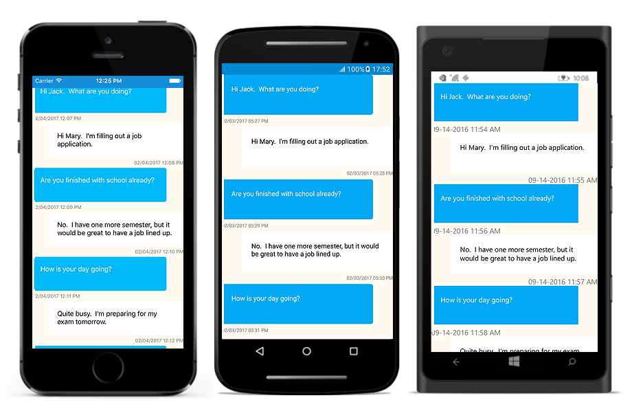

# View Appearance

SfListView lets you customize the appearance of the underlying data and provides different functionalities to the end-user.

## Defining the Item Template

A template can be used to present the data in a way that makes sense for your application by using different controls. SfListView lets you customize the appearance of view by setting the [ItemTemplate](https://help.syncfusion.com/cr/cref_files/xamarin/sflistview/Syncfusion.SfListView.XForms~Syncfusion.ListView.XForms.SfListView~ItemTemplate.html) property. In SfListView, by default a [SfLabel](https://help.syncfusion.com/cr/cref_files/xamarin/sflistview/Syncfusion.SfListView.XForms~Syncfusion.ListView.XForms.SfLabel.html) is used to present the list of data.

## Defining the Data Template Selector

SfListView lets you customize the appearance of each item with different templates based on specific constraints using [DataTemplateSelector](https://developer.xamarin.com/api/type/Xamarin.Forms.DataTemplateSelector/). You can choose a `DataTemplate` for each item at runtime based on the value of a data-bound property using `DataTemplateSelector`.

### Create a Data Template Selector

You can create the custom class that inherits from `DataTemplateSelector` and override the `OnSelectTemplate` method to return the `DataTemplate` for that item. At runtime, the SfListView invokes the `OnSelectTemplate` method for each item and passes the data object as parameter.



class MyDataTemplateSelector : Xamarin.Forms.DataTemplateSelector
{

   private readonly DataTemplate incomingDataTemplate;
   private readonly DataTemplate outgoingDataTemplate;

   public MyDataTemplateSelector()
   {
      this.incomingDataTemplate = new DataTemplate(typeof(IncomingViewCell));
      this.outgoingDataTemplate = new DataTemplate(typeof(OutgoingViewCell));      
   }

   protected override DataTemplate OnSelectTemplate(object item, BindableObject container)
   {
      var messageVm = item as Message;
      if (messageVm == null)
         return null;
      return messageVm.IsIncoming ? this.incomingDataTemplate : this.outgoingDataTemplate;
   }

}



### Applying the Data Template Selector to SfListView

You can assign that custom `DataTemplateSelector` to the [ItemTemplate](https://help.syncfusion.com/cr/cref_files/xamarin/sflistview/Syncfusion.SfListView.XForms~Syncfusion.ListView.XForms.SfListView~ItemTemplate.html) of SfListView either in XAML and C#.



<ContentPage xmlns="http://xamarin.com/schemas/2014/forms"
             xmlns:x="http://schemas.microsoft.com/winfx/2009/xaml"
             x:Class="DataTemplateSelector.MainPage"
             xmlns:syncfusion="clr-namespace:Syncfusion.ListView.XForms;assembly=Syncfusion.SfListView.XForms"
             xmlns:local="clr-namespace:DataTemplateSelector;assembly=DataTemplateSelector">
  <ContentPage.Resources>
    <ResourceDictionary>
      <local:MyDataTemplateSelector x:Key="MessageTemplateSelector" />
    </ResourceDictionary>
  </ContentPage.Resources>
  <Grid>
    <syncfusion:SfListView x:Name="ListView"
                           ItemTemplate="{StaticResource MessageTemplateSelector}"
                           ItemsSource="{Binding Messages}"
                           ItemSize="100">
    </syncfusion:SfListView>
  </Grid>
</ContentPage>


public class MainPageCs : ContentPage
{
   public MainPageCs()
   {
      var viewModel = new MainPageViewModel();
      BindingContext = viewModel;
      Content = new SfListView()
      {
          ItemSize = 100,
          ItemsSource = viewModel.Messages,
          ItemTemplate = new MyDataTemplateSelector()
      };
   }
}



Now run the application to render the following output. You can also download the entire source code of this demo from [here](http://files2.syncfusion.com/Xamarin.Forms/Samples/ListView_DataTemplateSelector.zip).

## Defining the Item Size

SfListView allows you to customize the size of the items by setting the [ItemSize](https://help.syncfusion.com/cr/cref_files/xamarin/sflistview/Syncfusion.SfListView.XForms~Syncfusion.ListView.XForms.SfListView~ItemSize.html) property. The default value of this property is 40. This property responds to runtime changes and hence you can customize it based on your requirement.



<syncfusion:SfListView x:Name="listView" ItemSize="60" />


listView.ItemSize = 60;



N> For Vertical orientation, the item size is considered as height and for Horizontal orientation, it will be considered as width.

## Set Spacing between Items

SfListView allows you to specify the spacing between each item in the list by setting the [ItemSpacing](https://help.syncfusion.com/cr/cref_files/xamarin/sflistview/Syncfusion.SfListView.XForms~Syncfusion.ListView.XForms.SfListView~ItemSpacing.html) property. You can generate the space around the item. The default value of this property is 0. This property responds to runtime changes and hence you can customize it based on your requirement.



<syncfusion:SfListView x:Name="listView" ItemSpacing="5,0,0,0" />


listView.ItemSpacing = new Thickness(5, 0, 0, 0)



## Orientation

SfListView allows you to layout every item in the [SfListView.ItemsSource](https://help.syncfusion.com/cr/cref_files/xamarin/sflistview/Syncfusion.SfListView.XForms~Syncfusion.ListView.XForms.SfListView~ItemsSource.html) property in either vertical or horizontal orientation by setting [SfListView.Orientation](https://help.syncfusion.com/cr/cref_files/xamarin/sflistview/Syncfusion.SfListView.XForms~Syncfusion.ListView.XForms.SfListView~Orientation.html). The default orientation is `Vertical`.



<syncfusion:SfListView x:Name="listView" Orientation="Horizontal" />


listView.Orientation = Orientation.Horizontal;



