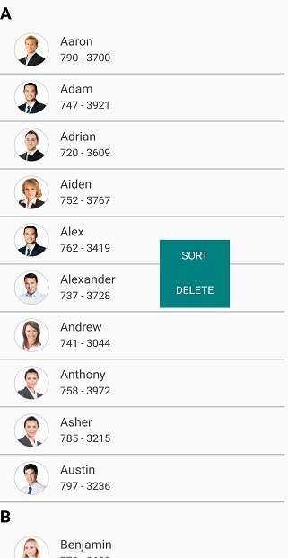
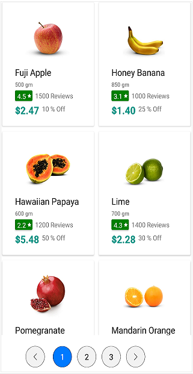

# Working with SfListView

## Programmatic scrolling

### Scrolling to row index

The SfListView allows programmatically scrolling a row based on the index by using the [ScrollToRowIndex](https://help.syncfusion.com/cr/cref_files/xamarin/sflistview/Syncfusion.SfListView.XForms~Syncfusion.ListView.XForms.LayoutBase~ScrollToRowIndex.html) method for both linear and grid layouts. It also enables and disables the scrolling animation when changing the view. By default, the scrolling will be animated.

N> If grouping is enabled, get the desired row index by passing the underlying data in the [DisplayItems.IndexOf](https://help.syncfusion.com/cr/cref_files/xamarin/datasource/Syncfusion.DataSource.Portable~Syncfusion.DataSource.DisplayItems~IndexOf.html) method.




int index = listView.DataSource.DisplayItems.IndexOf(viewModel.Customers[2]); 
listView.LayoutManager.ScrollToRowIndex(index, true); 




### Limitations

 * When [AutoFitMode](https://help.syncfusion.com/cr/cref_files/xamarin/sflistview/Syncfusion.SfListView.XForms~Syncfusion.ListView.XForms.SfListView~AutoFitMode.html) is `Height` or grouping is enabled, the scroll animation will be disabled by default in Android and iOS platforms. 
 * If [ScrollToRowIndex](https://help.syncfusion.com/cr/cref_files/xamarin/sflistview/Syncfusion.SfListView.XForms~Syncfusion.ListView.XForms.LayoutBase~ScrollToRowIndex.html) method is called when loading the `SfListView`, set `disableAnimation` to `true` to scroll to the appropriate row index, or else view does not scrolled in Android.

## Identifying scroll state changes

The SfListView will notify the scrolling state changes by using the [ScrollStateChanged](https://help.syncfusion.com/cr/cref_files/xamarin/sflistview/Syncfusion.SfListView.XForms~Syncfusion.ListView.XForms.SfListView~ScrollStateChanged_EV.html) event.

Following states will be notified via [ScrollState](https://help.syncfusion.com/cr/cref_files/xamarin/sflistview/Syncfusion.SfListView.XForms~Syncfusion.ListView.XForms.ScrollState.html) property in the event argument.

 * Dragging: Specifies that `SfListView` is currently being dragged in the view.
 * Fling: Specifies that fling action is performed on the `SfListView`.
 * Idle: Specifies that `SfListView` is not currently scrolling.
 * Programmatic: Specifies that scrolling is performed by using [ScrollTo](https://help.syncfusion.com/cr/cref_files/xamarin/sflistview/Syncfusion.SfListView.XForms~Syncfusion.ListView.XForms.SfListView~ScrollTo.html) or [ScrollToRowIndex](https://help.syncfusion.com/cr/cref_files/xamarin/sflistview/Syncfusion.SfListView.XForms~Syncfusion.ListView.XForms.LayoutBase~ScrollToRowIndex.html) method.




listView.ScrollStateChanged += ListView_ScrollStateChanged;
private void ListView_ScrollStateChanged(object sender, ScrollStateChangedEventArgs e)
{
   if (e.ScrollState == ScrollState.Idle)
   {
      DisplayAlert("ScrollState", "Scrolling has stopped", "OK");
   }
}




## Events

### Loaded event

The [Loaded](https://help.syncfusion.com/cr/cref_files/xamarin/sflistview/Syncfusion.SfListView.XForms~Syncfusion.ListView.XForms.SfListView~Loaded_EV.html) event is raised when the SfListView is loading in view for the first time.




listView.Loaded += ListView_Loaded;

private void ListView_Loaded(object sender, ListViewLoadedEventArgs e)
{
   listView.SelectedItems.Add(viewModel.Customers[2]);
}




The `Loaded` event used for the following use cases:

* To scroll the desired position or index by using the [ScrollTo](https://help.syncfusion.com/cr/cref_files/xamarin/sflistview/Syncfusion.SfListView.XForms~Syncfusion.ListView.XForms.SfListView~ScrollTo.html) or [ScrollToRowIndex](https://help.syncfusion.com/cr/cref_files/xamarin/sflistview/Syncfusion.SfListView.XForms~Syncfusion.ListView.XForms.LayoutBase~ScrollToRowIndex.html).
* To collapse all the groups.
* To find the sorted or grouped [DataSource.DisplayItems](https://help.syncfusion.com/cr/cref_files/xamarin/sflistview/Syncfusion.DataSource.Portable~Syncfusion.DataSource.DataSource~DisplayItems.html) of underlying bound data to SfListView.

### Tapped event

The [ItemTapped](https://help.syncfusion.com/cr/cref_files/xamarin/sflistview/Syncfusion.SfListView.XForms~Syncfusion.ListView.XForms.SfListView~ItemTapped_EV.html) event will be triggered whenever tapping the item. [ItemTappedEventArgs](https://help.syncfusion.com/cr/cref_files/xamarin/sflistview/Syncfusion.SfListView.XForms~Syncfusion.ListView.XForms.ItemTappedEventArgs.html) has the following members which provides the information for `ItemTapped` event:

 * [ItemType](https://help.syncfusion.com/cr/cref_files/xamarin/sflistview/Syncfusion.SfListView.XForms~Syncfusion.ListView.XForms.ItemTappedEventArgs~ItemType.html): It gets the type of the tapped item.
 * [ItemData](https://help.syncfusion.com/cr/cref_files/xamarin/sflistview/Syncfusion.SfListView.XForms~Syncfusion.ListView.XForms.ItemTappedEventArgs~ItemData.html): The underlying data associated with the tapped item as its arguments.
 * [Position](https://help.syncfusion.com/cr/cref_files/xamarin/sflistview/Syncfusion.SfListView.XForms~Syncfusion.ListView.XForms.ItemTappedEventArgs~Position.html): Gets the touch position in the tapped item.




listView.ItemTapped += ListView_ItemTapped;

private void ListView_ItemTapped(object sender, Syncfusion.ListView.XForms.ItemTappedEventArgs e)
{
    if (e.ItemData == viewModel.InboxInfo[0])
      viewModel.InboxInfo.Remove(e.ItemData as ListViewInboxInfo);  
}




The [ItemTapped](https://help.syncfusion.com/cr/cref_files/xamarin/sflistview/Syncfusion.SfListView.XForms~Syncfusion.ListView.XForms.SfListView~ItemTapped_EV.html) event is used for the following use cases:

* To show the context menu.
* To navigate to another page.
* To delete the item in the list view at runtime.
* To display the item details into another view.
* To expand the view like, accordion.
* To change the underlying bound data.
* To skip other events like selection events if the Handled property set to true.

### ItemDoubleTapped event

The [ItemDoubleTapped](https://help.syncfusion.com/cr/cref_files/xamarin/sflistview/Syncfusion.SfListView.XForms~Syncfusion.ListView.XForms.SfListView~ItemDoubleTapped_EV.html) event will be triggered whenever double tapping the item. The [ItemDoubleTappedEventArgs](https://help.syncfusion.com/cr/cref_files/xamarin/sflistview/Syncfusion.SfListView.XForms~Syncfusion.ListView.XForms.ItemDoubleTappedEventArgs.html) has the following members providing information for the `ItemDoubleTapped` event:

 * [ItemType](https://help.syncfusion.com/cr/cref_files/xamarin/sflistview/Syncfusion.SfListView.XForms~Syncfusion.ListView.XForms.ItemDoubleTappedEventArgs~ItemType.html): It gets the type of double tapped item.
 * [ItemData](https://help.syncfusion.com/cr/cref_files/xamarin/sflistview/Syncfusion.SfListView.XForms~Syncfusion.ListView.XForms.ItemDoubleTappedEventArgs~ItemData.html): The underlying data associated with the double tapped item as its arguments.
 * [Position](https://help.syncfusion.com/cr/cref_files/xamarin/sflistview/Syncfusion.SfListView.XForms~Syncfusion.ListView.XForms.ItemDoubleTappedEventArgs~Position.html): Gets the touch position in the double tapped item.




listView.ItemDoubleTapped += ListView_ItemDoubleTapped;

private void ListView_ItemDoubleTapped(object sender, ItemDoubleTappedEventArgs e)
{
    var listViewInboxInfo = new ListViewInboxInfo();
    listViewInboxInfo.Title = "Bryce Thomas";
    listViewInboxInfo.Subject = "Congratulations on the move!";
    viewModel.InboxInfo.Add(listViewInboxInfo);
}




The [ItemDoubleTapped](https://help.syncfusion.com/cr/cref_files/xamarin/sflistview/Syncfusion.SfListView.XForms~Syncfusion.ListView.XForms.SfListView~ItemDoubleTapped_EV.html) event is used for the following use cases:

* To show the context menu.
* To delete the item in the list view at runtime.
* To change the underlying bound data.

### ItemHolding event

The [ItemHolding](https://help.syncfusion.com/cr/cref_files/xamarin/sflistview/Syncfusion.SfListView.XForms~Syncfusion.ListView.XForms.SfListView~ItemHolding_EV.html) event will be triggered whenever long pressing the item. [ItemHoldingEventArgs](https://help.syncfusion.com/cr/cref_files/xamarin/sflistview/Syncfusion.SfListView.XForms~Syncfusion.ListView.XForms.ItemHoldingEventArgs.html) has the following members which provides the information for `ItemHolding` event:

 * [ItemType](https://help.syncfusion.com/cr/cref_files/xamarin/sflistview/Syncfusion.SfListView.XForms~Syncfusion.ListView.XForms.ItemHoldingEventArgs~ItemType.html): It gets the type of the long pressed item.
 * [ItemData](https://help.syncfusion.com/cr/cref_files/xamarin/sflistview/Syncfusion.SfListView.XForms~Syncfusion.ListView.XForms.ItemHoldingEventArgs~ItemData.html): The underlying data associated with the holding item as its arguments.
 * [Position](https://help.syncfusion.com/cr/cref_files/xamarin/sflistview/Syncfusion.SfListView.XForms~Syncfusion.ListView.XForms.ItemHoldingEventArgs~Position.html): Gets the touch position in the holding item.




listView.ItemHolding += ListView_ItemHolding;

private void ListView_ItemHolding(object sender, ItemHoldingEventArgs e)
{
   if (e.ItemData == viewModel.InboxInfo[3])
      viewModel.InboxInfo.Remove(e.ItemData as ListViewInboxInfo);         
}




The [ItemHolding](https://help.syncfusion.com/cr/cref_files/xamarin/sflistview/Syncfusion.SfListView.XForms~Syncfusion.ListView.XForms.SfListView~ItemHolding_EV.html) event is used for the following use cases:

* To show the context menu.

### ItemAppearing

The [ItemAppearing](https://help.syncfusion.com/cr/cref_files/xamarin/sflistview/Syncfusion.SfListView.XForms~Syncfusion.ListView.XForms.SfListView~ItemAppearing_EV.html) event is raised when the items are appearing in the view on scrolling, loading, and navigating from one page to another page. The [ItemAppearingEventArgs](https://help.syncfusion.com/cr/cref_files/xamarin/sflistview/Syncfusion.SfListView.XForms~Syncfusion.ListView.XForms.ItemAppearingEventArgs.html) has the following member which provides the information of appearing Items.

* [ItemData](https://help.syncfusion.com/cr/cref_files/xamarin/sflistview/Syncfusion.SfListView.XForms~Syncfusion.ListView.XForms.ItemAppearingEventArgs~ItemData.html): The underlying data associated with the appearing item.




listView.ItemAppearing += listView_ItemAppearing;

private void listView_ItemAppearing(object sender, Syncfusion.ListView.XForms.ItemAppearingEventArgs e)
{
    if (e.ItemData == viewModel.BookInfo[0])
        Debug.WriteLine((e.ItemData as BookInfo).BookName);

    // If the ItemData value is "Header", then it's a header item.
    if (e.ItemData == "Header")
        Debug.WriteLine("Header is Appeared");
}




The [ItemAppearing](https://help.syncfusion.com/cr/cref_files/xamarin/sflistview/Syncfusion.SfListView.XForms~Syncfusion.ListView.XForms.SfListView~ItemAppearing_EV.html) event used for the following use cases:

* To find the item appears in the view.
* To customize the appearing item to change the background color using converter.

### ItemDisappearing

The [ItemDisappearing](https://help.syncfusion.com/cr/cref_files/xamarin/sflistview/Syncfusion.SfListView.XForms~Syncfusion.ListView.XForms.SfListView~ItemDisappearing_EV.html) event is raised when the items disappearing in the view on scrolling, disposing, and navigating from one page to another page. The [ItemDisappearingEventArgs](https://help.syncfusion.com/cr/cref_files/xamarin/sflistview/Syncfusion.SfListView.XForms~Syncfusion.ListView.XForms.ItemDisappearingEventArgs.html) has the following member which provides the information on disappearing Items:

* [ItemData](https://help.syncfusion.com/cr/cref_files/xamarin/sflistview/Syncfusion.SfListView.XForms~Syncfusion.ListView.XForms.ItemDisappearingEventArgs~ItemData.html): The underlying data associated with the disappearing item.




listView.ItemDisappearing += listView_ItemDisappearing;

private void listView_ItemDisappearing(object sender, Syncfusion.ListView.XForms.ItemDisappearingEventArgs e)
{
    if (e.ItemData == viewModel.BookInfo[0])
        Debug.WriteLine((e.ItemData as BookInfo).BookName);

    // If the ItemData value is "Footer" then it's a Footer item.
    if (e.ItemData == "Footer")
        Debug.WriteLine("Footer is Disappeared");
}




The [ItemDisappearing](https://help.syncfusion.com/cr/cref_files/xamarin/sflistview/Syncfusion.SfListView.XForms~Syncfusion.ListView.XForms.SfListView~ItemDisappearing_EV.html) event used for the following use cases:

* To find the item disappears in the view.

## Commands

### Tap command

The [TapCommand](https://help.syncfusion.com/cr/cref_files/xamarin/sflistview/Syncfusion.SfListView.XForms~Syncfusion.ListView.XForms.SfListView~TapCommand.html) will be triggered whenever tapping the item and passing the [ItemTappedEventArgs](https://help.syncfusion.com/cr/cref_files/xamarin/sflistview/Syncfusion.SfListView.XForms~Syncfusion.ListView.XForms.ItemTappedEventArgs.html) as parameter.




listView.TapCommand = viewModel.TappedCommand;

public class CommandViewModel
{
    private Command<Object> tappedCommand;

    public Command<object> TappedCommand
    {
        get { return tappedCommand; }
        set { tappedCommand = value; }
    }

    public CommandViewModel()
    {            
        TappedCommand = new Command<object>(TappedCommandMethod);
    }

    private void TappedCommandMethod(object obj)
    {
        if ((obj as Syncfusion.ListView.XForms.ItemTappedEventArgs).ItemData == viewModel.InboxInfo[0])
            viewModel.InboxInfo.Remove(e.ItemData as ListViewInboxInfo)
    }   
}




### Hold command

The [HoldCommand](https://help.syncfusion.com/cr/cref_files/xamarin/sflistview/Syncfusion.SfListView.XForms~Syncfusion.ListView.XForms.SfListView~HoldCommand.html) will be triggered whenever long pressing the item and passing the [ItemHoldingEventArgs](https://help.syncfusion.com/cr/cref_files/xamarin/sflistview/Syncfusion.SfListView.XForms~Syncfusion.ListView.XForms.ItemHoldingEventArgs.html) as parameter.
 



listView.HoldCommand = viewModel.HoldCommand;

public class CommandViewModel
{
    private Command<Object> holdingCommand;

    public Command<object> HoldingCommand
    {
        get { return holdingCommand; }
        set { holdingCommand = value; }
    }

    public CommandViewModel()
    {
        HoldingCommand = new Command<object>(HoldingCommandMethod);
    }

    private void HoldingCommandMethod(object obj)
    {
        if ((obj as Syncfusion.ListView.XForms.ItemHoldingEventArgs).ItemData == viewModel.InboxInfo[3])
            viewModel.InboxInfo.Remove(e.ItemData as ListViewInboxInfo);
    }
}




## Improving ListView performance

The SfListView has been built from the ground up with an optimized view reuse strategy for the best possible performance on the Xamarin platform even when loading large data sets. Following techniques are used to improve performance of the SfListView:

 * Bind the ItemsSource property to an IList<T> collection instead of an IEnumerable<T> collection because IEnumerable<T> collection do not support random access.
 * The `SfListView` gets refreshed each and every time a new item added into the underlying collection. Because, when adding items at runtime, the `DataSource` gets refreshed. To avoid this behavior, use [BeginInit()](https://help.syncfusion.com/cr/cref_files/xamarin/datasource/Syncfusion.DataSource.Portable~Syncfusion.DataSource.DataSource~BeginInit.html) to stop the RefreshView() calling in each time, and use [EndInit()](https://help.syncfusion.com/cr/cref_files/xamarin/datasource/Syncfusion.DataSource.Portable~Syncfusion.DataSource.DataSource~EndInit.html) to start the RefreshView() calling when adding number of finished items.
 * Avoid loading complex layout in the template contains large size of images or nested containers that cause some performance degradation on scrolling. So recommended to use fewer elements and images with less size and resolution to achieve the maximum performance.
 * Avoid placing the SfListView inside ScrollView for the following reasons:
    * The SfListView implement its own scrolling.
    * The SfListView will not receive any gestures as it will be handled by the parent ScrollView.
    * Should define size to the SfListView if it loads inside ScrollView.
 * Avoid changing the cell layout based on the BindingContext. This incurs large layout and initialization costs.

### Limitation

#### Load SfListView inside ScrollView

When the `SfListView` is loaded inside the `ScrollView` with the height of total items, scrolling will not occur in the SfListView only when [AllowSwiping](https://help.syncfusion.com/cr/cref_files/xamarin/sflistview/Syncfusion.SfListView.XForms~Syncfusion.ListView.XForms.SfListView~AllowSwiping.html) is set to `true`. The SfListView does not pass touch to the parent ScrollView in UWP, because swiping is handled in it. 

When the SfListView is loaded inside the ScrollView the following scenarios, the height of the total items is set to `HeightRequest` of the SfListView.

* If the position of the SfListView is not in view when loading inside the StackLayout with more than one children, the SfListView will not be loaded. Because, the StackLayout passes the height for the `SfListView` as 1. 

* When loading the SfListView inside the `Grid` with row definition as `Auto` in UWP, Grid passes the height for the SfListView to be `1`.

When the SfListView is loaded inside the ScrollView with sticky header and sticky group header, it changed to scrollable. The empty space remains after the `SfListView` items, when the device orientation is changed to horizontal. Because, the total extend is set to the ScrollView in horizontal orientation.




<local:ExtScrollView x:Name="scrollView" >
   <sync:SfListView x:Name="listView" ItemsSource="{Binding BookInfo}"/>
</local:ExtScrollView>


 public class ExtScrollView: ScrollView
 {    
     protected override void LayoutChildren(double x, double y, double width, double height)
     {
         this.Content.HeightRequest = height;
         base.LayoutChildren(x, y, width, height);
     }
}




You can download the entire source code from [here](http://www.syncfusion.com/downloads/support/directtrac/general/ze/SfListViewSample197024233.zip).

#### Load SfListView inside CarousalPage/Master detail page

When the SfListView is loaded in CarouselView with [SfListView.AllowSwiping](https://help.syncfusion.com/cr/cref_files/xamarin/sflistview/Syncfusion.SfListView.XForms~Syncfusion.ListView.XForms.SfListView~AllowSwiping.html) as false, it behaves in UWP platform as follows:
 
 * When performing first swipe on the view, it will be handled by ScrollView to ensure whether scrolling is happened or not. If not means the manipulation to parent cannot be passed immediately due to UWP platform behavior. The second swipe will be listened by CarouselView, and the view gets swiped. This is the behavior of the SfListView. 

When the SfListView is loaded in CarouselView with `SfListView.AllowSwiping` as true, it behaves as follows:  
 
 * When swiping in iOS, suddenly carousel swipe happened. To swipe ListViewItem, touch and hold the item for some fraction of seconds (0.25 - 0.5 seconds) and then swipe. 
 * When swiping any Item, the SfListView handles the touch and swipe the ListViewItem.  
 * After swiping on ListViewItem, SwipeView will load along with it. If you swipe SwipeView element, Carousel view is swiped. Or else swipe on ListViewItem, control handles touching and swiping the item as usual. 
 * If you swipe header, footer or group header elements, Carousel view will swipe in Android platform. But in UWP, first swipe on those elements will be handled by SfListView itself, because manipulation to parent cannot be passed immediately. The second swipe will be listened by CarouselView.

## Context menu on items

The SfListView allows displaying a pop-up menu with different menu items to an item when it is long pressed by customizing the SfListView and by using custom view in it. For UWP platform, you can also display the pop-up menu when pressing right click button over the item. Display the pop-up menu by accessed the touch position in the item based on [Position](https://help.syncfusion.com/cr/cref_files/xamarin/sflistview/Syncfusion.SfListView.XForms~Syncfusion.ListView.XForms.ItemHoldingEventArgs~Position.html) property from [ItemHolding](https://help.syncfusion.com/cr/cref_files/xamarin/sflistview/Syncfusion.SfListView.XForms~Syncfusion.ListView.XForms.SfListView~ItemHolding_EV.html) event.

Defining SfPopUpView



<ContentView>

    <ContentView.Content>
        <StackLayout BackgroundColor="Teal" >
            <Button x:Name="SortButton" Text="Sort" Clicked="SortButton_Clicked"/>
            <Button x:Name="DeleteButton" Text="Delete" Clicked="DeleteButton_Clicked"/>
        </StackLayout>
    </ContentView.Content>

</ContentView>




public class SfPopUpView : ContentView
{
    public SfPopUpView()
    {
        StackLayout stackLayout = new StackLayout { BackgroundColor = Color.Teal };
        Button button = new Button { Text = "Sort", };
        button.Clicked += SortButton_Clicked;
        Button button1 = new Button { Text = "Delete", };
        button1.Clicked += DeleteButton_Clicked;
        stackLayout.Children.Add(button);
        stackLayout.Children.Add(button1);
    }
}




Layout the Pop-Up Menu



public partial class SfPopUpView : ContentView
{
    int sortOrder = 0;
    Contacts item;
    SfListView listview;

    public SfListView ListView
    {
        get { return listview; }
        set
        {
            if (listview != value)
            {
                listview = value;
                OnListViewChanged(listview);
            }
        }
    }

    public void ShowPopup(double x, double y)
    {
        this.IsVisible = true;
        this.Layout(new Rectangle(x, y, 100, 100));
    }

    public void Dismiss()
    {
        this.IsVisible = false;
    }

    private void OnListViewChanged(SfListView listview)
    {
        if (listview != null)
        {
            listview.ScrollStateChanged += SfListView_ScrollStateChanged;
            listview.ItemTapped += SfListView_ItemTapped;
            listview.ItemHolding += SfListView_ItemHolding;
        }
    }

    private void SfListView_ItemHolding(object sender, ItemHoldingEventArgs e)
    {
        item = e.ItemData as Contacts;
        this.ShowPopup(e.Position.X, e.Position.Y);
    }

    private void SfListView_ItemTapped(object sender, Syncfusion.ListView.XForms.ItemTappedEventArgs e)
    {
        this.Dismiss();
    }

    private void SfListView_ScrollStateChanged(object sender, ScrollStateChangedEventArgs e)
    {
        this.Dismiss();
    }

    private void DeleteButton_Clicked(object sender, EventArgs e)
    {
        if (ListView == null)
            return;

        var source = ListView.ItemsSource as IList;

        if (source != null && source.Contains(item))
            source.Remove(item);
        else
            App.Current.MainPage.DisplayAlert("Alert", "Unable to delete the item", "OK");

        item = null;
        source = null;
    }

    private void SortButton_Clicked(object sender, EventArgs e)
    {
        if (ListView == null)
            return;

        ListView.DataSource.SortDescriptors.Clear();
        this.Dismiss();
        ListView.DataSource.LiveDataUpdateMode = LiveDataUpdateMode.AllowDataShaping;
        if (sortOrder == 0)
        {
            ListView.DataSource.SortDescriptors.Add(new SortDescriptor { PropertyName = "ContactName", Direction = ListSortDirection.Descending });
            sortOrder = 1;
        }
        else
        {
            ListView.DataSource.SortDescriptors.Add(new SortDescriptor { PropertyName = "ContactName", Direction = ListSortDirection.Ascending });
            sortOrder = 0;
        }
    }
}



Defining the SfListView




<ContentPage>
  <ContentPage.BindingContext>
    <local:ContactsViewModel x:Name="viewModel"/>
  </ContentPage.BindingContext>
    <ContentPage.Content>
        <Grid>
            <listView:SfListView x:Name="listView" ItemsSource="{Binding Items}" >
                <listView:SfListView.ItemTemplate>
                    <DataTemplate>
                        <Grid>
                            <Image Source="{Binding ContactImage}"/>
                            <Label Text="{Binding ContactName}" />
                            <Label Text="{Binding ContactNumber}" />
                        </Grid>
                    </DataTemplate>
                </listView:SfListView.ItemTemplate>
                <local:SfPopUpView IsVisible="{Binding ShowPopUp, Mode=TwoWay}" ListView="{x:Reference listView}"/>
            </listView:SfListView>
        </Grid>
    </ContentPage.Content>
</ContentPage>




public partial class ContextMenu : ContentPage
{
    public ContextMenu()
    {
        var grid = new Grid();
        var listView = new SfListView();
        ContactsViewModel contactsViewModel = new ContactsViewModel()
            listView.ItemsSource = contactsViewModel.Items;
        listView.ItemTemplate = new DataTemplate(() =>
        {
            var grid = new Grid();
            var image = new Image();
            image.SetBinding(Image.SourceProperty, new Binding("ContactImage"));
            var label = new Label();
            label.SetBinding(Label.TextProperty, new Binding("ContactName"));
            var label1 = new Label();
            label1.SetBinding(Label.TextProperty, new Binding("ContactNumber"));
            grid.Children.Add(image);
            grid.Children.Add(label);
            grid.Children.Add(label1);
            return grid;
        });

        var popupLayout = new SfPopUpView();
        popupLayout.SetBinding(SfPopUpView.IsVisibleProperty, new Binding("", BindingMode.TwoWay));
        popupLayout.ListView = listView;

        grid.Children.Add(listView);
        grid.Children.Add(popupLayout);
    }
}



    
You can download the entire source code of this demo from [here](http://www.syncfusion.com/downloads/support/directtrac/general/ze/ListViewContextMenu-1107225769).

## Paging

The SfListView allows displaying paging using the [SfDataPager](http://help.syncfusion.com/cr/cref_files/xamarin/sfdatagrid/Syncfusion.SfDataGrid.XForms~Syncfusion.SfDataGrid.XForms.DataPager_namespace.html) control. It can be performed through loading data dynamically into ItemsSource of the SfListView using OnDemandLoading event for the current page by setting the [SfDataPager.UseOnDemandPaging](http://help.syncfusion.com/cr/cref_files/xamarin/sfdatagrid/Syncfusion.SfDataGrid.XForms~Syncfusion.SfDataGrid.XForms.DataPager.SfDataPager~UseOnDemandPaging.html) to ‘True’. By using the [SfDataPager.PageSize](http://help.syncfusion.com/cr/cref_files/xamarin/sfdatagrid/Syncfusion.SfDataGrid.XForms~Syncfusion.SfDataGrid.XForms.DataPager.SfDataPager~PageSize.html) property, you can define the number of list items to be displayed in each page.

N> For more details about paging refer to [here](https://help.syncfusion.com/xamarin/sfdatagrid/paging).




<ContentPage xmlns:syncfusion="clr-namespace:Syncfusion.ListView.XForms;assembly=Syncfusion.SfListView.XForms"
             xmlns:sfPager="clr-namespace:Syncfusion.SfDataGrid.XForms.DataPager;assembly=Syncfusion.SfDataGrid.XForms">

    <ContentPage.Behaviors>
        <local:SfListViewPagingBehavior/>
    </ContentPage.Behaviors>

    <ContentPage.Resources>
        <ResourceDictionary>
            <local:CurrencyFormatConverter x:Key="currencyFormatConverter"/>
        </ResourceDictionary>
    </ContentPage.Resources>

    <ContentPage.Content>
        <StackLayout>

            <syncfusion:SfListView x:Name="listView" >
                <syncfusion:SfListView.LayoutManager>
                    <syncfusion:GridLayout SpanCount = "2">
                </syncfusion:SfListView.LayoutManager>
                <syncfusion:SfListView.ItemTemplate>
                    <DataTemplate>
                        <Grid>
                            <Image Source="{Binding Image}" />    
                            <Label Text="{Binding Name}" />
                            <Label Text="{Binding Weight}" />
                        <Grid>
                    </DataTemplate>
                </syncfusion:SfListView.ItemTemplate>
            </syncfusion:SfListView>

            <sfPager:SfDataPager x:Name="dataPager" UseOnDemandPaging="True" DisplayMode = "PreviousNextNumeric" NumericButtonCount = "4" PageSize = "6">

        </StackLayout>
    </ContentPage.Content>
</ContentPage>




using Syncfusion.ListView.XForms;
using Syncfusion.SfDataGrid.XForms.DataPager;

namespace Paging
{
    public class Paging : ContentPage
    {
        SfDataPager sfPager = new SfDataPager();
        SfListView listView = new SfListView();
        public Paging()
        {
            var stackLayout = new StackLayout();
            sfPager.DisplayMode = PagerDisplayMode.PreviousNextNumeric;
            sfPager.UseOnDemandPaging = true;
            sfPager.NumericButtonCount = 4;
            sfPager.PageSize = 6;
            listView = new SfListView();
            listView.LayoutManager = new GridLayout() { SpanCount = 2 };
            listView.ItemTemplate = new DataTemplate(() => 
            {
                var grid = new Grid();
                var image = new Image();
                image.SetBinding(Image.SourceProperty, new Binding("Image"));
                var label = new Label();
                label.SetBinding(Label.TextProperty, new Binding("Name"));
                var label1 = new Label();
                label1.SetBinding(Label.TextProperty, new Binding("Weight"));
                grid.Children.Add(image);
                grid.Children.Add(label);
                grid.Children.Add(label1);
                return grid;
            });
            stackLayout.Children.Add(listView);
            stackLayout.Children.Add(sfPager);
        }
    }
}






public class SfListViewPagingBehavior : Behavior<ContentPage>
{

    private Syncfusion.ListView.XForms.SfListView listView;
    private PagingViewModel PagingViewModel;
    private SfDataPager dataPager;

    protected override void OnAttachedTo(ContentPage bindable)
    {
        listView = bindable.FindByName<Syncfusion.ListView.XForms.SfListView>("listView");
        dataPager = bindable.FindByName<SfDataPager>("dataPager");
        PagingViewModel = new PagingViewModel();
        listView.BindingContext = PagingViewModel;
        dataPager.Source = PagingViewModel.pagingProducts;
        dataPager.OnDemandLoading += DataPager_OnDemandLoading;
        base.OnAttachedTo(bindable);
    }

    private void DataPager_OnDemandLoading(object sender, OnDemandLoadingEventArgs e)
    {
        var source = PagingViewModel.pagingProducts.Skip(e.StartIndex).Take(e.PageSize);
        listView.ItemsSource = source.AsEnumerable();
    }

    protected override void OnDetachingFrom(ContentPage bindable)
    {
        listView = null;
        PagingViewModel = null;
        dataPager = null;
        base.OnDetachingFrom(bindable);
    }
}



You can download the entire source code of this demo from [here](http://www.syncfusion.com/downloads/support/directtrac/general/ze/Paging-638353541).

 
## How to

### load data from SQLite online database

The SfListView allows binding the data from online database with the help of `Azure App Service`. To perform this, follow the steps:

Step 1: Get URL to store the data online.
Step 2: Create table using `AppServiceHelpers`.
Step 3: Populate the data into the table using the ObservableCollection `Items`.
Step 4: Bind it to SfListView using [SfListView.ItemSource](https://help.syncfusion.com/cr/cref_files/xamarin/sflistview/Syncfusion.SfListView.XForms~Syncfusion.ListView.XForms.SfListView~ItemsSource.html) property.
Step 5: Refer to the following link to know more about working with `Azure App Service`.
        https://blog.xamarin.com/add-a-backend-to-your-app-in-10-minutes/ 

N> Install the following NuGet packages to successfully run the application:

* Microsoft.Azure.Mobile.Client(v.2.1.1)
* Microsoft.Azure.Mobile.Client.SQLiteStore(v.2.1.1)
* AppService.Helpers (Does not support UWP platform)
* AppService.Helpers.Forms (Does not support UWP platform)

Refer to the following code which illustrates, how to initialize the library with the URL of the Azure Mobile App and registering the Model with the client to create a table.



public App()
{
    InitializeComponent();
    IEasyMobileServiceClient client = new EasyMobileServiceClient();
    client.Initialize("http://xamarin-todo-sample.azurewebsites.net");
    client.RegisterTable<ToDo>();
    client.FinalizeSchema();
    MainPage = new NavigationPage(new Pages.ToDoListPage(client));
}



Refer to the following code which illustrates, how to create a table using AppServiceHelpers and insert items in it.



using AppServiceHelpers.Abstractions;
using AppServiceHelpers.Models;
public class BaseAzureViewModel<T> : INotifyPropertyChanged where T : EntityData
{
    IEasyMobileServiceClient client;
    ITableDataStore<T> table;

    public BaseAzureViewModel(IEasyMobileServiceClient client)
    {
        this.client = client;
        table = client.Table<T>();
    }

    // Returns an ObservableCollection of all the items in the table
    ObservableCollection<T> items = new ObservableCollection<T>();
    public ObservableCollection<T> Items
    {
        get { return items; }
        set
        {
            items = value;
            OnPropertyChanged("items");
        }
    }

    // Adds an item to the table.
    public async Task AddItemAsync(T item)
    {
        await table.AddAsync(item);
    }

    // Deletes an item from the table.
    public async Task DeleteItemAsync(T item)
    {
        await table.DeleteAsync(item);
    }

    // Updates an item in the table.
    public async Task UpdateItemAsync(T item)
    {
        await table.UpdateAsync(item);
    }

    // Refresh the table and synchronize data with Azure.
    Command refreshCommand;
    public Command RefreshCommand
    {
        get { return refreshCommand ?? (refreshCommand = new Command(async () => await ExecuteRefreshCommand())); }
    }

    async Task ExecuteRefreshCommand()
    {
        if (IsBusy)
            return;

        IsBusy = true;

        try
        {
            var _items = await table.GetItemsAsync();
            Items.Clear();
            foreach (var item in _items)
            {
                Items.Add(item);
            }
            IsBusy = false;
        }
        catch (Exception ex)
        {
            await Application.Current.MainPage.DisplayAlert("Error", ex.Message, "OK");
        }
    }

    public event PropertyChangedEventHandler PropertyChanged;
    public void OnPropertyChanged(string propertyName)
    {
        if (PropertyChanged == null)
            return;

        PropertyChanged(this, new PropertyChangedEventArgs(propertyName));
    }
}



Refer to the following code which illustrates, how to bind the table contents into the SfListView.



public partial class ToDoListPage : ContentPage
{
  public ToDoListPage(IEasyMobileServiceClient client)
  {
    InitializeComponent();
    var viewModel = new ViewModels.ToDosViewModel(client);
    BindingContext = viewModel;
    listView.ItemsSource = viewModel.Items;
  }
  
  private void FetchButton_Clicked(object sender, EventArgs e)
  {
    var viewModel1 = (ToDosViewModel)BindingContext;
    viewModel1.RefreshCommand.Execute(null);
  }
}



<ContentPage>

    <ContentPage.Content>
        <StackLayout>
            <syncfusion:SfListView x:Name="listView" SelectedItem="{Binding SelectedToDoItem, Mode=TwoWay}" ItemSize="50">
                <syncfusion:SfListView.ItemTemplate>
                    <DataTemplate>
                        <ViewCell>
                            <StackLayout Orientation="Horizontal" HorizontalOptions="FillAndExpand" VerticalOptions="CenterAndExpand">
                                <Label Text="{Binding Text}" />
                                <Switch IsToggled="{Binding Completed}"/>
                            </StackLayout>
                        </ViewCell>
                    </DataTemplate>
                </syncfusion:SfListView.ItemTemplate>
            </syncfusion:SfListView>
            <Button Text="Add New" Command="{Binding AddNewItemCommand}"/>
            <Button Text="Fetch" Command="{Binding FetchItemCommand}" />
        </StackLayout>
    </ContentPage.Content>

</ContentPage>



You can download the entire source code of this demo from [here](http://www.syncfusion.com/downloads/support/directtrac/general/ze/AzureSampleApp-1350807709).

### Load data from SQLite offline database

The SfListView allows binding the data from local database by using SQLite. To perform this, follow the steps: SQLiteConnection

Step 1: Create a `SQLite database table`
Step 2: Populate the data into the table
Step 3: Store them as an `IEnumerable` collection
Step 4: Bind it to SfListView using [SfListView.ItemSource](https://help.syncfusion.com/cr/cref_files/xamarin/sflistview/Syncfusion.SfListView.XForms~Syncfusion.ListView.XForms.SfListView~ItemsSource.html) property.
Step 5: Refer to the following link to know how to create SQLite connection,
http://developer.xamarin.com/guides/xamarin-forms/working-with/databases/

N> To run this sample in UWP, install [sqLite.Net.Pcl](https://www.nuget.org/packages/sqlite-net-pcl), version v1.0.10 (Only this version of SQLite supports UWP platform, later versions don’t support UWP).



using SQLite;

public class OrderItem
{
    public int ID { get; set; }
    public string Name { get; set; }
}





using SQLite;
  
public class ViewModel
{
    SQLiteConnection database;
    IEnumerable<OrderItem> orderItemCollection;
    public IEnumerable<OrderItem> OrderItemCollection
    {
        get
        {
            if (orderItemCollection == null)
                orderItemCollection = GetItems();
            return orderItemCollection;
        }
    }
    public ViewModel()
    {
        database = DependencyService.Get<ISQLite>().GetConnection();
        // Create the table
        database.CreateTable<OrderItem>();
  
        // Insert items into table
        database.Query<OrderItem>("INSERT INTO OrderItem (ID,Name)values (1001,'Antony')");
        database.Query<OrderItem>("INSERT INTO OrderItem (ID,Name)values (1002,'Blake')");
        database.Query<OrderItem>("INSERT INTO OrderItem (ID,Name)values (1003,'Catherine')");
        database.Query<OrderItem>("INSERT INTO OrderItem (ID,Name)values (1004,'Jude')");
        database.Query<OrderItem>("INSERT INTO OrderItem (ID,Name)values (1005,'Mark')");
        database.Query<OrderItem>("INSERT INTO OrderItem (ID,Name)values (1006,'Anderson')");
        database.Query<OrderItem>("INSERT INTO OrderItem (ID,Name)values (1007,'Wilson')");
        database.Query<OrderItem>("INSERT INTO OrderItem (ID,Name)values (1008,'Jade')");
        database.Query<OrderItem>("INSERT INTO OrderItem (ID,Name)values (1009,'Zachery')");
        database.Query<OrderItem>("INSERT INTO OrderItem (ID,Name)values (1010,'Dhotis')");
        database.Query<OrderItem>("INSERT INTO OrderItem (ID,Name)values (1011,'Trunks')");
        database.Query<OrderItem>("INSERT INTO OrderItem (ID,Name)values (1012,'Kevin')");
        database.Query<OrderItem>("INSERT INTO OrderItem (ID,Name)values (1013,'Mathew')");
        database.Query<OrderItem>("INSERT INTO OrderItem (ID,Name)values (1014,'Watson')");
        database.Query<OrderItem>("INSERT INTO OrderItem (ID,Name)values (1015,'Chris')");
        database.Query<OrderItem>("INSERT INTO OrderItem (ID,Name)values (1016,'Phantom')");
    }
  
    public IEnumerable<OrderItem> GetItems()
    {
        // Changing the database table items as ObservableCollection
        var table = (from i in database.Table<OrderItem>() select i);
        ObservableCollection<OrderItem> OrderList = new ObservableCollection<OrderItem>();
        foreach (var order in table)
        {
            OrderList.Add(new OrderItem()
            {
                ID = order.ID,
                Name = order.Name
            });
        }
        return OrderList;
    }
}



Refer to the following code which illustrates, how to bind the data from the SQLite database to SfListView.




<ContentPage>
    <ContentPage.BindingContext>
        <local:ViewModel/>
    </ContentPage.BindingContext>
    <ContentPage.Content>
        <Grid>
            <listView:SfListView x:Name="listView" ItemSize="70" 
                                BackgroundColor="Teal"
                        ItemsSource="{Binding OrderItemCollection}">
                <listView:SfListView.ItemTemplate>
                    <DataTemplate>
                        <ViewCell>
                            <ViewCell.View>
                                <Grid>
                                    <Grid.RowDefinitions>
                                        <RowDefinition Height="*" />
                                        <RowDefinition Height="1" />
                                    </Grid.RowDefinitions>
                                    <Grid>
                                        <Grid.ColumnDefinitions>
                                            <ColumnDefinition Width="*" />
                                            <ColumnDefinition Width="*" />
                                        </Grid.ColumnDefinitions>
                                        <Label LineBreakMode="NoWrap" Text="{Binding ID}" VerticalOptions="Center"/>
                                        <Label LineBreakMode="NoWrap" Text="{Binding Name}" Grid.Column="1" VerticalOptions="Center" />
                                    </Grid>
                                    <StackLayout Grid.Row="1" BackgroundColor="Gray" HeightRequest="1"/>
                                </Grid>
                            </ViewCell.View>
                        </ViewCell>
                    </DataTemplate>
                </listView:SfListView.ItemTemplate>
            </listView:SfListView>
        </Grid>
    </ContentPage.Content>
</ContentPage>




You can download the entire source code of this demo from [here](http://www.syncfusion.com/downloads/support/directtrac/general/ze/SfListViewSample405826458).

### Identify when end of the list is reached on scrolling

The SfListView allows notifying when scrolling using [Changed](https://help.syncfusion.com/cr/cref_files/xamarin/gridcommon/Syncfusion.GridCommon.Portable~Syncfusion.GridCommon.ScrollAxis.ScrollAxisBase~Changed_EV.html) event of [ScrollAxisBase](http://help.syncfusion.com/cr/cref_files/wpf/sfdatagrid/Syncfusion.SfGrid.WPF~Syncfusion.UI.Xaml.ScrollAxis.ScrollAxisBase.html) in [VisualContainer](https://help.syncfusion.com/cr/cref_files/xamarin/sflistview/Syncfusion.SfListView.XForms~Syncfusion.ListView.XForms.VisualContainer.html) of the SfListView. By using this event, you can find whether reached the last item in the list in the SfListView based on [LastBodyVisibleLineIndex](https://help.syncfusion.com/cr/cref_files/xamarin/gridcommon/Syncfusion.GridCommon.Portable~Syncfusion.GridCommon.ScrollAxis.ScrollAxisBase~LastBodyVisibleLineIndex.html) property and underlying collection count.




public partial class MainPage : ContentPage
{
    VisualContainer visualContainer;
    bool isAlertShown = false;

    public MainPage()
    {
        InitializeComponent();
        visualContainer = listView.GetVisualContainer();
        visualContainer.ScrollRows.Changed += ScrollRows_Changed;
    }

    ///

    ///To notify when end reached
    ///

    private void ScrollRows_Changed(object sender, ScrollChangedEventArgs e)
    {
        var lastIndex = visualContainer.ScrollRows.LastBodyVisibleLineIndex;

        //To include header if used
        var header = (listView.HeaderTemplate != null && !listView.IsStickyHeader) ? 1 : 0;

        //To include footer if used
        var footer = (listView.FooterTemplate != null && !listView.IsStickyFooter) ? 1 : 0;
        var totalItems = listView.DataSource.DisplayItems.Count + header + footer;

        if ((lastIndex == totalItems - 1))
        {
            if (!isAlertShown)
            {
                DisplayAlert("Alert", "End of list reached...", "Ok");
                isAlertShown = true;
            }
        }
        else
            isAlertShown = false;
    }
}




You can download the entire source code of this demo from [here](http://www.syncfusion.com/downloads/support/directtrac/general/ze/EndReachedOnScrolling1293175475).

### Maintain the scroll position while updating ItemsSource at runtime

The SfListView have scrolled to top automatically when changing the ItemsSource at runtime. However, you can maintain the same scrolled position by using the `ScrollY` value of ExtendedScrollView from the [VisualContainer](https://help.syncfusion.com/cr/cref_files/xamarin/sflistview/Syncfusion.SfListView.XForms~Syncfusion.ListView.XForms.VisualContainer.html). After changing the ItemsSource, you can pass the ScrollY value to [ScrollTo](https://help.syncfusion.com/cr/cref_files/xamarin/sflistview/Syncfusion.SfListView.XForms~Syncfusion.ListView.XForms.SfListView~ScrollTo.html) method of SfListView and scroll back to the same position.

For horizontal orientation, use the `ScrollX` value of ExtendedScrollView.

 By using [Reflection](https://msdn.microsoft.com/en-us/library/system.reflection(v=vs.110).aspx), get the value of `ScrollOwner` from `VisualContainer` and use it.




public partial class MainPage : ContentPage
{
    ExtendedScrollView scrollView;

    public MainPage()
    {
        InitializeComponent();
        VisualContainer visualContainer = listView.GetVisualContainer();
        scrollView = visualContainer.GetType().GetRuntimeProperties().First(x => x.Name == "ScrollOwner").GetValue(visualContainer) as ExtendedScrollView;
    }

    private void ChangeItemsSource_Clicked(object sender, EventArgs e)
    {
        var viewModel = new ContactsViewModel();
        listView.ItemsSource = viewModel.EmployeeInfo;
        listView.ScrollTo(scrollView.ScrollY);
    }
}




You can download the entire source code of this demo from [here](http://www.syncfusion.com/downloads/support/directtrac/general/ze/ItemsourceScrolling-865979633).
