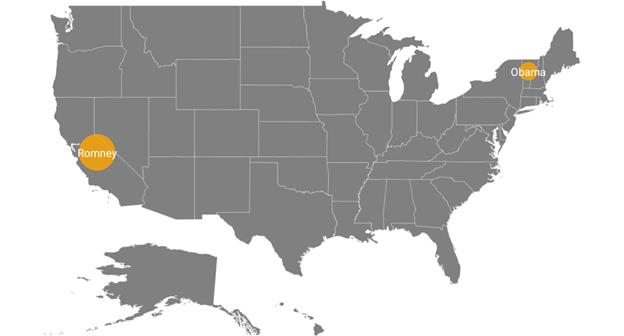

# Bubble marker

Bubbles in the maps control represents the underlying data values of the map. Bubbles are scattered throughout the map shapes that contain bound values.

## Bubble Data

Bubbles are included when the data binding and [`BubbleMarkerSettings`](https://help.syncfusion.com/cr/cref_files/xamarin/Syncfusion.SfMaps.XForms~Syncfusion.SfMaps.XForms.ShapeFileLayer~BubbleMarkerSettings.html# ) are set to the shape layers.

Below code snippet explains the data binding that is provided for bubble.





<maps:ShapeFileLayer  Uri="usa_state.shp"  ShapeIDPath="State"  ShapeIDTableField="STATE_NAME" 

ItemsSource="{Binding Data}"    />





ShapeFileLayer layer = new ShapeFileLayer();

layer.Uri = "usa_state.shp";

layer.ItemsSource = viewModel.Data;

layer.ShapeIDTableField = "STATE_NAME";

layer.ShapeIDPath = "State";

map.Layers.Add(layer);

public class ViewModel
    {
        public ObservableCollection<ElectionData> Data { get; set; }
        public ViewModel()
        {
            Data = new ObservableCollection<ElectionData>();
            Data.Add(new ElectionData("California", "Romney", 55));            
            Data.Add(new ElectionData("Vermont", "Obama", 3));
        }
    }





## Adding bubbles

To add bubbles to a map, the bubble marker setting should be added to the shape file layer.[`ShowBubbles`](https://help.syncfusion.com/cr/cref_files/xamarin/Syncfusion.SfMaps.XForms~Syncfusion.SfMaps.XForms.BubbleMarkerSetting~ShowBubbles.html#) property should be enabled for the bubble to be visible.

[`ValuePath`](https://help.syncfusion.com/cr/cref_files/xamarin/Syncfusion.SfMaps.XForms~Syncfusion.SfMaps.XForms.BubbleMarkerSetting~ValuePath.html#) represents the field value that is to be fetched from the data for each bubble.





<maps:ShapeFileLayer.BubbleMarkerSettings>

<maps:BubbleMarkerSetting ShowBubbles="True"  ValuePath="Electors" />

</maps:ShapeFileLayer.BubbleMarkerSettings>





BubbleMarkerSetting bubbleSetting = new BubbleMarkerSetting();

bubbleSetting.ShowBubbles = true;

bubbleSetting.ValuePath = "Electors";

layer.BubbleMarkerSettings = bubbleSetting;





## Bubble marker customization

### Color Customization

The fill color and opacity of the bubbles can be customized using the [`Fill`](https://help.syncfusion.com/cr/cref_files/xamarin/Syncfusion.SfMaps.XForms~Syncfusion.SfMaps.XForms.BubbleMarkerSetting~Fill.html#) and [`Opacity`](https://help.syncfusion.com/cr/cref_files/xamarin/Syncfusion.SfMaps.XForms~Syncfusion.SfMaps.XForms.BubbleMarkerSetting~Opacity.html#)  properties.





<maps:ShapeFileLayer.BubbleMarkerSettings>

<maps:BubbleMarkerSetting ShowBubbles="True"  ValuePath="Electors"  Fill="Orange" Opacity="0.8" />

</maps:ShapeFileLayer.BubbleMarkerSettings>





BubbleMarkerSetting bubbleSetting = new BubbleMarkerSetting();

bubbleSetting.ShowBubbles = true;

bubbleSetting.ValuePath = "Electors";

bubbleSetting.Fill = Color.Orange;

bubbleSetting.Opacity = 0.8;

layer.BubbleMarkerSettings = bubbleSetting;





### Size customization

Size of the bubbles depends on the data that is bound to the [`ValuePath`](https://help.syncfusion.com/cr/cref_files/xamarin/Syncfusion.SfMaps.XForms~Syncfusion.SfMaps.XForms.BubbleMarkerSetting~ValuePath.html#) but the maximum and minimum size of the bubble can be customized using [`MaxSize`](https://help.syncfusion.com/cr/cref_files/xamarin/Syncfusion.SfMaps.XForms~Syncfusion.SfMaps.XForms.BubbleMarkerSetting~MaxSize.html#) and [`MinSize`](https://help.syncfusion.com/cr/cref_files/xamarin/Syncfusion.SfMaps.XForms~Syncfusion.SfMaps.XForms.BubbleMarkerSetting~MinSize.html#) properties.

I> [`ShowMapItems`](https://help.syncfusion.com/cr/cref_files/xamarin/Syncfusion.SfMaps.XForms~Syncfusion.SfMaps.XForms.ShapeFileLayer~ShowMapItems.html) should be enabled to display label on bubble marker.





<maps:ShapeFileLayer.BubbleMarkerSettings>

<maps:BubbleMarkerSetting ShowBubbles="True"  ValuePath="Electors"  Fill="Orange"
                         MaxSize="25" MinSize="20" Opacity="0.8" />

</maps:ShapeFileLayer.BubbleMarkerSettings>





BubbleMarkerSetting bubbleSetting = new BubbleMarkerSetting();

bubbleSetting.ShowBubbles = true;

bubbleSetting.ValuePath = "Electors";

bubbleSetting.Fill = Color.Orange;

bubbleSetting.Opacity = 0.8;

bubbleSetting.MinSize = 20;

bubbleSetting.MaxSize = 25;

 layer.BubbleMarkerSettings = bubbleSetting;





Following snippet explains the complete code for adding bubbles along with its customization.





 <maps:SfMaps x:Name="sfmap"  BackgroundColor="White">                
                <maps:SfMaps.Layers>
                    <maps:ShapeFileLayer Uri="usa_state.shp" ShapeIDPath="State" ShowMapItems="True"
                                         ShapeIDTableField="STATE_NAME">

                        <maps:ShapeFileLayer.BubbleMarkerSettings>
                            <maps:BubbleMarkerSetting ShowBubbles="True"  MaxSize="25" MinSize="20"
                                                  ValuePath="Electors" Fill="Orange" Opacity="0.8">
                            </maps:BubbleMarkerSetting>
                        </maps:ShapeFileLayer.BubbleMarkerSettings>

                        <maps:ShapeFileLayer.ShapeSettings>
                            <maps:ShapeSetting ShapeValuePath="Candidate" />
                        </maps:ShapeFileLayer.ShapeSettings>
                        
                    </maps:ShapeFileLayer>
                </maps:SfMaps.Layers>
            </maps:SfMaps>





 SfMaps map = new SfMaps();

            map.BackgroundColor = Color.White;

            ShapeFileLayer layer = new ShapeFileLayer();

            layer.Uri = "usa_state.shp";            

            layer.ItemsSource = viewModel.Data;

            layer.ShapeIDTableField = "STATE_NAME";

            layer.ShapeIDPath = "State";

            layer.ShowMapItems = true;

            map.Layers.Add(layer);

            BubbleMarkerSetting bubbleSetting = new BubbleMarkerSetting();

            bubbleSetting.ShowBubbles = true;

            bubbleSetting.MinSize = 20;

            bubbleSetting.MaxSize = 25;

            bubbleSetting.Fill = Color.Orange;

            bubbleSetting.Opacity = 0.8;

            bubbleSetting.ValuePath = "Electors";

            layer.BubbleMarkerSettings = bubbleSetting;

            ShapeSetting shapeSetting = new ShapeSetting();

            shapeSetting.ShapeValuePath = "Candidate";

            layer.ShapeSettings = shapeSetting;

            this.Content = map;

public class ViewModel
    {
        public ObservableCollection<ElectionData> Data { get; set; }
        public ViewModel()
        {
            Data = new ObservableCollection<ElectionData>();
            Data.Add(new ElectionData("California", "Romney", 55));            
            Data.Add(new ElectionData("Vermont", "Obama", 3));
        }
    }





