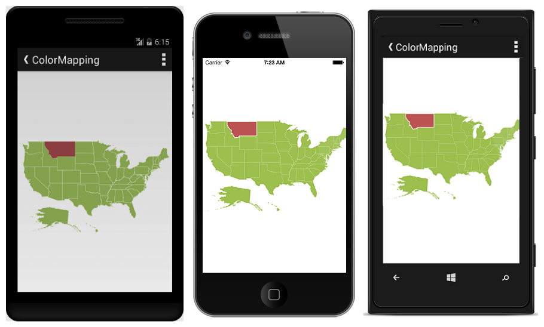
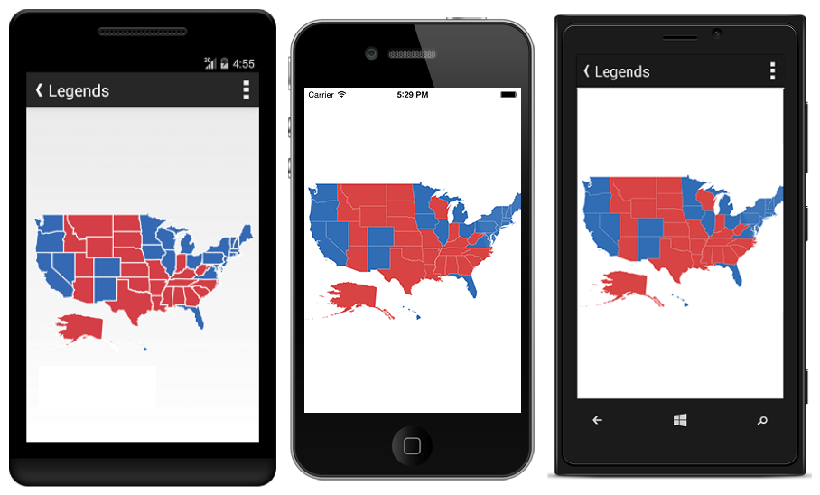
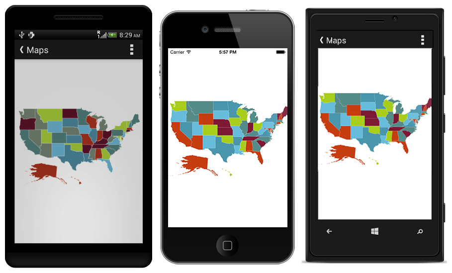

# Customization

Maps control supports color customization to determine the exact combination of colors for shapes displayed in Maps and tooltip support to display additional information of shape data.

## Shape Settings

The shapeSettings defines the basic customization settings of shapes in the map.

* `ShapeFill` - It is used to set the fill color of the shapes in the map.
* `ShapeStroke` - It is used to set the border color of the shape in the map.
* `ShapeStrokeThickness` - It is used to set the border thickness of the shape in the map.
* `SelectedShapeColor` - It is used to set the selection color for shapes in the map.




        <SfMaps:ShapeFileLayer:ShapeSetting>
            <SfMaps:ShapeSetting ShapeFill="#9CBF4E" SelectedShapeColor="#BC5353" 
            ShapeStroke="white" ShapeStrokeThickess="1"/>
        </SfMaps:ShapeFileLayer:ShapeSetting>
                      
      




ShapeSetting setting = new ShapeSetting ();
setting.ShapeFill = Color.ParseColor("#9CBF4E");
setting.SelectedShapeColor = Color.ParseColor("#BC5353");
setting.ShapeStroke = Color.White;
setting.ShapeStrokeThickess = 1;
layer.ShapeSettings = setting;




  

## Color Mapping

The Color Mapping support enables the customization of shape colors based on the underlying value of shape received from bounded data.

* `ColorValuePath` - It renders the field value that is to be fetched from data for each shape used for determining the shape color.
* `ValuePath` - It renders the field value that is to be fetched from data for each shape. This support also provides a tree map-like impact on the map UI. The various types of Color Mapping supported in maps are listed as follows.

### Equal Color Mapping

The `EqualColorMapping` is used to differentiate the shape’s fill based on its underlying value and color. The properties of equalColorMapping is listed in the following table.

<table>
<tr>
<th>
 Property  </th><th>
Type  </th><th>
Description  </th></tr>
<tr>
<td>
Value  </td><td>
String  </td><td>
Gets or sets the value.  </td></tr>
<tr>
<td>
Color  </td><td>
String  </td><td>
Gets or sets the color for mapping.  </td></tr>
</table>



        
    <SfMaps:ShapeFileLayer>
        <SfMaps:ShapeFileLayer ShapeIdTableField="STATE_NAME" ShapeIdPath="State"/>
                                      
        <SfMaps:ShapeFileLayer:ShapeSetting>
            <SfMaps:ShapeSetting ShapeColorValuePath="Candidate" >
            <SfMaps:ShapeSetting.ColorMappings>
                    
                <sfMaps:EqualColorMapping Value="Obama" LegendLabel="Obama" Color="#316DB5"/>
                <sfMaps:EqualColorMapping Value="Romney" LegendLabel="Romney" Color="#D84444"/>
                
            </SfMaps:ShapeSetting.ColorMappings>
                    
        </SfMaps:ShapeFileLayer:ShapeSetting>
    </SfMaps:ShapeFileLayer>               	  





{

    //..           
    layer.ShapeIdTableField ="STATE_NAME";
    layer.ShapeIdPath ="State";
    layer.DataSource = GetDataSource ();
    SetColorMapping(layer.ShapeSettings);
    layer.ShapeSettings.ShapeColorValuePath ="Candidate";
    //..
}

void SetColorMapping(ShapeSetting setting)
{

    List<ColorMapping> colorMappings= new List<ColorMapping>();

    EqualColorMapping colorMapping1= new EqualColorMapping();
    colorMapping1.Value= "Obama";
    colorMapping1.LegendLabel= "Obama";
    colorMapping1.Color =Color.ParseColor("#316DB5");
    colorMappings.Add(colorMapping1);

    EqualColorMapping colorMapping2= new EqualColorMapping();
    colorMapping2.Value= "Romney";
    colorMapping2.LegendLabel= "Romney";
    colorMapping2.Color =Color.ParseColor("#D84444");
    colorMappings.Add(colorMapping2);

    setting.ColorMapping = colorMappings;
}




  

### Color Palette

When `AutoFillColors` property is set to true, shapes are filled with default colors from built-in palettes or custom palette.



           
                                      
        <SfMaps:ShapeFileLayer:ShapeSetting AutoFillColors="true"/>            
            




        
layer.ShapeSettings.AutoFillColors = true;




  

### Item Templates

Item Templates for Map Markers The maps control provides item template support for marker items, allowing custom templates to be created with any type of view element.



    <maps:ShapeFileLayer.MarkerTemplate>
      <DataTemplate >
         <StackLayout  Padding="-12,-12,0,0" IsClippedToBounds="false" HorizontalOptions="StartAndExpand" VerticalOptions="Center" HeightRequest="60" WidthRequest="60"  >
           <Image Source="{Binding ImageName}" Scale="1" Aspect="AspectFit " HorizontalOptions="StartAndExpand" VerticalOptions="Center"  HeightRequest="15" WidthRequest="23"   />    
         </StackLayout>
      </DataTemplate>
    </maps:ShapeFileLayer.MarkerTemplate>
 


  