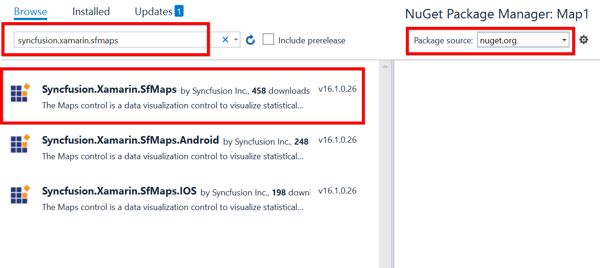
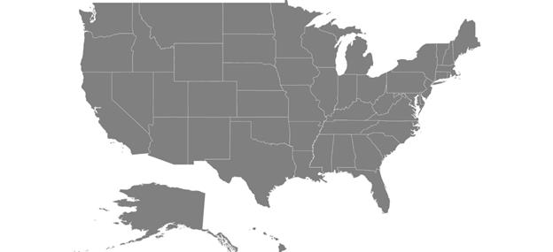

# Getting Started

This section explains the steps required to configure the SfMaps control and provides information to its basic customization.

## Adding SfMaps reference

Syncfusion Xamarin components are available in [nuget.org](https://www.nuget.org/). To add maps to your project, open the NuGet package manager in Visual Studio, and search for [syncfusion.xamarin.sfmaps](https://www.nuget.org/packages/Syncfusion.Xamarin.SfMaps), and then install it. 

 

To know more about obtaining our components, refer to these links: [Mac](https://help.syncfusion.com/xamarin/introduction/download-and-installation/mac) and [Windows](https://help.syncfusion.com/xamarin/introduction/download-and-installation/windows). Also, if you prefer to manually refer the assemblies instead of NuGet, refer to this [link](https://help.syncfusion.com/xamarin/introduction/control-dependencies#sfmaps) to know about the dependent assemblies for maps.

I> After adding the reference, an additional step is required for iOS and UWP projects. You should create an instance of the `SfMapsRenderer` in iOS and UWP projects as shown in this [KB article.](https://www.syncfusion.com/kb/8603)

I> For UWP alone, one more additional step is required if the project is built-in release mode with .NET Native tool chain enabled. You can refer to this [KB article](https://www.syncfusion.com/kb/8604) for more details.

## Adding namespace

The following namespace needs to be added.





xmlns:maps="clr-namespace:Syncfusion.SfMaps.XForms;assembly=Syncfusion.SfMaps.XForms"





using Syncfusion.SfMaps.XForms;





## Initializing Maps   

Create an instance for maps control, and add it as content.	





<maps:SfMaps >
  
</maps:SfMaps>





SfMaps map = new SfMaps();
	
this.Content = map;





## Adding layers

Map is maintained through [`Layers`](https://help.syncfusion.com/cr/cref_files/xamarin/sfmaps/Syncfusion.SfMaps.XForms~Syncfusion.SfMaps.XForms.SfMaps~Layers.html). It can accommodate one or more shape file layers.





<maps:SfMaps>

<maps:SfMaps.Layers>

<maps:ShapeFileLayer/>

</maps:SfMaps.Layers>  

</maps:SfMaps>  





SfMaps map = new SfMaps();

ShapeFileLayer layer = new ShapeFileLayer();

map.Layers.Add(layer);
	
this.Content = map;





## Adding shape files

Shape file is a set of files that are stored in a non-topological geometry with the attribute information for the spatial features and records in a data set.

Maps control supports reading and loading the shape files.
Shape file can be a set of files or a single file. Generally, a shape file contains the following files:

* Main file (.shp)

* dBase file (.dbf)

### Android

*	Add the necessary shape files to the Assets folder of ProjectFileName.Droid.
*	Right-click the added shape file, and navigate to properties.
*	Choose the `AndroidAsset` option under BuildAction of respective shape file.

### iOS

*	Add the necessary shape files to the Resources folder of ProjectFileName.iOS.
*	Right-click the added shape file, and navigate to properties.
*	Choose the `BundleResource` option under BuildAction of respective shape file.

### UWP

*	Add the necessary shapes file in a folder and name it as `ShapeFiles`. Add this `ShapeFiles` folder into the `Assets` folder of ProjectFileName.UWP.
*	Right-click the added shape file, and navigate to properties.
*	Choose the `EmbeddedResource` option under BuildAction of respective shape file.

[`Uri`](https://help.syncfusion.com/cr/cref_files/xamarin/sfmaps/Syncfusion.SfMaps.XForms~Syncfusion.SfMaps.XForms.ShapeFileLayer~Uri.html) property in shape file layer is used to retrieve the location of the shape file that is added.





    <maps:SfMaps x:Name="sfmap"  BackgroundColor="White" >
                <maps:SfMaps.Layers >
                    <maps:ShapeFileLayer Uri="usa_state.shp"  >                        
                    </maps:ShapeFileLayer>
                </maps:SfMaps.Layers>
    </maps:SfMaps>     




	
SfMaps map = new SfMaps();
map.BackgroundColor = Color.White;
ShapeFileLayer layer = new ShapeFileLayer();
layer.Uri = "usa_state.shp";
map.Layers.Add(layer);
this.Content = map;


 


After loading the shapes file, the following output will be reproduced.

## GeoJSON support

Maps control supports reading and loading the GeoJSON files. GeoJSON file contains attribute information for the spatial features and coordinates in a dataset.
 



        
 <maps:ShapeFileLayer Uri="usa_state.json">                        
 </maps:ShapeFileLayer>
					



     
 ShapeFileLayer layer = new ShapeFileLayer();
 layer.Uri = "usa_state.json";
			




## Data binding

Data can be binded to the shape file layer using the [`ItemsSource`](https://help.syncfusion.com/cr/cref_files/xamarin/sfmaps/Syncfusion.SfMaps.XForms~Syncfusion.SfMaps.XForms.ShapeFileLayer~ItemsSource.html), [`ShapeIDPath`](https://help.syncfusion.com/cr/cref_files/xamarin/sfmaps/Syncfusion.SfMaps.XForms~Syncfusion.SfMaps.XForms.ShapeFileLayer~ShapeIDPath.html), [`ShapeIdTableField`](https://help.syncfusion.com/cr/cref_files/xamarin/sfmaps/Syncfusion.SfMaps.XForms~Syncfusion.SfMaps.XForms.ShapeFileLayer~ShapeIDTableField.html) properties.
 [`Populate data`](https://help.syncfusion.com/xamarin/SfMaps/PopulateData) topic gives the detailed explanation of data binding.





<maps:SfMaps.Layers >
<maps:ShapeFileLayer Uri="usa_state.shp" ItemsSource="{Binding Data}"
                                          ShapeIDPath="State" ShapeIDTableField="STATE_NAME" >
</maps:ShapeFileLayer>
                </maps:SfMaps.Layers>        




	
ShapeFileLayer layer = new ShapeFileLayer();
            layer.Uri = "usa_state.shp";
            layer.ItemsSource =viewModel.Data;
            layer.ShapeIDTableField = "STATE_NAME";
            layer.ShapeIDPath = "State";			
            map.Layers.Add(layer);





## Adding marker 

Markers are used to identify the shapes. This can be added to the shape file layers as shown in the following code sample.
Markers can be customized using the [`MarkerSettings`](https://help.syncfusion.com/cr/cref_files/xamarin/sfmaps/Syncfusion.SfMaps.XForms~Syncfusion.SfMaps.XForms.ShapeFileLayer~MarkerSettings.html) property in shape file layer.

Detailed explanation of marker and its customization is provided under [`Markers`](https://help.syncfusion.com/xamarin/SfMaps/Markers) topic.





 <maps:ShapeFileLayer.Markers>
              <maps:MapMarker Label = "California" Latitude = "37" Longitude = "-120">                
              </maps:MapMarker>
 </maps:ShapeFileLayer.Markers>           




	
MapMarker marker = new MapMarker();
marker.Label = "California";
marker.Latitude = "37";
marker.Longitude = "-120";
layer.Markers.Add(marker);   





## Color mapping

The color mapping support enables the customization of shape colors based on the underlying value of shape received from the bounded data.
Both range and equal color mapping is supported in maps.

Detailed explanation of color mapping is provided in  [`colorMapping`](https://help.syncfusion.com/xamarin/SfMaps/ColorMapping) topic.





<maps:ShapeSetting.ColorMappings>
<maps:EqualColorMapping Color="#D84444" LegendLabel="Romney" Value = "Romney"></maps:EqualColorMapping>
<maps:EqualColorMapping Color="#316DB5" LegendLabel="Obama" Value="Obama"></maps:EqualColorMapping>
</maps:ShapeSetting.ColorMappings>         




	
 EqualColorMapping colorMapping = new EqualColorMapping();
            colorMapping.Color = Color.FromHex("#D84444");
            colorMapping.LegendLabel = "Romney";
            colorMapping.Value = "Romney";

            EqualColorMapping colorMapping1 = new EqualColorMapping();
            colorMapping1.Color = Color.FromHex("#316DB5");
            colorMapping1.LegendLabel = "Obama";
            colorMapping1.Value = "Obama";

            ShapeSetting shapeSetting = new ShapeSetting();           
            shapeSetting.ColorMappings.Add(colorMapping);
            shapeSetting.ColorMappings.Add(colorMapping1);




 
## Adding legend

The legends interpret what the map displays. It can be added to the shape file layer as in below code snippet. Legends will be displayed based on the data bound to the layer and color mapping plays a major role in that. 

Detailed explanation of legend is provided under [`Legend`](https://help.syncfusion.com/xamarin/SfMaps/Legend) topic.





<maps:ShapeFileLayer.LegendSettings>
   <maps:MapLegendSetting ShowLegend="true" LegendPosition="75,90"/>
</maps:ShapeFileLayer.LegendSettings>




	
MapLegendSetting setting = new MapLegendSetting();
setting.ShowLegend = true;
setting.LegendPosition = new Point(75, 90);
layer.LegendSettings = setting;  





The following code example gives you the complete code for map with marker and legend.





<maps:SfMaps x:Name="sfmap"  BackgroundColor="White"  >
                <maps:SfMaps.Layers >
                    <maps:ShapeFileLayer Uri="usa_state.shp" ShapeIDPath="State" 
                                         ShapeIDTableField="STATE_NAME" 
                                       ItemsSource="{Binding Data}"
                                         >
                        <maps:ShapeFileLayer.Markers>
                            <maps:MapMarker Label = "California" Latitude = "37" Longitude = "-120">
                            </maps:MapMarker>
                        </maps:ShapeFileLayer.Markers>
                        
                        <maps:ShapeFileLayer.MarkerSettings>
                            
                            <maps:MapMarkerSetting IconColor="LimeGreen" IconSize="25" 
                                                   LabelColor="White" LabelSize="20">
                            </maps:MapMarkerSetting>

                        </maps:ShapeFileLayer.MarkerSettings>

                        <maps:ShapeFileLayer.ShapeSettings>
                            <maps:ShapeSetting ShapeColorValuePath="Candidate" ShapeValuePath="Candidate"   >
                                <maps:ShapeSetting.ColorMappings>

                                    <maps:EqualColorMapping Color="#D84444" LegendLabel="Romney" Value = "Romney"></maps:EqualColorMapping>
                                    <maps:EqualColorMapping Color="#316DB5" LegendLabel="Obama" Value="Obama"></maps:EqualColorMapping>
                                </maps:ShapeSetting.ColorMappings>
                            </maps:ShapeSetting>
                        </maps:ShapeFileLayer.ShapeSettings>

                        <maps:ShapeFileLayer.LegendSettings>
                            <maps:MapLegendSetting ShowLegend="True"  
                                                   LegendPosition="30,70">
                                <maps:MapLegendSetting.IconSize>
                                    <Size Width="20" Height="20"></Size>
                                </maps:MapLegendSetting.IconSize>
                            </maps:MapLegendSetting>
                        </maps:ShapeFileLayer.LegendSettings>
                        
                    </maps:ShapeFileLayer>
                </maps:SfMaps.Layers>
            </maps:SfMaps>





SfMaps map = new SfMaps();

            map.BackgroundColor = Color.White;
            ShapeFileLayer layer = new ShapeFileLayer();
            layer.Uri = "usa_state.shp";
            layer.ItemsSource = viewModel.Data;
            layer.ShapeIDTableField = "STATE_NAME";
            layer.ShapeIDPath = "State";
            map.Layers.Add(layer);

            MapLegendSetting legendSetting = new MapLegendSetting();
            legendSetting.ShowLegend = true;
            legendSetting.LegendPosition = new Point(30, 70);
            legendSetting.IconSize = new Size(20, 20);
            layer.LegendSettings = legendSetting;

            MapMarker marker = new MapMarker();
            marker.Label = "California";
            marker.Latitude = "37";
            marker.Longitude = "-120";
            layer.Markers.Add(marker);

            MapMarkerSetting markerSetting = new MapMarkerSetting();
            markerSetting.IconColor = Color. LimeGreen;
            markerSetting.IconSize = 25;
            markerSetting.LabelColor = Color.White;
            markerSetting.LabelSize = 20;
            layer.MarkerSettings = markerSetting;

            EqualColorMapping colorMapping = new EqualColorMapping();
            colorMapping.Color = Color.FromHex("#D84444");
            colorMapping.LegendLabel = "Romney";
            colorMapping.Value = "Romney";

            EqualColorMapping colorMapping1 = new EqualColorMapping();
            colorMapping1.Color = Color.FromHex("#316DB5");
            colorMapping1.LegendLabel = "Obama";
            colorMapping1.Value = "Obama";

            ShapeSetting shapeSetting = new ShapeSetting();
            shapeSetting.ShapeValuePath = "Candidate";
            shapeSetting.ShapeColorValuePath = "Candidate";
            shapeSetting.ColorMappings.Add(colorMapping);
            shapeSetting.ColorMappings.Add(colorMapping1);
            layer.ShapeSettings = shapeSetting;

            this.Content = map;





The following output is reproduced as a result of above codes.

 

You can download the complete getting started sample from this [link](http://www.syncfusion.com/downloads/support/directtrac/general/ze/MapsSample-1975206216.zip).