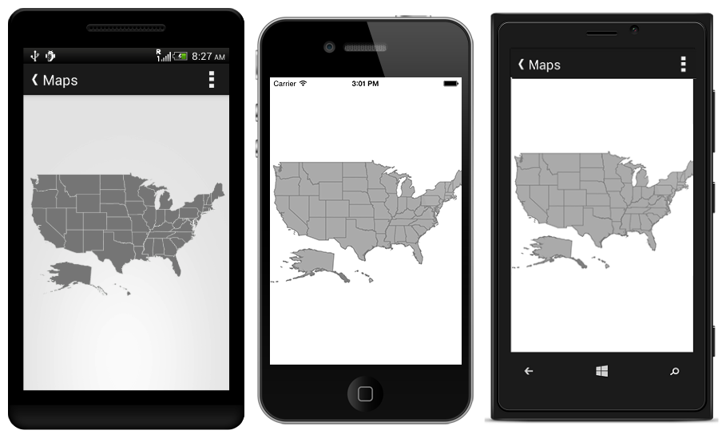
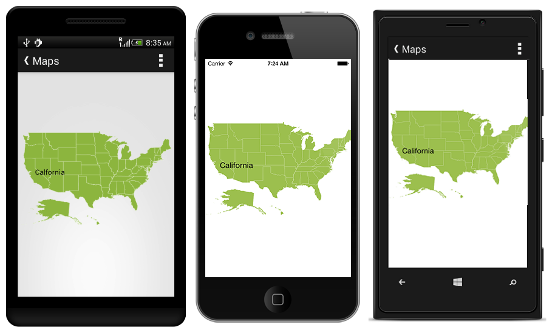

# Getting Started

This section explains you the steps to configure a Maps control in a real-time scenario and also provides a walk-through on some of the customization features available in Maps control.

## Referencing Essential Studio components in your solution

If you had acquired Essential Studio components through the Xamarin component store interface from within your IDE, then after adding the components to your Xamarin.iOS, Xamarin.Android and UWP projects through the Component manager, you will still need to manually reference the PCL (Portable Class Library) assemblies in the Xamarin.Forms PCL project in your solution. You can do this by manually adding the relevant PCL assembly references to your PCL project contained in the following path inside of your solution folder.  

Components/syncfusionessentialstudio-version/lib/pcl/

Alternatively if you had downloaded Essential Studio from Syncfusion.com or through the Xamarin store web interface then all assembly references need to be added manually.

After installing Essential Studio for Xamarin, all the required assemblies can be found in the installation folders, typically

{Syncfusion Installed location}\Essential Studio\syncfusionessentialstudio-version\lib

Eg: C:\Program Files (x86)\Syncfusion\Essential Studio\{{ site.releaseversion }}\lib

Or after downloading through the Xamarin store web interface, all the required assemblies can be found in the below folder

{Download location}\syncfusionessentialstudio-version\lib

You can then add the assembly references to the respective projects as shown below

<table>
<tr>
<th>Project</th>
<th>Required assemblies</th>
</tr>
<tr>
<td>PCL</td>
<td>pcl\Syncfusion.SfMaps.XForms.dll</td>
</tr>
<tr>
<td>Android</td>
<td>android\Syncfusion.SfMaps.Android.dll android\Syncfusion.SfMaps.XForms.Android.dll</td>
</tr>
<tr>
<td>iOS (Classic)</td>
<td>iOS\Syncfusion.SfMaps.iOS.dll iOS\Syncfusion.SfMaps.XForms.iOS.dll iOS\Syncfusion.SfMaps.XForms.dll</td>
</tr>
<tr>
<td>iOS (Unified)</td>
<td>iOS-unified\Syncfusion.SfMaps.iOS.dll iOS-unified\Syncfusion.SfMaps.XForms.iOS.dll iOS-unified\Syncfusion.SfMaps.XForms.dll</td>
</tr>
<tr>
<td>UWP</td>
<td>uwp\Syncfusion.SfMaps.XForms.dll uwp\Syncfusion.SfMaps.XForms.UWP.dll uwp\Syncfusion.SfMaps.UWP.dll</td>
</tr>
</table>

Currently an additional step is required for UWP and iOS projects. We need to create an instance of the maps custom renderer as shown below. 

Create an instance of SfMapsRenderer in MainPage constructor of the UWP project as shown 



public MainPage()

{

    new SfMapsRenderer();

    ...    

}



Create an instance of SfMapsRenderer in FinishedLaunching overridden method of AppDelegate class in iOS Project as shown below



public override bool FinishedLaunching(UIApplication app, NSDictionary options)

{

    ...

    new SfMapsRenderer ();

    ...

}	



## Initializing Maps   

Create a Maps instance in Main Activity and set Maps as a ContentView in onCreate() overridden method.





    <syncfusion:SfMap>
           
    </syncfusion:SfMap>    





    SfMaps maps = new SfMaps ();
    this.ContentView=maps;
    





## Loading Shapes to Maps

The Maps control supports reading and loading shape files. A shape file is a set of files which are stored in a non-topological geometry and the attribute information for the spatial features and records in a data set. 

A shape file can be a set of files or a single file. Generally, the shape file contains the following files:

* Main file (.shp)

* dBase file (.dbf)

These files need to be added in Asset folder.





    <syncfusion:SfMap>                     
        <syncfusion:SfMap.Layers>                
            <syncfusion:ShapeFileLayer   Uri="usa_state.shp">                                    
            </syncfusion:ShapeFileLayer>           
        </syncfusion:SfMap.Layers>        
    </syncfusion:SfMap>    	        




	

    SfMaps maps = new SfMaps ();
    ShapeFileLayer layer = new ShapeFileLayer ();
    layer.Uri = "usa_state.shp";
    maps.Layers.Add (layer);
    this.ContentView=maps;
    


 


## Steps for adding shapefiles 

Android    
     
  * Add shape files in Assets folder in ProjectFileName.Droid.                       	
    
  * Right click on the added shape file. 
   	
  * Select BuildAction property and then enable Android  Asset.If it is already enabled don't do nothing.

iOS   
  
  * Add shape files in Resource folder in ProjectFileName.iOS.  
    
  * Right click on the added shape file. 
    
  * Select BuildAction property and then enable Bundle Resource.If it is already enabled don't do nothing.

 UWP
   
  * Add shape files in Assets folder in ProjectFileName.UWP.
     
  * Right click on the added shape file.
 
  * Select BuildAction property and then enable Embedded Resource.If it is already enabled don't do nothing.

## GeoJson Support

 The Maps control supports reading and loading GeoJson files.A GeoJson file contains  attribute information for the spatial features and coordinates in a data set. 
 



        
       <SfMaps:ShapeFileLayer Uri="world.json">
       </SfMaps:ShapeFileLayer>               	  



 
     
      ShapeFileLayer layer=new ShapeFileLayer();
      layer.Uri = "world.json";





## Adding Marker to the Maps

Markers can be added into the shape layers. The below code snippets enables you to do so.





    <SfMaps:ShapeFileLayer:MapMarker>
                
        <SfMaps:MapMarker Label = "California" Latitude = "37" Longitude = "-120"/>                
                    
    </SfMaps:ShapeFileLayer:ShapeSetting>	              




	

            
    SfMaps maps = new SfMaps ();
    ShapeFileLayer layer = new ShapeFileLayer ();
    MapMarker marker = new MapMarker ();
    marker.Label = "California";
    marker.Latitude = 37;
    marker.Longitude = -120;
    layer.Markers.Add (marker);  
    maps.Layers.Add (layer);            
    this.ContentView=maps;
    





 