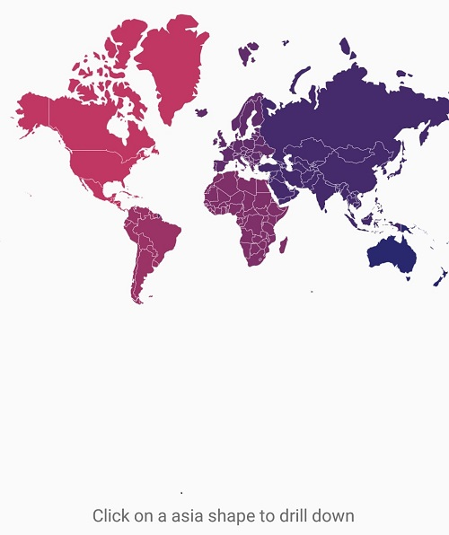
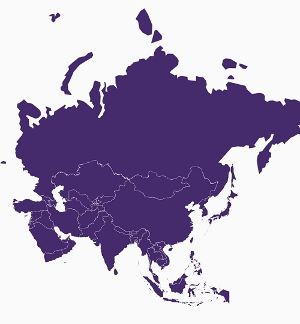

# Layers

Maps is maintained through [`Layers`](https://help.syncfusion.com/cr/cref_files/xamarin/Syncfusion.SfMaps.XForms~Syncfusion.SfMaps.XForms.SfMaps~LayersProperty.html) and it can accommodate one or more layers.

Maps consists of two layers

* ImageryLayer

* ShapeFileLayer

## ImageryLayer

[`MapsProvider`](https://help.syncfusion.com/xamarin/sfmaps/mapsprovider) topic explains about the ImageryLayer.

## ShapeFileLayer

Through ShapeFileLayer, custom shape files can be rendered and the shapes can be customized.

### Shape settings

The shape settings define basic customization options for shapes in a map.

A shape’s fill, stroke, and stroke thickness can be customized using the following properties:

[`ShapeFill`](https://help.syncfusion.com/cr/cref_files/xamarin/Syncfusion.SfMaps.XForms~Syncfusion.SfMaps.XForms.ShapeSetting~ShapeFill.html#): Sets the fill color for the shapes in a map. 

[`ShapeStroke`](https://help.syncfusion.com/cr/cref_files/xamarin/Syncfusion.SfMaps.XForms~Syncfusion.SfMaps.XForms.ShapeSetting~ShapeStroke.html#): Sets the border color for the shapes in a map.

[`ShapeStrokeThickness`](https://help.syncfusion.com/cr/cref_files/xamarin/Syncfusion.SfMaps.XForms~Syncfusion.SfMaps.XForms.ShapeSetting~ShapeStrokeThickness.html#): Sets the border thickness for the shapes in a map.

Refer to the following code sample for customizing shapes.





<maps:ShapeFileLayer.ShapeSettings>

<maps:ShapeSetting  ShapeFill="LightBlue" ShapeStroke="Black" ShapeStrokeThickness="2" >

</maps:ShapeSetting>

</maps:ShapeFileLayer.ShapeSettings>





ShapeSetting shapeSetting = new ShapeSetting();            

shapeSetting.ShapeFill = Color.LightBlue;

shapeSetting.ShapeStroke = Color.Black;

shapeSetting.ShapeStrokeThickness = 2;





To customize the shapes based on the bound values, use the following properties:

[`ShapeValuePath`](https://help.syncfusion.com/cr/cref_files/xamarin/Syncfusion.SfMaps.XForms~Syncfusion.SfMaps.XForms.ShapeSetting~ShapeValuePath.html#): Field value that has to be bound for each shape.

[`ShapeColorValuePath`](https://help.syncfusion.com/cr/cref_files/xamarin/Syncfusion.SfMaps.XForms~Syncfusion.SfMaps.XForms.ShapeSetting~ShapeColorValuePath.html#): Field value that has to be bound to determine the color.





<maps:SfMaps.Layers >

<maps:ShapeFileLayer Uri="usa_state.shp" 

ShapeIDPath="State" ShapeIDTableField="STATE_NAME" >

<maps:ShapeFileLayer.ShapeSettings>

<maps:ShapeSetting ShapeColorValuePath="Candidate" ShapeValuePath="Candidate">

<maps:ShapeSetting.ColorMappings>

<maps:EqualColorMapping Color="#D84444" Value="Romney" LegendLabel="Romney"></maps:EqualColorMapping>

<maps:EqualColorMapping Color="#316DB5" Value="Obama" LegendLabel="Obama"></maps:EqualColorMapping>

</maps:ShapeSetting.ColorMappings>

</maps:ShapeSetting>

</maps:ShapeFileLayer.ShapeSettings>

</maps:ShapeFileLayer>

</maps:SfMaps.Layers>





ShapeFileLayer layer = new ShapeFileLayer();

layer.Uri = "usa_state.shp";

layer.ItemsSource = GetDataSource();

layer.ShapeIDTableField = "STATE_NAME";

layer.ShapeIDPath = "State";           

map.Layers.Add(layer);

EqualColorMapping colorMapping = new EqualColorMapping();

colorMapping.Color = Color.FromHex("#D84444");

colorMapping.LegendLabel = "Romney";

colorMapping.Value = "Romney";

EqualColorMapping colorMapping1 = new EqualColorMapping();

colorMapping1.Color = Color.FromHex("#316DB5");

colorMapping1.LegendLabel = "Obama";

colorMapping1.Value = "Obama";

ShapeSetting shapeSetting = new ShapeSetting();

shapeSetting.ShapeValuePath = "Candidate";

shapeSetting.ShapeColorValuePath = "Candidate";

shapeSetting.ColorMappings.Add(colorMapping);

shapeSetting.ColorMappings.Add(colorMapping1);

layer.ShapeSettings = shapeSetting;





### Selected shapes settings

To customize the selected shapes alone, use the following properties:

[`SelectedShapeColor`](https://help.syncfusion.com/cr/cref_files/xamarin/Syncfusion.SfMaps.XForms~Syncfusion.SfMaps.XForms.ShapeSetting~SelectedShapeColor.html#): Sets the color for selected shapes in a map.

[`SelectedShapeStroke`](https://help.syncfusion.com/cr/cref_files/xamarin/Syncfusion.SfMaps.XForms~Syncfusion.SfMaps.XForms.ShapeSetting~SelectedShapeStroke.html#): Sets the border color for selected shapes in a map.

[`SelectedShapeStrokeThickness`](https://help.syncfusion.com/cr/cref_files/xamarin/Syncfusion.SfMaps.XForms~Syncfusion.SfMaps.XForms.ShapeSetting~SelectedShapeStrokeThickness.html#): Sets the border thickness for selected shapes in a map.





<maps:ShapeFileLayer.ShapeSettings>

<maps:ShapeSetting  ShapeFill="LightBlue" ShapeStroke="Black" ShapeStrokeThickness="1" >

</maps:ShapeSetting>

</maps:ShapeFileLayer.ShapeSettings>





ShapeSetting shapeSetting = new ShapeSetting();

shapeSetting.SelectedShapeColor = Color. Green;

shapeSetting.SelectedShapeStroke = Color.Black;

shapeSetting.SelectedShapeStrokeThickness = 1;

layer.ShapeSettings = shapeSetting;





### Events

The [`ShapeSelected`](https://help.syncfusion.com/cr/cref_files/xamarin/Syncfusion.SfMaps.XForms~Syncfusion.SfMaps.XForms.ShapeFileLayer~ShapeSelected_EV.html) event will be triggered when the map shapes are selected. A corresponding model data is passed as an argument. ShapeSelected event has been deprecated. 

[`ShapeSelectionChanged`](https://help.syncfusion.com/cr/cref_files/xamarin/Syncfusion.SfMaps.XForms~Syncfusion.SfMaps.XForms.ShapeFileLayer~ShapeSelectionChanged_EV.html) event will be triggered when the map shapes selection changed with corresponding argument as model data and the selection state of the shape.





<maps:ShapeFileLayer ShapeSelectionChanged ="ShapeLayer_ShapeSelectionChanged" />





        private void ShapeLayer_ShapeSelectionChanged(object sender, ShapeSelectedEventArgs e)
        {
            AgricultureData data = e.Data as AgricultureData;
            if (data != null)
            {
                Toast.IsVisible = true;
                State = countryLabel.Text = data.Name;
                Type = populationLabel.Text = data.Type;

                Device.StartTimer(new TimeSpan(0, 0, 3), () =>
                {
                    Toast.IsVisible = false;
                    return false;
                });
            }
        }




The following code sample provides a template for showing pop-up message when a shape is selected.





 <StackLayout   x:Name="Toast" IsVisible="false" Orientation="Vertical" Spacing="0"  
                           WidthRequest="100"  HorizontalOptions="End" VerticalOptions="End" >
                <Label x:Name="stateLabel" Text="Country" HorizontalOptions="Center" 
                       VerticalOptions="Center" XAlign="Center" YAlign="Center" FontSize="10" 
                       WidthRequest="100"  HeightRequest= "20"  Opacity="0.5" BackgroundColor="Green" 
                       TextColor="White" />
                <Label x:Name="candidateLabel" Text="Population" HorizontalOptions="Center" 
                       VerticalOptions="Center" XAlign="Center" YAlign="Center" FontSize="8" Grid.Row="1"  
                       HeightRequest= "20"  WidthRequest="100"  Opacity="0.5" BackgroundColor="Green" 
                       TextColor="White"/>

</StackLayout>





## MultiLayer

The Multilayer support allows you to load multiple shape files in a single container, enabling maps to display more information.

### Adding Multiple Layers in the Map

The multiple layer can be added in the maps using [`BaseMapIndex`](https://help.syncfusion.com/cr/cref_files/xamarin/Syncfusion.SfMaps.XForms~Syncfusion.SfMaps.XForms.SfMaps~BaseMapIndexProperty.html) property which allows to drilldown from the main layer to multiple layers.

In ShapeSelected event, BaseMapIndex property has been used to change the layer when asia shape selected.




      
      <Grid>
        <Grid.BindingContext>
            <local:DrilldownViewModel/>
        </Grid.BindingContext>
        <maps:SfMaps x:Name="map">
            <maps:SfMaps.Layers>
                <maps:ShapeFileLayer EnableSelection="True" x:Name="layer1" Uri="world-map.shp" ItemsSource="{Binding DataSource}" ShapeIDPath="Country" ShapeIDTableField="admin" ShapeSelectionChanged="ShapeFileLayer_ShapeSelected">
                    <maps:ShapeFileLayer.ShapeSettings>
                        <maps:ShapeSetting  ShapeColorValuePath="Continent">
                            <maps:ShapeSetting.ColorMappings>
                                <maps:EqualColorMapping Color="#C13664" Value="North America" ></maps:EqualColorMapping>
                                <maps:EqualColorMapping Color="#9C3367" Value="South America"></maps:EqualColorMapping>
                                <maps:EqualColorMapping Color="#80306A" Value="Africa"></maps:EqualColorMapping>
                                <maps:EqualColorMapping Color="#622D6C" Value="Europe"></maps:EqualColorMapping>
                                <maps:EqualColorMapping Color="#462A6D" Value="Asia"></maps:EqualColorMapping>
                                <maps:EqualColorMapping Color="#2A2870" Value="Australia"></maps:EqualColorMapping>
                            </maps:ShapeSetting.ColorMappings>
                        </maps:ShapeSetting>
                    </maps:ShapeFileLayer.ShapeSettings>
                </maps:ShapeFileLayer>
                <maps:ShapeFileLayer x:Name="layer2" Uri="asia.shp">
                    <maps:ShapeFileLayer.ShapeSettings>
                        <maps:ShapeSetting ShapeFill="#462A6D"/>
                    </maps:ShapeFileLayer.ShapeSettings>
                </maps:ShapeFileLayer>
            </maps:SfMaps.Layers>
        </maps:SfMaps>
        <Label x:Name="label" Grid.Row="1" HorizontalOptions="Center" VerticalOptions="Center" HorizontalTextAlignment="Center" VerticalTextAlignment="Center" Text="Click on a asia shape to drill down"/>
    </Grid>





        private void ShapeFileLayer_ShapeSelected(object sender, Syncfusion.SfMaps.XForms.ShapeSelectedEventArgs e)
        {
            map.BaseMapIndex = 1;
            label.IsVisible = false;
        }

    public class DrilldownViewModel
    {
        public DrilldownViewModel()
        {
            DataSource = new ObservableCollection<DrilldownModel>();
            DataSource.Add(new DrilldownModel("Afghanistan", "Asia"));
            DataSource.Add(new DrilldownModel("Angola", "Africa"));
            DataSource.Add(new DrilldownModel("Albania", "Europe"));
            DataSource.Add(new DrilldownModel("United Arab Emirates", "Asia"));
            DataSource.Add(new DrilldownModel("Argentina", "South America"));
            DataSource.Add(new DrilldownModel("Armenia", "Asia"));
            DataSource.Add(new DrilldownModel("French Southern and Antarctic Lands", "Seven seas (open ocean)"));
            DataSource.Add(new DrilldownModel("Australia", "Australia"));
            DataSource.Add(new DrilldownModel("Austria", "Europe"));
            DataSource.Add(new DrilldownModel("Azerbaijan", "Asia"));
            DataSource.Add(new DrilldownModel("Burundi", "Africa"));
            DataSource.Add(new DrilldownModel("Belgium", "Europe"));
            DataSource.Add(new DrilldownModel("Benin", "Africa"));
            DataSource.Add(new DrilldownModel("Burkina Faso", "Africa"));
            DataSource.Add(new DrilldownModel("Bangladesh", "Asia"));
            DataSource.Add(new DrilldownModel("Bulgaria", "Europe"));
            DataSource.Add(new DrilldownModel("The Bahamas", "North America"));
            DataSource.Add(new DrilldownModel("Bosnia and Herzegovina", "Europe"));
            DataSource.Add(new DrilldownModel("Belarus", "Europe"));
            DataSource.Add(new DrilldownModel("Belize", "North America"));
            DataSource.Add(new DrilldownModel("Bolivia", "South America"));
            DataSource.Add(new DrilldownModel("Brazil", "South America"));
            DataSource.Add(new DrilldownModel("Brunei", "Asia"));
            DataSource.Add(new DrilldownModel("Bhutan", "Asia"));
            DataSource.Add(new DrilldownModel("Botswana", "Africa"));
            DataSource.Add(new DrilldownModel("Central African Republic", "Africa"));
            DataSource.Add(new DrilldownModel("Canada", "North America"));
            DataSource.Add(new DrilldownModel("Switzerland", "Europe"));
            DataSource.Add(new DrilldownModel("Chile", "South America"));
            DataSource.Add(new DrilldownModel("China", "Asia"));
            DataSource.Add(new DrilldownModel("Ivory Coast", "Africa"));
            DataSource.Add(new DrilldownModel("Cameroon", "Africa"));
            DataSource.Add(new DrilldownModel("Democratic Republic of the Congo", "Africa"));
            DataSource.Add(new DrilldownModel("Republic of Congo", "Africa"));
            DataSource.Add(new DrilldownModel("Colombia", "South America"));
            DataSource.Add(new DrilldownModel("Costa Rica", "North America"));
            DataSource.Add(new DrilldownModel("Cuba", "North America"));
            DataSource.Add(new DrilldownModel("Northern Cyprus", "Asia"));
            DataSource.Add(new DrilldownModel("Cyprus", "Asia"));
            DataSource.Add(new DrilldownModel("Czech Republic", "Europe"));
            DataSource.Add(new DrilldownModel("Germany", "Europe"));
            DataSource.Add(new DrilldownModel("Djibouti", "Africa"));
            DataSource.Add(new DrilldownModel("Denmark", "Europe"));
            DataSource.Add(new DrilldownModel("Dominican Republic", "North America"));
            DataSource.Add(new DrilldownModel("Algeria", "Africa"));
            DataSource.Add(new DrilldownModel("Ecuador", "South America"));
            DataSource.Add(new DrilldownModel("Egypt", "Africa"));
            DataSource.Add(new DrilldownModel("Eritrea", "Africa"));
            DataSource.Add(new DrilldownModel("Spain", "Europe"));
            DataSource.Add(new DrilldownModel("Estonia", "Europe"));
            DataSource.Add(new DrilldownModel("Ethiopia", "Africa"));
            DataSource.Add(new DrilldownModel("Finland", "Europe"));
            DataSource.Add(new DrilldownModel("Fiji", "Australia"));
            DataSource.Add(new DrilldownModel("Falkland Islands", "South America"));
            DataSource.Add(new DrilldownModel("France", "Europe"));
            DataSource.Add(new DrilldownModel("Gabon", "Africa"));
            DataSource.Add(new DrilldownModel("United Kingdom", "Europe"));
            DataSource.Add(new DrilldownModel("Georgia", "Asia"));
            DataSource.Add(new DrilldownModel("Ghana", "Africa"));
            DataSource.Add(new DrilldownModel("Guinea", "Africa"));
            DataSource.Add(new DrilldownModel("Gambia", "Africa"));
            DataSource.Add(new DrilldownModel("Guinea Bissau", "Africa"));
            DataSource.Add(new DrilldownModel("Equatorial Guinea", "Africa"));
            DataSource.Add(new DrilldownModel("Greece", "Europe"));
            DataSource.Add(new DrilldownModel("Greenland", "North America"));
            DataSource.Add(new DrilldownModel("Guatemala", "North America"));
            DataSource.Add(new DrilldownModel("Guyana", "South America"));
            DataSource.Add(new DrilldownModel("Honduras", "North America"));
            DataSource.Add(new DrilldownModel("Croatia", "Europe"));
            DataSource.Add(new DrilldownModel("Haiti", "North America"));
            DataSource.Add(new DrilldownModel("Hungary", "Europe"));
            DataSource.Add(new DrilldownModel("Indonesia", "Asia"));
            DataSource.Add(new DrilldownModel("India", "Asia"));
            DataSource.Add(new DrilldownModel("Ireland", "Europe"));
            DataSource.Add(new DrilldownModel("Iran", "Asia"));
            DataSource.Add(new DrilldownModel("Iraq", "Asia"));
            DataSource.Add(new DrilldownModel("Iceland", "Europe"));
            DataSource.Add(new DrilldownModel("Israel", "Asia"));
            DataSource.Add(new DrilldownModel("Italy", "Europe"));
            DataSource.Add(new DrilldownModel("Jamaica", "North America"));
            DataSource.Add(new DrilldownModel("Jordan", "Asia"));
            DataSource.Add(new DrilldownModel("Japan", "Asia"));
            DataSource.Add(new DrilldownModel("Kazakhstan", "Asia"));
            DataSource.Add(new DrilldownModel("Kenya", "Africa"));
            DataSource.Add(new DrilldownModel("Kyrgyzstan", "Asia"));
            DataSource.Add(new DrilldownModel("Cambodia", "Asia"));
            DataSource.Add(new DrilldownModel("South Korea", "Asia"));
            DataSource.Add(new DrilldownModel("Kosovo", "Europe"));
            DataSource.Add(new DrilldownModel("Kuwait", "Asia"));
            DataSource.Add(new DrilldownModel("Laos", "Asia"));
            DataSource.Add(new DrilldownModel("Lebanon", "Asia"));
            DataSource.Add(new DrilldownModel("Liberia", "Africa"));
            DataSource.Add(new DrilldownModel("Libya", "Africa"));
            DataSource.Add(new DrilldownModel("Sri Lanka", "Asia"));
            DataSource.Add(new DrilldownModel("Lesotho", "Africa"));
            DataSource.Add(new DrilldownModel("Lithuania", "Europe"));
            DataSource.Add(new DrilldownModel("Luxembourg", "Europe"));
            DataSource.Add(new DrilldownModel("Latvia", "Europe"));
            DataSource.Add(new DrilldownModel("Morocco", "Africa"));
            DataSource.Add(new DrilldownModel("Moldova", "Europe"));
            DataSource.Add(new DrilldownModel("Madagascar", "Africa"));
            DataSource.Add(new DrilldownModel("Mexico", "North America"));
            DataSource.Add(new DrilldownModel("Macedonia", "Europe"));
            DataSource.Add(new DrilldownModel("Mali", "Africa"));
            DataSource.Add(new DrilldownModel("Myanmar", "Asia"));
            DataSource.Add(new DrilldownModel("Montenegro", "Europe"));
            DataSource.Add(new DrilldownModel("Mongolia", "Asia"));
            DataSource.Add(new DrilldownModel("Mozambique", "Africa"));
            DataSource.Add(new DrilldownModel("Mauritania", "Africa"));
            DataSource.Add(new DrilldownModel("Malawi", "Africa"));
            DataSource.Add(new DrilldownModel("Malaysia", "Asia"));
            DataSource.Add(new DrilldownModel("Namibia", "Africa"));
            DataSource.Add(new DrilldownModel("New Caledonia", "Australia"));
            DataSource.Add(new DrilldownModel("Niger", "Africa"));
            DataSource.Add(new DrilldownModel("Nigeria", "Africa"));
            DataSource.Add(new DrilldownModel("Nicaragua", "North America"));
            DataSource.Add(new DrilldownModel("Netherlands", "Europe"));
            DataSource.Add(new DrilldownModel("Norway", "Europe"));
            DataSource.Add(new DrilldownModel("Nepal", "Asia"));
            DataSource.Add(new DrilldownModel("New Zealand", "Australia"));
            DataSource.Add(new DrilldownModel("Oman", "Asia"));
            DataSource.Add(new DrilldownModel("Pakistan", "Asia"));
            DataSource.Add(new DrilldownModel("Panama", "North America"));
            DataSource.Add(new DrilldownModel("Peru", "South America"));
            DataSource.Add(new DrilldownModel("Philippines", "Asia"));
            DataSource.Add(new DrilldownModel("Papua New Guinea", "Australia"));
            DataSource.Add(new DrilldownModel("Poland", "Europe"));
            DataSource.Add(new DrilldownModel("Puerto Rico", "North America"));
            DataSource.Add(new DrilldownModel("North Korea", "Asia"));
            DataSource.Add(new DrilldownModel("Portugal", "Europe"));
            DataSource.Add(new DrilldownModel("Paraguay", "South America"));
            DataSource.Add(new DrilldownModel("Palestine", "Asia"));
            DataSource.Add(new DrilldownModel("Qatar", "Asia"));
            DataSource.Add(new DrilldownModel("Romania", "Europe"));
            DataSource.Add(new DrilldownModel("Russia", "Asia"));
            DataSource.Add(new DrilldownModel("Rwanda", "Africa"));
            DataSource.Add(new DrilldownModel("Western Sahara", "Africa"));
            DataSource.Add(new DrilldownModel("Saudi Arabia", "Asia"));
            DataSource.Add(new DrilldownModel("Sudan", "Africa"));
            DataSource.Add(new DrilldownModel("South Sudan", "Africa"));
            DataSource.Add(new DrilldownModel("Senegal", "Africa"));
            DataSource.Add(new DrilldownModel("Solomon Islands", "Australia"));
            DataSource.Add(new DrilldownModel("Sierra Leone", "Africa"));
            DataSource.Add(new DrilldownModel("El Salvador", "North America"));
            DataSource.Add(new DrilldownModel("Somaliland", "Africa"));
            DataSource.Add(new DrilldownModel("Somalia", "Africa"));
            DataSource.Add(new DrilldownModel("Republic of Serbia", "Europe"));
            DataSource.Add(new DrilldownModel("Suriname", "South America"));
            DataSource.Add(new DrilldownModel("Slovakia", "Europe"));
            DataSource.Add(new DrilldownModel("Slovenia", "Europe"));
            DataSource.Add(new DrilldownModel("Sweden", "Europe"));
            DataSource.Add(new DrilldownModel("Swaziland", "Africa"));
            DataSource.Add(new DrilldownModel("Syria", "Asia"));
            DataSource.Add(new DrilldownModel("Chad", "Africa"));
            DataSource.Add(new DrilldownModel("Togo", "Africa"));
            DataSource.Add(new DrilldownModel("Thailand", "Asia"));
            DataSource.Add(new DrilldownModel("Tajikistan", "Asia"));
            DataSource.Add(new DrilldownModel("Turkmenistan", "Asia"));
            DataSource.Add(new DrilldownModel("East Timor", "Asia"));
            DataSource.Add(new DrilldownModel("Trinidad and Tobago", "North America"));
            DataSource.Add(new DrilldownModel("Tunisia", "Africa"));
            DataSource.Add(new DrilldownModel("Turkey", "Asia"));
            DataSource.Add(new DrilldownModel("Taiwan", "Asia"));
            DataSource.Add(new DrilldownModel("United Republic of Tanzania", "Africa"));
            DataSource.Add(new DrilldownModel("Uganda", "Africa"));
            DataSource.Add(new DrilldownModel("Ukraine", "Europe"));
            DataSource.Add(new DrilldownModel("Uruguay", "South America"));
            DataSource.Add(new DrilldownModel("United States of America", "North America"));
            DataSource.Add(new DrilldownModel("Uzbekistan", "Asia"));
            DataSource.Add(new DrilldownModel("Venezuela", "South America"));
            DataSource.Add(new DrilldownModel("Vietnam", "Asia"));
            DataSource.Add(new DrilldownModel("Vanuatu", "Australia"));
            DataSource.Add(new DrilldownModel("Yemen", "Asia"));
            DataSource.Add(new DrilldownModel("South Africa", "Africa"));
            DataSource.Add(new DrilldownModel("Zambia", "Africa"));
            DataSource.Add(new DrilldownModel("Zimbabwe", "Africa"));
        }
        public ObservableCollection<DrilldownModel> DataSource { get; set; }

    }

     public class DrilldownModel
    {
        public DrilldownModel(string contry, string con)
        {
            this.Country = contry;
            this.Continent = con;
        }
        public string Continent
        {
            get;
            set;
        }
        public string Country
        {
            get;
            set;
        }

    }





   