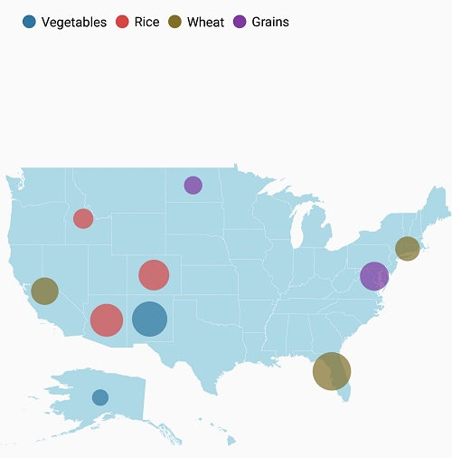
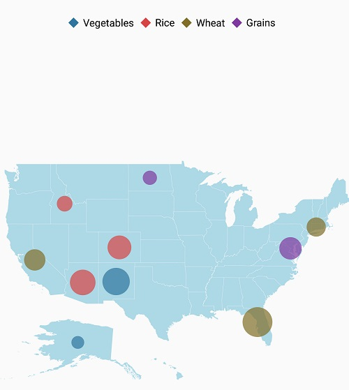
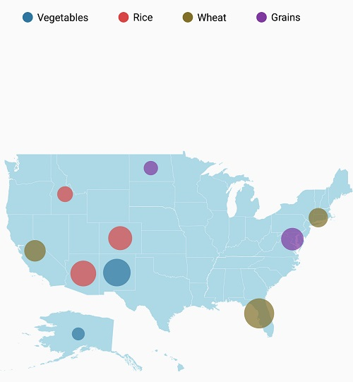
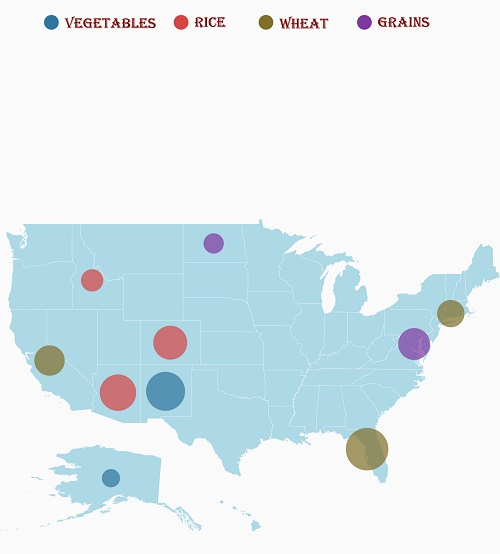

# Legend

Legends are keys used on maps; they contain swatches of symbols with descriptions. A legend interprets what the map displays; it can be represented in various colors, shapes, or other identifiers based on the data. It gives a breakdown on what each symbol represents throughout the map.
Legends can be added using the [`LegendSettings`](https://help.syncfusion.com/cr/cref_files/xamarin/Syncfusion.SfMaps.XForms~Syncfusion.SfMaps.XForms.ShapeFileLayer~LegendSettings.html) in the shape file layer.

## Visibility

The legends can be made visible by setting the [`ShowLegend`](https://help.syncfusion.com/cr/cref_files/xamarin/Syncfusion.SfMaps.XForms~Syncfusion.SfMaps.XForms.MapLegendSetting~ShowLegend.html#) property in [`MapLegendSetting`](https://help.syncfusion.com/cr/cref_files/xamarin/Syncfusion.SfMaps.XForms~Syncfusion.SfMaps.XForms.MapLegendSetting.html#) to true.





<maps:ShapeFileLayer.LegendSettings>

<maps:MapLegendSetting ShowLegend="True"></maps:MapLegendSetting>

</maps:ShapeFileLayer.LegendSettings>





MapLegendSetting legendSetting = new MapLegendSetting();

legendSetting.ShowLegend = true;

layer.LegendSettings = legendSetting;





## LegendType

Based on the layer settings,legend can be displayed. There are two LegendTypes

* Layers
* Bubbles

To display legends for Shapes,[`LegendType`](https://help.syncfusion.com/cr/cref_files/xamarin/Syncfusion.SfMaps.XForms~Syncfusion.SfMaps.XForms.MapLegendSetting~LegendTypeProperty.html) Layers is used. To display legend for Bubbles, [`LegendType`](https://help.syncfusion.com/cr/cref_files/xamarin/Syncfusion.SfMaps.XForms~Syncfusion.SfMaps.XForms.MapLegendSetting~LegendTypeProperty.html) Bubbles is used. By default, LegendType is Layers

## Legend Alignment

Legends can be aligned using [`HorizontalAlignment`](https://help.syncfusion.com/cr/cref_files/xamarin/Syncfusion.SfMaps.XForms~Syncfusion.SfMaps.XForms.MapLegendSetting~HorizontalAlignmentProperty.html) and [`VerticalAlignment`](https://help.syncfusion.com/cr/cref_files/xamarin/Syncfusion.SfMaps.XForms~Syncfusion.SfMaps.XForms.MapLegendSetting~VerticalAlignmentProperty.html) Properties. By default legends will be aligned in center.





        <maps:ShapeFileLayer.LegendSettings>

        <maps:MapLegendSetting LegendType="Bubbles" HorizontalAlignment="Start" LegendPosition="5,20" VerticalAlignment="Center" ShowLegend="True"></maps:MapLegendSetting>

        </maps:ShapeFileLayer.LegendSettings>





            MapLegendSetting legendSetting = new MapLegendSetting();

            legendSetting.ShowLegend = true;

            legendSetting.LegendType = LegendType.Bubbles;

            legendSetting.LegendPosition = new Point(5, 20);

            legendSetting.HorizontalAlignment = HorizontalAlignment.Start;

            legendSetting.VerticalAlignment = VerticalAlignment.Center;

            layer.LegendSettings = legendSetting;





## Legend position

Based on the margin values of x and y-axes, the legends can be positioned using the [`LegendPosition`](https://help.syncfusion.com/cr/cref_files/xamarin/Syncfusion.SfMaps.XForms~Syncfusion.SfMaps.XForms.MapLegendSetting~LegendPosition.html#) property of the [`MapLegendSetting`](https://help.syncfusion.com/cr/cref_files/xamarin/Syncfusion.SfMaps.XForms~Syncfusion.SfMaps.XForms.MapLegendSetting.html#) class. 

The legend items can be placed in multiple rows if size of the total legend exceeds the available size. 





        <maps:ShapeFileLayer.LegendSettings>

        <maps:MapLegendSetting LegendType="Bubbles" HorizontalAlignment="Start" LegendPosition="80,60" ShowLegend="True"></maps:MapLegendSetting>

        </maps:ShapeFileLayer.LegendSettings>





            MapLegendSetting legendSetting = new MapLegendSetting();

            legendSetting.ShowLegend = true;

            legendSetting.LegendType = LegendType.Bubbles;

            legendSetting.LegendPosition = new Point(80, 60);

            legendSetting.HorizontalAlignment = HorizontalAlignment.Start;

            layer.LegendSettings = legendSetting;





## Icon customization

The icon size of a legend can be customized using the [`IconSize`](https://help.syncfusion.com/cr/cref_files/xamarin/Syncfusion.SfMaps.XForms~Syncfusion.SfMaps.XForms.MapLegendSetting~IconSize.html#) property.





<maps:ShapeFileLayer.LegendSettings>

<maps:MapLegendSetting ShowLegend="True" LegendPosition="75,90">

<maps:MapLegendSetting.IconSize>

<Size Width="20" Height="20"/>

</maps:MapLegendSetting.IconSize>

</maps:MapLegendSetting>

</maps:ShapeFileLayer.LegendSettings>





MapLegendSetting legendSetting = new MapLegendSetting();

legendSetting.ShowLegend = true;

legendSetting.LegendPosition = new Point(75, 90);

legendSetting.IconSize = new Size(20, 20);

layer.LegendSettings = legendSetting;





The icon shape can also be customized by [`LegendIcon`](https://help.syncfusion.com/cr/cref_files/xamarin/Syncfusion.SfMaps.XForms~Syncfusion.SfMaps.XForms.LegendIcon.html) property. By default, LegendIcon is circle for bubbles and rectangle for shapes.





<maps:ShapeFileLayer.LegendSettings>

<maps:MapLegendSetting ShowLegend="True" LegendType="Bubbles" LegendIcon="Diamond">

</maps:MapLegendSetting>

</maps:ShapeFileLayer.LegendSettings>





MapLegendSetting legendSetting = new MapLegendSetting();

legendSetting.ShowLegend = true;

legendSetting.LegendType = LegendType.Bubbles;

legendSetting.LegendIcon = LegendIcon.Diamond;

layer.LegendSettings = legendSetting;





## ItemMargin

The [`ItemMargin`](https://help.syncfusion.com/cr/cref_files/xamarin/Syncfusion.SfMaps.XForms~Syncfusion.SfMaps.XForms.MapLegendSetting~ItemMarginProperty.html) property is used to set the spacing between the legend items.





        <maps:ShapeFileLayer.LegendSettings>

       <maps:MapLegendSetting LegendType="Bubbles" ShowLegend="True" ItemMargin="30" />

        </maps:ShapeFileLayer.LegendSettings>





            MapLegendSetting legendSetting = new MapLegendSetting();

            legendSetting.ShowLegend = true;

            legendSetting.LegendType = LegendType.Bubbles;

            legendSetting.ItemMargin = 30;
            
            layer.LegendSettings = legendSetting;







## Legend label

The [`LegendLabel`](https://help.syncfusion.com/cr/cref_files/xamarin/Syncfusion.SfMaps.XForms~Syncfusion.SfMaps.XForms.ColorMapping~LegendLabel.html) provides information about the maps. It is specified under color mapping.

The following properties are used to customize the label of the legend

 * [`TextColor`](https://help.syncfusion.com/cr/cref_files/xamarin/Syncfusion.SfMaps.XForms~Syncfusion.SfMaps.XForms.MapLegendSetting~TextColorProperty.html) - used to change the color of the legend text.

 * [`FontAttributes`](https://help.syncfusion.com/cr/cref_files/xamarin/Syncfusion.SfMaps.XForms~Syncfusion.SfMaps.XForms.MapLegendSetting~FontAttributesProperty.html) - used to change the font weight of the legend label.

 * [`FontFamily`](https://help.syncfusion.com/cr/cref_files/xamarin/Syncfusion.SfMaps.XForms~Syncfusion.SfMaps.XForms.MapLegendSetting~FontFamilyProperty.html) - used to change the font family of the legend label.

 * [`FontSize`](https://help.syncfusion.com/cr/cref_files/xamarin/Syncfusion.SfMaps.XForms~Syncfusion.SfMaps.XForms.MapLegendSetting~FontSizeProperty.html) - used to change the text size of the legend label.





        <maps:ShapeFileLayer.LegendSettings>

       <maps:MapLegendSetting LegendType="Bubbles" ShowLegend="True" FontFamily="algerian.ttf" TextColor="Maroon" />

        </maps:ShapeFileLayer.LegendSettings>





            MapLegendSetting legendSetting = new MapLegendSetting();

            legendSetting.ShowLegend = true;

            legendSetting.LegendType = LegendType.Bubbles;

            legendSetting.FontFamily ="algerian.ttf";

            legendSetting.TextColor = Color.Maroon;
            
            layer.LegendSettings = legendSetting;





The following code sample demonstrates how to add a legend to maps and customize it.





     <Grid>
        <Grid.BindingContext>
            <local:ViewModel />
        </Grid.BindingContext>
        <maps:SfMaps>
            <maps:SfMaps.Layers>
                <maps:ShapeFileLayer x:Name="layer" Uri="usa_state.shp" ShapeIDPath="Name" ShapeIDTableField="STATE_NAME" 
                                        ShowMapItems="True"  ItemsSource="{Binding DataSource}">
                    <maps:ShapeFileLayer.BubbleMarkerSettings>
                        <maps:BubbleMarkerSetting  ValuePath="index" ColorValuePath="index" >
                            <maps:BubbleMarkerSetting.ColorMappings>
                                <maps:RangeColorMapping Color="#2E769F" From="0" To="15" LegendLabel="0 - 15 " />
                                <maps:RangeColorMapping Color="#D84444" To="30" From="15" LegendLabel="15- 30" />
                                <maps:RangeColorMapping Color="#816F28" To="45" From="30" LegendLabel="30 - 45" />
                                <maps:RangeColorMapping Color="#7F38A0" To="60" From="45" LegendLabel="45 - 60" />
                            </maps:BubbleMarkerSetting.ColorMappings>
                        </maps:BubbleMarkerSetting>
                    </maps:ShapeFileLayer.BubbleMarkerSettings>
                    <maps:ShapeFileLayer.ShapeSettings>
                        <maps:ShapeSetting  ShapeFill="LightBlue"/>
                    </maps:ShapeFileLayer.ShapeSettings>
                    <maps:ShapeFileLayer.LegendSettings>
                        <maps:MapLegendSetting LegendType="Bubbles" ItemMargin="30" LegendIcon="Diamond" LegendPosition="5,20" HorizontalAlignment="Start" VerticalAlignment="Bottom" FontFamily="algerian.ttf" FontSize="14" TextColor="Maroon" ShowLegend="True"></maps:MapLegendSetting>
                    </maps:ShapeFileLayer.LegendSettings>
                </maps:ShapeFileLayer>
            </maps:SfMaps.Layers>
        </maps:SfMaps>
    </Grid>





ViewModel viewModel = new ViewModel();

            SfMaps map = new SfMaps();

            map.BackgroundColor = Color.White;

            ShapeFileLayer layer = new ShapeFileLayer();

            layer.Uri = "usa_state.shp";

            layer.ItemsSource = viewModel.DataSource;

            layer.ShapeIDTableField = "STATE_NAME";

            layer.ShapeIDPath = "Name";

            layer.ShowMapItems = true;               

            BubbleMarkerSetting bubbleSetting = new BubbleMarkerSetting();

            bubbleSetting.ValuePath = "index";

            bubbleSetting.ColorValuePath = "index";

            RangeColorMapping colorMapping1 = new RangeColorMapping() { Color = Color.FromHex("#2E769F"), From = 0, To = 15 };
            RangeColorMapping colorMapping2 = new RangeColorMapping() { Color = Color.FromHex("#D84444"), From = 15, To = 30 };
            RangeColorMapping colorMapping3 = new RangeColorMapping() { Color = Color.FromHex("#816F28"), From = 30, To = 45 };
            RangeColorMapping colorMapping4 = new RangeColorMapping() { Color = Color.FromHex("#7F38A0"), From = 45, To = 50 };

            bubbleSetting.ColorMappings.Add(colorMapping1);
            bubbleSetting.ColorMappings.Add(colorMapping2);
            bubbleSetting.ColorMappings.Add(colorMapping3);
            bubbleSetting.ColorMappings.Add(colorMapping4);

            layer.BubbleMarkerSettings = bubbleSetting;

            MapLegendSetting legendSetting = new MapLegendSetting();

            legendSetting.ShowLegend = true;

            legendSetting.LegendPosition = new Point(5, 20);

            legendSetting.LegendType = LegendType.Bubbles;

            legendSetting.FontFamily ="algerian.ttf";

            legendSetting.TextColor = Color.Maroon;

            legendSetting.ItemMargin = 30;

            legendSetting.LegendIcon = LegendIcon.Diamond;

            legendSetting.HorizontalAlignment = HorizontalAlignment.Start;

            layer.LegendSettings = legendSetting;

            ShapeSetting shapeSetting = new ShapeSetting();

            shapeSetting.ShapeFill = Color.LightBlue;

            layer.ShapeSettings = shapeSetting;

            map.Layers.Add(layer);

            this.Content = map;

    public class AgricultureData
    {
        public AgricultureData(string name, string type, int count)
        {
            Name = name;
            Type = type;
            index = count;
        }

        public string Name
        {
            get;
            set;
        }

        public string Type
        {
            get;
            set;
        }

        public int index
        {
            get;
            set;
        }
    }

    public class ViewModel
    {
        public ViewModel()
        {
            DataSource = new ObservableCollection<AgricultureData>();
          
            DataSource.Add(new AgricultureData("Alaska", "Vegetables", 0));
            DataSource.Add(new AgricultureData("Arizona", "Rice", 36));          
            DataSource.Add(new AgricultureData("California", "Wheat", 24));
            DataSource.Add(new AgricultureData("Colorado", "Rice", 31));
            DataSource.Add(new AgricultureData("North Dakota", "Grains", 4));
            DataSource.Add(new AgricultureData("Connecticut", "Wheat", 18));          
            DataSource.Add(new AgricultureData("District of Columbia", "Grains", 27));
            DataSource.Add(new AgricultureData("Florida", "Wheat", 48));
            DataSource.Add(new AgricultureData("New Mexico", "Vegetables", 41));        
            DataSource.Add(new AgricultureData("Idaho", "Rice", 8));
          
        }
        public ObservableCollection<AgricultureData> DataSource { get; set; }

    }





