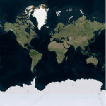
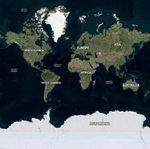
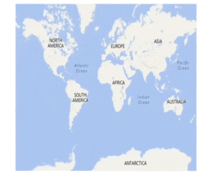
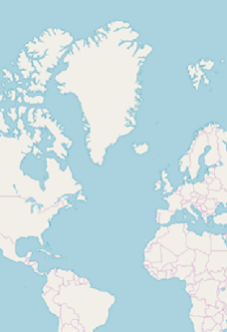

# Maps Providers

The maps control supports map providers, such as OpenStreetMap and BingMap that can be added to an imagery layer in maps.

## OpenStreetMap

The OpenStreetMap (OSM) is a world map, built by a community of mappers, and it is free to use under an open license. This allows you to view geographical data in a collaborative way from anywhere on the Earth. The OSM provides small tile images based on your requests and combines them into a single image to display the map area in the maps control. 

### Adding OSM in maps

The maps control uses `imagery layer` to display the tile images from the OSM service. To use `OSM`, add an imagery layer in maps’ layers collection.





<maps:SfMaps.Layers>
    <maps:ImageryLayer/>
</maps:SfMaps.Layers>





  SfMaps maps = new SfMaps();
  ImageryLayer layer = new ImageryLayer();
  maps.Layers.Add(layer);





N> Both the [`ShapeFileLayer`](https://help.syncfusion.com/cr/cref_files/xamarin/sfmaps/Syncfusion.SfMaps.XForms~Syncfusion.SfMaps.XForms.ShapeFileLayer.html) and `ImageryLayer` have been derived commonly from MapsLayer. 

## Bing maps

The Bing maps is a world map owned by Microsoft. As OSM, Bing maps also provides map tile images based on your requests and combines them into a single image to display a map area. To use `Bing maps`, set the `LayerType` property of ImageryLayer to “Bing”. Then, set the Bing maps key (which is obtained from [`this`](https://www.microsoft.com/en-us/maps/create-a-bing-maps-key)) to BingMapKey property of ImageryLayer. 





  <maps:SfMaps.Layers>
      <maps:ImageryLayer LayerType="Bing" BingMapKey="Your bing map key"/>
   </maps:SfMaps.Layers>





 SfMaps maps = new SfMaps();
ImageryLayer layer = new ImageryLayer();
layer.LayerType = LayerType.Bing;
layer.BingMapKey = "Your bing map key";
maps.Layers.Add(layer);





N> The `LayerType` property of `ImageryLayer` provides support for `OSM` and `Bing` maps. The default value of the LayerType property is OSM.

## BingMapStyle

The ImageryLayer provides support for the following types of Bing maps:

* `Road`
* `Aerial`
* `AerialWithLabels`

The desired style for the Bing maps can be set using the BingMapStyle property of ImageryLayer. The default value of BingMapStyle is Road.

### Road

Road view displays the default map view of roads, buildings, and geography. The default value of the BingMapStyle property of imagery layer is Road.

### Aerial

Aerial view displays the satellite images to highlight roads and major landmarks for easy identification. The aerial view can be applied to maps by setting the BingMapStyle to Aerial.





<maps:SfMaps.Layers>
    <maps:ImageryLayer LayerType="Bing" 
                       BingMapStyle="Aerial"
                       BingMapKey=" Your bing map key "/>
</maps:SfMaps.Layers>





    SfMaps maps = new SfMaps();
    ImageryLayer layer = new ImageryLayer();
    layer.LayerType = LayerType.Bing;
    layer.BingMapStyle = BingMapStyle.Aerial;
    layer.BingMapKey = "Your bing map key ";
    maps.Layers.Add(layer);





## AerialWithLabel

AerialWithLabel view displays the Aerial map with labels for continent, country, ocean, etc. This view can be applied to maps by setting the BingMapStyle as AerialWithLabel.





<maps:SfMaps.Layers>
    <maps:ImageryLayer LayerType="Bing" 
                       BingMapStyle="AerialWithLabels"
                      BingMapKey=" Your bing map key "/>
</maps:SfMaps.Layers>





    SfMaps maps = new SfMaps();
    ImageryLayer layer = new ImageryLayer();
    layer.LayerType = LayerType.Bing;
    layer.BingMapStyle = BingMapStyle.AerialWithLabels;
    layer.BingMapKey = "Your bing map key ";
    maps.Layers.Add(layer);





## Zooming and panning

Maps provides interactive zooming and panning support for OSM and Bing maps.

Zooming helps you get a closer look of an area on map for in-depth analysis. Panning helps you move a map around to focus the targeted area. You can perform zooming and panning with the pinching gesture in a map area.

## ResetOnDoubleTap

The ImageryLayer provides support to reset to the default view when you double tap the imagery layer by setting the `ResetOnDoubleTap` property to true. The default value of this property is true. This behavior can be restricted by setting the `ResetOnDoubleTap` property value to false.





<maps:SfMaps>
   <maps:SfMaps.Layers>
        <maps:ImageryLayer ResetOnDoubleTap="True"/>
    </maps:SfMaps.Layers>
</maps:SfMaps>





    SfMaps maps = new SfMaps();
    ImageryLayer layer = new ImageryLayer();
    layer.ResetOnDoubleTap = true;
    maps.Layers.Add(layer);





## GeoCoordinates

The `GeoCoordinates` property allows to view the desired area at the center on loading. By default, the `GeoCoordinates` value is (0,0). So, the latitude value 0 and longitude value 0 are shown at the center.





<maps:SfMaps ZoomLevel="2">
        <maps:SfMaps.Layers>
            <maps:ImageryLayer GeoCoordinates="69.07,-37.08"/>
        </maps:SfMaps.Layers>
    </maps:SfMaps>





  SfMaps maps = new SfMaps();
  maps.ZoomLevel = 2;
  ImageryLayer layer = new ImageryLayer();
  layer.GeoCoordinates = new Point(69.07, -37.08);
  maps.Layers.Add(layer);









<maps:SfMaps ZoomLevel="2">
    <maps:SfMaps.Layers>
        <maps:ImageryLayer GeoCoordinates="0,0"/>
    </maps:SfMaps.Layers>
</maps:SfMaps>





  SfMaps maps = new SfMaps();
  maps.ZoomLevel = 2;
  ImageryLayer layer = new ImageryLayer();
  layer.GeoCoordinates = new Point(0,0);
  maps.Layers.Add(layer);





## Markers

As [`ShapeFileLayer`](https://help.syncfusion.com/cr/cref_files/xamarin/sfmaps/Syncfusion.SfMaps.XForms~Syncfusion.SfMaps.XForms.ShapeFileLayer.html), markers also can be added to imagery layer. Markers can be customized using the MarkerSettings property in imagery layer.
The detailed explanation of marker and its customization has been provided in Markers section.

% tabs %}



<maps:ImageryLayer  >
    <maps:ImageryLayer.MarkerSettings>
        <maps:MapMarkerSetting IconColor="Red" 
                               IconSize="13" MarkerIcon="Diamond"/>
    </maps:ImageryLayer.MarkerSettings>
                <maps:ImageryLayer.Markers>
                    <maps:MapMarker  Label="United States" Latitude="40"
                                     Longitude= "-101"/>
                    <maps:MapMarker Label="Brazil" Latitude="-15.7833" 
                                    Longitude= "-52" />
                    <maps:MapMarker Label="Congo" Latitude="-1.6" 
                                    Longitude= "24.4" />
                    <maps:MapMarker Label="Kazakhstan" Latitude="49.9" 
                                    Longitude= "72.23" />
                    <maps:MapMarker Label="Australia" Latitude="-20.54"
                                    Longitude= "134.10" />
               </maps:ImageryLayer.Markers>
        </maps:ImageryLayer>





            ImageryLayer layer = new ImageryLayer();
            layer.MarkerSettings = new MapMarkerSetting();
            layer.MarkerSettings.IconColor = Color.Red;
            layer.MarkerSettings.MarkerIcon = MapMarkerIcon.Diamond;
            layer.MarkerSettings.IconSize = 13;
            MapMarker marker1 = new MapMarker();
            marker1.Label = "United States";
            marker1.Latitude = "40";
            marker1.Longitude = "-101";
            layer.Markers.Add(marker1);
            MapMarker marker2 = new MapMarker();
            marker2.Label = "Brazil";
            marker2.Latitude = "-15.7833";
            marker2.Longitude = "-52";
            layer.Markers.Add(marker2);
            MapMarker marker3 = new MapMarker();
            marker3.Label = "Congo";
            marker3.Latitude = "-1.6";
            marker3.Longitude = "24.4";
            layer.Markers.Add(marker3);
            MapMarker marker4 = new MapMarker();
            marker4.Label = "Kazakhstan";
            marker4.Latitude = "49.9";
            marker4.Longitude = "72.23";
            layer.Markers.Add(marker4);
            MapMarker marker5 = new MapMarker();
            marker5.Label = "Australia";
            marker5.Latitude = "-20.54";
            marker5.Longitude = "134.10";
            layer.Markers.Add(marker5);





