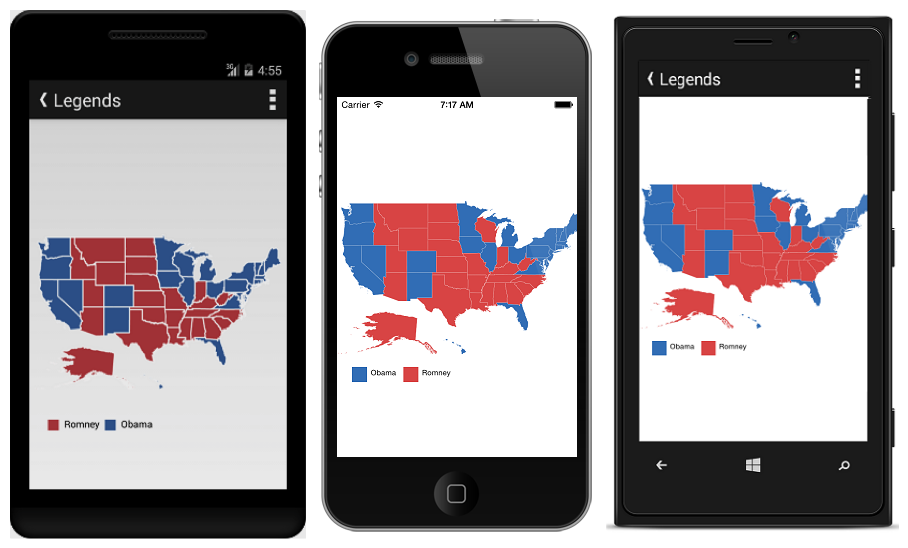

# Overview

The Essential Xamarin Maps control provides a graphical representation of geographical data. It is used to represent the statistical data of a particular geographical area on Earth. Using pan and zoom, the maps can be navigated. Maps supports enhanced data visualization with bubbles and labels using data bounded to map.

## Key Features

* `Layers` - Maps are visualized through layers. It can accommodate one or more layers.
 
* `Map Elements Customization` - Additional information on map can be visualized with customized appearance using various set of elements, including shapes, bubbles, markers, legend, labels and data items.
 
* `User Interaction` - Options like zooming, panning and map selection enables the effective interaction on map elements.

