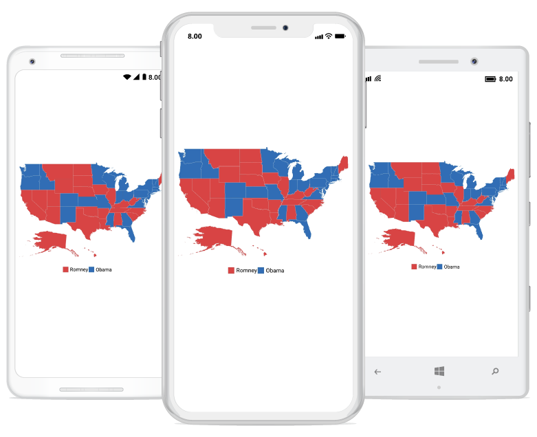

# Overview

The Essential Maps for Xamarin.Forms control provides a graphical representation of geographical data. This is used to represent the statistical data of a particular geographical area on earth. You can navigate a map by panning and zooming. Maps support enhanced data visualization with bubbles and labels using data that bounded to map.

## Key Features

* `Layers` - Maps are visualized through layers. A map can accommodate one or more layers.
 
* `Map Elements Customization` - Additional information on map can be visualized with customized appearance using various set of elements, including shapes, bubbles, markers, legend, labels, and data items.
 
* `User Interaction` - Options such as zooming, panning, and map selection enable the effective interaction on map elements.

