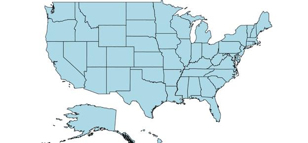
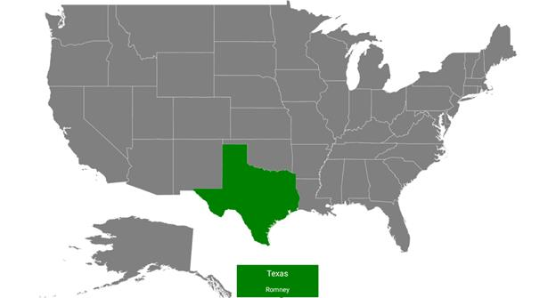

# Shape customization

## Shape settings

The shape settings define the basic customization options for shapes in the map.

A shape’s fill, stroke, and stroke thickness can be customized using the following properties:

[`ShapeFill`](https://help.syncfusion.com/cr/cref_files/xamarin/Syncfusion.SfMaps.XForms~Syncfusion.SfMaps.XForms.ShapeSetting~ShapeFill.html#): Sets the fill color for the shapes in a map. 

[`ShapeStroke`](https://help.syncfusion.com/cr/cref_files/xamarin/Syncfusion.SfMaps.XForms~Syncfusion.SfMaps.XForms.ShapeSetting~ShapeStroke.html#): Sets the border color for the shape in a map.

[`ShapeStrokeThickness`](https://help.syncfusion.com/cr/cref_files/xamarin/Syncfusion.SfMaps.XForms~Syncfusion.SfMaps.XForms.ShapeSetting~ShapeStrokeThickness.html#): Sets the border thickness for the shape in a map. 

Refer to the following code snippet.





<maps:ShapeFileLayer.ShapeSettings>

<maps:ShapeSetting  ShapeFill="LightBlue" ShapeStroke="Black" ShapeStrokeThickness="2" >

</maps:ShapeSetting>

</maps:ShapeFileLayer.ShapeSettings>





ShapeSetting shapeSetting = new ShapeSetting();            

shapeSetting.ShapeFill = Color.LightBlue;

shapeSetting.ShapeStroke = Color.Black;

shapeSetting.ShapeStrokeThickness = 2;





To customize the shapes based on the bound values, use the following properties:

[`ShapeValuePath`](https://help.syncfusion.com/cr/cref_files/xamarin/Syncfusion.SfMaps.XForms~Syncfusion.SfMaps.XForms.ShapeSetting~ShapeValuePath.html#): Field value that has to be bound for each shape.

[`ShapeColorValuePath`](https://help.syncfusion.com/cr/cref_files/xamarin/Syncfusion.SfMaps.XForms~Syncfusion.SfMaps.XForms.ShapeSetting~ShapeColorValuePath.html#): Field value that has to be bound to determine the color.





<maps:SfMaps.Layers >

<maps:ShapeFileLayer Uri="usa_state.shp" 

ShapeIDPath="State" ShapeIDTableField="STATE_NAME" >

<maps:ShapeFileLayer.ShapeSettings>

<maps:ShapeSetting ShapeColorValuePath="Candidate" ShapeValuePath="Candidate">

<maps:ShapeSetting.ColorMappings>

<maps:EqualColorMapping Color="#D84444" Value="Romney" LegendLabel="Romney"></maps:EqualColorMapping>

<maps:EqualColorMapping Color="#316DB5" Value="Obama" LegendLabel="Obama"></maps:EqualColorMapping>

</maps:ShapeSetting.ColorMappings>

</maps:ShapeSetting>

</maps:ShapeFileLayer.ShapeSettings>

</maps:ShapeFileLayer>

</maps:SfMaps.Layers>





ShapeFileLayer layer = new ShapeFileLayer();

layer.Uri = "usa_state.shp";

layer.ItemsSource = GetDataSource();

layer.ShapeIDTableField = "STATE_NAME";

layer.ShapeIDPath = "State";           

map.Layers.Add(layer);

EqualColorMapping colorMapping = new EqualColorMapping();

colorMapping.Color = Color.FromHex("#D84444");

colorMapping.LegendLabel = "Romney";

colorMapping.Value = "Romney";

EqualColorMapping colorMapping1 = new EqualColorMapping();

colorMapping1.Color = Color.FromHex("#316DB5");

colorMapping1.LegendLabel = "Obama";

colorMapping1.Value = "Obama";

ShapeSetting shapeSetting = new ShapeSetting();

shapeSetting.ShapeValuePath = "Candidate";

shapeSetting.ShapeColorValuePath = "Candidate";

shapeSetting.ColorMappings.Add(colorMapping);

shapeSetting.ColorMappings.Add(colorMapping1);

layer.ShapeSettings = shapeSetting;





## Selected shapes settings

To customize the selected shapes alone, use the following properties:

[`SelectedShapeColor`](https://help.syncfusion.com/cr/cref_files/xamarin/Syncfusion.SfMaps.XForms~Syncfusion.SfMaps.XForms.ShapeSetting~SelectedShapeColor.html#): Sets the color for selected shapes in the map.

[`SelectedShapeStroke`](https://help.syncfusion.com/cr/cref_files/xamarin/Syncfusion.SfMaps.XForms~Syncfusion.SfMaps.XForms.ShapeSetting~SelectedShapeStroke.html#): Sets the border color for selected shapes in the map.

[`SelectedShapeStrokeThickness`](https://help.syncfusion.com/cr/cref_files/xamarin/Syncfusion.SfMaps.XForms~Syncfusion.SfMaps.XForms.ShapeSetting~SelectedShapeStrokeThickness.html#): Sets the border thickness for selected shapes in the map.





<maps:ShapeFileLayer.ShapeSettings>

<maps:ShapeSetting  ShapeFill="LightBlue" ShapeStroke="Black" ShapeStrokeThickness="1" >

</maps:ShapeSetting>

</maps:ShapeFileLayer.ShapeSettings>





ShapeSetting shapeSetting = new ShapeSetting();

shapeSetting.SelectedShapeColor = Color. Green;

shapeSetting.SelectedShapeStroke = Color.Black;

shapeSetting.SelectedShapeStrokeThickness = 1;

layer.ShapeSettings = shapeSetting;





## Events

[`ShapeSelected`](https://help.syncfusion.com/cr/cref_files/xamarin/Syncfusion.SfMaps.XForms~Syncfusion.SfMaps.XForms.ShapeFileLayer~ShapeSelected_EV.html) event gets triggered when the map shapes are selected.
Corresponding model data is passed as an argument.





<maps:ShapeFileLayer ShapeSelected="ShapeFileLayer_ShapeSelected" />





 private void ShapeFileLayer_ShapeSelected(object data)
 {
    ElectionData electionData = data as ElectionData;
    if (electionData != null)
    {
         Toast.IsVisible = true;
         stateLabel.Text = electionData.State;
         candidateLabel.Text = electionData.Candidate;

         Device.StartTimer(new TimeSpan(0, 0, 3), () =>
         {
             Toast.IsVisible = false;
             return false;
         });        
    }
 }




Template for showing popup message when a shape is selected is given below.





 <StackLayout   x:Name="Toast" IsVisible="false" Orientation="Vertical" Spacing="0"  
                           WidthRequest="100"  HorizontalOptions="End" VerticalOptions="End" >
                <Label x:Name="stateLabel" Text="Country" HorizontalOptions="Center" 
                       VerticalOptions="Center" XAlign="Center" YAlign="Center" FontSize="10" 
                       WidthRequest="100"  HeightRequest= "20"  Opacity="0.5" BackgroundColor="Green" 
                       TextColor="White" />
                <Label x:Name="candidateLabel" Text="Population" HorizontalOptions="Center" 
                       VerticalOptions="Center" XAlign="Center" YAlign="Center" FontSize="8" Grid.Row="1"  
                       HeightRequest= "20"  WidthRequest="100"  Opacity="0.5" BackgroundColor="Green" 
                       TextColor="White"/>

</StackLayout>





