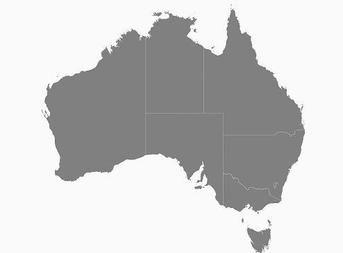
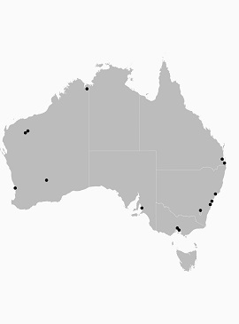
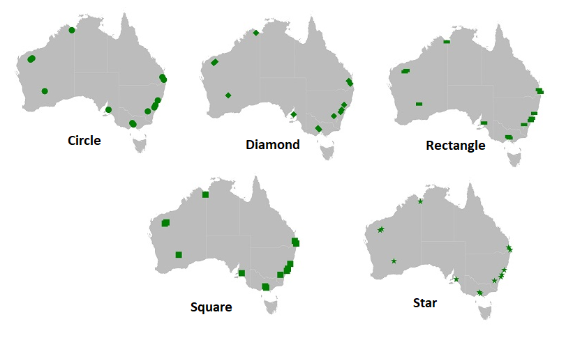
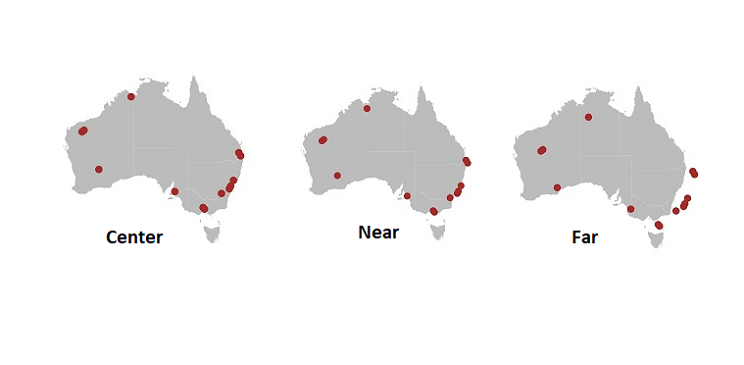

# Shape Type

[`SfMaps`](https://help.syncfusion.com/xamarin/sfmaps/getting-started) allows to provide various shape type in the [`ShapeFileLayer`](https://help.syncfusion.com/xamarin/sfmaps/layers#shape-file-layer) such as Polygon, Polyline and Points.

## Polygon

A polygon is a two-dimensional surface stored as a sequence of points defining its exterior bounding ring and 0 or more interior rings. Polygons are always simple. Mostly the polygon shape type defines group of land, water bodies, and other features that have a spatial extent.

## Polyline

The polyline is shape that has a dimension of 1. It is called a simple line, if it does not intersect itself. The polylines are often used to define linear features such as roads, rivers, and power lines. Mostly the shape file layer with the polyline shape type is used as [`sublayer`](https://help.syncfusion.com/xamarin/sfmaps/sublayer#adding-sublayers-in-shapefilelayer).

The below example demonstrates the sublayer with the polyline shape type. In that roads(sublayer) of Baharin (base layer) has been displayed using the shape file layer of maps





<maps:SfMaps>

<maps:SfMaps.Layers>

<maps:ShapeFileLayer Uri="Bahrain.shp">

<maps:ShapeFileLayer.ShapeSettings>

<maps:ShapeSetting  ShapeFill="#bcbcbc"/>
               
</maps:ShapeFileLayer.ShapeSettings>
                
<maps:ShapeFileLayer.Sublayers>

<maps:ShapeFileLayer Uri="roads.shp">

<maps:ShapeFileLayer.ShapeSettings>

<maps:ShapeSetting  ShapeFill="Black"  ShapeStrokeThickness="2"/>

</maps:ShapeFileLayer.ShapeSettings>

</maps:ShapeFileLayer>

</maps:ShapeFileLayer.Sublayers>

</maps:ShapeFileLayer>

</maps:SfMaps.Layers>

</maps:SfMaps>





SfMaps maps = new SfMaps();

ShapeFileLayer layer = new ShapeFileLayer();

layer.Uri = "Bahrain.shp";

ShapeSetting layerSetting = new ShapeSetting();

layerSetting.ShapeFill = Color.FromHex("#bcbcbc");

layer.ShapeSettings = layerSetting;

ShapeFileLayer subLayer = new ShapeFileLayer();

subLayer.Uri = "roads.shp";

ShapeSetting subLayerSetting = new ShapeSetting();
 
subLayerSetting.ShapeFill = Color.Black;

subLayerSetting.ShapeStrokeThickness = 2;

subLayer.ShapeSettings = subLayerSetting;

layer.Sublayers.Add(subLayer);

maps.Layers.Add(layer);

this.Content = maps;





## Points

A point is shape with a dimension of 0 that occupies a single location in coordinate space. A point has a single x,y coordinate value. The points are often used to define features such as oil wells, landmarks, and elevations.

The below example demonstrates the [`sublayer`](https://help.syncfusion.com/xamarin/sfmaps/sublayer#adding-sublayers-in-shapefilelayer) with the points shape type. In that, the places (sublayer) of Australia (base layer) has been displayed using the shape file layer of maps





<maps:SfMaps>

<maps:SfMaps.Layers>

<maps:ShapeFileLayer Uri="australia.shp">

<maps:ShapeFileLayer.ShapeSettings>

<maps:ShapeSetting  ShapeFill="#bcbcbc"/>

</maps:ShapeFileLayer.ShapeSettings>

<maps:ShapeFileLayer.Sublayers>

<maps:ShapeFileLayer Uri="points.shp">

<maps:ShapeFileLayer.ShapeSettings>

<maps:ShapeSetting  ShapeFill="Black" />

</maps:ShapeFileLayer.ShapeSettings>

</maps:ShapeFileLayer>

</maps:ShapeFileLayer.Sublayers>

</maps:ShapeFileLayer>

</maps:SfMaps.Layers>

</maps:SfMaps>





SfMaps maps = new SfMaps();

ShapeFileLayer layer = new ShapeFileLayer();
           
layer.Uri = "australia.shp";

ShapeSetting layerSetting = new ShapeSetting();
            
layerSetting.ShapeFill = Color.FromHex("#bcbcbc");

layer.ShapeSettings = layerSetting;

ShapeFileLayer subLayer = new ShapeFileLayer();
            
subLayer.Uri = "points.shp";

ShapeSetting subLayerSetting = new ShapeSetting();

subLayerSetting.ShapeFill = Color.Black;

subLayer.ShapeSettings = subLayerSetting;

layer.Sublayers.Add(subLayer);

maps.Layers.Add(layer);

this.Content = maps;





### Customization of Points

The size, shape and position of the map points can be customized with the [`MapPointIconSize`], [`MapPointIcon`], [`MapPointHorizontalAlignment`] and [`MapPointVerticalAlignment`] property of shape file layer

### Map point icon

The shape of the map point has been customized using the [`MapPointIcon`] property of ShapeFileLayer. SfMap supports the following map point icon types,

*	Circle,
*	Rectangle,
*	Square,
*	Diamond,
*	Star





<maps:SfMaps BackgroundColor="White">

<maps:SfMaps.Layers>

<maps:ShapeFileLayer Uri="australia.shp">

<maps:ShapeFileLayer.ShapeSettings>

<maps:ShapeSetting  ShapeFill="#bcbcbc"/>

</maps:ShapeFileLayer.ShapeSettings>

<maps:ShapeFileLayer.Sublayers>

<maps:ShapeFileLayer Uri="points.shp" MapPointIcon="Circle" MapPointIconSize="10">
                        
<maps:ShapeFileLayer.ShapeSettings>
                        
<maps:ShapeSetting  ShapeFill="Green" />

</maps:ShapeFileLayer.ShapeSettings>

</maps:ShapeFileLayer>

</maps:ShapeFileLayer.Sublayers>

</maps:ShapeFileLayer>

</maps:SfMaps.Layers>

</maps:SfMaps>





SfMaps maps = new SfMaps();

ShapeFileLayer layer = new ShapeFileLayer();

layer.Uri = "australia.shp";

ShapeSetting layerSetting = new ShapeSetting();
            
layerSetting.ShapeFill = Color.FromHex("#bcbcbc");

layer.ShapeSettings = layerSetting;

ShapeFileLayer subLayer = new ShapeFileLayer();

subLayer.Uri = "points.shp";

subLayer.MapPointIcon = MapPointIcon.Circle;

subLayer.MapPointIconSize = 10;

ShapeSetting subLayerSetting = new ShapeSetting();

subLayerSetting.ShapeFill = Color.Green;

subLayer.ShapeSettings = subLayerSetting;

layer.Sublayers.Add(subLayer);

maps.Layers.Add(layer);





### Map point position

The position of the map points can be customized using the [`MapPointHorizontalAlignment`] and [`MapPointVerticalAlignment`] property of shape file layer. These properties allow us to vary the position as Near, Far and Center by considering the provided latitude ,longitude and the map point icon size.





<maps:SfMaps BackgroundColor="White">

<maps:SfMaps.Layers>

<maps:ShapeFileLayer Uri="australia.shp">

<maps:ShapeFileLayer.ShapeSettings>

<maps:ShapeSetting  ShapeFill="#bcbcbc"/>

</maps:ShapeFileLayer.ShapeSettings>

<maps:ShapeFileLayer.Sublayers>

<maps:ShapeFileLayer Uri="points.shp" MapPointIcon="Circle" MapPointIconSize="10"
                                         
                MapPointHorizontalAlignment="Near" MapPointVerticalAlignment="Near">

<maps:ShapeFileLayer.ShapeSettings>

<maps:ShapeSetting  ShapeFill="Brown" />

</maps:ShapeFileLayer.ShapeSettings>

</maps:ShapeFileLayer>

</maps:ShapeFileLayer.Sublayers>

</maps:ShapeFileLayer>

</maps:SfMaps.Layers>

</maps:SfMaps>





SfMaps maps = new SfMaps();

ShapeFileLayer layer = new ShapeFileLayer();
            
layer.Uri = "australia.shp";

ShapeSetting layerSetting = new ShapeSetting();
            
layerSetting.ShapeFill = Color.FromHex("#bcbcbc");
            
layer.ShapeSettings = layerSetting;

ShapeFileLayer subLayer = new ShapeFileLayer();
            
subLayer.Uri = "points.shp";
            
subLayer.MapPointIcon = MapPointIcon.Circle;
            
subLayer.MapPointIconSize = 10;
            
subLayer.MapPointHorizontalAlignment = MarkerAlignment.Near;

subLayer.MapPointHorizontalAlignment = MarkerAlignment.Near;

ShapeSetting subLayerSetting = new ShapeSetting();

subLayerSetting.ShapeFill = Color.Green;

subLayer.ShapeSettings = subLayerSetting;

layer.Sublayers.Add(subLayer);

maps.Layers.Add(layer);





### Map point size

The size of the map points can be customized with the [`MapPointIconSize`] property of  ShapeFileLayer





<maps:SfMaps BackgroundColor="White">
        
<maps:SfMaps.Layers>
            
<maps:ShapeFileLayer Uri="australia.shp">
                
<maps:ShapeFileLayer.ShapeSettings>
                   
<maps:ShapeSetting  ShapeFill="#bcbcbc"/>
                
</maps:ShapeFileLayer.ShapeSettings>
                
<maps:ShapeFileLayer.Sublayers>
                    
<maps:ShapeFileLayer Uri="points.shp"  MapPointIconSize="15">
                        
<maps:ShapeFileLayer.ShapeSettings>
                            
<maps:ShapeSetting  ShapeFill="OrangeRed" />
                        
</maps:ShapeFileLayer.ShapeSettings>
                    
</maps:ShapeFileLayer>
                
</maps:ShapeFileLayer.Sublayers>
            
</maps:ShapeFileLayer>
        
</maps:SfMaps.Layers>
    
</maps:SfMaps>





SfMaps maps = new SfMaps();

ShapeFileLayer layer = new ShapeFileLayer();
            
layer.Uri = "australia.shp";

ShapeSetting layerSetting = new ShapeSetting();
            
layerSetting.ShapeFill = Color.FromHex("#bcbcbc");
            
layer.ShapeSettings = layerSetting;

ShapeFileLayer subLayer = new ShapeFileLayer();
            
subLayer.Uri = "points.shp";
            
subLayer.MapPointIcon = MapPointIcon.Circle;
            
subLayer.MapPointIconSize = 15;
            
ShapeSetting subLayerSetting = new ShapeSetting();

subLayerSetting.ShapeFill = Color. OrangeRed;

subLayer.ShapeSettings = subLayerSetting;

layer.Sublayers.Add(subLayer);
            
maps.Layers.Add(layer);





