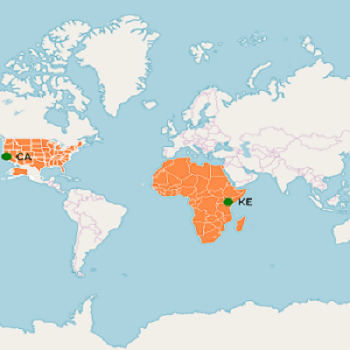

# Sublayer

Sublayer in the maps control allows to load multiple shape files in a single container and enables maps to display more information.

## Adding sublayers in ShapeFileLayer

You can add multiple shape files in the [`ShapeFileLayer`](https://help.syncfusion.com/cr/cref_files/xamarin/Syncfusion.SfMaps.XForms~Syncfusion.SfMaps.XForms.ShapeFileLayer.html) using the [`Sublayers`](https://help.syncfusion.com/cr/cref_files/xamarin/Syncfusion.SfMaps.XForms~Syncfusion.SfMaps.XForms.ShapeFileLayer~Sublayers.html) property.





     <maps:SfMaps x:Name="sfmap">

        <maps:SfMaps.Layers>

            <maps:ImageryLayer>

                <maps:ImageryLayer.Sublayers>
                  
                    <maps:ShapeFileLayer Uri="africa.shp">

                        <maps:ShapeFileLayer.ShapeSettings>

                            <maps:ShapeSetting ShapeFill="#FD8C48" ShapeStrokeThickness="1"/>

                        </maps:ShapeFileLayer.ShapeSettings>

                    </maps:ShapeFileLayer>

                </maps:ImageryLayer.Sublayers>
            
            </maps:ImageryLayer>

        </maps:SfMaps.Layers>
        
    </maps:SfMaps>




          
            SfMaps map = new SfMaps();

            ImageryLayer imageryLayer = new ImageryLayer();

            ShapeFileLayer subShapeLayer = new ShapeFileLayer();
            subShapeLayer.Uri = "africa.shp";

            ShapeSetting shapeSetting = new ShapeSetting();
            shapeSetting.ShapeFill = Color.FromHex("#FD8C48");
            shapeSetting.ShapeStrokeThickness = 1;
            subShapeLayer.ShapeSettings = shapeSetting;

            imageryLayer.Sublayers.Add(subShapeLayer);
            map.Layers.Add(imageryLayer);
			
            Content = map;





## Adding sublayers in ImageryLayer

You can add multiple shape files in the `ImageryLayer` using the `Sublayers` property.





    <maps:SfMaps x:Name="sfmap">

        <maps:SfMaps.Layers>

            <maps:ImageryLayer>

                <maps:ImageryLayer.Sublayers>

                    <maps:ShapeFileLayer  Uri="usa_state.shp">

                        <maps:ShapeFileLayer.ShapeSettings>

                            <maps:ShapeSetting ShapeFill="#FD8C48" ShapeStrokeThickness="1"/>

                        </maps:ShapeFileLayer.ShapeSettings>

                    </maps:ShapeFileLayer>

                    <maps:ShapeFileLayer Uri="africa.shp">

                        <maps:ShapeFileLayer.ShapeSettings>

                            <maps:ShapeSetting ShapeFill="#FD8C48" ShapeStrokeThickness="1"/>

                        </maps:ShapeFileLayer.ShapeSettings>

                    </maps:ShapeFileLayer>

                </maps:ImageryLayer.Sublayers>

                <maps:ImageryLayer.Markers>

                    <maps:MapMarker Label="CA" Latitude="37.3382082" Longitude="-121.8863286"/>
                    
                    <maps:MapMarker Label="KE" Latitude="-0.023559" Longitude="37.906193"/>

                </maps:ImageryLayer.Markers>

            </maps:ImageryLayer>

        </maps:SfMaps.Layers>
        
    </maps:SfMaps>





            SfMaps map = new SfMaps();

            ImageryLayer imageryLayer = new ImageryLayer();

            ShapeFileLayer subShapeLayer1 = new ShapeFileLayer();
            subShapeLayer1.Uri = "usa_state.shp";

            ShapeFileLayer subShapeLayer2 = new ShapeFileLayer();
            subShapeLayer2.Uri = "africa.shp";

            ShapeSetting shapeSetting = new ShapeSetting();
            shapeSetting.ShapeStrokeThickness = 2;
            shapeSetting.ShapeFill = Color.FromHex("#FD8C48");
            subShapeLayer1.ShapeSettings = shapeSetting;

            ShapeSetting shapeSetting2 = new ShapeSetting();
            shapeSetting2.ShapeFill = Color.FromHex("#FD8C48");
            shapeSetting2.ShapeStrokeThickness = 1;
            subShapeLayer2.ShapeSettings = shapeSetting2;

            MapMarker mapMarker1 = new MapMarker();
            mapMarker1.Label = "KE";
            mapMarker1.Latitude = "-0.023559";
            mapMarker1.Longitude = "37.906193";
            imageryLayer.Markers.Add(mapMarker1);

            MapMarker mapMarker2 = new MapMarker();
            mapMarker2.Label = "CA";
            mapMarker2.Latitude = "37.3382082";
            mapMarker2.Longitude = "-121.8863286";
            imageryLayer.Markers.Add(mapMarker2);

            imageryLayer.Sublayers.Add(subShapeLayer1);
            imageryLayer.Sublayers.Add(subShapeLayer2);

            map.Layers.Add(imageryLayer);
			
            Content = map;
			


	

### Customizing sublayer

Sublayer is a type of shapefile layer. You can add all the elements such as markers, bubbles, color mapping, and legends to sublayer. Please refer to the following links to add the sublayer properties.

* [`Adding markers`](https://help.syncfusion.com/xamarin/sfmaps/getting-started?cs-save-lang=1&cs-lang=xaml#adding-markers)
* [`Color mapping`](https://help.syncfusion.com/xamarin/sfmaps/getting-started?cs-save-lang=1&cs-lang=xaml#color-mapping)
* [`Adding legend`](https://help.syncfusion.com/xamarin/sfmaps/getting-started?cs-save-lang=1&cs-lang=xaml#adding-legends)
* [`Adding bubbles`](https://help.syncfusion.com/xamarin/sfmaps/bubblemarker#adding-bubbles)
* [`Adding data labels`](https://help.syncfusion.com/xamarin/sfmaps/datalabels#adding-data-labels)