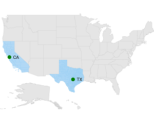

# Sublayer
 
The sublayer in maps allows to load multiple shape files in a single container, enabling maps to display more information. 

## Adding sublayer

You can add multiple shape files in the [`ShapeFileLayer`](https://help.syncfusion.com/cr/cref_files/xamarin/Syncfusion.SfMaps.XForms~Syncfusion.SfMaps.XForms.ShapeFileLayer.html) using [`Sublayers`](https://help.syncfusion.com/cr/cref_files/xamarin/Syncfusion.SfMaps.XForms~Syncfusion.SfMaps.XForms.ShapeFileLayer~Sublayers.html) property.

### Customizing sublayer

Sublayer is a type of shapefile layer, so you can add all the properties like markers, bubbles, color mapping, legends and data labels in sublayer also. Please refer the below link to add the sublayer properties.

* [`Adding Markers`](https://help.syncfusion.com/xamarin/sfmaps/getting-started?cs-save-lang=1&cs-lang=xaml#adding-marker).

* [`Color Mapping`](https://help.syncfusion.com/xamarin/sfmaps/getting-started?cs-save-lang=1&cs-lang=xaml#color-mapping).

* [`Adding Legend`](https://help.syncfusion.com/xamarin/sfmaps/getting-started?cs-save-lang=1&cs-lang=xaml#adding-legend).

* [`Adding Bubbles`](https://help.syncfusion.com/xamarin/sfmaps/bubblemarker#adding-bubbles).

* [`Adding Data Labels`](https://help.syncfusion.com/xamarin/sfmaps/datalabels#adding-data-labels).





     <maps:SfMaps x:Name="sfmap">

        <maps:SfMaps.Layers>

            <maps:ShapeFileLayer Uri="usa_state.shp">

                <maps:ShapeFileLayer.ShapeSettings>

                    <maps:ShapeSetting ShapeStroke="#D0D0D0" ShapeStrokeThickness="2" ShapeFill="#E5E5E5" />

                </maps:ShapeFileLayer.ShapeSettings>

                <maps:ShapeFileLayer.Sublayers>

                    <maps:ShapeFileLayer  Uri="Texas.shp">

                        <maps:ShapeFileLayer.ShapeSettings>

                            <maps:ShapeSetting ShapeFill="#B1D8F5" ShapeStroke="#8DCCF4" ShapeStrokeThickness="1"/>

                        </maps:ShapeFileLayer.ShapeSettings>

                        <maps:ShapeFileLayer.Markers>

                            <maps:MapMarker Label="TX" Latitude="30.267153" Longitude="-97.7430608"/>

                        </maps:ShapeFileLayer.Markers>

                    </maps:ShapeFileLayer>

                    <maps:ShapeFileLayer Uri="California.shp">

                        <maps:ShapeFileLayer.ShapeSettings>

                            <maps:ShapeSetting ShapeFill="#B1D8F5" ShapeStroke="#8DCCF4" ShapeStrokeThickness="1"/>

                        </maps:ShapeFileLayer.ShapeSettings>

                        <maps:ShapeFileLayer.Markers>

                            <maps:MapMarker Label="CA" Latitude="37.3382082" Longitude="-121.8863286"/>

                        </maps:ShapeFileLayer.Markers>

                    </maps:ShapeFileLayer>

                </maps:ShapeFileLayer.Sublayers>

            </maps:ShapeFileLayer>

        </maps:SfMaps.Layers>

    </maps:SfMaps>





            SfMaps map = new SfMaps();

            ShapeFileLayer layer = new ShapeFileLayer();

            layer.Uri = "usa_state.shp";

            ShapeSetting shapeSetting = new ShapeSetting();

            shapeSetting.ShapeStroke = Color.FromHex("#D0D0D0");

            shapeSetting.ShapeStrokeThickness = 2;

            shapeSetting.ShapeFill = Color.FromHex("#E5E5E5");

            layer.ShapeSettings = shapeSetting;

            ShapeFileLayer subShapeLayer = new ShapeFileLayer();

            subShapeLayer.Uri = "Texas.shp";

            ShapeSetting shapeSetting1 = new ShapeSetting();

            shapeSetting1.ShapeFill = Color.FromHex("#B1D8F5");

            shapeSetting1.ShapeStrokeThickness = 1;

            shapeSetting1.ShapeStroke = Color.FromHex("#8DCCF4");

            subShapeLayer.ShapeSettings = shapeSetting1;

            MapMarker mapMarker = new MapMarker();

            mapMarker.Label = "TX";

            mapMarker.Latitude = "30.267153";

            mapMarker.Longitude = "-97.7430608";

            subShapeLayer.Markers.Add(mapMarker);

            layer.Sublayers.Add(subShapeLayer);

            ShapeFileLayer subShapeLayer1 = new ShapeFileLayer();

            subShapeLayer1.Uri = "California.shp";

            ShapeSetting shapeSetting2 = new ShapeSetting();

            shapeSetting2.ShapeFill = Color.FromHex("#B1D8F5");

            shapeSetting2.ShapeStrokeThickness = 1;

            shapeSetting2.ShapeStroke = Color.FromHex("#8DCCF4");

            subShapeLayer1.ShapeSettings = shapeSetting2;

            MapMarker mapMarker1 = new MapMarker();

            mapMarker1.Label = "CA";

            mapMarker1.Latitude = "37.3382082";

            mapMarker1.Longitude = "-121.8863286";

            subShapeLayer1.Markers.Add(mapMarker1);

            layer.Sublayers.Add(subShapeLayer1);

            map.Layers.Add(layer);

            this.Content = map;





