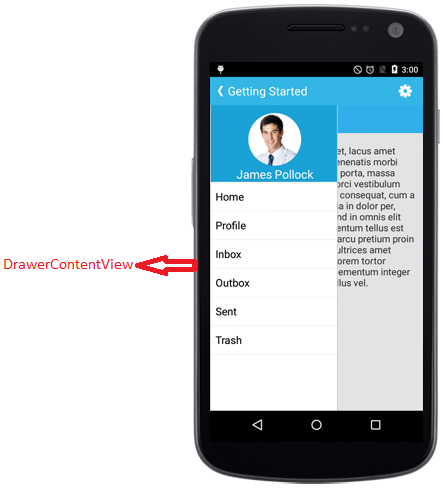
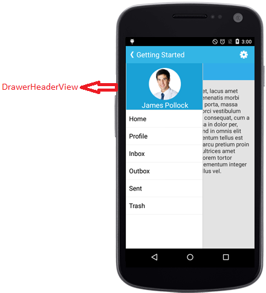
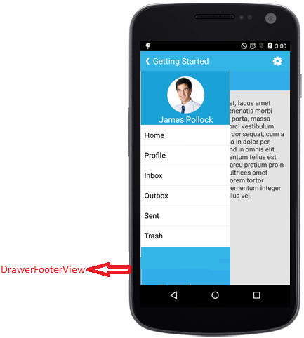

# Sliding Panel Contents

The sliding panel contents are divided into three parts and they are as follows
	
* [Drawer Content](#drawer-main-content)
* [Header Content](#drawer-header-content) 
* [Footer Content](#drawer-footer-content)
		
The header and footer contents are optional and Drawer content is the mandatory one which is due to the maximum space allocated for Drawer content view.
		
## Drawer Main Content

The sliding main content of the SfNavigationDrawer can be set with any view using `DrawerContentView`. This part mostly holds the list of menus that has to be selected to display the Main content.

The control has been initialized in XAML





    <navigation:SfNavigationDrawer x:Name="navigationDrawer"  />
	




and the content has set using `DrawerContentView` property.





StackLayout mainStack = new StackLayout ();
mainStack.Opacity = 1;
mainStack.Orientation = StackOrientation.Vertical;
mainStack.HeightRequest = 500;
mainStack.BackgroundColor = Color.White;

ObservableCollection<String> list = new ObservableCollection<string> ();
list.Add ("Home");
list.Add ("Profile");
list.Add ("Inbox");
list.Add ("OutBox");
list.Add ("Sent");
list.Add ("Draft");

ListView listView = new ListView();
listView.WidthRequest= 200;
listView.VerticalOptions = LayoutOptions.FillAndExpand;
listView.ItemsSource = list;
mainStack.Children.Add (listView);
            
navigationDrawer.DrawerContentView = mainStack;
  




## Drawer Header Content

Instead of providing everything in the drawer content view, `DrawerHeaderView` property can be used to display certain information like user id or names in the header part.




    
<navigation:SfNavigationDrawer x:Name="navigationDrawer">
    <navigation:SfNavigationDrawer.DrawerHeaderView>
         <StackLayout x:Name="headerLayout" Orientation="Vertical" BackgroundColor="#1aa1d6" HeightRequest="150" WidthRequest="300">
                <Image x:Name="image" HeightRequest="100" WidthRequest="70" Source="user.png" />
                <Label x:Name="header" Text="James Pollock" FontSize="20" TextColor="White" HorizontalTextAlignment="Center" /> 
         </StackLayout>
    </navigation:SfNavigationDrawer.DrawerHeaderView>
</navigation:SfNavigationDrawer>





StackLayout headerLayout = new StackLayout ();
headerLayout.Orientation = StackOrientation.Vertical;
headerLayout.BackgroundColor = Color.FromHex ("#1aa1d6");
headerLayout.VerticalOptions = LayoutOptions.CenterAndExpand;
headerLayout.HorizontalOptions = LayoutOptions.CenterAndExpand;
headerLayout.HeightRequest = 200;
headerLayout.WidthRequest = 275;
Image image = new Image ();
image.Source = ImageSource.FromFile("user.png");
image.HeightRequest = 100;
image.WidthRequest =  70;
image.HorizontalOptions = LayoutOptions.CenterAndExpand;
image.VerticalOptions = LayoutOptions.Center;
image.BackgroundColor = Color.FromHex ("#1aa1d6");
headerLayout.Children.Add (image);

Label header = new Label ();
header.Text  = "James Pollock";
header.FontSize = 20;
header.HeightRequest = 30;
header.WidthRequest = 140;
header.TextColor = Color.White;
header.HorizontalOptions = LayoutOptions.Center;
header.VerticalOptions = LayoutOptions.Center;
header.BackgroundColor = Color.FromHex ("#1aa1d6");
headerLayout.Children.Add (header);			
navigationDrawer.DrawerHeaderView=headerLayout;
  




## Drawer Footer Content

Similar to drawer header view, the `DrawerFooterView` property can be used to set footer content. For ex: Logout option or Exit option can be placed at Footer part. 





<navigation:SfNavigationDrawer x:Name="navigationDrawer">
    <navigation:SfNavigationDrawer.DrawerFooterView>
        <StackLayout x:Name="footerLayout" BackgroundColor="Navy" />           
    </navigation:SfNavigationDrawer.DrawerFooterView>
</navigation:SfNavigationDrawer>
	




StackLayout footerLayout = new StackLayout ();
footerLayout.BackgroundColor = Color.Navy;		
navigationDrawer.DrawerFooterView=footerLayout;
  




## Drawer Size

Gets or sets the height and width of the DrawerView panel in the NavigationDrawer control using `DrawerHeight` and `DrawerWidth` properties.



 

<navigation:SfNavigationDrawer x:Name="navigationDrawer" DrawerHeight="300" DrawerWidth="300" />
	



        
navigationDrawer.DrawerHeight = 300;
navigationDrawer.DrawerWidth = 300;
  




N> The Drawer width will be handy when [Position](/Xamarin/SfNavigationDrawer/Position "Configuring The Drawer In Different Sides") is left or right and `DrawerHeight` property can be used when Position is Top or bottom.