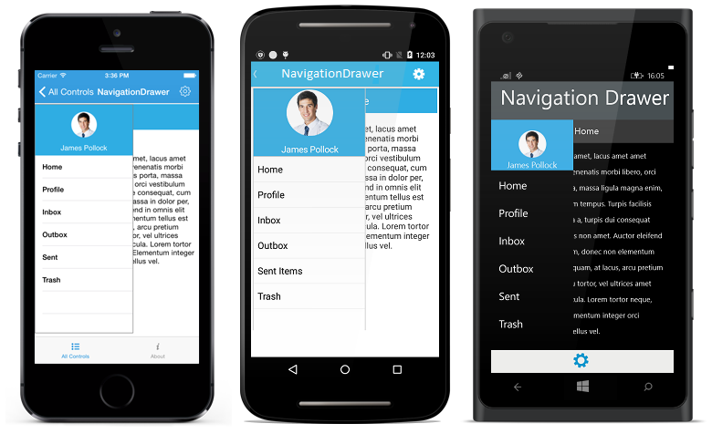

# Getting Started

This section provides overview for working with Essential NavigationDrawer for Xamarin.Forms. You can walk through the entire process of creating an NavigationDrawer.

## Referencing Essential Studio Components in Your Solution	

If you had acquired Essential Studio components through the Xamarin component store interface from within your IDE, then after adding the components to your Xamarin.iOS, Xamarin.Android and Windows Phone projects through the Component manager, you will still need to manually reference the PCL (Portable Class Library) assemblies in the Xamarin.Forms PCL project in your solution. You can do this by manually adding the relevant PCL assembly references to your PCL project contained in the following path inside of your solution folder.

Components/syncfusionessentialstudio-version/lib/pcl/

Alternatively if you had downloaded Essential Studio from Syncfusion.com or through the Xamarin store web interface then all assembly references need to be added manually.

After installing Essential Studio for Xamarin, all the required assemblies can be found in the installation folders, typically

{Syncfusion Installed location}\Essential Studio\syncfusionessentialstudio-version\lib

Eg: C:\Program Files (x86)\Syncfusion\Essential Studio\{{ site.releaseversion }}\lib

Or after downloading through the Xamarin store web interface, all the required assemblies can be found in the below folder

{Download location}\syncfusionessentialstudio-version\lib

You can then add the assembly references to the respective projects as shown below

<table>
<tr>
<th>Project</th>
<th>Required assemblies</th>
</tr>
<tr>
<td>PCL</td>
<td>pcl\Syncfusion.SfNavigationDrawer.XForms.dll</td>
</tr>
<tr>
<td>Android</td>
<td>android\Syncfusion.SfNavigationDrawer.Android.dll android\Syncfusion.SfNavigationDrawer.XForms.dll  android\Syncfusion.SfNavigationDrawer.XForms.Android.dll   Xamarin.Android.Support.v4 (from Nuget Packages)</td>
</tr>
<tr>
<td>iOS (Unified)</td>
<td>iOS-unified\Syncfusion.SfNavigationDrawer.iOS.dll iOS-unified\SyncfusionSfNavigationDrawer.XForms.dll iOS-unified\Syncfusion.SfNavigationDrawer.XForms.iOS.dll</td>
</tr>
<tr>
<td>Windows Phone</td>
<td>wp8\Syncfusion.SfNavigationDrawer.WP8.dll wp8\Syncfusion.SfNavigationDrawer.XForms.dll wp8\Syncfusion.SfNavigationDrawer.XForms.WinPhone.dll</td>
</tr>
<tr>
<td>Windows Phone 8.1</td>
<td>wp81\Syncfusion.SfNavigationDrawer.WP.dll wp81\Syncfusion.SfNavigationDrawer.XForms.dll wp81\Syncfusion.SfNavigationDrawer.XForms.WinPhone.dll</td>
</tr>
<tr>
<td>WinRT</td>
<td>winrt\Syncfusion.SfNavigationDrawer.WinRT.dll winrt\Syncfusion.SfNavigationDrawer.XForms.dll winrt\Syncfusion.SfNavigationDrawer.XForms.WinRT.dll</td>
</tr>
<tr>
<td>UWP</td>
<td>uwp\Syncfusion.SfNavigationDrawer.UWP.dll uwp\Syncfusion.SfNavigationDrawer.XForms.dll uwp\Syncfusion.SfNavigationDrawer.XForms.UWP.dll</td>
</tr>
</table>

Currently an additional step is required for Windows Phone, Windows Phone 8.1 and iOS projects. We need to create an instance of the NavigationDrawer custom renderer as shown below. 

Create an instance of SfNavigationDrawerRenderer in MainPage constructor of the Windows Phone and Windows Phone 8.1  project as shown 



public MainPage()

{

    new SfNavigationDrawerRenderer();

    ...    

}



Create an instance of SfNavigationDrawerRenderer in FinishedLaunching overridden method of AppDelegate class in iOS Project as shown below



public override bool FinishedLaunching(UIApplication app, NSDictionary options)

{

    ...

    new SfNavigationDrawerRenderer ();

    ...

}	



## Add SfNavigationDrawer

The SfNavigationDrawer control configured entirely in C# code or by using XAML markup. The following steps explain on how to create a SfNavigationDrawer and configure its elements.

* Adding namespace for the added assemblies to the Main window. 





	using Syncfusion.SfNavigationDrawer.XForms;





	<xmlns:navigation="clr-namespace:Syncfusion.SfNavigationDrawer.XForms;assembly=Syncfusion.SfNavigationDrawer.XForms"/>
	




* Now add the SfNavigationDrawer control with a required optimal name by using the included namespace.





	SfNavigationDrawer navigationDrawer=new SfNavigationDrawer();
	this.Content=navigationDrawer;





	<navigation:SfNavigationDrawer x:Name="navigationDrawer"/>
	




## Add Drawer Content

The sliding main content of the SfNavigationDrawer which is a part of DrawerPanel can be set using `DrawerContentView` property with desired views.

The control has been initialized in Xaml


    <navigation:SfNavigationDrawer x:Name="navigationDrawer"  />
	


and the content has set using `DrawerContentView` property.



	StackLayout mainStack = new StackLayout ();
	mainStack.Opacity = 1;
	mainStack.Orientation = StackOrientation.Vertical;
	mainStack.HeightRequest = 500;
	mainStack.BackgroundColor = Color.White;

	ObservableCollection<String> list = new ObservableCollection<string> ();
	list.Add ("Home");
	list.Add ("Profile");
	list.Add ("Inbox");
	list.Add ("Outbox");
    list.Add ("Sent");
	list.Add ("Draft");

	ListView listView = new ListView();
	listView.WidthRequest= 200;
	listView.VerticalOptions = LayoutOptions.FillAndExpand;
	listView.ItemsSource = list;
	mainStack.Children.Add (listView);
            
    navigationDrawer.DrawerContentView = mainStack;
  


## Add Drawer Header Content

Instead of providing everyting in the drawer content view, `DrawerHeaderView` property can be used to display certain information like user id or names in the header part.





	StackLayout headerLayout = new StackLayout ();
	headerLayout.Orientation = StackOrientation.Vertical;
	headerLayout.BackgroundColor = Color.FromHex ("#1aa1d6");
	headerLayout.VerticalOptions = LayoutOptions.CenterAndExpand;
	headerLayout.HorizontalOptions = LayoutOptions.CenterAndExpand;
	headerLayout.HeightRequest = 200;
	headerLayout.WidthRequest = 275;
	Image image = new Image ();
	image.Source = ImageSource.FromFile("user.png");
	image.HeightRequest = 100;
	image.WidthRequest =  70;
	image.HorizontalOptions = LayoutOptions.CenterAndExpand;
	image.VerticalOptions = LayoutOptions.Center;
	image.BackgroundColor = Color.FromHex ("#1aa1d6");
	headerLayout.Children.Add (image);

	Label header = new Label ();
	header.Text  = "James Pollock";
    header.FontSize = 20;
	header.HeightRequest = 30;
	header.WidthRequest = 140;
	header.TextColor = Color.White;
	header.HorizontalOptions = LayoutOptions.Center;
	header.VerticalOptions = LayoutOptions.Center;
	header.BackgroundColor = Color.FromHex ("#1aa1d6");
	headerLayout.Children.Add (header);			
	navigationDrawer.DrawerHeaderView=headerLayout;
  



    
    <navigation:SfNavigationDrawer x:Name="navigationDrawer">
        <navigation:SfNavigationDrawer.DrawerHeaderView>
             <StackLayout x:Name="headerLayout" Orientation="Vertical" HeightRequest="200" WidthRequest="275">
                    <Image x:Name="image" HeightRequest="100" WidthRequest="70" Source="user.png" />
                    <Label x:Name="header" Text="James Pollock" FontSize="20" HeightRequest="30" WidthRequest="140" /> 
             </StackLayout>
        </navigation:SfNavigationDrawer.DrawerHeaderView>
    </navigation:SfNavigationDrawer>




## Adjust Drawer Width

Drawer width and height can be set through `DrawerHeight` and `DrawerWidth` properties.



        
        
        navigationDrawer.DrawerWidth = 300;
  




	<navigation:SfNavigationDrawer x:Name="navigationDrawer"  DrawerWidth="300" />
	




## Add main content 

The main view of the SfNavigationDrawer can be set using `ContentView` property with desired views.




	
	Button imageButton = new Button();
	imageButton.Source = (FileImageSource)ImageSource.FromFile ("_menu_.png");
	imageButton.WidthRequest=50;
	
	Label homeLabel=new Label();
	homeLabel.Text="Home";
	homeLabel.FontSize=15;
	homeLabel.TextColor=Color.White;
	homeLabel.HorizontalTextAlignment=TextAlignment.Center;
	homeLabel.VerticalTextAlignment=TextAlignment.Center;
	
	StackLayout headerFrame=new StackLayout(); 
	headerFrame.Orientation = StackOrientation.Horizontal;
	headerFrame.Children.Add(imageButton);
	headerFrame.Children.Add(homeLabel);
	
	Label mainLabel=new Label();
	mainLabel.FontSize=14;
	mainLabel.TextColor=Color.Black;
	mainLabel.Text="Lorem ipsum dolor sit amet, lacus amet amet ultricies. Quisque mi venenatis morbi libero, orci dis, mi ut et class porta, massa ligula magna enim, aliquam orci vestibulum tempus. Turpis facilisis vitae consequat, cum a a, turpis dui consequat massa in dolor per, felis non amet. Auctor eleifend in omnis elit vestibulum, donec non elementum tellus est mauris, id aliquam, at lacus, arcu pretium proin lacus dolor et. Eu tortor, vel ultrices amet dignissim mauris vehicula. Lorem tortor neque, purus taciti quis id. Elementum integer orci accumsan minim phasellus vel.";
	
	StackLayout ContentFrame=new StackLayout();
	ContentFrame.Orientation = StackOrientation.Vertical; 
	ContentFrame.BackgroundColor=Color.White;
	ContentFrame.Children.Add(headerFrame);
	ContentFrame.Children.Add(mainLabel);
	navigationDrawer.ContentView=ContentFrame;
  


	  


 	<navigation:SfNavigationDrawer x:Name="navigationDrawer">
        <navigation:SfNavigationDrawer.ContentView>
             <StackLayout x:Name="ContentFrame" Orientation="Vertical">
				<StackLayout x:Name="headerFrame" Orientation="Horizontal">
					 <Button x:Name="imageButton" FontSize="20" HeightRequest="50" Grid.Column="0" BackgroundColor="#1aa1d6" HorizontalOptions="Start" WidthRequest="50" />
					 <Label x:Name="homeLabel" FontSize="15" HorizontalTextAlignment="Center" VerticalTextAlignment="Center"     HeightRequest="50"  TextColor="White" />
			    </StackLayout>   
				<Label x:Name="mainLabel" FontSize="14" TextColor="Black">
					<Label.Text>
						Lorem ipsum dolor sit amet, lacus amet amet ultricies. Quisque mi venenatis morbi libero, orci dis, mi ut et class porta, massa ligula magna enim, aliquam orci vestibulum tempus. Turpis facilisis vitae consequat, cum a a, turpis dui consequat massa in dolor per, felis non amet. Auctor eleifend in omnis elit vestibulum, donec non elementum tellus est mauris, id aliquam, at lacus, arcu pretium proin lacus dolor et. Eu tortor, vel ultrices amet dignissim mauris vehicula. Lorem tortor neque, purus taciti quis id. Elementum integer orci accumsan minim phasellus vel.
					</Label.Text>
				</Label>   
             </StackLayout>
        </navigation:SfNavigationDrawer.ContentView>
 	</navigation:SfNavigationDrawer> 
 




## Set drawing edge for drawer panel

The `Position` property specifies the sliding position of the DrawerView panel. The `Position` property has the following four options.

* Left

* Right

* Top

* Bottom

N> The default option is Left.

	
	


	navigationDrawer.Position=Position.Left;





	<navigation:SfNavigationDrawer x:Name="navigationDrawer" Position="Left">
  	




## Change Drawer Opening Animation

The `Transition` property specifies the opening animations for the DrawerView panel. The `Transition` property has the following three options.

* SlideOnTop
* Push
* Reveal

N> The default Transition is SlideOnTop.

	
	
 

	navigationDrawer.Transition=Transition.SlideOnTop;





	<navigation:SfNavigationDrawer x:Name="navigationDrawer" Transition="SlideOnTop">
	




The NavigationDrawer looks as follows

