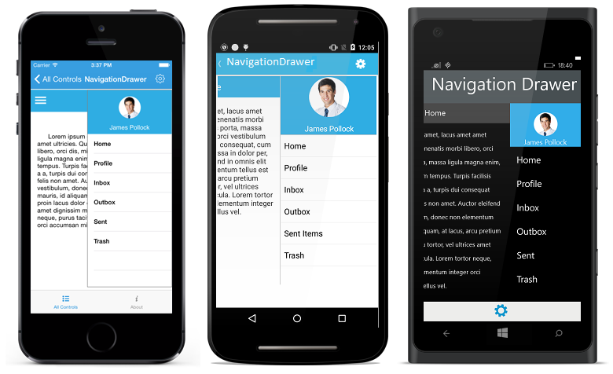
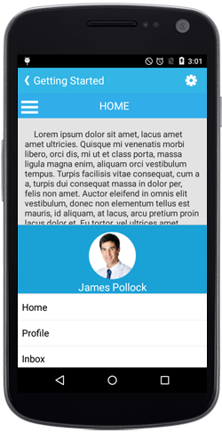

# Position

The `Position` property specifies the sliding position of the DrawerView panel. The `Position` property has the following four options:

* Left

* Right

* Top

* Bottom

N> The default option is Left.

## Left

Sets the NavigationDrawer sliding position to the left.

	
	


	Position sliderposition = Position.Left;	
	slideDrawer.Position=sliderposition;





	<navigation:SfNavigationDrawer x:Name="navigationDrawer" Position="Left">
  	




## Right

Sets the NavigationDrawer sliding position to the right.

	
	


	Position sliderposition = Position.Right;	
	slideDrawer.Position=sliderposition;





	<navigation:SfNavigationDrawer x:Name="navigationDrawer" Position="Right">
	




	
## Top

Sets the NavigationDrawer sliding position to the top.

	
	


	Position sliderposition = Position.Top;	
   	slideDrawer.Position=sliderposition;





	<navigation:SfNavigationDrawer x:Name="navigationDrawer" Position="Top">
	




## Bottom

Sets the NavigationDrawer sliding position to the bottom.

	
	


	Position sliderposition = Position.Bottom;	
	slideDrawer.Position=sliderposition;





	<navigation:SfNavigationDrawer x:Name="navigationDrawer" Position="Bottom">
	




