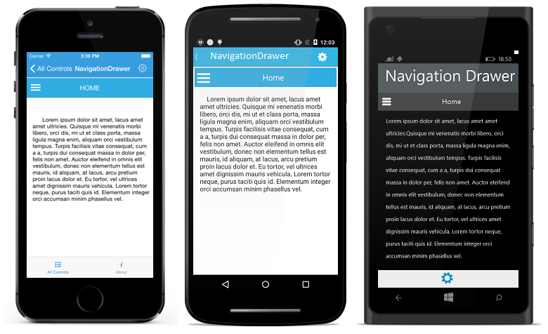

# Features

## ContentView

The main view of the NavigationDrawer can be set using `ContentView` property with desired views.




	
	Button imageButton = new Button();
	imageButton.Source = (FileImageSource)ImageSource.FromFile ("_menu_.png");
	imageButton.WidthRequest=50;
	
	Label homeLabel=new Label();
	homeLabel.Text="Home";
	homeLabel.FontSize=15;
	homeLabel.TextColor=Color.White;
	homeLabel.HorizontalTextAlignment=TextAlignment.Center;
	homeLabel.VerticalTextAlignment=TextAlignment.Center;
	
	StackLayout headerFrame=new StackLayout(); 
	headerFrame.Orientation = StackOrientation.Horizontal;
	headerFrame.Children.Add(imageButton);
	headerFrame.Children.Add(homeLabel);
	
	Label mainLabel=new Label();
	mainLabel.FontSize=14;
	mainLabel.TextColor=Color.Black;
	mainLabel.Text="Lorem ipsum dolor sit amet, lacus amet amet ultricies. Quisque mi venenatis morbi libero, orci dis, mi ut et class porta, massa ligula magna enim, aliquam orci vestibulum tempus. Turpis facilisis vitae consequat, cum a a, turpis dui consequat massa in dolor per, felis non amet. Auctor eleifend in omnis elit vestibulum, donec non elementum tellus est mauris, id aliquam, at lacus, arcu pretium proin lacus dolor et. Eu tortor, vel ultrices amet dignissim mauris vehicula. Lorem tortor neque, purus taciti quis id. Elementum integer orci accumsan minim phasellus vel.";
	
	StackLayout ContentFrame=new StackLayout();
	ContentFrame.Orientation = StackOrientation.Vertical; 
	ContentFrame.BackgroundColor=Color.White;
	ContentFrame.Children.Add(headerFrame);
	ContentFrame.Children.Add(mainLabel);
	navigationDrawer.ContentView=ContentFrame;
  


	  


 	<navigation:SfNavigationDrawer x:Name="navigationDrawer">
        <navigation:SfNavigationDrawer.ContentView>
            <StackLayout x:Name="ContentFrame" Orientation="Horizontal">
				<StackLayout x:Name="headerFrame" Orientation="Vertical">
					 <Button x:Name="imageButton" FontSize="20" HeightRequest="50" Grid.Column="0" Clicked="Btn_Clicked" BackgroundColor="#1aa1d6" HorizontalOptions="Start" WidthRequest="50" />
					 <Label x:Name="homeLabel" FontSize="15" HorizontalTextAlignment="Center" VerticalTextAlignment="Center"     HeightRequest="50"  TextColor="White" />
			    </StackLayout>   
				<Label x:Name="mainLabel" FontSize="14" TextColor="Black" />   
             </StackLayout>
        </navigation:SfNavigationDrawer.ContentView>
 	</navigation:SfNavigationDrawer>
 
 



	

## DrawerContentView

The sliding main content of the NavigationDrawer which is a part of DrawerPanel can be set using `DrawerContentView` property with desired views.





	StackLayout mainStack = new StackLayout ();
	mainStack.Opacity = 1;
	mainStack.Orientation = StackOrientation.Vertical;
	mainStack.HeightRequest = 500;
	mainStack.BackgroundColor = Color.White;

	ObservableCollection<String> list = new ObservableCollection<string> ();
	list.Add ("Home");
	list.Add ("Profile");
	list.Add ("Inbox");
	list.Add ("Outbox");
    list.Add ("Sent");
	list.Add ("Draft");

	ListView listView = new ListView();
	listView.WidthRequest= 200;
	listView.VerticalOptions = LayoutOptions.FillAndExpand;
	listView.ItemsSource = list;
	mainStack.Children.Add (listView);
            
    navigationDrawer.DrawerContentView = mainStack;
  




    <navigation:SfNavigationDrawer x:Name="navigationDrawer" DrawerContentView="{Binding }" />
       




## DrawerFooterView

Gets or sets the footer for the DrawerView panel in the SfNavigationDrawer control using `DrawerFooterView` property.





	StackLayout footerLayout = new StackLayout ();
	footerLayout.BackgroundColor = Color.Navy;		
    navigationDrawer.DrawerFooterView=footerLayout;
  




	<navigation:SfNavigationDrawer x:Name="navigationDrawer">
        <navigation:SfNavigationDrawer.DrawerFooterView>
            <StackLayout x:Name="footerLayout" BackgroundColor="Navy" />           
        </navigation:SfNavigationDrawer.DrawerFooterView>
 	</navigation:SfNavigationDrawer>
	




## DrawerHeaderView

Gets or sets the header of the DrawerView panel in the SfNavigationDrawer control using `DrawerHeaderView` property.





	StackLayout headerLayout = new StackLayout ();
	headerLayout.Orientation = StackOrientation.Vertical;
	headerLayout.BackgroundColor = Color.FromHex ("#1aa1d6");
	headerLayout.VerticalOptions = LayoutOptions.CenterAndExpand;
	headerLayout.HorizontalOptions = LayoutOptions.CenterAndExpand;
	headerLayout.HeightRequest = 200;
	headerLayout.WidthRequest = 275;
	Image image = new Image ();
	image.Source = ImageSource.FromFile("user.png");
	image.HeightRequest = 100;
	image.WidthRequest =  70;
	image.HorizontalOptions = LayoutOptions.CenterAndExpand;
	image.VerticalOptions = LayoutOptions.Center;
	image.BackgroundColor = Color.FromHex ("#1aa1d6");
	headerLayout.Children.Add (image);

	Label header = new Label ();
	header.Text  = "James Pollock";
    header.FontSize = 20;
	header.HeightRequest = 30;
	header.WidthRequest = 140;
	header.TextColor = Color.White;
	header.HorizontalOptions = LayoutOptions.Center;
	header.VerticalOptions = LayoutOptions.Center;
	header.BackgroundColor = Color.FromHex ("#1aa1d6");
	headerLayout.Children.Add (header);			
	navigationDrawer.DrawerHeaderView=headerLayout;
  



    
    <navigation:SfNavigationDrawer x:Name="navigationDrawer">
        <navigation:SfNavigationDrawer.DrawerHeaderView>
             <StackLayout x:Name="headerLayout" Orientation="Vertical" HeightRequest="200" WidthRequest="275">
                    <Image x:Name="image" HeightRequest="100" WidthRequest="70" Source="user.png" />
                    <Label x:Name="header" Text="James Pollock" FontSize="20" HeightRequest="30" WidthRequest="140" /> 
             </StackLayout>
        </navigation:SfNavigationDrawer.DrawerHeaderView>
    </navigation:SfNavigationDrawer>




## Drawer Size

Gets or sets the height and width of the DrawerView panel in the NavigationDrawer control using `DrawerHeight` and `DrawerWidth` properties.




        
        navigationDrawer.DrawerHeight = 300;
        navigationDrawer.DrawerWidth = 300;
  




	<navigation:SfNavigationDrawer x:Name="navigationDrawer" DrawerHeight="300" DrawerWidth="300" />
	


