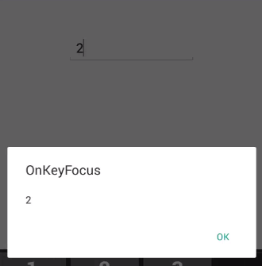

# Events and Interactivity

## Events

### ValueChanged Event

We can perform operation while the changing the value of NumericTextBox's Value using ValueChanged event. ValueChanged event returns the changed value in NumericTextBox.

<table>
<tr>
<th>Members</th>
<th>Description</th>
</tr>
<tr>
<td>Value</td>
<td>Displays changed value in NumericTextBox</td>
</tr>
</table>





	<syncfusion:SfNumericTextBox x:Name="numericTextBox" ValueChanged="Handle_ValueChanged" Value="123"  />
	




SfNumericTextBox numericTextBox=new SfNumericTextBox();
numericTextBox.Value = 123;
numericTextBox.ValueChanged += (object sender, ValueEventArgs e) =>
{
	System.Diagnostics.Debug.WriteLine(e.Value.ToString());
};
this.Content=numericTextBox;





### Completed Event

Occurs when the user finalizes the text in the NumericTextBox by pressing return key on the keyboard.





    <syncfusion:SfNumericTextBox x:Name="numericTextBox" Completed="Handle_Completed” Value="123"/>
    




SfNumericTextBox numericTextBox=new SfNumericTextBox();
numericTextBox.Value = 123;
numericTextBox.Completed += (object sender, EventArgs e) =>
{
    System.Diagnostics.Debug.WriteLine(“Completed”);
};
this.Content=numericTextBox;





## Interactivity : ValueChangeMode

The ValueChangeMode property is used to mention when the validation need to take place, either in key pressed or in focus lost. When ValueChangeMode is set to OnKeyFocus, the validation will be carried out for each key press. When ValueChangeMode is OnLostFocus, the validation occur when the control lost the focus or the focus move to next control. ValueChangeMode includes the following options:

1. OnKeyFocus
2. OnLostFocus

### OnKeyFocus





	<syncfusion:SfNumericTextBox ValueChangeMode="OnKeyFocus" x:Name="numericTextBox"  Value="123"  />
	




SfNumericTextBox numericTextBox=new SfNumericTextBox();
numericTextBox.Value = 123;
numericTextBox.ValueChangeMode = ValueChangeMode.OnKeyFocus;
this.Content=numericTextBox;





### OnLostFocus





	<syncfusion:SfNumericTextBox ValueChangeMode="OnLostFocus" x:Name="numericTextBox"  Value="123"  />
	




SfNumericTextBox numericTextBox=new SfNumericTextBox();
numericTextBox.Value = 123;
numericTextBox.ValueChangeMode = ValueChangeMode.OnLostFocus;
this.Content=numericTextBox;





