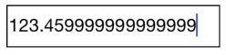

# Number Formatting

The Values of the SfNumericTextBox can be configured to display different formats like currency format, percent format etc. 

## Format String

The `FormatString` property determines the format specifier by which the display text has to be formatted. 

N> The control displays the formatted text on lost focus. Default Value of `FormatString` is "n".

### Display Currency Notation

`c` - Displays the value with currency notation.
	
	



	<numeric:SfNumericTextBox x:Name="numericTextBox" FormatString="c" />
	

	

	
	numericTextBox.FormatString="c";
	 



	
### Display Number Notation

`n` – Displays the value in number format.





	<numeric:SfNumericTextBox x:Name="numericTextBox" FormatString="n" />
	

	

	
	numericTextBox.FormatString="n";
	 




### Display Percentage Notation

`p` – Displays the value in percentage.
	
	



	<numeric:SfNumericTextBox x:Name="numericTextBox" FormatString="p" />
	

	


	numericTextBox.FormatString="p";
	 



	
N> Instead of using above `FormatString` types, we can provide any symbol or value as string in `FormatString` property which will be appended with the value in SfNumericTextBox. 

## Parser Input Value

The value of the SfNumericTextBox can be parsed based on the `ParsingMode` property. 

N> The `ParsingMode` is of type Parsers containing enum values of Double and Decimal. The default Value for `ParsingMode` is Double.





	<numeric:SfNumericTextBox x:Name="numericTextBox" ParsingMode="Decimal" />
	




	numericTextBox.ParsingMode=ParsingMode.Decimal;
	  




## Compute to Percentage

The `PercentDisplayMode` property can be used to display numeric data in Percent mode. 

N> The control displays the percent value on lost focus. 

It provides the following options:

* `Value`: Displays the value with percentage symbol.




	<numeric:SfNumericTextBox x:Name="numericTextBox" PercentDisplayMode="Value" />
	




	numericTextBox.PercentDisplayMode=PercentDisplayMode.Value;





* `Compute`: Displays the computed value with percentage symbol.




	<numeric:SfNumericTextBox x:Name="numericTextBox" PercentDisplayMode="Compute" />
	




	numericTextBox.PercentDisplayMode=PercentDisplayMode.Compute;





