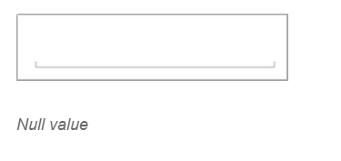

# Features

## MaximumNumberDecimalDigits

The maximum number of digits to be displayed after the decimal point can be specified by using `MaximumNumberDecimalDigits` property. 

N> The `MaximumNumberDecimalDigits` property can be provided with positive value only.





	numericUpDown.MaximumNumberDecimalDigits = 2;





	<numeric:SfNumericUpDown x:Name="numericUpDown" MaximumNumberDecimalDigits="2"/>
	




## Nullable Value

The null values can be set in SfNumericUpDown `Value` property, by setting `AllowNull` property value to true.

N> By default, the property value is false.





	numericUpDown.AllowNull=true;





	<numeric:SfNumericUpDown x:Name="numericUpDown" AllowNull="true"/>
	




## AutoReverse

While incrementing, the control will start from Minimum once it reaches the Maximum and vice-versa.

N> By default the property value is false.





	numericUpDown.AutoReverse = true;





	<numeric:SfNumericUpDown x:Name="numericUpDown" AutoReverse="true"/>
	




## Range

User can restrict the Values between a specific range by setting `Maximum` and `Minimum` property value.

N> By default the minimum property value is 0 and maximum property value is 100.





	numericUpDown.Minimum = 0;
	numerucUpDown.Maximum = 100





	<numeric:SfNumericUpDown x:Name="numericUpDown" Minimum="10" Maximum="50"/>
	




## Step Value

Frequency in which values gets incremented can be decided using `StepValue` property.

N> By default the property value is 1.





	numericUpDown.StepValue = 6;





	<numeric:SfNumericUpDown x:Name="numericUpDown" StepValue="6"/>
	




