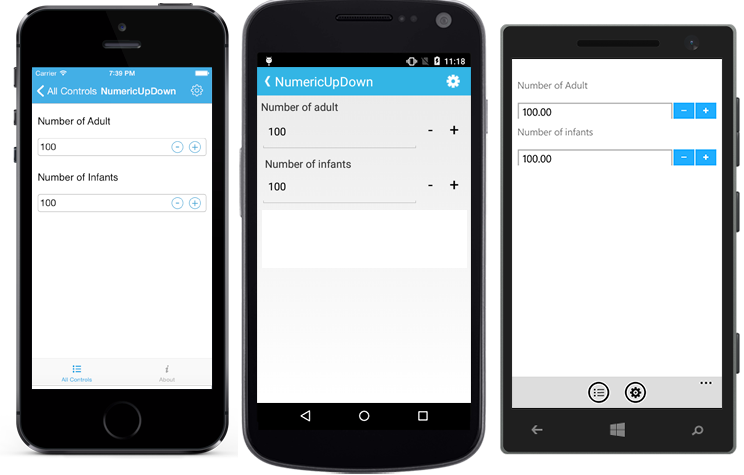
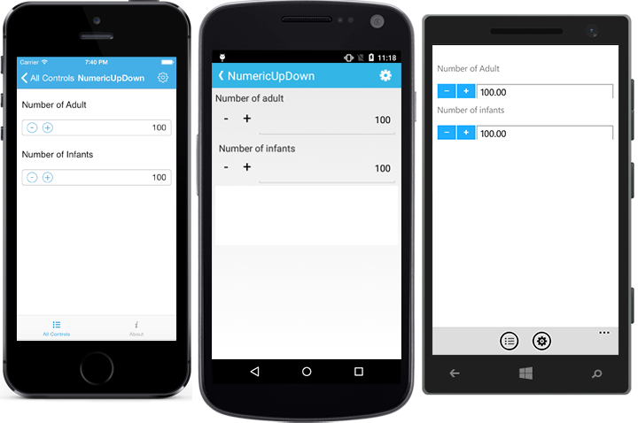
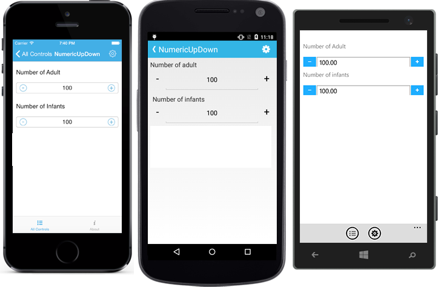
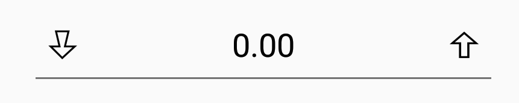

# Spin Button Alignment

Spin Button position in the SfNumericUpDown control can be changed relative to the TextBox based on `SpinButtonAlignment` property. 

There are three built-in modes.

### Right

Spin Buttons will get aligned to the right side of the control.





	numericUpDown.SpinButtonAlignment = SpinButtonAlignment.Right;





	<numeric:SfNumericUpDown x:Name="numericUpDown" SpinButtonAlignment="Right"/>
	




### Left

Spin Buttons will get aligned to the left side of the control.





	<numeric:SfNumericUpDown x:Name="numericUpDown" SpinButtonAlignment="Left"/>
	




	numericUpDown.SpinButtonAlignment = SpinButtonAlignment.Left;





### Both

Spin Buttons will get aligned to the both side of the control.





	<numeric:SfNumericUpDown x:Name="numericUpDown" SpinButtonAlignment="Both"/>
	




	numericUpDown.SpinButtonAlignment = SpinButtonAlignment.Both;





N> By default the property value is Right.

## UpDownButtonSetting Customization

We can set the Up Down button of SfNumericUpDown control by using any of the below given ways.

1. View
2. Image
3. FontIconText

N> For image and Font icon we need to add the the respective image and TTF file.
		For android: Add image at Resource/Drawable/{Image} and .ttf file at Asserts/{.ttf}
		For iOS: Add image and .ttf file to Resource/{Image/.ttf} and To use FontIcons, add respective FontFamily name in info.plist file under Fonts provided by application category.
		For UWP: Add the image and .ttf file directly to the project.

### By using View





<updown:SfNumericUpDown x:Name="upDown" SpinButtonAlignment="Both" TextAlignment="Center">
<updown:SfNumericUpDown.IncrementButtonSettings>
<updown:UpDownButtonSettings ButtonHeight="45" ButtonWidth="45">
<updown:UpDownButtonSettings.ButtonView>
<Grid HeightRequest="40" WidthRequest="40">
<Image Source="up.png" Aspect="AspectFit" />
</Grid>
</updown:UpDownButtonSettings.ButtonView>
</updown:UpDownButtonSettings>
</updown:SfNumericUpDown.IncrementButtonSettings>
<updown:SfNumericUpDown.DecrementButtonSettings>
<updown:UpDownButtonSettings ButtonHeight="45" ButtonWidth="45">
<updown:UpDownButtonSettings.ButtonView>
<Grid HeightRequest="40" WidthRequest="40">
<Image Source="down.png" Aspect="AspectFit" />
</Grid>
</updown:UpDownButtonSettings.ButtonView>
</updown:UpDownButtonSettings>
</updown:SfNumericUpDown.DecrementButtonSettings>
</updown:SfNumericUpDown>





 public partial class MainPage : ContentPage
    {
        SfNumericUpDown upDown;
        Grid incrementGrid, decrementGrid;
        UpDownButtonSettings incSettings, decrementSettings;
        Image incrementImage, decrementImage;
        public MainPage()
        {
            InitializeComponent();
            incrementGrid = new Grid
            {
                HeightRequest = 40,
                WidthRequest = 40,
                BackgroundColor = Color.Blue
            };
            incSettings = new UpDownButtonSettings
            {
                ButtonView = incrementGrid,
                ButtonHeight = 45,
                ButtonWidth = 45
            };
            incrementImage = new Image
            {
                HorizontalOptions = LayoutOptions.Center,
                VerticalOptions = LayoutOptions.Center,
                Source = (FileImageSource)ImageSource.FromFile("up.png"),
                Aspect = Aspect.AspectFit
            };
            decrementSettings = new UpDownButtonSettings
            {
                ButtonView = decrementGrid,
                ButtonHeight = 45,
                ButtonWidth = 45
            };
            decrementGrid = new Grid
            {
                HeightRequest = 40,
                WidthRequest = 40,
                BackgroundColor = Color.Red

            };
            decrementImage = new Image
            {
                Source = (FileImageSource)ImageSource.FromFile("down.png"),
                Aspect = Aspect.AspectFit,
                HorizontalOptions = LayoutOptions.Center,
                VerticalOptions = LayoutOptions.Center
            };
            upDown = new SfNumericUpDown
            {
                SpinButtonAlignment = SpinButtonAlignment.Left,
                IncrementButtonSettings = incSettings,
                DecrementButtonSettings = decrementSettings
            };
            incrementGrid.Children.Add(incrementImage);
            decrementGrid.Children.Add(decrementImage);
            this.Content = upDown;
        }
        
    }





### By using Image





<updown:SfNumericUpDown x:Name="upDown" SpinButtonAlignment="Both" TextAlignment="Center">
<updown:SfNumericUpDown.IncrementButtonSettings>
<updown:UpDownButtonSettings ButtonImage="up" ButtonHeight="35" ButtonWidth="35" />
</updown:SfNumericUpDown.IncrementButtonSettings>
<updown:SfNumericUpDown.DecrementButtonSettings>
<updown:UpDownButtonSettings ButtonImage="down" ButtonHeight="35" ButtonWidth="35" />
</updown:SfNumericUpDown.DecrementButtonSettings>
</updown:SfNumericUpDown> 

	




public partial class MainPage : ContentPage
    {
        }
        SfNumericUpDown upDown;
        Grid incrementGrid, decrementGrid;
        UpDownButtonSettings incSettings, decrementSettings;
        Image incrementImage, decrementImage;
        public MainPage()
        {
            InitializeComponent();
           
            incSettings = new UpDownButtonSettings
            {
                ButtonImage = "up",
                ButtonHeight = 45,
                ButtonWidth = 45
            };
            decrementSettings = new UpDownButtonSettings
            {
                ButtonImage = "down",
                ButtonHeight = 45,
                ButtonWidth = 45
            };
            upDown = new SfNumericUpDown
            {
                SpinButtonAlignment = SpinButtonAlignment.Both,
                IncrementButtonSettings = incSettings,
                DecrementButtonSettings = decrementSettings
            }; 
            this.Content = upDown;
        }
        
    }





### By using FontIconText





<updown:SfNumericUpDown x:Name="upDown" SpinButtonAlignment="Both" TextAlignment="Center">
<updown:SfNumericUpDown.IncrementButtonSettings>
<updown:UpDownButtonSettings.ButtonFontFamily>
<OnPlatform
                x:TypeArguments="x:String">
                <On
                    Platform="Android"
                    Value="numeric.ttf">
                </On>
                <On
                    Platform="iOS"
                    Value="numeric">
                </On>
            </OnPlatform>
</updown:UpDownButtonSettings.ButtonFontFamily>
<updown:UpDownButtonSettings ButtonFontIcon="&#xe701;" ButtonHeight="35" ButtonWidth="35" />
</updown:SfNumericUpDown.IncrementButtonSettings>
<updown:SfNumericUpDown.DecrementButtonSettings>
<updown:UpDownButtonSettings.ButtonFontFamily>
<OnPlatform
                x:TypeArguments="x:String">
                <On
                    Platform="Android"
                    Value="numeric.ttf">
                </On>
                <On
                    Platform="iOS"
                    Value="numeric">
                </On>
            </OnPlatform>
</updown:UpDownButtonSettings.ButtonFontFamily>
<updown:UpDownButtonSettings ButtonFontIcon="&#xe700;" ButtonHeight="35" ButtonWidth="35" />
</updown:SfNumericUpDown.DecrementButtonSettings>
</updown:SfNumericUpDown> 





SfNumericUpDown upDown = new SfNumericUpDown();
upDown.SpinButtonAlignment = SpinButtonAlignment.Both;
UpDownButtonSettings incSettings = new UpDownButtonSettings();
incSettings.ButtonFontIcon = "\xe701";
    if (Device.OS == TargetPlatform.Android)
{
    incSettings.ButtonFontFamily = "numeric.ttf";
    decrementSettings.ButtonFontFamily = "numeric.ttf";
}

else
{
    incSettings.ButtonFontFamily = "numeric";
    decrementSettings.ButtonFontFamily = "numeric";
}
upDown.IncrementButtonSettings = incSettings;
UpDownButtonSettings decrementSettings = new UpDownButtonSettings();
decrementSettings.ButtonFontIcon = "\xe700";
decrementSettings.ButtonWidth = 45;
upDown.DecrementButtonSettings = decrementSettings;
this.Content = upDown;





