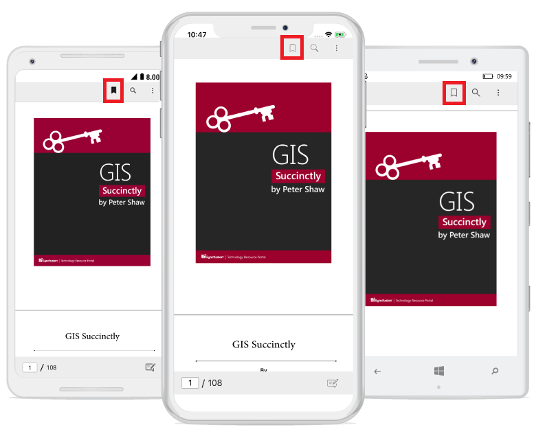

# Working with Bookmark Navigation

PDF viewer allows users to view the bookmarks present in the loaded PDF document and navigate to the destination saved in the bookmarks. 

## Enabling and disabling bookmark feature

You can enable and disable the bookmark button from the built-in toolbar using the `BookmarkNavigationEnabled` property available in PDF viewer.

<table>

<tr>
<th>Property</th>
<th>Action</th>
</tr>

<tr>
<td>BookmarkNavigationEnabled</td>
<td>Gets or sets the value that enable and disable the bookmark feature in PDF viewer. By default, this property is set to true.</td>
</tr>

</table>

This property removes the bookmark button from the built-in toolbar and disable the bookmark feature, when it is set to false and vice versa.




<pdfviewer:SfPdfViewer x:Name="pdfViewerControl" BookmarkNavigationEnabled="False"/>               







//Bookmark feature is disabled
pdfViewerControl. BookmarkNavigationEnabled = false;             




## Expand and collapse the bookmark pane from built-in toolbar

The bookmark pane is expanded and collapsed by clicking the bookmark button from the built-in toolbar.

## Expand and collapse the bookmark pane programmatically

The bookmark pane is expanded and collapsed programmatically by using the `BookmarkPaneVisible` bindable property available in PDF viewer.

<table>

<tr>
<th>Property</th>
<th>Action</th>
</tr>

<tr>
<td>BookmarkPaneVisible</td>
<td>Gets or sets the value to expand and collapse the bookmark pane in PDF viewer. Setting this property to true expands the pane and vice versa. By default, this property is set to true.</td>
</tr>

</table>




<pdfviewer:SfPdfViewer x:Name="pdfViewerControl" BookmarkPaneVisible="False"/>     







//Bookmark pane will be collapsed, if it is expanded
pdfViewerControl.BookmarkPaneVisible = true;




## Programmatically navigate to a bookmark destination

You can navigate to a desired bookmark destination using the `GotoBookmark(PdfBookmark)` method. The target/destination bookmark should be provided as the argument to this method. Refer to the following code sample.




//Loads the PDF document in PdfLoadedDocument
PdfLoadedDocument loadedDocument = new PdfLoadedDocument(documentStream);

//Retrieves the bookmark collection from the loaded PDF document
PdfBookmarkBase bookmark = loadedDocument.Bookmarks;

//Navigate to the specified bookmark destination offset
pdfViewerControl.GoToBookmark(bookmark[0]);




## Track the occurrence of the bookmark navigation

You can track the bookmark navigation operation using the `BookmarkNavigationOccurred` event. The argument of this event will provide the instance of the bookmark, destination page number, and vertical offset. Refer to the following code example.




pdfViewerControl.BookmarkNavigationOccurred += PdfViewerControl_BookmarkNavigationOccurred;

private void PdfViewerControl_BookmarkNavigationOccurred(object sender, Syncfusion.SfPdfViewer.XForms.BookmarkNavigationOccurredEventArgs e)
{
      //Retrieves the current bookmark
      PdfBookmark bookmark = e.Bookmark;

      //Gets the vertical offset of the bookmark
      double destinationOffset = e.Offset;

      //Gets the current page number in which the bookmark destination resides
      int pageNumber = e.PageNumber;

}




