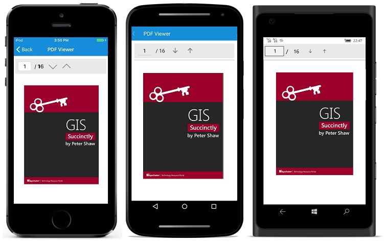

# Getting Started

This section explains about the assemblies required for the deployment of SfPdfViewer control and how to create simple application with SfPdfViewer control.
 
## Assemblies Required
 
### PCL project

pcl\Syncfusion.SfPdfViewer.XForms.dll
 
### Android project

android\Syncfusion.SfPdfViewer.XForms.Andriod.dll

android\Syncfusion.SfPdfViewer.XForms.dll
 
### iOS(Unified) project

iOS-unified\Syncfusion.SfPdfViewer.XForms.iOS.dll

iOS-unified\Syncfusion.SfPdfViewer.XForms.dll
 
## Create a simple application with the SfPdfViewer

Follow the below steps to create a simple application with the SfPdfViewer and load a PDF document.

* Create a new Cross Platform application for Xamarin.Forms.Portable in the Visual Studio and refer the required assemblies to the respective projects.

N>**Essential PDF Viewer for Xamarin.Forms Android project is compatible with platform version of Android 5.0 (API Level 21) or more.

N>**Essential PDF Viewer for Xamarin.Forms iOS project is compatible with operating system of iOS 9.0 or more.

An additional step is required for iOS projects. We need to create an instance of the SfPdfDocumentViewRenderer as shown below.

Create an instance of SfPdfDocumentViewRenderer in FinishedLaunching overridden method of AppDelegate class in iOS Project as shown below.




public override bool FinishedLaunching(UIApplication app, NSDictionary options)
{
    ...
    new SfPdfDocumentViewRenderer();
    ...
}




* Add the following C# code in your main page to make use of the PdfViewerControl.




SfPdfViewer pdfViewerControl = new SfPdfViewer();
Content = pdfViewerControl;




Alternatively, we can add the following Xaml code in our main page to make use of PdfViewerControl.




<ContentPage xmlns="http://xamarin.com/schemas/2014/forms"
             xmlns:x=http://schemas.microsoft.com/winfx/2009/xaml
             xmlns:syncfusion="clr-namespace:Syncfusion.SfPdfViewer.XForms;assembly=Syncfusion.SfPdfViewer.XForms">
     
    <ContentPage.Content>
        <syncfusion:SfPdfViewer x:Name="pdfViewerControl">
        </syncfusion:SfPdfViewer>
    </ContentPage.Content>
</ContentPage>




## Loading PDF document

The LoadDocument method of PdfViewerControl object can be used to load a PDF document as stream input.




protected override void OnAppearing()
{
    Stream fileStream = typeof(App).GetTypeInfo().Assembly.GetManifestResourceStream("GIS Succinctly.pdf");
    pdfViewerControl.LoadDocument(fileStream);       
}




## Unloading PDF document from the Viewer

The SfPdfViewer control allows you to unload the PDF document from the viewer when the control is not in use anymore. This releases the PDF document and all its associated resources of the application.

We need to call the Unload method of SfPdfViewer control as in the below code snippet to achieve the same.




pdfViewerControl.Unload();




This is how the final output will look like on iOS, Android and UWP devices.

