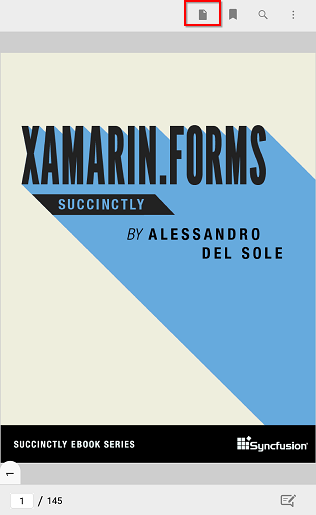
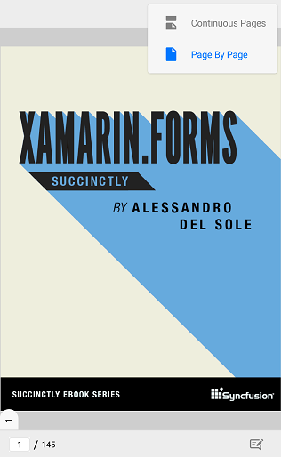

# Single page view mode

The default continuous view mode of PDF Viewer allows vertical scrolling. In addition to that, PDF Viewer also provides options to view PDFs page by page with horizontal navigation support.

## Switching between view modes

The view mode can be switched by choosing the corresponding option from the menu bar that appears when the view mode button is clicked. The view mode button is available on the top toolbar. 

The view mode can also be changed programmatically using the `PageViewMode` property of the PDF viewer. The enum `PageViewMode` has two constants - `Continuous`, `PageByPage`. The default value is `Continuous`. The below code snippet illustrates how to switch to the page by page view mode.





<syncfusion:SfPdfViewer x:Name="pdfViewerControl" PageViewMode="PageByPage" />





pdfViewerControl.PageViewMode = PageViewMode.PageByPage;




## Tracking the changes in the `PageViewMode` property

When the `PageViewMode` property changes, the `PageViewModeChanged` event is raised. The second parameter of the event handler is of type `PageViewModeChangedEventArgs` which provides the details about the old and new view modes. 




pdfViewerControl.PageViewModeChanged += PdfViewerControl_PageViewModeChanged1;

private void PdfViewerControl_PageViewModeChanged1(object sender, PageViewModeChangedEventArgs e)
{
    PageViewMode oldViewMode = e.PreviousPageViewMode;
    PageViewMode newViewMode = e.CurrentPageViewMode;
}


