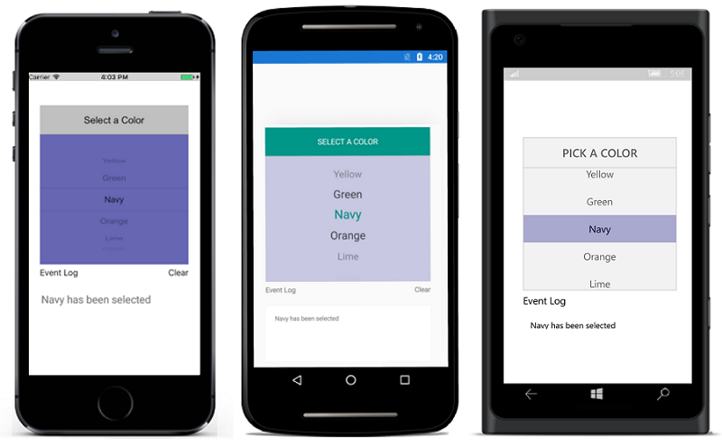

---

layout: post
title: Getting Started with Syncfusion Picker control for Xamarin.Forms
description: A quick tour to initial users on Syncfusion Picker control for Xamarin.Forms platform.
platform: Xamarin
control: Picker
documentation: ug

---

# Getting Started

This section explains you the steps to configure a SfPicker control in a real-time scenario and also provides a walk-through on some of the customization features available in SfPicker control.

## Add SfPicker

You can then add the assembly references to the respective projects as shown below

<table>
<tr>
<th>Project</th>
<th>Required assemblies</th>
</tr>
<tr>
<td>PCL</td>
<td>pcl\pcl\Syncfusion.SfPicker.XForms.dll
</td>
</tr>
<tr>
<td>Android</td>
<td>android\pcl\Syncfusion.SfPicker.XForms.dll
 android\Syncfusion.SfPicker.XForms.Android.dll
 android\Syncfusion.SfPicker.Android.dll
</td>
</tr>
<tr>
<td>iOS (Unified)</td>
<td>iOS-unified\Syncfusion.SfPicker.iOS.dll iOS-unified\Syncfusion.SfPicker.Xforms.dll
 iOS-unified\Syncfusion.SfPicker.XForms.iOS.dll
</td>
</tr>
<tr>
<td>UWP</td>
<td>uwp\Syncfusion.SfInput.UWP.dll uwp\Syncfusion.SfShared.UWP.dll uwp\Syncfusion.SfPicker.XForms.dll uwp\Syncfusion.Sfpicker.XForms.UWP.dll</td>
</tr>
</table>

Currently an additional step is required for iOS project. We need to create an instance of the picker custom renderer as shown below. 

Create an instance of SfPickerRenderer in FinishedLaunching overridden method of AppDelegate class in iOS Project as shown below





public override bool FinishedLaunching(UIApplication app, NSDictionary options)
{
    new SfPickerRenderer ();
}	





The SfPicker control is configured entirely in C# code or by using XAML markup. The following steps explains how to create a SfPicker and configure its elements.

* Adding namespace for the added assemblies. 





	<xmlns:picker="clr-namespace:Syncfusion.SfPicker.XForms;assembly=Syncfusion.SfPicker.XForms"/>





	using Syncfusion.SfPicker.XForms;





## Create your first Picker in Xamarin.Forms

The Picker control can be configured entirely in C# code or by using XAML markup.

1) Create new BlankApp (Xamarin.Forms.Portable) application in Xamarin Studio or Visual Studio.

2) Now, create a simple data source as shown in the following code example. Add the following code example in a newly created class file and save it PickerGettingStartedViewModel.cs file.





public class PickerGettingStartedViewModel : INotifyPropertyChanged
{
private ObservableCollection<object> source;

private bool isShowHeader = false;

private bool isShowColumnHeader = true;

private bool isShowFooter = false;

private int selectedIndex = 2;

private string headerText = "SELECT A COLOR";

public event PropertyChangedEventHandler PropertyChanged;

public PickerGettingStartedViewModel()
{
source = new ObservableCollection<object>();
source.Add("Yellow");
source.Add("Green");
source.Add("Navy");
source.Add("Orange");
source.Add("Lime");
source.Add("Purple");
source.Add("Pink");
source.Add("Red");
source.Add("Gray");

}

public ObservableCollection<object> Source
{
get
{
return source;
}

set
{
source = value;
}
}

public bool IsShowHeader
{
get
{
return isShowHeader;
}

set
{
isShowHeader = value;
OnPropertyChanged("IsShowHeader");
}
}
public bool IsShowFooter
{
get
{
return isShowFooter;
}

set
{
isShowFooter = value;
OnPropertyChanged("IsShowFooter");
}
}
public bool IsShowColumnHeader
{
get
{
return isShowColumnHeader;
}

set
{
isShowColumnHeader = value;
OnPropertyChanged("IsShowColumnHeader");
}
}

public string HeaderText
{
get
{
return headerText;
}

set
{
headerText = value;
OnPropertyChanged("HeaderText");
}
}

public int SelectedIndex
{
get
{
return selectedIndex;
}

set
{
selectedIndex = value;
OnPropertyChanged("SelectedIndex");
}
}

void OnPropertyChanged(string propertyName)
{
if (PropertyChanged != null)
PropertyChanged.Invoke(this, new PropertyChangedEventArgs(propertyName));
}
}





3)You can set the data source of the Picker by using the SfPicker.ItemsSource property as follows.




<ContentPage xmlns="http://xamarin.com/schemas/2014/forms" 
xmlns:x="http://schemas.microsoft.com/winfx/2009/xaml" 
xmlns:local="clr-namespace:Picker_GettingStarted"
xmlns:Syncfusion="clr-namespace:Syncfusion.SfPicker.XForms;assembly=Syncfusion.SfPicker.XForms"
x:Class="Picker_GettingStarted.Picker_GettingStartedPage">
<ContentPage.Content>
<Syncfusion:SfPicker 
x:Name="sfPicker"  
SelectedIndex="{Binding SelectedIndex}"
ItemsSource="{Binding Source}" 
ShowHeader="{Binding IsShowHeader}"  
ShowColumnHeader="{Binding IsShowColumnHeader}" 
HeaderText="{Binding HeaderText}"
ShowFooter="{Binding isShowFooter}"
ColumnHeaderText="{Binding ColumnHeaderTextCollection}"/>
</ContentPage.Content>
</ContentPage>

	




public partial class Picker_GettingStartedPage : ContentPage
{
public Picker_GettingStartedPage()
{
InitializeComponent();

var viewModel = new PickerGettingStartedViewModel();
this.BindingContext =  viewModel;

}
}





4.	Essential Picker for Xamarin.Forms allows you to apply the header and footer on it. The following code illustrates this.





<ContentPage.Content>
<Syncfusion:SfPicker 
x:Name="sfPicker"  
SelectedIndex="{Binding SelectedIndex}"
ItemsSource="{Binding Source}" 
ShowHeader="true"  
ShowFooter="true"
ShowColumnHeader="true" 
HeaderText="{Binding HeaderText}"
ColumnHeaderText="{Binding ColumnHeaderTextCollection}"/>
</ContentPage.Content>
	




