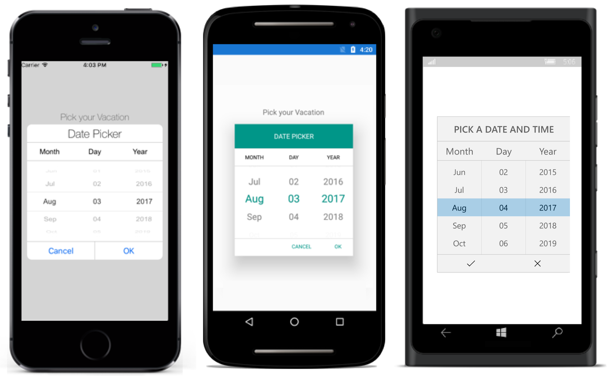

---

layout: post
title: Overview of Syncfusion Picker control for Xamarin.Forms
description: Overview and key features of Picker control
platform: Xamarin
control: Picker
documentation: ug

---
# Overview

The picker control allows users to pick an item among a list of items that can be customized with custom view. This control can be opened as dialog. Its rich feature set includes functionalities like data binding, multi column, header/footer, custom view on header/footer and default validation buttons.

## Key Features

* `Multi Column`

* `Header view`

* `Footer view with default buttons`

* `Template support`

* `RTL support.`

