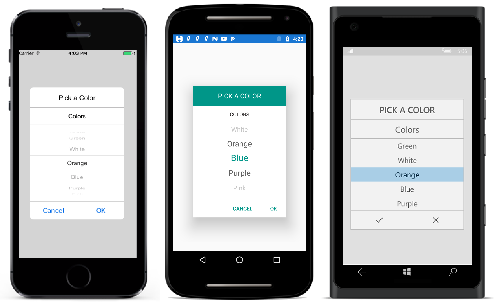

# Getting Started

This section explains you the steps to configure a SfPicker control in a real-time scenario and provides a walk-through on some of the customization features available in SfPicker control.

## Adding SfPicker reference

Refer this [article](https://help.syncfusion.com/xamarin/introduction/download-and-installation# "") to know how to obtain and reference Essential Studio components in your solution; then refer [this](https://help.syncfusion.com/xamarin/introduction/control-dependencies#sfpicker "") link to know about the assemblies required for adding SfPicker to your project.

## Initialize SfPicker on each Platform

To use SfPicker in Xamarin application. Each platform project must initialize the SfPicker renderer. This initializing step are varies from platform to platform and it is discussed in the section.

### Android

The Android launches the SfPicker without any initialization and is enough to only initialize the Xamarin.Forms Framework to launch the application.

### iOS

To launch the SfPicker in iOS, you need to call the `SfPickerRenderer.Init()` in the FinishedLaunching overridden method of the `AppDelegate` class after the Xamarin.Forms Framework initialization and before the LoadApplication is called, as demonstrated in the following code example:



public override bool FinishedLaunching(UIApplication app, NSDictionary options)

{

…

global::Xamarin.Forms.Forms.Init ();

SfPickerRenderer.Init();

LoadApplication (new App ());

…

}


### Universal Windows Platform (UWP)

To launch the SfPicker in UWP, you need to call the `SfPickerRenderer.Init()` in the `MainPage` constructor before the `LoadApplication` is called, as demonstrated in the following code example:



public MainPage()

{

…

SfPickerRenderer.Init();

LoadApplication (new App ());

…

}


### ReleaseMode issue in UWP platform

There is a known Framework issue in UWP platform. The custom controls will not render when deployed the application in Release Mode.

The above problem can be resolved by initializing the SfPicker assemblies in `App.xaml.cs` in UWP project as like in below code snippet.


// In App.xaml.cs

protected override void OnLaunched(LaunchActivatedEventArgs e)

{

…

rootFrame.NavigationFailed += OnNavigationFailed;

// you'll need to add `using System.Reflection;`

List<Assembly> assembliesToInclude = new List<Assembly>();

//Now, add all the assemblies your app uses

assembliesToInclude.Add(typeof(SfPickerRenderer).GetTypeInfo().Assembly);

// replaces Xamarin.Forms.Forms.Init(e);        

Xamarin.Forms.Forms.Init(e, assembliesToInclude);

…     

}


### Create a simple SfPicker

This section explains how to create simple SfPicker control and configure it. SfPicker can configure using XAML or C# code. 

### Create the Xamarin Form project 

Create new blank project (Xamarin.Forms Portable) using Visual Studio or Xamarin Studio for Xamarin.Forms. 

### Adding SfPicker in Xamarin Form project

1. Add the required assembly reference in PCL and other renderer projects as discussed in **Adding** **SfPicker** **reference** section.
2. Add SfPicker control two way XAML or C#.
* XAML Page
  * Set SfPicker control namespace as `xmlns:syncfusion="clr- namespace:Syncfusion.SfPicker.XForms;assembly=Syncfusion.SfPicker.XForms”` in XAML Content page.
  * Set the SfPicker control in Content property of ContentPage.
* C# Page
  * Import SfPicker control namespace as `using Syncfusion.SfPicker.XForms;` in C# ContentPage.
  * Create new SfPicker instance in ContentPage constructor and assign SfPicker instance to ContentPage Content property.



<?xml version="1.0" encoding="utf-8" ?>

<ContentPage xmlns="http://xamarin.com/schemas/2014/forms" xmlns:syncfusion="clr-namespace:Syncfusion.SfPicker.XForms;assembly=Syncfusion.SfPicker.XForms"

xmlns:x="http://schemas.microsoft.com/winfx/2009/xaml"

x:Class="GettingStarted.PickerSample">

<ContentPage.Content>

<syncfusion:SfPicker x:Name="picker" />

</ContentPage.Content>

</ContentPage>





using Syncfusion.SfPicker.XForms;

using Xamarin.Forms;

using Xamarin.Forms.Xaml;

namespace GettingStarted

{

[XamlCompilation(XamlCompilationOptions.Compile)]

public partial class PickerSample : ContentPage

{

SfPicker picker;

public PickerSample()

{

InitializeComponent();

picker = new SfPicker();

this.Content = picker;

}

}

}




### Set Header to the SfPicker

SfPicker allows you to define header text by setting the `SfPicker.HeaderText` and enable SfPicker header by setting `SfPicker.ShowHeader` property to true. Default value of `SfPicker.ShowHeader` is True.




<syncfusion:SfPicker x:Name="picker" HeaderText="Select a Color" />





picker.HeaderText = "Select a Color";




### Adding SfPicker Items 

SfPicker control is a data bounded control. Hence you must create collection of data’s and bind it to SfPicker control.

* Create simple Observable Collection with string type of Data’s for the SfPicker 



public class ColorInfo

{

private ObservableCollection<string> _color;

public ObservableCollection<string> Colors

{

get { return _color; }

set { _color = value; }

}

public ColorInfo()

{

Colors = new ObservableCollection<string>();

Colors.Add("Red");

Colors.Add("Green");

Colors.Add("Yellow");

Colors.Add("Blue");

Colors.Add("SkyBlue");

Colors.Add("Orange");

Colors.Add("Gray");

Colors.Add("Pink");

}

}


* Binding the Collection to SfPicker

SfPicker allow you to bind collection of data’s by setting `SfPicker.ItemsSource` property. You can bind the collection of data’s in both XAML or C#.




<?xml version="1.0" encoding="utf-8" ?>

<ContentPage

x:Class="GettingStarted.PickerSample"

xmlns="http://xamarin.com/schemas/2014/forms"

xmlns:x="http://schemas.microsoft.com/winfx/2009/xaml"

xmlns:local="clr-namespace:GettingStarted"

xmlns:syncfusion="clr-namespace:Syncfusion.SfPicker.XForms;assembly=Syncfusion.SfPicker.XForms">

<ContentPage.BindingContext>

<local:ColorInfo />

</ContentPage.BindingContext>

<ContentPage.Content>

<syncfusion:SfPicker

x:Name="picker"

HeaderText="Select a Color"

ItemsSource="{Binding Colors}" />

</ContentPage.Content>

</ContentPage>





ColorInfo info = new ColorInfo();

picker.ItemsSource = info.Colors;




### Set title to the Items 

SfPicker allows you to define title to the SfPicker items by setting `SfPicker.ColumnHeaderText` and enable title of the SfPicker items by setting `SfPicker.ShowColumnHeader` property to True. Default value of `SfPicker.ShowColumnHeader` is False.




<syncfusion:SfPicker

x:Name="picker"

ColumnHeaderText="Color"

ShowColumnHeader="True" />





picker.ColumnHeaderText = "Color";

picker.ShowColumnHeader = true;




### Enable Validation button in Footer

In SfPicker validation button (Ok and Cancel) can be enabled by setting `SfPicker.ShowFooter` property to True. Default value of `SfPicker.ShowFooter` property is False




<syncfusion:SfPicker

x:Name="picker"

ShowFooter="True" />



  

picker.ShowFooter = true;




### Open as Dialog

In SfPickerSfPicker can be rendered as a dialog by setting `SfPicker.PickerMode` property to Dialog. Default value of `SfPicker.PickerMode` property is Default. 




<syncfusion:SfPicker x:Name="picker" PickerMode="Dialog" />





picker.PickerMode = PickerMode.Dialog;




The picker can be opened programmatically by setting by setting `SfPicker.IsOpen` property to True. Default value of `SfPicker.IsOpen` is False.

Note: This property automatically changed to False when close the dialog by click outside of dialog SfPicker.




<syncfusion:SfPicker

x:Name="picker"

IsOpen="True" 

PickerMode="Dialog" />





picker.IsOpen = true;




Screen shot for the above code

We have attached sample for reference. please download the sample from the below link.

Sample link:[GettingStarted](http://www.syncfusion.com/downloads/support/directtrac/general/ze/GettingStarted2134182983)