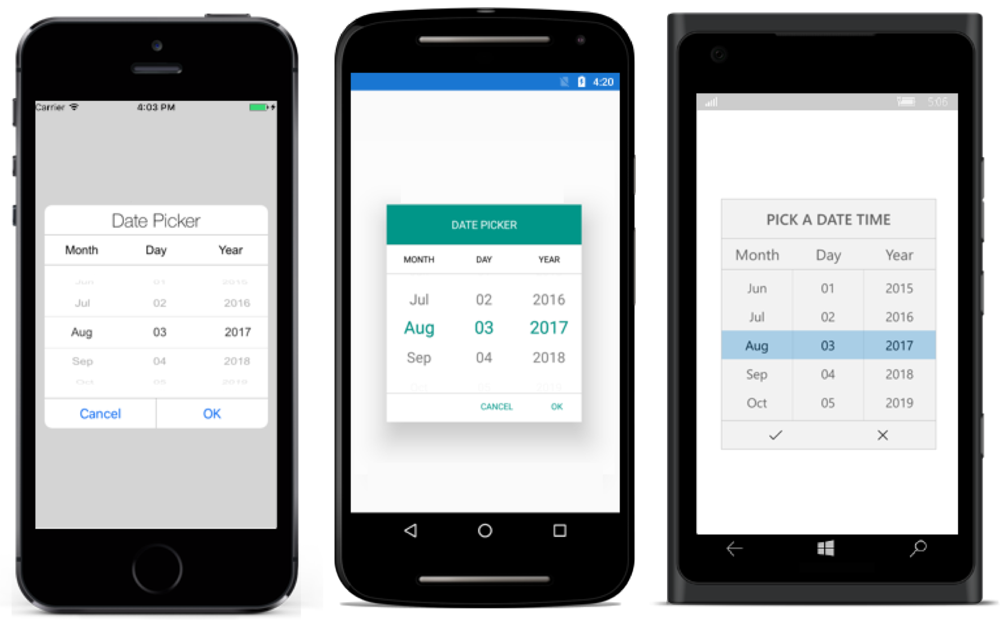

# Populating Items

This section explains about the ways of populating items for SfPicker control

## Binding Data Source

SfPicker is bound the external data source to display the data’s. It supports any collections that’s implements the `IEnumerable` interface.

To bind the data source in SfPicker, set the `SfPicker.ItemsSource` property as show in below code.




<?xml version="1.0" encoding="utf-8" ?>

<ContentPage

x:Class="GettingStarted.PickerSample"

xmlns="http://xamarin.com/schemas/2014/forms"

xmlns:x="http://schemas.microsoft.com/winfx/2009/xaml"

xmlns:local="clr-namespace:GettingStarted"

xmlns:syncfusion="clr-namespace:Syncfusion.SfPicker.XForms;assembly=Syncfusion.SfPicker.XForms">

<ContentPage.BindingContext>

<local:ColorInfo />

</ContentPage.BindingContext>

<ContentPage.Content>

<syncfusion:SfPicker

x:Name="picker"

HeaderText="Select a Color"

ItemsSource="{Binding Colors}" />

</ContentPage.Content>

</ContentPage>





ColorInfo info = new ColorInfo();

picker.ItemsSource = info.Colors;




## Multi-Column Items

The SfPicker automatically populate the items as Multi-Column based on the Data Source.

Collection of items can be created and assigned to a Collection and each item Collection is a column of SfPicker. 

The following code example illustrates about to populate Month, Day and Year values in each column of SfPicker.




public class DatesInfo

{

public ObservableCollection<object> Dates { get; set; }

//Day is the collection of day numbers

private ObservableCollection<string> Day { get; set; }

//Month is the collection of Month Names

private ObservableCollection<string> Month { get; set; }

//Year is the collection of Years from 1990 to 2050

private ObservableCollection<string> Year { get; set; }

public DatesInfo()

{

Dates = new ObservableCollection<object>();

//Populate Day, Month and Year values of each collection

PopulateDates();

//first column of SfPicker

Dates.Add(Day);

//Second column of SfPicker

Dates.Add(Month);

//Third column of SfPicker

Dates.Add(Year);

}

private void PopulateDates()

{

Day = new ObservableCollection<string>();

Month = new ObservableCollection<string>();

Year = new ObservableCollection<string>();

for (int i = 1; i <= 31; i++)

Day.Add(i.ToString());

for (int i = 1; i <= 12; i++)

Month.Add(System.Globalization.CultureInfo.CurrentCulture.DateTimeFormat.GetMonthName(i));

for (int i = 1990; i <= 2050; i++)

Year.Add(i.ToString());

}

}




<?xml version="1.0" encoding="utf-8" ?>

<ContentPage

x:Class="GettingStarted.PickerSample"

xmlns="http://xamarin.com/schemas/2014/forms"

xmlns:x="http://schemas.microsoft.com/winfx/2009/xaml"

xmlns:local="clr-namespace:GettingStarted"

xmlns:syncfusion="clr-namespace:Syncfusion.SfPicker.XForms;assembly=Syncfusion.SfPicker.XForms">

<ContentPage.BindingContext>

<local:DatesInfo />

</ContentPage.BindingContext>

<ContentPage.Content>

<syncfusion:SfPicker

x:Name="picker"

HeaderText="Date Picker" 

ItemsSource="{Binding Dates}" />

</ContentPage.Content>

</ContentPage>



MultiColumn sample from the following link

Sample link: [MultiColumn](http://www.syncfusion.com/downloads/support/directtrac/general/ze/MultiColumnSample798010799)

Screen shot for the above code.

## Set Items Colors and Font Attributes customization

In SfPicker, items text color and font both selected and unselected item of SfPicker control can be customized as shown below.  

### Selected Item Customization

##### Text Color 

Selected item text color can be customized by setting `SfPicker.SelectedItemTextColor` property of SfPicker.




<syncfusion:SfPicker

x:Name="picker"

ItemsSource="{Binding Colors}"

SelectedItemTextColor="Red" />





picker.SelectedItemTextColor = Color.Red;




##### Font 

This section explains about the customization of Selected Item Font.

###### 	FontFamily

Selected item text FontFamily can be customized by setting `SfPicker.SelectedItemFontFamily` property of SfPicker.




<syncfusion:SfPicker

x:Name="picker"

ItemsSource="{Binding Colors}"

SelectedItemFontFamily="Arial" />





picker.SelectedItemFontFamily = "Arial";




###### 	FontSize

Selected item text FontSize can be customized by setting `SfPicker.SelectedItemFontSize` property of SfPicker.




<syncfusion:SfPicker

x:Name="picker"

ItemsSource="{Binding Colors}"

SelectedItemFontSize="12" />





picker.SelectedItemFontSize = 12;




###### 	FontAttribute

Selected item text FontAttribute can be customized by setting `SfPicker.SelectedItemFontAttribute` property of SfPicker.




<syncfusion:SfPicker

x:Name="picker"

ItemsSource="{Binding Colors}"

SelectedItemFontAttribute="Bold" />





picker.SelectedItemFontAttribute = FontAttributes.Bold;




### UnSelected Item Customization

##### Text Color

Unselected item text color can be customized by setting `SfPicker.UnSelectedItemTextColor` property of SfPicker.




<syncfusion:SfPicker

x:Name="picker"

ItemsSource="{Binding Colors}"

UnSelectedItemTextColor="Gray" />





picker.UnSelectedItemTextColor = Color.Gray;




##### Font

This section explains about the customization of unselected items Font.

###### 	FontFamily

Unselected item text FontFamily can be customized by setting `SfPicker.UnSelectedItemFontFamily` property of SfPicker.




<syncfusion:SfPicker

x:Name="picker"

ItemsSource="{Binding Colors}"

UnSelectedItemFontFamily="Calibri" />



  

picker.UnSelectedItemFontFamily = "Calibri";




###### 	FontSize

Unselected item text FontSize can be customized by setting `SfPicker.UnSelectedItemFontSize` property of SfPicker.




<syncfusion:SfPicker

x:Name="picker"

ItemsSource="{Binding Colors}"

UnSelectedItemFontSize="11" />





picker.UnSelectedItemFontSize = 11;




###### 	FontAttribute

Unselected item text FontAttribute can be customized by setting `SfPicker.UnSelectedItemFontAttribute` property of SfPicker.




<syncfusion:SfPicker

x:Name="picker"

ItemsSource="{Binding Colors}"

UnSelectedItemFontAttribute="Italic" />





picker.UnSelectedItemFontAttribute = FontAttributes.Italic;




## Adding Custom View Items

In SfPicker, the items can be customized with custom view of each item by hooking `SfPicker.OnPickerItemLoaded` event and assign custom view in `PickerViewEventArgs.View` property to added the all the item with custom view.





    <Grid x:Name="main">

<Button 

x:Name="button" 

Text="Open Picker" 

Clicked="Handle_Clicked" 

HeightRequest="100" 

WidthRequest="200" 

VerticalOptions="Center" 

HorizontalOptions="Center" />

<picker:SfPicker 

x:Name="picker"
                    
HeaderHeight="40"
                    
ShowHeader="true"
                    
HeaderText="SfPicker Sample"
                    
ShowColumnHeader="True"
                    
ColumnHeaderHeight="46"
                    
PickerMode="Dialog"
                    
ItemsHeight="40"
                    
PickerHeight="350"
                    
PickerWidth="350"
                    
ShowFooter="True" 
                    
FooterHeight="46"/>

    </Grid>





public partial class MainPage : ContentPage
    
{

public MainPage()

{

InitializeComponent();

ObservableCollection<object> mainCollection = new ObservableCollection<object>();

ObservableCollection<object> column0 = new ObservableCollection<object>();
            
ObservableCollection<object> column1 = new ObservableCollection<object>();
            
ObservableCollection<string> columnHeader = new ObservableCollection<string>();
            
columnHeader.Add("Custom View");
            
columnHeader.Add("Labels");
            
picker.ColumnHeaderText = columnHeader;
            
picker.OnPickerItemLoaded+=HandlePickerViewEvent;
            
column0.Add("India.png");
            
column0.Add("UAE.png");
            
column0.Add("USA.png");
            
column0.Add("UK.png");
            
column0.Add("Germany.png");
            
column1.Add("TestingLabel 1");
            
column1.Add("TestingLabel 2"); 
            
column1.Add("TestingLabel 3");
            
column1.Add("TestingLabel 4");
            
column1.Add("TestingLabel 5");
            
mainCollection.Add(column0);
            
mainCollection.Add(column1);
            
picker.ItemsSource = mainCollection;
            
picker.Parent = main;

}

void HandlePickerViewEvent(object sender, Syncfusion.SfPicker.XForms.PickerViewEventArgs e)
       
{
           
if (e.Column == 0)
           
{

Country country = new Country() { Name = e.Item.ToString() };
                
e.View = new ItemView(country);
            
}

}

void Handle_Clicked(object sender, System.EventArgs e)
        
{

picker.IsOpen = true;
        
}
    
}




### CustomView Xaml





     <Grid>
         
<Grid.ColumnDefinitions>
        
        <ColumnDefinition Width="40" />
        <ColumnDefinition Width="*" />
    
</Grid.ColumnDefinitions>
    
<Image 

Source="{Binding Name}" 

Margin="8,0,0,0"  

VerticalOptions="Center"  />
    
<Label 

Text="{Binding Text}" 

Grid.Column="1" />

    </Grid>





public partial class ItemView : ContentView
    
{
       
Country countryName;
       
int i;
       
public ItemView(Country country)
        
{
           
i = 0;
           
countryName = country;
           
InitializeComponent();

foreach(char count in country.Name)
            
{
               
i++;   

}
          
countryName.Text = country.Name.Remove(i - 4);
           
this.BindingContext = countryName;
       
}
   
}

public class Country

{
        
public string Name { get; set; }
        
public string Text { get; set; }

}




Screen shot for the above code.

    

