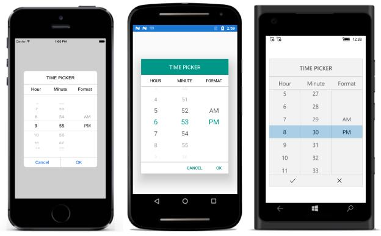

# Time Picker

We have demonstrated how to create CustomTimePicker using Picker control in the following steps.

**Step** **1** **:** We have created custom class named as “CustomTimePicker”. This class should inherit from SfPicker control.


public class CustomTimePicker: SfPicker

{

}



**Step** **2** **:** After that create four ObservableCollection with object type in CustomTimePicker class.

**Collection** **details** **:**

Time Collection, Minute Collection, Hour Collection and Format Collection.

Time Collection->We have added all the three collections.

Minute Collection -> We have added minutes from 0 to 59.

Hour Collection -> We have added hours from 1 to 12.

Format Collection -> We have added two format AM and PM.

The below code demonstrates Time collection creation.



public class CustomTimePicker: SfPicker
    {
        /// 

        /// Header API is holds the column name for every column in time picker
        /// 

        
        public ObservableCollection<string> Headers { get; set; }
        public CustomTimePicker()
        {
	       Headers = new ObservableCollection<string>();
            if (Device.OS == TargetPlatform.Android)
            {
                Headers.Add("HOUR");
                Headers.Add("MINUTE");
                Headers.Add("FORMAT");
            }
            else
            {
                Headers.Add("Hour");
                Headers.Add("Minute");
                Headers.Add("Format");
            }

                     //SfPicker header text
                     HeaderText = "TIME PICKER";	
		
                     // Column header text collection
                     this.ColumnHeaderText = Headers;	
         }
     }


**Step** **3** **:** We have defined each column headers “Hour”, “Minute” and “Format” using ColumnHeaderText property of SfPicker control. The below code demonstrates how to define header for each column of SfPicker control.


public class CustomTimePicker: SfPicker

{

/// 

/// Header API is holds the column name for every column in time picker

/// 

public ObservableCollection<string> Headers { get; set; }

public CustomTimePicker()

{

Headers = new ObservableCollection<string>();

if (Device.OS == TargetPlatform.Android)

{

Headers.Add("HOUR");

Headers.Add("MINUTE");

Headers.Add("FORMAT");

}

else

{

Headers.Add("Hour");

Headers.Add("Minute");

Headers.Add("Format");

}

//SfPicker header text

HeaderText = "TIME PICKER";

// Column header text collection

this.ColumnHeaderText = Headers;

}

}



**Step** **4** **:** Finally we have enabled SfPicker header, Column header and footer using ShowHeader ,ShowFooter and ShowColumnHeader properties.


public CustomTimePicker()

{

//Enable Footer of SfPicker

ShowFooter = true;

//Enable Header of SfPicker

ShowHeader = true;

//Enable Column Header of SfPicker

ShowColumnHeader = true;

}



**Step** **5** **:** We have added the CustomTimePicker control in main XAML page. Please refer the below code snippets.



<ContentPage xmlns="http://xamarin.com/schemas/2014/forms"

xmlns:x="http://schemas.microsoft.com/winfx/2009/xaml"

xmlns:local="clr-namespace:TimePicker"

x:Class="TimePicker.MainPage"

xmlns:picker="clr-namespace:Syncfusion.SfPicker.XForms;assembly=Syncfusion.SfPicker.XForms">

<!--Assign the TimePickerViewModel to BindingContext of Page-->

<ContentPage.BindingContext>

<local:TimePickerViewModel />

</ContentPage.BindingContext>

<Grid>

<Button

Clicked="Button_Clicked"

HeightRequest="50"

VerticalOptions="Center"

HorizontalOptions="Center"

Text="Show TimePicker"

WidthRequest="200" />

<!--Initialize the CustomTimePicker-->

<local:CustomTimePicker

x:Name="date"

ColumnHeaderHeight="40"

HorizontalOptions="Center"

VerticalOptions="Center"

PickerHeight="400"

PickerMode="Dialog"

PickerWidth="300" 

SelectedItem="{Binding SelectedTime,Mode=TwoWay}"/>

</Grid>

</ContentPage>




public partial class MainPage : ContentPage

{

public MainPage()

{

InitializeComponent();

}

private void Button_Clicked(object sender, EventArgs e)

{

//open picker dialog

date.IsOpen = !date.IsOpen;

}

}




Screen shot for the above codes.

We have attached TimePicker sample for reference. Please download the sample from the following link.

Sample link: [TimePicker](http://www.syncfusion.com/downloads/support/directtrac/general/ze/TimePicker-2129220014.zip)
