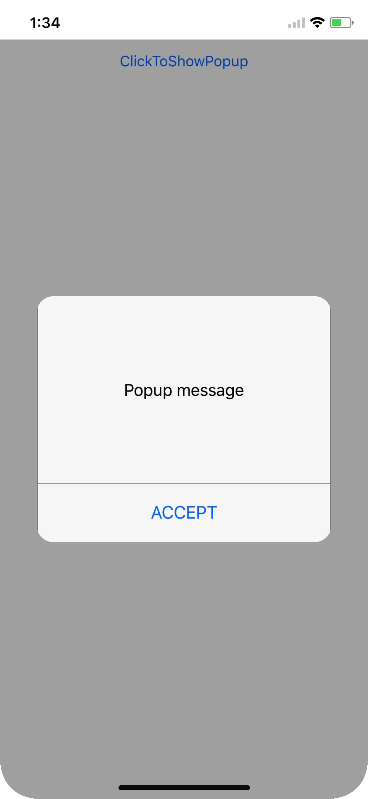
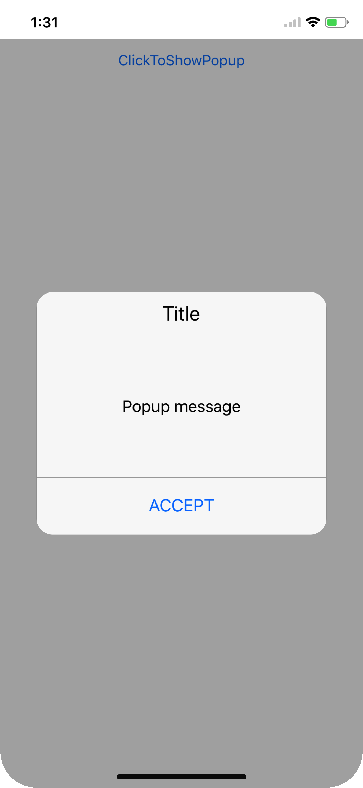

---
layout: post
title: How to | SfPopupLayout |Xamarin | Syncfusion
description: Explains achieving various requirements of user scenarios and customizations possible with the Xamarin.Forms PopupLayout.
platform: Xamarin
control: SfPopupLayout
documentation: ug
--- 
# How to 

## Hide the header in the SfPopupLayout

The SfPopupLayout allows hiding the header by using the [SfPopupLayout.PopupView.ShowHeader](https://help.syncfusion.com/cr/cref_files/xamarin/Syncfusion.SfPopupLayout.XForms~Syncfusion.XForms.PopupLayout.PopupView~ShowHeader.html) property. The default value of this property is `true`.





<sfPopup:SfPopupLayout x:Name="popUpLayout">
    <sfPopup:SfPopupLayout.PopupView>
        <sfPopup:PopupView ShowHeader="False"/>
    </sfPopup:SfPopupLayout.PopupView>
<sfPopup:SfPopupLayout>





//MainPage.cs

public MainPage()
{
    ....
    InitializeComponent();
    popupLayout.PopupView.ShowHeader = false;
    ....
}





## Hide the footer in SfPopupLayout

The SfPopupLayout allows hiding the footer by using the [SfPopupLayout.PopupView.ShowFooter](https://help.syncfusion.com/cr/cref_files/xamarin/Syncfusion.SfPopupLayout.XForms~Syncfusion.XForms.PopupLayout.PopupView~ShowFooter.html) property. The default value of this property is `true`.





<sfPopup:SfPopupLayout x:Name="popUpLayout">
    <sfPopup:SfPopupLayout.PopupView>
        <sfPopup:PopupView ShowFooter="False"/>
    </sfPopup:SfPopupLayout.PopupView>
<sfPopup:SfPopupLayout>





//MainPage.cs

public MainPage()
{
    ....
    InitializeComponent();
    popupLayout.PopupView.ShowFooter = false;
    ....
}





## Hide the Close icon in the SfPopupLayout 

The SfPopupLayout allows hiding the Close icon by using the [SfPopupLayout.PopupView.ShowCloseButton](https://help.syncfusion.com/cr/cref_files/xamarin/Syncfusion.SfPopupLayout.XForms~Syncfusion.XForms.PopupLayout.PopupView~ShowCloseButton.html) property. The default value of this property is `true`.





<sfPopup:SfPopupLayout x:Name="popUpLayout">
    <sfPopup:SfPopupLayout.PopupView>
        <sfPopup:PopupView ShowCloseButton="False"/>
    </sfPopup:SfPopupLayout.PopupView>
<sfPopup:SfPopupLayout>





//MainPage.cs

public MainPage()
{
    ....
    InitializeComponent();
    popupLayout.PopupView.ShowCloseButton = false;
    ....
}





## Load the SfPopupLayout in GridTappedEvent of the SfDataGrid

The SfPopupLayout allows pop-up in the grid tapped event of the SfDataGrid.





<?xml version="1.0" encoding="utf-8" ?>
<ContentPage xmlns="http://xamarin.com/schemas/2014/forms"
             xmlns:x="http://schemas.microsoft.com/winfx/2009/xaml"
             xmlns:local="clr-namespace:PopupSample"
             x:Class="PopupSample.MainPage"
             xmlns:sfPopup="clr-namespace:Syncfusion.XForms.PopupLayout;assembly=Syncfusion.SfPopupLayout.XForms"
             xmlns:sfDataGrid="clr-namespace:Syncfusion.SfDataGrid.XForms;assembly=Syncfusion.SfDataGrid.XForms" >
    <ContentPage.BindingContext>
        <local:ViewModel x:Name="viewModel" />
    </ContentPage.BindingContext>
    
    <sfPopup:SfPopupLayout x:Name="popupLayout" >
        <sfPopup:SfPopupLayout.Content>
            <sfDataGrid:SfDataGrid x:Name="dataGrid"
                                   ItemsSource="{Binding OrdersInfo}">
            </sfDataGrid:SfDataGrid>
       </sfPopup:SfPopupLayout.Content>
    </sfPopup:SfPopupLayout>
</ContentPage>





using Syncfusion.XForms.PopupLayout;

namespace GettingStarted
{
    public partial class MainPage : ContentPage
    {

        SfDataGrid dataGrid;
        ViewModel viewModel;
        SfPopupLayout popupLayout;
        public MainPage()
        {
            InitializeComponent();
            dataGrid = new SfDataGrid();
            viewModel = new ViewModel();
            dataGrid.ItemsSource = viewModel.OrdersInfo;
            popupLayout = new SfPopupLayout();
            popupLayout.Content = dataGrid;
            dataGrid.GridTapped += DataGrid_GridTapped;
            this.Content = popupLayout;
        }

        private async void DataGrid_GridTapped(object sender, Syncfusion.SfDataGrid.XForms.GridTappedEventArgs e)
        {
            await Task.Delay(100);

            // Popup is opened at the Grid tapped event
            popupLayout.Show();
        }
    }
}





## Load SfPopupLayout in Prism

Refer to the following code in which the SfPopupLayout is shown, if you navigate to the next and previous pages using button click.




// MainPage.xaml

<?xml version="1.0" encoding="utf-8" ?>
<ContentPage xmlns="http://xamarin.com/schemas/2014/forms"
             xmlns:x="http://schemas.microsoft.com/winfx/2009/xaml"
             xmlns:prism="clr-namespace:Prism.Mvvm;assembly=Prism.Forms"
             prism:ViewModelLocator.AutowireViewModel="True"
             x:Class="PrismUnitySfDataGrid.Views.MainPage"
             Title="MainPage"
             xmlns:sfPopup="clr-namespace:Syncfusion.XForms.PopupLayout;assembly=Syncfusion.SfPopupLayout.XForms">

    <ContentPage.Content>
        <StackLayout>
            <Button Text="GO TO NEXT PAGE" VerticalOptions="Center" HorizontalOptions="Center" Clicked="Button_Clicked" />
        </StackLayout>
    </ContentPage.Content>
</ContentPage>





// MainPage.cs

public partial class MainPage : ContentPage
{
    public MainPage()
    {
        InitializeComponent();
    }

    private void Button_Clicked(object sender, System.EventArgs e)
    {
        (this.BindingContext as MainPageViewModel).navigation_service.NavigateAsync("SecondPage");
    }
}






// SecondPage

<?xml version="1.0" encoding="utf-8" ?>
<ContentPage xmlns="http://xamarin.com/schemas/2014/forms"
             xmlns:x="http://schemas.microsoft.com/winfx/2009/xaml"
             xmlns:local="clr-namespace:PrismUnitySfDataGrid.ViewModels"
             xmlns:prism="clr-namespace:Prism.Mvvm;assembly=Prism.Forms"
             prism:ViewModelLocator.AutowireViewModel="True"
             x:Class="PrismUnitySfDataGrid.Views.SecondPage">

    <ContentPage.Content>
        <StackLayout>
            <Button Text="GO TO PREVIOUS PAGE" VerticalOptions="Center" HorizontalOptions="Center" Clicked="Button_Clicked" />
        </StackLayout>
    </ContentPage.Content>
</ContentPage>





// SecondPage.cs

public partial class SecondPage : ContentPage
{
    public SecondPage()
    {
        InitializeComponent();
    }

    private void Button_Clicked(object sender, System.EventArgs e)
    {
        (this.BindingContext as SecondPageViewModel).navigation_service.NavigateAsync("MainPage");
    }
}






// App.cs

public partial class App : PrismApplication
{
    public App(IPlatformInitializer initializer = null) : base(initializer) { }

    protected override void OnInitialized()
    {
        InitializeComponent();
        NavigationService.NavigateAsync("NavigationPage/MainPage");
    }

    protected override void RegisterTypes()
    {
        Container.RegisterTypeForNavigation<NavigationPage>();
        Container.RegisterTypeForNavigation<MainPage>();
        Container.RegisterTypeForNavigation<SecondPage>();
    }
}






// MainPageViewModel.cs

public class MainPageViewModel : INavigationAware
{
    private SfPopupLayout popupLayout;
    private DataTemplate templateView;
    private Button popupContent;
    public INavigationService navigation_service;

    public MainPageViewModel(INavigationService navigationService)
    {
        navigation_service = navigationService;
        popupLayout = new SfPopupLayout();
        // Set the required content template
        templateView = new DataTemplate(() =>
        {
            popupContent = new Button();
            popupContent.Text = "Click to change background";
            popupContent.BackgroundColor = Color.Yellow;
            popupContent.Clicked += (s, e) =>
            {
                popupContent.BackgroundColor = Color.Green;
            };
            return popupContent;
        });
        popupLayout.PopupView.ContentTemplate = templateView;
    }

    public void OnNavigatedFrom(NavigationParameters parameters)
    {
    }

    public void OnNavigatedTo(NavigationParameters parameters)
    {
        if (App.Current.MainPage != null)
        {
            popupLayout.Show(((App.Current.MainPage as NavigationPage).CurrentPage as ContentPage).Content);
        }
    }

    public void OnNavigatingTo(NavigationParameters parameters)
    {
    }
}






// SecondPageViewModel.cs

public class SecondPageViewModel : INavigationAware
{
    private SfPopupLayout popupLayout;
    private DataTemplate templateView;
    private Button popupContent;
    public INavigationService navigation_service;

    public SecondPageViewModel(INavigationService navigationService)
    {
        navigation_service = navigationService;
        popupLayout = new SfPopupLayout();
        // Set the required content template
        templateView = new DataTemplate(() =>
        {
            popupContent = new Button();
            popupContent.Text = "Click to change background";
            popupContent.BackgroundColor = Color.Yellow;
            popupContent.Clicked += (s, e) =>
            {
                popupContent.BackgroundColor = Color.Green;
            };
            return popupContent;
        });
        popupLayout.PopupView.ContentTemplate = templateView;
    }

    public void OnNavigatedFrom(NavigationParameters parameters)
    {
    }

    public void OnNavigatedTo(NavigationParameters parameters)
    {
        if (App.Current.MainPage != null)
        {
            popupLayout.Show(((App.Current.MainPage as NavigationPage).CurrentPage as ContentPage).Content);
        }
    }

    public void OnNavigatingTo(NavigationParameters parameters)
    {
    }
}



## Open SfPopupLayout in ItemTapped event of SfListView

The SfPopupLayout allows opening it in the ItemTapped event of the SfListView.





<?xml version="1.0" encoding="utf-8" ?>
<ContentPage xmlns="http://xamarin.com/schemas/2014/forms"
             xmlns:x="http://schemas.microsoft.com/winfx/2009/xaml"
             xmlns:local="clr-namespace:ListViewWithPopup"
             x:Class="ListViewWithPopup.MainPage"
             xmlns:sfListview="clr-namespace:Syncfusion.ListView.XForms;assembly=Syncfusion.SfListView.XForms"     
             xmlns:sfPopup="clr-namespace:Syncfusion.XForms.PopupLayout;assembly=Syncfusion.SfPopupLayout.XForms">

     <ContentPage.BindingContext>
        <local:ContactsViewModel x:Name="viewModel"/>
    </ContentPage.BindingContext>
    
    <sfPopup:SfPopupLayout x:Name="popupLayout">
        <sfPopup:SfPopupLayout.PopupView>
            <sfPopup:PopupView>
                <sfPopup:PopupView.ContentTemplate>
                    <DataTemplate>
                        <Label Text="A pop-up is a graphical user interface display area that 
                               suddenly appears in the foreground of the visual interface. 
                               Pop-up can be initiated by single or double tap or can simply 
                               be timed to occur. A pop-up window should be smaller than the 
                               background window or interface; otherwise, its a replacement 
                               interface."
                               BackgroundColor="White"
                               TextColor="Black"
                               />
                    </DataTemplate>
                </sfPopup:PopupView.ContentTemplate>
            </sfPopup:PopupView>
        </sfPopup:SfPopupLayout.PopupView>
        <sfPopup:SfPopupLayout.Content>
            <sfListview:SfListView  x:Name="listView"  ItemSpacing="5" 
                          ItemsSource="{Binding contactsInfo}" >
                <sfListview:SfListView.ItemTemplate>
                    <DataTemplate>
                        <ViewCell>
                            <ViewCell.View>
                                <Grid x:Name="grid" RowSpacing="1">
                                    <Grid.RowDefinitions>
                                        <RowDefinition Height="*" />
                                    </Grid.RowDefinitions>
                                    <Grid.ColumnDefinitions>
                                        <ColumnDefinition Width="50" />
                                        <ColumnDefinition Width="200" />
                                        <ColumnDefinition Width="50" />
                                    </Grid.ColumnDefinitions>

                                    <Image Source="{Binding ContactImage}"
                                       VerticalOptions="Center"
                                       HorizontalOptions="Center"
                                       HeightRequest="50"/>

                                    <Label Grid.Column="1"
                                        HorizontalTextAlignment="Center"
                                        LineBreakMode="NoWrap"
                                        Text="{Binding ContactName}" 
                                        FontSize="Medium" />

                                    <Image Grid.Column="2" 
                                       Source="{Binding ContactType}"
                                       VerticalOptions="End"
                                       HorizontalOptions="End"
                                       HeightRequest="50"/>
                                    
                                </Grid>
                            </ViewCell.View>
                        </ViewCell>
                    </DataTemplate>
                </sfListview:SfListView.ItemTemplate>
            </sfListview:SfListView>
        </sfPopup:SfPopupLayout.Content>
    </sfPopup:SfPopupLayout> 
 </ContentPage>





namespace ListViewWithPopup
{
    public partial class MainPage : ContentPage
    {
        public MainPage()
        {
            InitializeComponent();
            popupLayout.PopupView.ContentTemplate = new DataTemplate(() =>
            {
                Label popupContent = new Label();
                popupContent.Text = "A pop-up is a graphical user interface display area that suddenly appears in the foreground of the visual interface. Pop-up can be initiated by single or double tap or can simply be timed to occur. A pop-up window should be smaller than the background window or interface; otherwise, its a replacement interface.";
                return popupContent;
            });
            listView.ItemTapped += ListView_ItemTapped;
        }

        private void ListView_ItemTapped(object sender, Syncfusion.ListView.XForms.ItemTappedEventArgs e)
        {
            popupLayout.Show();
        }
    }
}





## Show ListView as a pop-up

The SfPopupLayout allows loading the SfListView as a content of the pop-up. You have to set `WidthRequest` and `HeightRequest` properties for loading SfListView in the SfPopupLayout. 



<ContentPage xmlns="http://xamarin.com/schemas/2014/forms"
             xmlns:x="http://schemas.microsoft.com/winfx/2009/xaml"
             x:Class="ListViewWithPopup.MainPage"           
             xmlns:sfPopup="clr-namespace:Syncfusion.XForms.PopupLayout;assembly=Syncfusion.SfPopupLayout.XForms">
    <sfPopup:SfPopupLayout x:Name="popupLayout">
        <sfPopup:SfPopupLayout.Content>
            <StackLayout x:Name="mainLayout">
                <Button x:Name="clickToShowPopup" Text="CLICK TO SHOW POPUP" VerticalOptions="Start" HorizontalOptions="FillAndExpand"    />
            </StackLayout>
        </sfPopup:SfPopupLayout.Content>
    </sfPopup:SfPopupLayout> 
</ContentPage>




namespace ListViewWithPopup
{
    public partial class MainPage : ContentPage
    {
       private ListViewPage listView;
       public MainPage()
        {
            InitializeComponent();
            listView = new ListViewPage();
            popupLayout.PopupView.ContentTemplate = new DataTemplate(() =>
            {
                return listView.Content;
            });
            clickToShowPopup.Clicked += ClickToShowPopup_Clicked;
         }

        private void ClickToShowPopup_Clicked(object sender, EventArgs e)
        {
            popupLayout.Show();
        }
    }
}



## Display popup when interacting with a switch

[SfPopupLayout.IsOpen](https://help.syncfusion.com/cr/cref_files/xamarin/sfpopuplayout/Syncfusion.SfPopupLayout.XForms~Syncfusion.XForms.PopupLayout.SfPopupLayout~IsOpen.html) is a bindable property and hence can be binded to any property and based on its value the popup will open or close. In the below code example, we have binded the `IsOpen` property with the `IsToggled` property of the the switch and the popup will be opened or closed as the switch toggles.





//MainPage.xaml

<sfpopup:SfPopupLayout IsOpen="{Binding Source={x:Reference popupSwitch}, Path=IsToggled}">
    <sfpopup:SfPopupLayout.Content>
        <StackLayout Orientation="Horizontal">
            <Label Text="On the switch to show popup" />
            <Switch x:Name="popupSwitch" IsToggled="False" VerticalOptions="Start" />
        </StackLayout>
    </sfpopup:SfPopupLayout.Content>
</sfpopup:SfPopupLayout>





## Display popup in MVVM

SfPopup can be used in MVVM architecture applications easily. In the below example [SfPopupLayout.IsOpen](https://help.syncfusion.com/cr/cref_files/xamarin/sfpopuplayout/Syncfusion.SfPopupLayout.XForms~Syncfusion.XForms.PopupLayout.SfPopupLayout~IsOpen.html) property is binded to a property in the ViewModel based on which the popup is opened or closed. Refer the below code example to display popup in MVVM.

In the below code snippet, note that the Binding context is set for the page and the property (DisplayPopup) of the ViewModel is binded to the [SfPopupLayout.IsOpen](https://help.syncfusion.com/cr/cref_files/xamarin/sfpopuplayout/Syncfusion.SfPopupLayout.XForms~Syncfusion.XForms.PopupLayout.SfPopupLayout~IsOpen.html).





//MainPage.xaml

<ContentPage.BindingContext>
    <local:ViewModel />
</ContentPage.BindingContext>

<sfpopup:SfPopupLayout x:Name="popup" IsOpen="{Binding DisplayPopup}">
    <sfpopup:SfPopupLayout.Content>
        <StackLayout x:Name="rootView">
            <Button x:Name="isOpenButton" Text="Click to open popup" Command="{Binding OpenPopupCommand}"/>
        </StackLayout>
    </sfpopup:SfPopupLayout.Content>
</sfpopup:SfPopupLayout>





// ViewModel.cs

public class ViewModel : INotifyPropertyChanged
{
    private bool displayPopup;

    public ICommand OpenPopupCommand { get; set; }

    public bool DisplayPopup
    {
        get
        {
            return displayPopup;
        }
        set
        {
            displayPopup = value;
            RaisePropertyChanged("DisplayPopup");
        }
    }

    public ViewModel()
    {
        OpenPopupCommand = new Command(OpenPopup);
    }

    private void OpenPopup()
    {
        DisplayPopup = true;
    }

    #region INotifyPropertyChanged

    public event PropertyChangedEventHandler PropertyChanged;

    private void RaisePropertyChanged(string propertyName)
    {
        if(this.PropertyChanged != null)
        {
            this.PropertyChanged(this, new PropertyChangedEventArgs(propertyName));
        }
    }

    #endregion

}




