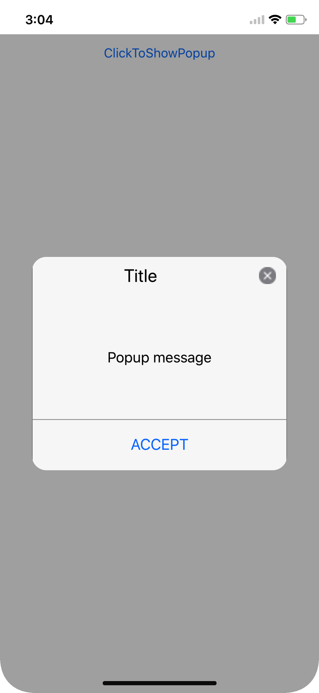
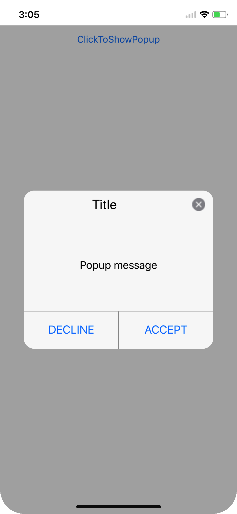
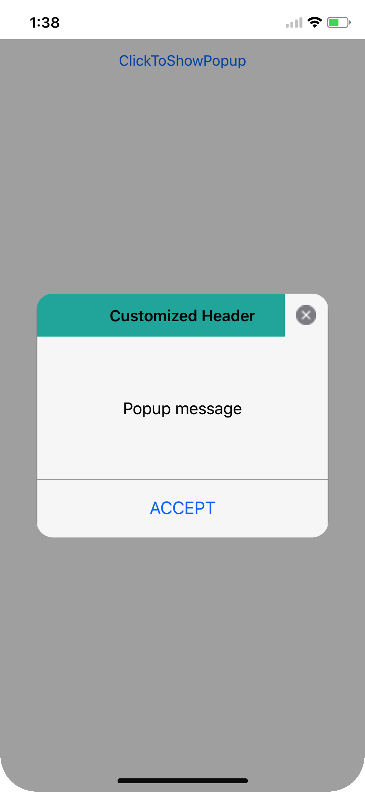
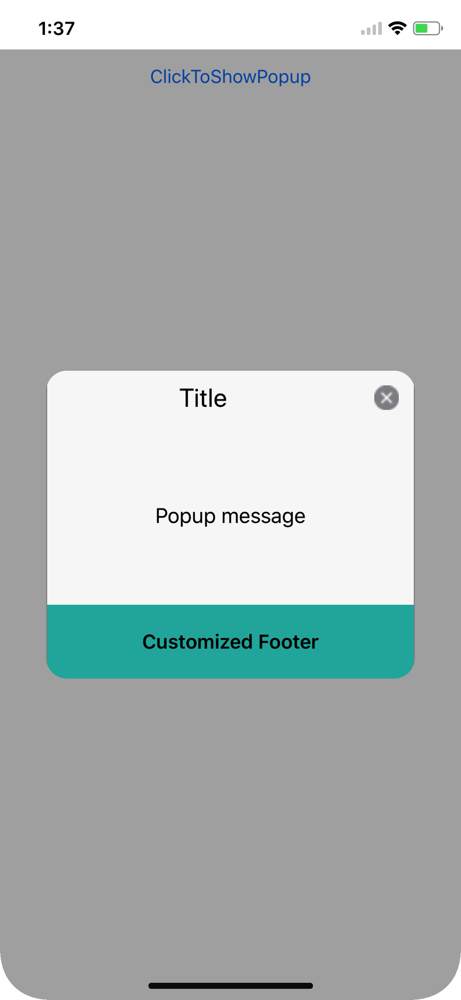

---
layout: post
title: Popup Layouts | SfPopupLayout |Xamarin | Syncfusion
description: Layouts in SfPopupLayout
platform: Xamarin
control: SfPopupLayout
documentation: ug
--- 

# Layout Customizations

The SfPopupLayout supports two types of [SfPopupLayout.PopupView.AppearanceMode](https://help.syncfusion.com/cr/cref_files/xamarin/Syncfusion.SfPopupLayout.XForms~Syncfusion.XForms.PopupLayout.AppearanceMode.html). By default, the `AppearanceMode.OneButton` is set. You can change the appearance by using the `SfPopupLayout.PopupView.AppearanceMode` property.

The two different appearance modes in the SfPopupLayout are as follows:

<table>
<tr>
<th> Modes </th>
<th> Description </th>
</tr>
<tr>
<td> {{'[OneButton](https://help.syncfusion.com/cr/cref_files/xamarin/Syncfusion.SfPopupLayout.XForms~Syncfusion.XForms.PopupLayout.AppearanceMode.html)'| markdownify }} </td>
<td> Shows the SfPopupLayout with one button in the footer view. This is the default value.</td>
</tr>
<tr>
<td> {{'[TwoButton](https://help.syncfusion.com/cr/cref_files/xamarin/Syncfusion.SfPopupLayout.XForms~Syncfusion.XForms.PopupLayout.AppearanceMode.html)'| markdownify }} </td>
<td> Shows the SfPopupLayout with two buttons in the footer view.</td>
</tr>
</table>

## Pop-up with one button in the footer

In the following code example, set the `SfPopupLayout.PopupView.AppearanceMode` property as `OneButton` which displays only the Accept button in the footer view.


<?xml version="1.0" encoding="utf-8" ?>
<ContentPage xmlns="http://xamarin.com/schemas/2014/forms"
             xmlns:x="http://schemas.microsoft.com/winfx/2009/xaml"
             xmlns:local="clr-namespace:GettingStarted"
             x:Class="GettingStarted.MainPage" 
             Padding="0,40,0,0"
             xmlns:sfPopup="clr-namespace:Syncfusion.XForms.PopupLayout;assembly=Syncfusion.SfPopupLayout.XForms">
<sfPopup:SfPopupLayout x:Name="popUpLayout">
   <sfPopup:SfPopupLayout.PopupView>
            <sfPopup:PopupView AppearanceMode="OneButton" />
   </sfPopup:SfPopupLayout.PopupView>
   <sfPopup:SfPopupLayout.Content>
     <StackLayout x:Name="layout">
       <Button x:Name="clickToShowPopup" Text="ClickToShowPopup" VerticalOptions="Start" HorizontalOptions="FillAndExpand" />
     </StackLayout>
    </sfPopup:SfPopupLayout.Content>
  </sfPopup:SfPopupLayout>
</ContentPage>




using Syncfusion.XForms.PopupLayout;

namespace GettingStarted
{
    public partial class MainPage : ContentPage
    {
        public MainPage()
        {
            InitializeComponent();
           
            // Setting the AppearanceMode as OneButton
            popupLayout.PopupView.AppearanceMode = AppearanceMode.OneButton;
            clickToShowPopup.Clicked += ClickToShowPopup_Clicked;
        }

        private void ClickToShowPopup_Clicked(object sender, EventArgs e)
        {
             popupLayout.Show();
        }
    }
}


Executing the above codes renders the following output in iOS, Android and Windows Phone devices respectively.

## Pop-up with two buttons in the footer

In the following code example, set the `SfPopupLayout.PopupView.AppearanceMode` property as `TwoButton` which displays both Accept button and Decline button in the footer view.


<?xml version="1.0" encoding="utf-8" ?>
<ContentPage xmlns="http://xamarin.com/schemas/2014/forms"
             xmlns:x="http://schemas.microsoft.com/winfx/2009/xaml"
             xmlns:local="clr-namespace:GettingStarted"
             x:Class="GettingStarted.MainPage" 
             Padding="0,40,0,0"
             xmlns:sfPopup="clr-namespace:Syncfusion.XForms.PopupLayout;assembly=Syncfusion.SfPopupLayout.XForms">
<sfPopup:SfPopupLayout x:Name="popUpLayout">
    <sfPopup:SfPopupLayout.PopupView>
            <sfPopup:PopupView AppearanceMode="TwoButton" />
    </sfPopup:SfPopupLayout.PopupView>
   <sfPopup:SfPopupLayout.Content>
     <StackLayout x:Name="layout">
       <Button x:Name="clickToShowPopup" Text="ClickToShowPopup" VerticalOptions="Start" HorizontalOptions="FillAndExpand" />
     </StackLayout>
    </sfPopup:SfPopupLayout.Content>
  </sfPopup:SfPopupLayout>
</ContentPage>




using Syncfusion.XForms.PopupLayout;

namespace GettingStarted
{
    public partial class MainPage : ContentPage
    {
        public MainPage()
        {
            InitializeComponent();
          
            // Setting the AppearanceMode as TwoButton
            popupLayout.PopupView.AppearanceMode = AppearanceMode.TwoButton;        
            clickToShowPopup.Clicked += ClickToShowPopup_Clicked;
        }

        private void ClickToShowPopup_Clicked(object sender, EventArgs e)
        {
             popupLayout.Show();
        }
    }
}


Executing the above codes renders the following output in iOS, Android and Windows Phone devices respectively.

## Customizing pop-up layouts
 
You can customize the entire view of the pop-up by loading the templates or custom views for the header, body and footer.

### Header customization

Any view can be added as the header content using the [SfPopupLayout.PopupView.HeaderTemplate](https://help.syncfusion.com/cr/cref_files/xamarin/Syncfusion.SfPopupLayout.XForms~Syncfusion.XForms.PopupLayout.PopupView~HeaderTemplate.html) property to refresh it. Refer to the following code example in which a label is added as a header content.





<?xml version="1.0" encoding="utf-8" ?>
<ContentPage xmlns="http://xamarin.com/schemas/2014/forms"
             xmlns:x="http://schemas.microsoft.com/winfx/2009/xaml"
             xmlns:local="clr-namespace:GettingStarted"
             x:Class="GettingStarted.MainPage" 
             Padding="0,40,0,0"
             xmlns:sfPopup="clr-namespace:Syncfusion.XForms.PopupLayout;assembly=Syncfusion.SfPopupLayout.XForms">
 <sfPopup:SfPopupLayout x:Name="popUpLayout">
  <sfPopup:SfPopupLayout.PopupView>
        <sfPopup:PopupView ShowCloseButton="False">
            <sfPopup:PopupView.HeaderTemplate>
                <DataTemplate>
                    <Label Text="Customized Header" 
                               FontAttributes="Bold"
                               BackgroundColor="Blue"
                               FontSize="16"
                               HorizontalTextAlignment="Center"
                               VerticalTextAlignment="Center"
                               />
                </DataTemplate>
            </sfPopup:PopupView.HeaderTemplate>
        </sfPopup:PopupView>
    </sfPopup:SfPopupLayout.PopupView>
   <sfPopup:SfPopupLayout.Content>
     <StackLayout x:Name="layout">
       <Button x:Name="clickToShowPopup" Text="ClickToShowPopup" VerticalOptions="Start" HorizontalOptions="FillAndExpand" />
     </StackLayout>
    </sfPopup:SfPopupLayout.Content>
  </sfPopup:SfPopupLayout>
</ContentPage>





using Syncfusion.XForms.PopupLayout;

namespace GettingStarted
{
    public partial class MainPage : ContentPage
    {
        DataTemplate headerTemplateView;
        Label headerContent;

        public MainPage()
        {
            InitializeComponent();
            clickToShowPopup.Clicked += ClickToShowPopup_Clicked;
            headerTemplateView = new DataTemplate(() =>
            {
                headerContent = new Label();
                headerContent.Text = "Customized Header";
                headerContent.FontAttributes = FontAttributes.Bold;
                headerContent.BackgroundColor = Color.FromRgb(0, 0, 225);
                headerContent.FontSize = 16;
                headerContent.HorizontalTextAlignment = TextAlignment.Center;
                headerContent.VerticalTextAlignment = TextAlignment.Center;
                return headerContent;
            });

            popupLayout.PopupView.ShowCloseButton = false;
            // Adding HeaderTemplate of the SfPopupLayout
            popupLayout.PopupView.HeaderTemplate = headerTemplateView;
        }

        private void ClickToShowPopup_Clicked(object sender, EventArgs e)
        {
            popupLayout.Show();
        }
    }
}





Executing the above codes renders the following output in iOS, Android and Windows Phone devices respectively.

### Footer customization

Any view can be added as the footer content using the [SfPopupLayout.PopupView.FooterTemplate](https://help.syncfusion.com/cr/cref_files/xamarin/Syncfusion.SfPopupLayout.XForms~Syncfusion.XForms.PopupLayout.PopupView~ContentTemplate.html) property to refresh it. Refer to the following code example in which a label is added as a footer content.





<?xml version="1.0" encoding="utf-8" ?>
<ContentPage xmlns="http://xamarin.com/schemas/2014/forms"
             xmlns:x="http://schemas.microsoft.com/winfx/2009/xaml"
             xmlns:local="clr-namespace:GettingStarted"
             x:Class="GettingStarted.MainPage" 
             Padding="0,40,0,0"
             xmlns:sfPopup="clr-namespace:Syncfusion.XForms.PopupLayout;assembly=Syncfusion.SfPopupLayout.XForms">
 <sfPopup:SfPopupLayout x:Name="popUpLayout">
    <sfPopup:SfPopupLayout.PopupView>
        <sfPopup:PopupView>
            <sfPopup:PopupView.FooterTemplate>
                <DataTemplate>
                    <Label Text="Customized Footer" 
                               FontAttributes="Bold"
                               BackgroundColor="Blue"
                               FontSize="16"
                               HorizontalTextAlignment="Center"
                               VerticalTextAlignment="Center"
                               />
                </DataTemplate>
            </sfPopup:PopupView.FooterTemplate>
        </sfPopup:PopupView>
    </sfPopup:SfPopupLayout.PopupView>
   <sfPopup:SfPopupLayout.Content>
     <StackLayout x:Name="layout">
       <Button x:Name="clickToShowPopup" Text="ClickToShowPopup" VerticalOptions="Start" HorizontalOptions="FillAndExpand" />
     </StackLayout>
    </sfPopup:SfPopupLayout.Content>
  </sfPopup:SfPopupLayout>
</ContentPage>





using Syncfusion.XForms.PopupLayout;

namespace GettingStarted
{
    public partial class MainPage : ContentPage
    {
        DataTemplate footerTemplateView;
        Label footerContent;

        public MainPage()
        {
            InitializeComponent();
            clickToShowPopup.Clicked += ClickToShowPopup_Clicked;
            footerTemplateView = new DataTemplate(() =>
            {
                footerContent = new Label();
                footerContent.Text = "Customized Footer";
                footerContent.FontAttributes = FontAttributes.Bold;
                footerContent.BackgroundColor = Color.FromRgb(0, 0, 225);
                footerContent.FontSize = 16;
                footerContent.HorizontalTextAlignment = TextAlignment.Center;
                footerContent.VerticalTextAlignment = TextAlignment.Center;
                return footerContent;
            });

            // Adding FooterTemplate of the SfPopupLayout
            popupLayout.PopupView.FooterTemplate = footerTemplateView;
        }

        private void ClickToShowPopup_Clicked(object sender, EventArgs e)
        {
            popupLayout.Show();
        }
    }
}





Executing the above codes renders the following output in iOS, Android and Windows Phone devices respectively.

## Styles

The SfPopupLayout applies style to all of its elements by using the [SfPopupLayout.PopupView.PopupStyle](https://help.syncfusion.com/cr/cref_files/xamarin/Syncfusion.SfPopupLayout.XForms~Syncfusion.XForms.PopupLayout.PopupView~PopupStyle.html) property.

### Customizing header elements

The SfPopupLayout allows customizing the header elements with various header customizations as follows:

<table>
<tr>
<th> Property </th>
<th> Description </th>
</tr>
<tr>
<td> {{'[SfPopupLayout.PopupView.PopupStyle.HeaderBackgroundColor](https://help.syncfusion.com/cr/cref_files/xamarin/Syncfusion.SfPopupLayout.XForms~Syncfusion.XForms.PopupLayout.PopupStyle~HeaderBackgroundColor.html)'| markdownify }} </td>
<td>  Gets or sets the background color for the header.</td>
</tr>
<tr>
<td> {{'[SfPopupLayout.PopupView.PopupStyle.HeaderFontAttribute](https://help.syncfusion.com/cr/cref_files/xamarin/Syncfusion.SfPopupLayout.XForms~Syncfusion.XForms.PopupLayout.PopupStyle~HeaderFontAttribute.html)'| markdownify }} </td>
<td>  Gets or sets the font attribute for the header title.</td>
</tr>
<tr>
<td> {{'[SfPopupLayout.PopupView.PopupStyle.HeaderFontFamily](https://help.syncfusion.com/cr/cref_files/xamarin/Syncfusion.SfPopupLayout.XForms~Syncfusion.XForms.PopupLayout.PopupStyle~HeaderFontFamily.html)'| markdownify }} </td>
<td>  Gets or sets the font style for the header title.</td>
</tr>
<tr>
<td> {{'[SfPopupLayout.PopupView.PopupStyle.HeaderFontSize](https://help.syncfusion.com/cr/cref_files/xamarin/Syncfusion.SfPopupLayout.XForms~Syncfusion.XForms.PopupLayout.PopupStyle~HeaderFontSize.html)'| markdownify }} </td>
<td> Gets or sets the font size for the header title.</td>
</tr>
<tr>
<td> {{'[SfPopupLayout.PopupView.PopupStyle.HeaderTextAlignment](https://help.syncfusion.com/cr/cref_files/xamarin/Syncfusion.SfPopupLayout.XForms~Syncfusion.XForms.PopupLayout.PopupStyle~HeaderTextAlignment.html)'| markdownify }} </td>
<td>  Gets or sets the text alignment for the header.</td>
</tr>
<tr>
<td> {{'[SfPopupLayout.PopupView.PopupStyle.HeaderTextColor](https://help.syncfusion.com/cr/cref_files/xamarin/Syncfusion.SfPopupLayout.XForms~Syncfusion.XForms.PopupLayout.PopupStyle~HeaderTextColor.html)'| markdownify }} </td>
<td>  Gets or sets the text color to be applied for the header title.</td>
</tr>
</table>

Refer to the following code example for customizing the header elements.





<sfPopup:SfPopupLayout x:Name="popUpLayout">
    <sfPopup:SfPopupLayout.PopupView>
        <sfPopup:PopupView>
            <sfPopup:PopupView.PopupStyle>
                <sfPopup:PopupStyle HeaderBackgroundColor="DimGray"
                                    HeaderFontAttribute="Bold"
                                    HeaderFontFamily="Helvetica-Bold"
                                    HeaderFontSize="25"
                                    HeaderTextAlignment="Center"
                                    HeaderTextColor="White"/>
            </sfPopup:PopupView.PopupStyle>
        </sfPopup:PopupView>
    </sfPopup:SfPopupLayout.PopupView>
</sfPopup:SfPopupLayout>





//MainPage.cs

public MainPage()
{
    ....
    InitializeComponent();
    popupLayout.PopupView.PopupStyle.HeaderBackgroundColor = Color.FromRgb(105,105,105);
    popupLayout.PopupView.PopupStyle.HeaderFontAttribute = FontAttributes.Bold;
    popupLayout.PopupView.PopupStyle.HeaderFontFamily = "Helvetica-Bold";
    popupLayout.PopupView.PopupStyle.HeaderFontSize = 25;
    popupLayout.PopupView.PopupStyle.HeaderTextAlignment = TextAlignment.Center;
    popupLayout.PopupView.PopupStyle.HeaderTextColor = Color.White;
    ....
}





Executing the above codes renders the following output in iOS, Android and Windows Phone devices respectively.

### Customizing footer elements

The SfPopupLayout allows customizing the footer elements with various footer customizations as follows:

<table>
<tr>
<th> Property </th>
<th> Description </th>
</tr>
<tr>
<td> {{'[SfPopupLayout.PopupView.PopupStyle.FooterBackgroundColor](https://help.syncfusion.com/cr/cref_files/xamarin/Syncfusion.SfPopupLayout.XForms~Syncfusion.XForms.PopupLayout.PopupStyle~FooterBackgroundColor.html)'| markdownify }} </td>
<td>  Gets or sets the background color for the footer.</td>
</tr>
<tr>
<td> {{'[SfPopupLayout.PopupView.PopupStyle.AcceptButtonBackgroundColor](https://help.syncfusion.com/cr/cref_files/xamarin/Syncfusion.SfPopupLayout.XForms~Syncfusion.XForms.PopupLayout.PopupStyle~AcceptButtonBackgroundColor.html)'| markdownify }} </td>
<td>  Gets or sets the background color for the Accept button in the footer.</td>
</tr>
<tr>
<td> {{'[SfPopupLayout.PopupView.PopupStyle.AcceptButtonTextColor](https://help.syncfusion.com/cr/cref_files/xamarin/Syncfusion.SfPopupLayout.XForms~Syncfusion.XForms.PopupLayout.PopupStyle~AcceptButtonTextColor.html)'| markdownify }} </td>
<td>  Gets or sets the foreground color for the Accept button in the footer.</td>
</tr>
<tr>
<td> {{'[SfPopupLayout.PopupView.PopupStyle.DeclineButtonBackgroundColor](https://help.syncfusion.com/cr/cref_files/xamarin/Syncfusion.SfPopupLayout.XForms~Syncfusion.XForms.PopupLayout.PopupStyle~DeclineButtonBackgroundColor.html)'| markdownify }} </td>
<td> Gets or sets the background color for the Decline button in the footer.</td>
</tr>
<tr>
<td> {{'[SfPopupLayout.PopupView.PopupStyle.DeclineButtonTextColor](https://help.syncfusion.com/cr/cref_files/xamarin/Syncfusion.SfPopupLayout.XForms~Syncfusion.XForms.PopupLayout.PopupStyle~DeclineButtonTextColor.html)'| markdownify }} </td>
<td>  Gets or sets the foreground color for the Decline button in the footer.</td>
</tr>
</table>

Refer to the following code example for customizing the header elements.





<sfPopup:SfPopupLayout x:Name="popUpLayout">
    <sfPopup:SfPopupLayout.PopupView>
        <sfPopup:PopupView AppearanceMode="TwoButton">
                <sfPopup:PopupView.PopupStyle>
                    <sfPopup:PopupStyle FooterBackgroundColor="LightGray"
                                        AcceptButtonBackgroundColor ="DimGray"
                                        AcceptButtonTextColor="White"
                                        DeclineButtonBackgroundColor="DimGray"
                                        DeclineButtonTextColor="White"
                                        />
                </sfPopup:PopupView.PopupStyle>
            </sfPopup:PopupView>
    </sfPopup:SfPopupLayout.PopupView>
</sfPopup:SfPopupLayout>





//MainPage.cs

public MainPage()
{
    ....
    InitializeComponent();

    // Setting the AppearanceMode as TwoButton
    popupLayout.PopupView.AppearanceMode = Syncfusion.XForms.PopupLayout.AppearanceMode.TwoButton;

    // Footer customization
    popupLayout.PopupView.PopupStyle.FooterBackgroundColor = Color.LightGray;
    popupLayout.PopupView.PopupStyle.AcceptButtonBackgroundColor = Color.FromRgb(105, 105, 105);
    popupLayout.PopupView.PopupStyle.AcceptButtonTextColor = Color.White;
    popupLayout.PopupView.PopupStyle.DeclineButtonBackgroundColor = Color.FromRgb(105, 105, 105);
    popupLayout.PopupView.PopupStyle.DeclineButtonTextColor = Color.White;
    ....
}





Executing the above codes renders the following output in iOS, Android and Windows Phone devices respectively.

## Border customization

The SfPopupLayout allows customizing the border appearance with various border customizations as follows:

<table>
<tr>
<th> Property </th>
<th> Description </th>
</tr>
<tr>
<td> {{'[SfPopupLayout.PopupView.PopupStyle.BorderColor](https://help.syncfusion.com/cr/cref_files/xamarin/Syncfusion.SfPopupLayout.XForms~Syncfusion.XForms.PopupLayout.PopupStyle~BorderColor.html)'| markdownify }} </td>
<td>  Gets or sets the border color for the PopupView.</td>
</tr>
<tr>
<td> {{'[SfPopupLayout.PopupView.PopupStyle.BorderThickness](https://help.syncfusion.com/cr/cref_files/xamarin/Syncfusion.SfPopupLayout.XForms~Syncfusion.XForms.PopupLayout.PopupStyle~BorderThickness.html)'| markdownify }} </td>
<td>  Gets or sets the border thickness for the PopupView.</td>
</tr>
<tr>
<td> {{'[SfPopupLayout.PopupView.PopupStyle.CornerRadius](https://help.syncfusion.com/cr/cref_files/xamarin/Syncfusion.SfPopupLayout.XForms~Syncfusion.XForms.PopupLayout.PopupStyle~CornerRadius.html)'| markdownify }} </td>
<td>  Gets or sets the corner radius for the PopupView.</td>
</tr>
</table>

Refer to the following code example for customizing the border elements.





<sfPopup:SfPopupLayout x:Name="popUpLayout">
    <sfPopup:SfPopupLayout.PopupView>
        <sfPopup:PopupView>
            <sfPopup:PopupView.PopupStyle>
                <sfPopup:PopupStyle BorderColor="LightBlue"
                                    BorderThickness="3"
                                    CornerRadius="5"
                                    />
            </sfPopup:PopupView.PopupStyle>
        </sfPopup:PopupView>
    </sfPopup:SfPopupLayout.PopupView>
<sfPopup:SfPopupLayout>





//MainPage.cs

public MainPage()
{
    ....
    InitializeComponent();
    popupLayout.PopupView.PopupStyle.BorderColor = Color.LightBlue;
    popupLayout.PopupView.PopupStyle.BorderThickness = 3;
    popupLayout.PopupView.PopupStyle.CornerRadius = 5;
    ....
}





Executing the above codes renders the following output in iOS, Android and Windows Phone devices respectively.

