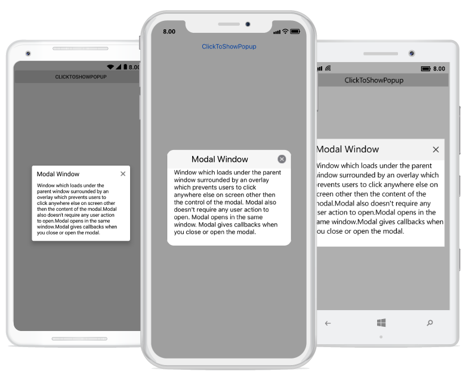

---
layout: post
title: Modal Window Popup | SfPopupLayout |Xamarin| Syncfusion
description: Modal Window Popup with SfPopupLayout
platform: Xamarin
control: SfPopupLayout
documentation: ug
--- 

# Modal Window Pop-up

You can use pop-up layout as modal window by using the built-in Close icon and the [SfPopupLayout.StaysOpen](https://help.syncfusion.com/cr/cref_files/xamarin/Syncfusion.SfPopupLayout.XForms~Syncfusion.XForms.PopupLayout.SfPopupLayout~StaysOpenProperty.html) property prevents interaction with your application until you close the window.

`Modal`: Window loads under the parent window surrounded by an overlay which prevents clicking anywhere else on the screen apart from the control of the modal.

Modal does not require any action to open. It opens in the same window and gives callbacks when closing or opening the window.

Refer to the following code example in which the pop-up will close only if you click on Close icon.


<?xml version="1.0" encoding="utf-8" ?>
<ContentPage xmlns="http://xamarin.com/schemas/2014/forms"
             xmlns:x="http://schemas.microsoft.com/winfx/2009/xaml"
             xmlns:local="clr-namespace:GettingStarted"
             x:Class="GettingStarted.MainPage" 
             Padding="0,40,0,0"
             xmlns:sfPopup="clr-namespace:Syncfusion.XForms.PopupLayout;assembly=Syncfusion.SfPopupLayout.XForms">
 <sfPopup:SfPopupLayout x:Name="popUpLayout">
   <sfPopup:SfPopupLayout.Content>
     <StackLayout x:Name="mainLayout">
       <Button x:Name="clickToShowPopup" Text="ClickToShowPopup" VerticalOptions="Start" HorizontalOptions="FillAndExpand" />
     </StackLayout>
    </sfPopup:SfPopupLayout.Content>
  </sfPopup:SfPopupLayout>
</ContentPage>





using Syncfusion.XForms.PopupLayout;

namespace GettingStarted
{
    public partial class MainPage : ContentPage
    {
        DataTemplate contentTemplateView;
        Label popupContent;

        public MainPage()
        {
            InitializeComponent();
            contentTemplateView = new DataTemplate(() =>
            {
                popupContent = new Label();
                popupContent.Text = "Window loads under the parent window surrounded by an overlay which prevents clicking anywhere else on the screen apart from the control of the modal. Modal opens in the same window. It also does not require any user action to open, and give callbacks when closing or opening the modal.";
                popupContent.WidthRequest = 260;
                popupContent.BackgroundColor = Color.White;
                popupContent.HorizontalOptions = LayoutOptions.FillAndExpand;
                return popupContent;
            });

            popupLayout.PopupView.HeightRequest = 230;
            popupLayout.PopupView.HeaderTitle = "Modal Window";
            popupLayout.PopupView.ContentTemplate = contentTemplateView;
            popupLayout.PopupView.ShowFooter = false;

            clickToShowPopup.Clicked += ClickToShowPopup_Clicked;
        }

        private void ClickToShowPopup_Clicked(object sender, EventArgs e)
        {
            // Below code ensures that the popup doesn't collapse when user interacts outside the popup.
            popupLayout.StaysOpen = true;
            popupLayout.PopupView.ShowCloseButton = true;
            popupLayout.IsOpen = true;            
        }
    }
}


Executing the above codes renders the following output in iOS, Android and Windows Phone devices respectively.

