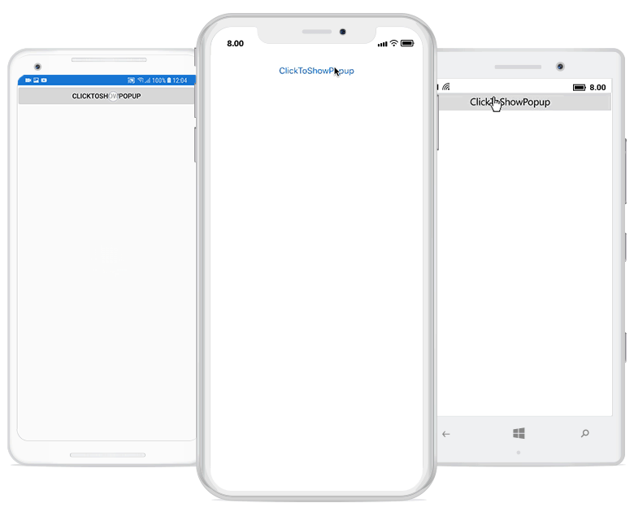
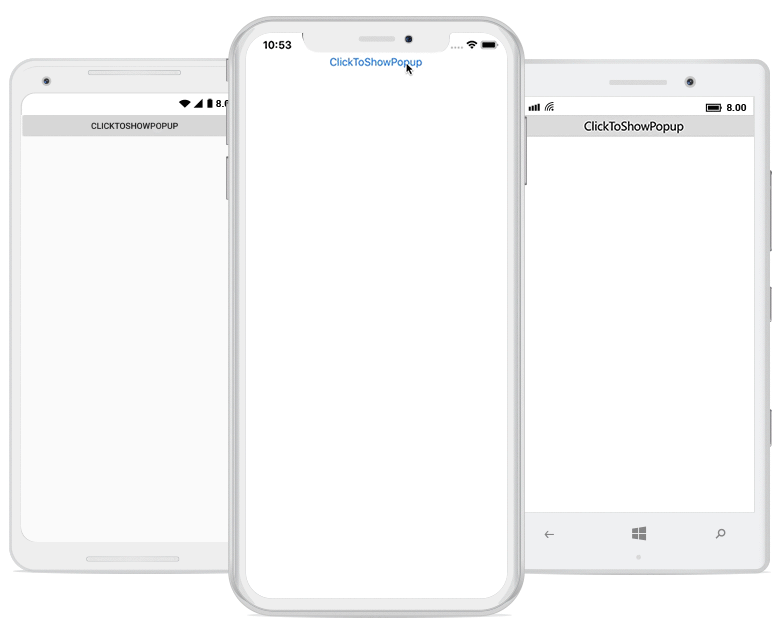
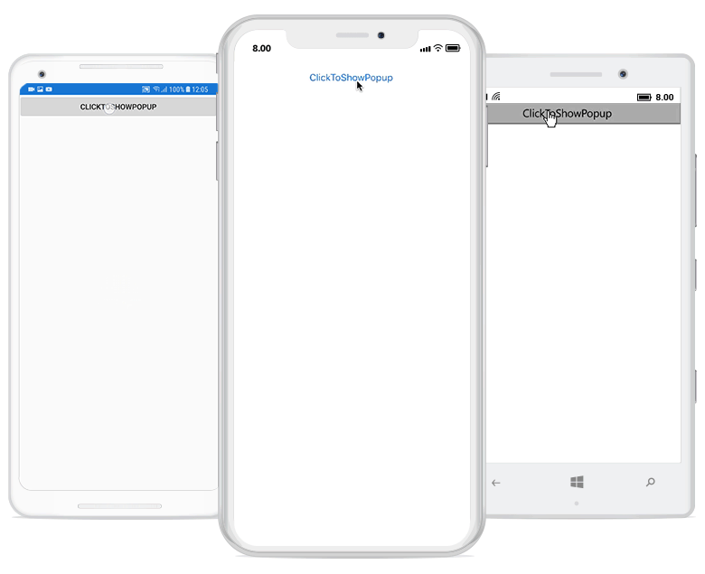

---
layout: post
title: Popup Animations | SfPopupLayout |Xamarin| Syncfusion
description: Animations in SfPopupLayout
platform: Xamarin
control: SfPopupLayout
documentation: ug
--- 

# Popup Animations

Built-in animations are available in SfPopupLayout, which is applied when the PopupView opens and closes in the screen.
SfPopupLayout has different animation modes as listed below.

<table>
<tr>
<th> Modes </th>
<th> Description </th>
</tr>
<tr>
<td> {{'[Zoom](https://help.syncfusion.com/cr/cref_files/xamarin/sfpopuplayout/Syncfusion.SfPopupLayout.XForms~Syncfusion.XForms.PopupLayout.AnimationMode.html)'| markdownify }} </td>
<td>  Zoom-out animation will be applied when the PopupView opens and zoom-in animation will be applied when the PopupView closes. This is the default AnimationMode</td>
</tr>
<tr>
<td> {{'[Fade](https://help.syncfusion.com/cr/cref_files/xamarin/sfpopuplayout/Syncfusion.SfPopupLayout.XForms~Syncfusion.XForms.PopupLayout.AnimationMode.html)'| markdownify }} </td>
<td>  Fade-out animation will be applied when the PopupView opens and Fade-in animation will be applied when the PopupView closes</td>
</tr>
<tr>
<td> {{'[SlideOnLeft](https://help.syncfusion.com/cr/cref_files/xamarin/sfpopuplayout/Syncfusion.SfPopupLayout.XForms~Syncfusion.XForms.PopupLayout.AnimationMode.html)'| markdownify }} </td>
<td>  PopupView will be animated from left-to-right, when it opens and from right-to-left when the PopupView closes.</td>
</tr>
<tr>
<td> `SlideOnRight` </td>
<td>  PopupView will be animated from right-to-left, when it opens and from left-to-right when the PopupView closes.</td>
</tr>
<tr>
<td> {{'[SlideOnTop](https://help.syncfusion.com/cr/cref_files/xamarin/sfpopuplayout/Syncfusion.SfPopupLayout.XForms~Syncfusion.XForms.PopupLayout.AnimationMode.html)'| markdownify }} </td>
<td>  PopupView will be animated from top-to-bottom, when it opens and from bottom-to-top when the PopupView closes.</td>
</tr>
<tr>
<td> `SlideOnBottom` </td>
<td>  PopupView will be animated from bottom-to-top, when it opens and from top-to-bottom when the PopupView closes.</td>
</tr>
<tr>
<td> {{'[None](https://help.syncfusion.com/cr/cref_files/xamarin/sfpopuplayout/Syncfusion.SfPopupLayout.XForms~Syncfusion.XForms.PopupLayout.AnimationMode.html)'| markdownify }} </td>
<td>  Animation will not be applied.</td>
</tr>
</table>

N> Setting of AnimationMode is same for both `Displaying pop-up when the SfPopupLayout is set as root view` and `Displaying pop-up when the SfPopupLayout is not set as root view` 

## Zoom 

Zoom-out animation will be applied when the PopupView opens and Zoom-in animation will be applied when the PopupView closes.



//MainPage.cs

public MainPage()
{
    ....
    InitializeComponent();
    popupLayout.PopupView.AnimationMode = AnimationMode.Zoom;
    ....
}



Executing the above codes renders the following output in iOS, Android and Windows Phone devices respectively.

## Fade 

Fade-out animation will be applied when the PopupView opens and Fade-in animation will be applied when the PopupView closes



//MainPage.cs

public MainPage()
{
    ....
    InitializeComponent();
    popupLayout.PopupView.AnimationMode = AnimationMode.Fade;
    ....
}



Executing the above codes renders the following output in iOS, Android and Windows Phone devices respectively.

## SlideOnLeft 

PopupView will be animated from left-to-right, when it opens and from right-to-left when the PopupView closes.



//MainPage.cs

public MainPage()
{
    ....
    InitializeComponent();
    popupLayout.PopupView.AnimationMode = AnimationMode.SlideOnLeft;
    ....
}



Executing the above codes renders the following output in iOS, Android and Windows Phone devices respectively.

## SlideOnRight

PopupView will be animated from right-to-left, when it opens and from left-to-right when the PopupView closes.



//MainPage.cs

public MainPage()
{
    ....
    InitializeComponent();
    popupLayout.PopupView.AnimationMode = AnimationMode.SlideOnRight;
    ....
}



Executing the above codes renders the following output in iOS, Android and Windows Phone devices respectively.

## SlideOnTop 

PopupView will be animated from top-to-bottom, when it opens and from bottom-to-top when the PopupView closes.



//MainPage.cs

public MainPage()
{
    ....
    InitializeComponent();
    popupLayout.PopupView.AnimationMode = AnimationMode.SlideOnTop;
    ....
}



Executing the above codes renders the following output in iOS, Android and Windows Phone devices respectively.

## SlideOnBottom

PopupView will be animated from bottom-to-top, when it opens and from top-to-bottom when the PopupView closes.



//MainPage.cs

public MainPage()
{
    ....
    InitializeComponent();
    popupLayout.PopupView.AnimationMode = AnimationMode.SlideOnBottom;
    ....
}



Executing the above codes renders the following output in iOS, Android and Windows Phone devices respectively.

## None

Animation will not be applied.



//MainPage.cs

public MainPage()
{
    ....
    InitializeComponent();
    popupLayout.PopupView.AnimationMode = AnimationMode.None;
    ....
}



Executing the above codes renders the following output in iOS, Android and Windows Phone devices respectively.

