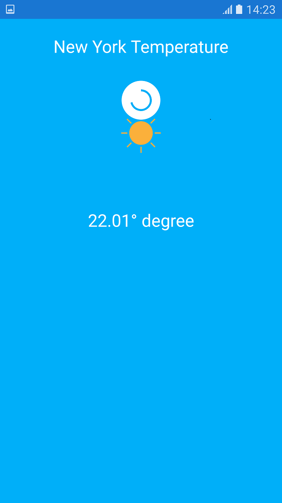
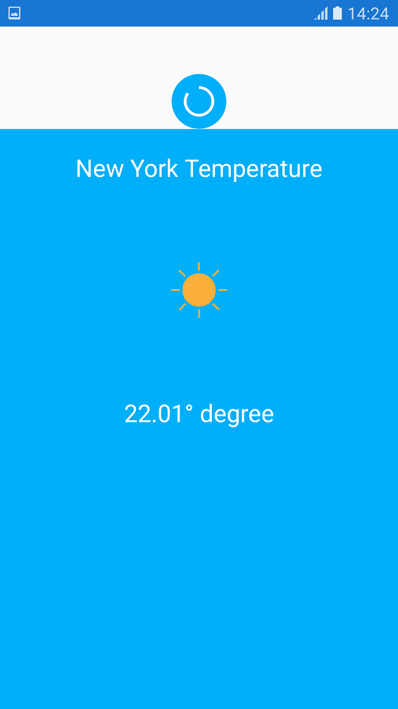

# Getting Started

This section provides a quick overview for working with SfPullToRefresh for Xamarin.Forms.

## Assembly deployment

After installing Essential Studio for Xamarin, you can find all the required assemblies in the installation folders,

{Syncfusion Essential Studio Installed location}\Essential Studio\{{ site.releaseversion }}\Xamarin\lib

Eg: C:\Program Files (x86)\Syncfusion\Essential Studio\{{ site.releaseversion }}\Xamarin\lib

N> Assemblies can be found in unzipped package location in Mac

## NuGet configuration

To install the SfPullToRefresh control in the application, configure the NuGet package of the Syncfusion components.

Refer to the following KB to configure the NuGet package of the Syncfusion components:

[How to configure package source and install Syncfusion NuGet packages in an existing project?](https://www.syncfusion.com/kb/7441/how-to-configure-package-source-and-install-syncfusion-nuget-packages-in-an-existing-project)

The following NuGet package should be added to use the SfDataGrid control in the application:

<table>
<tr>
<th> Project </th>
<th> Required package </th>
</tr>
<tr>
<td> Xamarin.Forms </td>
<td> Syncfusion.Xamarin.SfPullToRefresh</td>
</tr>
</table>

Refer to the following screenshot in which the Syncfusion.Xamarin.SfPullToRefresh is highlighted.

### SfPullToRefresh for Xamarin.Forms

The following list of assemblies need to be added as reference from the lib folder to use SfPullToRefresh in your application.

<table>
<tr>
<th>Project</th>
<th>Required assemblies</th>
</tr>
<tr>
<td>PCL</td>
<td>pcl\Syncfusion.Core.XForms.dll pcl\Syncfusion.SfPullToRefresh.XForms.dll </td>
</tr>
<tr>
<td>Android Renderer</td>
<td>android\Syncfusion.Core.XForms.dll android\Syncfusion.SfPullToRefresh.XForms.dll android\Syncfusion.SfPullToRefresh.XForms.Android.dll </td>
</tr>
<tr>
<td>iOS Renderer</td>
<td>ios-unified\Syncfusion.Core.XForms.dll ios-unified\Syncfusion.SfPullToRefresh.XForms.dll ios-unified\Syncfusion.SfPullToRefresh.XForms.iOS.dll </td>
</tr>
<tr>
<td>UWP Renderer</td>
<td>uwp\Syncfusion.Core.XForms.dll uwp\Syncfusion.SfPullToRefresh.XForms.dll uwp\Syncfusion.SfPullToRefresh.XForms.UWP.dll </td>
</tr>
</table>

N> When there is a mismatch of Xamarin NuGet packages between your sample and SfPullToRefresh assemblies, an error `Could not load type Xamarin.Forms.ElementTemplate` will occur. Please refer the `ReadMe` to know the software requirements of Syncfusion controls.

N> When there is a mismatch between Syncfusion NuGet packages among your projects, `System.IO.FileLoadException` will occur. To overcome this exception, install the same version of SfPullToRefresh assemblies in all your projects. 

## Launching the SfPullToRefresh on each platform

To use SfPullToRefresh inside an application, each platform application must initialize the SfPullToRefresh renderer. This initialization step varies from platform to platform and is discussed in the following sections.

### Android

The Android launches the SfPullToRefresh without any initialization and is enough to only initialize the Xamarin.Forms Framework to launch the application.

### iOS

To launch the SfPullToRefresh in iOS, you need to call the `SfPullToRefreshRenderer.Init()` in the `FinishedLaunching` overridden method of the AppDelegate class after the Xamarin.Forms Framework initialization and before the LoadApplication is called, as demonstrated in the following code example:


public override bool FinishedLaunching(UIApplication app, NSDictionary options)
{
    …
    global::Xamarin.Forms.Forms.Init ();
    SfPullToRefreshRenderer.Init();
    LoadApplication (new App ());
    …
}
 

### Universal Windows Platform (UWP)

To launch the SfPullToRefresh in UWP, you need to call the `SfPullToRefreshRenderer.Init()` in the `MainPage` constructor before the LoadApplication is called, as demonstrated in the following code example:


public MainPage()
{
    …
    SfPullToRefreshRenderer.Init();
    LoadApplication (new App ());
    …
}


### ReleaseMode issue in UWP platform

There is a known Framework issue in UWP platform. The custom controls will not render when deployed the application in `Release Mode`.

The above problem can be resolved by initializing the SfPullToRefresh assemblies in `App.xaml.cs` in UWP project as like in below code snippet.


// In App.xaml.cs

protected override void OnLaunched(LaunchActivatedEventArgs e)
{
    …

    rootFrame.NavigationFailed += OnNavigationFailed;
        
    // you'll need to add `using System.Reflection;`
    List<Assembly> assembliesToInclude = new List<Assembly>();

    //Now, add all the assemblies your app uses
    assembliesToInclude.Add(typeof(SfPullToRefreshRenderer).GetTypeInfo().Assembly);

    // replaces Xamarin.Forms.Forms.Init(e);        
    Xamarin.Forms.Forms.Init(e, assembliesToInclude);
        
    …     
}


## Create a sample with SfPullToRefresh 

This section explains how to create a SfPullToRefresh and configure it. 
 
You can download the entire source code of this demo for Xamarin.Forms from [here](http://files2.syncfusion.com/Xamarin.Forms/Samples/PullToRefresh_GettingStartedForms.zip).

## Creating the project

Create a new BlankApp (Xamarin.Forms.Portable) application in Xamarin Studio or Visual Studio for Xamarin.Forms. This is how the final output will look like on iOS, Android and Windows Phone devices.

## Adding SfPullToRefresh in Xamarin.Forms 

1. Add the required assembly references to the pcl and renderer projects as discussed in the [Assembly deployment](#assembly-deployment) section.
2. Import SfPullToRefresh control namespace `Syncfusion.SfPullToRefresh.XForms`.
3. Set the any `View` as `PullableContent` of the `SfPullToRefresh`.



<?xml version="1.0" encoding="utf-8" ?>
<ContentPage xmlns="http://xamarin.com/schemas/2014/forms"
             xmlns:x="http://schemas.microsoft.com/winfx/2009/xaml"
             xmlns:local="clr-namespace:GettingStarted"
             x:Class="GettingStarted.MainPage" 
             xmlns:syncfusion="clr-namespace:Syncfusion.SfPullToRefresh.XForms;assembly=Syncfusion.SfPullToRefresh.XForms">
        <syncfusion:SfPullToRefresh x:Name="pullToRefresh"
                                    IsRefreshing="False" 
                                    PullingThreshold="100"
                                    RefreshContentHeight="30"
                                    RefreshContentThreshold="30"
                                    RefreshContentWidth="30">
        <syncfusion:SfPullToRefresh.PullableContent>
            <StackLayout BackgroundColor="#00AFF9" Orientation="Vertical">
                <Label Text="New York Temperature" FontSize="Large" TextColor="White" HorizontalTextAlignment="Center" Margin="20"/>
                <Image  WidthRequest="100" HorizontalOptions="Center" HeightRequest="100"  Margin="20" Source="GettingStarted/warmselected.png"/>
                <Label x:Name="weatherData" FontSize="Large" TextColor="White" HorizontalTextAlignment="Center" Margin="20"/>
            </StackLayout>
        </syncfusion:SfPullToRefresh.PullableContent>
        </syncfusion:SfPullToRefresh>
</ContentPage>



using Syncfusion.SfPullToRefresh.XForms;
using Xamarin.Forms;

namespace GettingStarted
{
    public partial class MainPage : ContentPage
    {
        Random random = new Random();
        string[] temperatures = new string[] { "22°", "18°", "12°", "25°", "23°", "20°", "25°" };

        public MainPage()
        {
            InitializeComponent();
            this.BindingContext = this;
            weatherData.Text = temperatures[0].ToString()+" degree";
            pullToRefresh.Pulling += PullToRefresh_Pulling;
            pullToRefresh.Refreshing += PullToRefresh_Refreshing;
        }

        private async void PullToRefresh_Refreshing(object sender, EventArgs args)
        {
            pullToRefresh.IsRefreshing = true;
            await Task.Delay(2000);
            int number = random.Next(0, 6);
            new WeatherData(temperatures[number]);
            weatherData.Text = temperatures[number].ToString() + " degree";
            pullToRefresh.IsRefreshing = false;
        }

        private void PullToRefresh_Pulling(object sender, PullingEventArgs args)
        {
            args.Cancel = false;
            var progress = args.Progress;
        }
    }
}

Model class:

public class WeatherData: INotifyPropertyChanged
{
    private string _temperature;

    public WeatherData(string temperature)
    {
        Temperature = temperature;
    }

    public string Temperature
    {
        get
        {
            return _temperature;
        }
        set
        {
            _temperature = value;
            RaisePropertyChanged("Temperature");
        }
    }
        
    #region INotifyPropertyChanged implementation

    public event PropertyChangedEventHandler PropertyChanged;
    private void RaisePropertyChanged(String Name)
    {
        if (PropertyChanged != null)
            this.PropertyChanged(this, new PropertyChangedEventArgs(Name));
    }
    #endregion
}




If we run the above sample with `TransitionMode` as `Push`, the output will look like on iOS, Android and Windows Phone devices as shown below.

