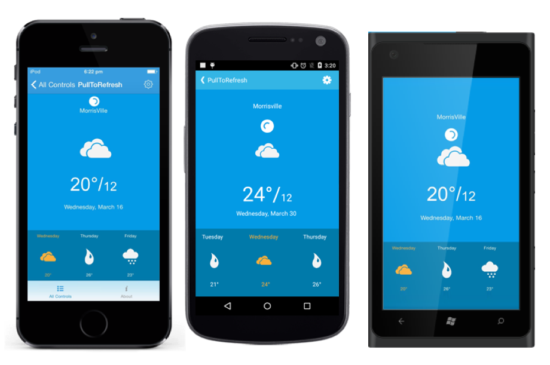

# Overview

SfPullToRefresh is a refresh control that allows you to interact and refresh the view loaded in it. The SfPullToRefresh control allows you to refresh the view upon performing the pull to refresh action. A progress indicator will be shown while start the pulling. The application will be refreshed once you have pulled down a certain distance and release the touch.
 
## Use Case Scenarios

`SfPullToRefresh` controls are mainly used in applications where the user needs to refresh the content on demand. PullToRefresh controls are mainly used in applications where the user needs to refresh the content on demand. The main applications that use the PullToRefresh are listed below:

1. Facebook
2. Weather
3. Gmail
4. Live Score applications

## Key Features

* `TransitionMode`: Specifies the transition mode of the `SfPullToRefresh`. 
* `Sizing`: Width, Height and progress stroke width customization support for `SfPullToRefresh`. 
* `Color`: Background and progress stroke color customization support for `SfPullToRefresh`. 
* `StartRefreshing()`: Starts the programmatic refreshing.
* `EndRefreshing()`: Ends the programmatic refreshing.

