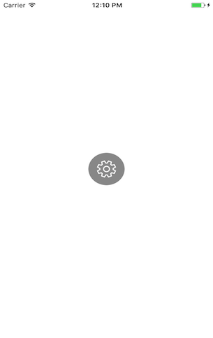
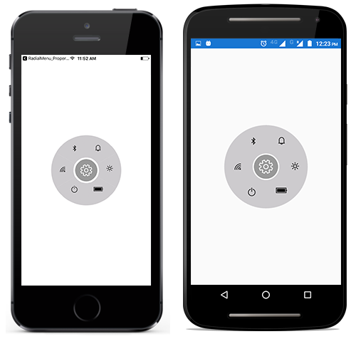

# Getting Started

This section explains the steps required to launch the radial menu with hierarchical items that can be used as mobile phone system settings. This section covers only the minimal features that needed to get started with the radial menu.

## Adding radial menu to reference 

Refer to this [article](https://help.syncfusion.com/xamarin/introduction/download-and-installation) to know how to obtain and reference Essential Studio components in your solution, and then refer to [this](https://help.syncfusion.com/xamarin/introduction/control-dependencies#sfradialmenu) link to know about the assemblies required for adding radial menu to your project.

## Initialize radial menu on each platform

To user radial menu inside an application, each platform application must initialize the radial menu renderer. This initialization step varies from platform to platform, and it is discussed in the following sections.

### Android and UWP

The Android launches the radial menu without any initialization, and it is enough to  initialize the Xamarin.Forms Framework to launch the application.

### iOS

To launch the radial menu in iOS, call the `SfRadialMenuRenderer.Init()` in the `FinishedLaunching` overridden method of the AppDelegate class after the Xamarin.Forms Framework has been initialized and before the LoadApplication is called, as demonstrated in the following code example,


public override bool FinishedLaunching(UIApplication app, NSDictionary options)
{
    …
    global::Xamarin.Forms.Forms.Init ();
    SfRadialMenuRenderer.Init();
    LoadApplication (new App ());
    …
}
 

## ReleaseMode issue in UWP platform



// In App.xaml.cs

protected override void OnLaunched(LaunchActivatedEventArgs e)
{
	…

	rootFrame.NavigationFailed += OnNavigationFailed;
		
	// you'll need to add `using System.Reflection;`
	List<Assembly> assembliesToInclude = new List<Assembly>();

	//Now, add all the assemblies your app uses
	assembliesToInclude.Add(typeof(SfRadialMenuRenderer).GetTypeInfo().Assembly);

	// replaces Xamarin.Forms.Forms.Init(e);        
	Xamarin.Forms.Forms.Init(e, assembliesToInclude);
	…     
}
 

## Adding a simple radial menu

This section explains how to create a radial menu and configure it. The d data grid control can be configured entirely in C# code, or by using XAML markup.

### Creating the project

Create a new BlankApp (Xamarin.Forms.Portable) application in Xamarin Studio or Visual Studio for Xamarin.Forms.

### Adding radial menu in Xamarin.Forms 

1. Add the required assembly references to the pcl and renderer projects. 

2. Import radial menu control namespace as `xmlns:syncfusion="clr-namespace:Syncfusion.SfRadialMenu.XForms;assembly=Syncfusion.SfRadialMenu.XForms` in XAML page.

3. Set the radial menu control as content to the ContentPage.





<?xml version="1.0" encoding="UTF-8"?>
<ContentPage xmlns="http://xamarin.com/schemas/2014/forms" BackgroundColor="White"
 xmlns:x="http://schemas.microsoft.com/winfx/2009/xaml" x:Class="RadialMenuGettingStarted.RadialMenuPage"
 xmlns:radialMenu="clr-namespace:Syncfusion.SfRadialMenu.XForms;assembly=Syncfusion.SfRadialMenu.XForms">
    
<ContentPage.Content>
            <radialMenu:SfRadialMenu x:Name="radialMenu" />
    </ContentPage.Content>
</ContentPage> 





using Syncfusion.XForms.SfRadialMenu;
using Xamarin.Forms;

public class App : Application
    {
        public App()
        {
            MainPage = new RadialMenuPage ();
        }

    }
Public class RadialMenuPage : ContentPage
{
	public RadialMenuPage ()
	{
		InitializeComponent();
		SfRadialMenu radialMenu = new SfRadialMenu();
		this.Content = radialMenu;
	}
}



### Configuring CenterButton and BackButton

Creating a RadialMenu's instance shows only round shape view on the application. You should configure CenterButton and BackButton. 





<?xml version="1.0" encoding="UTF-8"?>
<ContentPage xmlns="http://xamarin.com/schemas/2014/forms" BackgroundColor="White"
 xmlns:x="http://schemas.microsoft.com/winfx/2009/xaml" x:Class="RadialMenuGettingStarted.RadialMenuPage"
 xmlns:radialMenu="clr-namespace:Syncfusion.SfRadialMenu.XForms;assembly=Syncfusion.SfRadialMenu.XForms">
    
<ContentPage.Content>
            <radialMenu:SfRadialMenu x:Name="radialMenu" CenterButtonText="&#xe700;" CenterButtonBackText="&#xe72b;" CenterButtonFontFamily="Segoe MDL2 Assets.ttf" CenterButtonRadius="32"  CenterButtonBackFontFamily="Segoe MDL2 Assets.ttf" CenterButtonBorderColor="White" />
    </ContentPage.Content>
</ContentPage> 





using Syncfusion.XForms.SfRadialMenu;
using Xamarin.Forms;

public class App : Application
    {
        public App()
        {
            MainPage = new RadialMenuPage ();
        }

    }
Public class RadialMenuPage : ContentPage
{
	public RadialMenuPage ()
	{
		InitializeComponent();
		SfRadialMenu radialMenu = new SfRadialMenu();
		radialMenu.CenterButtonText = "\uE713";
		radialMenu.CenterButtonBackText = "\uE72B";
		radialMenu.CenterButtonFontFamily = "Segoe MDL2 Assets.ttf";
		radialMenu.CenterButtonBackFontFamily = "Segoe MDL2 Assets.ttf";
		radialMenu.CenterButtonRadius = 32;
		radialMenu.CenterButtonBorderColor = Color.White;
		this.Content = radialMenu;
	}
}



## Create radial menu items

After the radial menu has been created, add necessary items on it. For adding items to radial menu follow the below codes.





<?xml version="1.0" encoding="UTF-8"?>
<ContentPage xmlns="http://xamarin.com/schemas/2014/forms" BackgroundColor="White"
 xmlns:x="http://schemas.microsoft.com/winfx/2009/xaml" x:Class="RadialMenuGettingStarted.RadialMenuPage"
 xmlns:radialMenu="clr-namespace:Syncfusion.SfRadialMenu.XForms;assembly=Syncfusion.SfRadialMenu.XForms">
    
<ContentPage.Content>
           <radialMenu:SfRadialMenu x:Name="radial_Menu" CenterButtonText="&#xe72b;" CenterButtonBackText="&#xe72b;" CenterButtonFontFamily="Segoe MDL2 Assets.ttf" CenterButtonRadius="32">
				<radialMenu:SfRadialMenu.Items>
					<radialMenu:SfRadialMenuItem FontIconText="&#xe72e;" IconFontFamily="Segoe MDL2 Assets.ttf">
						<radialMenu:SfRadialMenuItem.Items>
							<radialMenu:SfRadialMenuItem  FontIconText="&#xe72e;" 
							IconFontFamily="Segoe MDL2 Assets.ttf" />
							<radialMenu:SfRadialMenuItem  FontIconText="&#xe72c;" 
							IconFontFamily="Segoe MDL2 Assets.ttf" />
							<radialMenu:SfRadialMenuItem  FontIconText="&#xe72e;" 
							IconFontFamily="Segoe MDL2 Assets.ttf" />
							<radialMenu:SfRadialMenuItem  FontIconText="&#xe734;" 
							IconFontFamily="Segoe MDL2 Assets.ttf" />
						</radialMenu:SfRadialMenuItem.Items>
					</radialMenu:SfRadialMenuItem>
					<radialMenu:SfRadialMenuItem FontIconText="&#xe734;" 
					IconFontFamily="Segoe MDL2 Assets.ttf">
						<radialMenu:SfRadialMenuItem.Items>
							<radialMenu:SfRadialMenuItem  FontIconText="&#xe72c;" 
							IconFontFamily="Segoe MDL2 Assets.ttf" />
							<radialMenu:SfRadialMenuItem  FontIconText="&#xe72d;" 
							IconFontFamily="Segoe MDL2 Assets.ttf" />
							<radialMenu:SfRadialMenuItem  FontIconText="&#xe734;" 
							IconFontFamily="Segoe MDL2 Assets.ttf" />
							<radialMenu:SfRadialMenuItem  FontIconText="&#xe72e;" 
							IconFontFamily="Segoe MDL2 Assets.ttf" />
						</radialMenu:SfRadialMenuItem.Items>
					</radialMenu:SfRadialMenuItem>
					<radialMenu:SfRadialMenuItem  FontIconText="&#xe72e;" 
					IconFontFamily="Segoe MDL2 Assets.ttf">
						<radialMenu:SfRadialMenuItem.Items>
							<radialMenu:SfRadialMenuItem  FontIconText="&#xe730;" 
							IconFontFamily="Segoe MDL2 Assets.ttf" />
							<radialMenu:SfRadialMenuItem  FontIconText="&#xe72e;" 
							IconFontFamily="Segoe MDL2 Assets.ttf" />
							<radialMenu:SfRadialMenuItem  FontIconText="&#xe730;" 
							IconFontFamily="Segoe MDL2 Assets.ttf" />
						</radialMenu:SfRadialMenuItem.Items>
					</radialMenu:SfRadialMenuItem>
					<radialMenu:SfRadialMenuItem  FontIconText="&#xe730;" IconFontFamily="Segoe MDL2 Assets.ttf">
						<radialMenu:SfRadialMenuItem.Items>
							<radialMenu:SfRadialMenuItem  IconFontSize="16" FontIconText="&#xe72c;" IconFontFamily="Segoe MDL2 Assets.ttf" />
							<radialMenu:SfRadialMenuItem  IconFontSize="18" FontIconText="&#xe730;" IconFontFamily="Segoe MDL2 Assets.ttf" />
							<radialMenu:SfRadialMenuItem  IconFontSize="20" FontIconText="&#xe72e;" IconFontFamily="Segoe MDL2 Assets.ttf" />
						</radialMenu:SfRadialMenuItem.Items>
					</radialMenu:SfRadialMenuItem>
					<radialMenu:SfRadialMenuItem  FontIconText="&#xe738;" 
					IconFontFamily="Segoe MDL2 Assets.ttf">
						<radialMenu:SfRadialMenuItem.Items>
							<radialMenu:SfRadialMenuItem  FontIconText="&#xe72c;" 
							IconFontFamily="Segoe MDL2 Assets.ttf" />
							<radialMenu:SfRadialMenuItem  FontIconText="&#xe72e;" 
							IconFontFamily="Segoe MDL2 Assets.ttf" />
							<radialMenu:SfRadialMenuItem  FontIconText="&#xe72d;" 
							IconFontFamily="Segoe MDL2 Assets.ttf" />
						</radialMenu:SfRadialMenuItem.Items>
					</radialMenu:SfRadialMenuItem>
					<radialMenu:SfRadialMenuItem FontIconText="&#xe72c;" IconFontFamily="Segoe MDL2 Assets.ttf">
						<radialMenu:SfRadialMenuItem.Items>
							<radialMenu:SfRadialMenuItem  FontIconText="&#xe734;" IconFontFamily="Segoe MDL2 Assets.ttf" />
							<radialMenu:SfRadialMenuItem  FontIconText="&#xe739;" IconFontFamily="Segoe MDL2 Assets.ttf" />
							<radialMenu:SfRadialMenuItem  FontIconText="&#xe734;" IconFontFamily="Segoe MDL2 Assets.ttf" />
						</radialMenu:SfRadialMenuItem.Items>
					</radialMenu:SfRadialMenuItem>
				</radialMenu:SfRadialMenu.Items>
			</radialMenu:SfRadialMenu>
    </ContentPage.Content>
</ContentPage> 





using Syncfusion.XForms.SfRadialMenu;
using Xamarin.Forms;

public class App : Application
    {
        public App()
        {
            MainPage = new RadialMenuPage ();
        }

    }
Public class RadialMenuPage : ContentPage
{
	public RadialMenuPage ()
	{
		InitializeComponent();
		SfRadialMenu radialMenu = new SfRadialMenu();
		 	
		//Initializing RadialMenu's properties
		radialMenu.CenterButtonText = "\uE713";
		radialMenu.CenterButtonBackText = "\uE72B";
		radialMenu.CenterButtonFontFamily = "Segoe MDL2 Assets.ttf";
		radialMenu.CenterButtonBackFontFamily = "Segoe MDL2 Assets.ttf";
		radialMenu.CenterButtonRadius = 32;
		radialMenu.CenterButtonBorderColor = Color.White;

		//Adding RadialMenu items
		string[] layer = new string[] { "\uE701", "\uE702", "\uEA8F", "\uE706", "\uEBAA", "\uE7E8" };
		string[] Wi-Fi = new string[] { "\uEC3B", "\uEC3A", "\uEC39", "\uEC38"};
		string[] battery = new string[] { "\uEBB8", "\uEBBC", "\uEBC0" };
		string[] brightness = new string[] { "\uEC8A", "\uEC8A", "\uE706" };
		string[] profile = new string[] { "\uE7ED", "\uE877", "\uEA8F" };
		string[] power = new string[] { "\uE708", "\uE777", "\uE7E8" };

		//Adding radialMenu main menu items
		for (int i = 0; i < 6; i++)
		{
			SfRadialMenuItem mainMenuItems = new SfRadialMenuItem();
			mainMenuItems.IconFontSize = 20;
			mainMenuItems.FontIconText = layer[i];
			mainMenuItems.ItemHeight = 30;
			mainMenuItems.ItemWidth = 40;
			mainMenuItems.TextColor = Color.White;
			mainMenuItems.IconFontFamily = "Segoe MDL2 Assets.ttf";
			radialMenu.Items.Add(mainMenuItems);
		}

		// Adding Wi-Fi submenu items
		for (int i = 0; i < 4; i++)
		{
			SfRadialMenuItem Wi-FiSubMenuItems = new SfRadialMenuItem();
			Wi-FiSubMenuItems.IconFontSize = 20;
			Wi-FiSubMenuItems.FontIconText = wifi[i];
			Wi-FiSubMenuItems.ItemHeight = 30;
			Wi-FiSubMenuItems.ItemWidth = 40;
			Wi-FiSubMenuItems.TextColor = Color.White;
			Wi-FiSubMenuItems.IconFontFamily = "Segoe MDL2 Assets.ttf";
			radialMenu.Items[0].Items.Add(Wi-FiSubMenuItems);
		}

		//Adding bluetooth submenu items
		for (int i = 0; i < 4; i++)
		{
			SfRadialMenuItem bluetoothSubMenuItems = new SfRadialMenuItem();
			bluetoothSubMenuItems.IconFontSize = 20;
			bluetoothSubMenuItems.FontIconText = Wi-Fi[i];
			bluetoothSubMenuItems.ItemHeight = 30;
			bluetoothSubMenuItems.ItemWidth = 40;
			bluetoothSubMenuItems.TextColor = Color.White;
			bluetoothSubMenuItems.IconFontFamily = "Segoe MDL2 Assets.ttf";
			radialMenu.Items[1].Items.Add(bluetoothSubMenuItems);
		}

		//Adding profile submenu items
		for (int i = 0; i < 3; i++)
		{
			SfRadialMenuItem profileSubMenuItems = new SfRadialMenuItem();
			profileSubMenuItems.IconFontSize = 20;
			profileSubMenuItems.FontIconText = profile[i];
			profileSubMenuItems.ItemHeight = 30;
			profileSubMenuItems.ItemWidth = 40;
			profileSubMenuItems.TextColor = Color.White;
			profileSubMenuItems.IconFontFamily = "Segoe MDL2 Assets.ttf";
			radialMenu.Items[2].Items.Add(profileSubMenuItems);
		}

		//Adding brightness submenu items
		for (int i = 0; i < 3; i++)
		{
			SfRadialMenuItem brightnessSubMenuItems = new SfRadialMenuItem();
			brightnessSubMenuItems.IconFontSize = 20;
			brightnessSubMenuItems.FontIconText = brightness[i];
			brightnessSubMenuItems.ItemHeight = 30;
			brightnessSubMenuItems.ItemWidth = 40;
			brightnessSubMenuItems.TextColor = Color.White;
			brightnessSubMenuItems.IconFontFamily = "Segoe MDL2 Assets.ttf";
			radialMenu.Items[3].Items.Add(brightnessSubMenuItems);
		}

		//Adding battery submenu items
		for (int i = 0; i < 3; i++)
		{
			SfRadialMenuItem batterySubMenuItems = new SfRadialMenuItem();
			batterySubMenuItems.IconFontSize = 20;
			batterySubMenuItems.FontIconText = battery[i];
			batterySubMenuItems.ItemHeight = 30;
			batterySubMenuItems.ItemWidth = 40;
			batterySubMenuItems.TextColor = Color.White;
			batterySubMenuItems.IconFontFamily = "Segoe MDL2 Assets.ttf";
			radialMenu.Items[4].Items.Add(batterySubMenuItems);
		}

		//Adding power submenu items
		for (int i = 0; i < 3; i++)
		{
			SfRadialMenuItem powerSubMenuItems = new SfRadialMenuItem();
			powerSubMenuItems.IconFontSize = 20;
			powerSubMenuItems.FontIconText = power[i];
			powerSubMenuItems.ItemHeight = 30;
			powerSubMenuItems.ItemWidth = 40;
			powerSubMenuItems.TextColor = Color.White;
			powerSubMenuItems.IconFontFamily = "Segoe MDL2 Assets.ttf";
			radialMenu.Items[5].Items.Add(powerSubMenuItems);
		}

       this.Content = radialMenu;
	}
}



N> To use FontIcons, add respective FontFamily name in `info.plist` file under fonts provided by application category.

