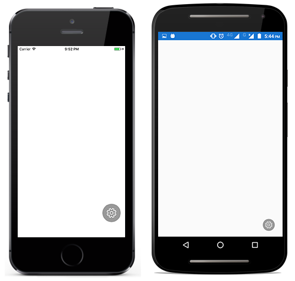

# Placing and Dragging RadialMenu

You can place radial menu anywhere on its parent layout, and drag it with in the parent layout. 

## Dragging RadialMenu

You can enable/disable dragging by using the `IsDragEnabled` property.





<?xml version="1.0" encoding="utf-8" ?>
<ContentPage xmlns="http://xamarin.com/schemas/2014/forms"
             xmlns:x="http://schemas.microsoft.com/winfx/2009/xaml"
             xmlns:local="clr-namespace:RadialSample"
             xmlns:radialMenu="clr-namespace:Syncfusion.SfRadialMenu.XForms;assembly=Syncfusion.SfRadialMenu.XForms"
             x:Class="RadialSample.MainPage">
    <ContentPage.Resources>
        <ResourceDictionary>
            <OnPlatform x:TypeArguments="x:String" x:Key="customfontfamily" iOS="Segoe MDL2 Assets" Android="radialmenu_Segoe MDL2 Assets.ttf" WinPhone="radialmenu_Segoe_MDL2_Assets.ttf#Segoe MDL2 Assets"  />
        </ResourceDictionary>
    </ContentPage.Resources>
    <ContentPage.Content>
        <radialMenu:SfRadialMenu x:Name="radialMenu" 
                                 IsDragEnabled="true" 
                                 CenterButtonText="&#xe713;"
                                 CenterButtonFontFamily="{StaticResource customfontfamily}" 
                                 CenterButtonRadius="30"
                                 CenterButtonFontSize="26" 
                                 CenterButtonTextColor="White"
                                 CenterButtonBorderColor="White" 
                                 CenterButtonBorderThickness="3">
        </radialMenu:SfRadialMenu>
    </ContentPage.Content>
</ContentPage>





using Syncfusion.SfRadialMenu.XForms;
using System.Collections.ObjectModel;
using Xamarin.Forms;

namespace RadialSample
{
    public partial class MainPage : ContentPage
    {
        public MainPage()
        {
            InitializeComponent();
            SfRadialMenu radialMenu = new SfRadialMenu()
            {
                IsDragEnabled = true,
                CenterButtonText = "\uE713",
                CenterButtonFontFamily = Device.RuntimePlatform == "iOS" ? "Segoe MDL2 Assets" : Device.RuntimePlatform == "Android" ? "radialmenu_Segoe MDL2 Assets.ttf" : "radialmenu_Segoe_MDL2_Assets.ttf#Segoe MDL2 Assets",
                CenterButtonRadius = 30,
                CenterButtonFontSize = 26,
                CenterButtonTextColor = Color.White,
                CenterButtonBorderColor = Color.White,
                CenterButtonBorderThickness = 3
            };
            this.Content = radialMenu;
        }
    }
}





## DragEvents

SfRadialMenu provides for event for DragBegin and DragEnd in which the event get hooked when the RadialMenu is get dragged.

### DragBegin event

This event get triggered when RadialMenu is start to drag with `DragBeginEventArgs`.

* `Position` - Gets the Start position of the RadialMenu

* `Handled` - Gets and Sets the boolean value for enabling and disabling the dragging of RadialMenu.

To hook the `DragBegin` event, and to get the start position and restricts the dragging, follow the code example:





<?xml version="1.0" encoding="utf-8" ?>
<ContentPage xmlns="http://xamarin.com/schemas/2014/forms"
             xmlns:x="http://schemas.microsoft.com/winfx/2009/xaml"
             xmlns:local="clr-namespace:RadialSample"
             xmlns:radialMenu="clr-namespace:Syncfusion.SfRadialMenu.XForms;assembly=Syncfusion.SfRadialMenu.XForms"
             x:Class="RadialSample.MainPage">
    <ContentPage.Resources>
        <ResourceDictionary>
            <OnPlatform x:TypeArguments="x:String" x:Key="customfontfamily" iOS="Segoe MDL2 Assets" Android="radialmenu_Segoe MDL2 Assets.ttf" WinPhone="radialmenu_Segoe_MDL2_Assets.ttf#Segoe MDL2 Assets"  />
        </ResourceDictionary>
    </ContentPage.Resources>
    <radialMenu:SfRadialMenu x:Name="radialMenu" 
                             IsDragEnabled="true" 
                             DragBegin="RadialMenu_DragBegin"
                             CenterButtonText="&#xe713;"
                             CenterButtonFontFamily="{StaticResource customfontfamily}" 
                             CenterButtonRadius="30"
                             CenterButtonFontSize="26" 
                             CenterButtonTextColor="White"
                             CenterButtonBorderColor="White" 
                             CenterButtonBorderThickness="3">
    </radialMenu:SfRadialMenu>
</ContentPage>





using Syncfusion.SfRadialMenu.XForms;
using System.Collections.ObjectModel;
using Xamarin.Forms;

namespace RadialSample
{
    public partial class MainPage : ContentPage
    {
        public MainPage()
        {
            InitializeComponent();
            SfRadialMenu radialMenu = new SfRadialMenu()
            {
                IsDragEnabled = true,
                CenterButtonText = "\uE713",
                CenterButtonFontFamily = Device.RuntimePlatform == "iOS" ? "Segoe MDL2 Assets" : Device.RuntimePlatform == "Android" ? "radialmenu_Segoe MDL2 Assets.ttf" : "radialmenu_Segoe_MDL2_Assets.ttf#Segoe MDL2 Assets",
                CenterButtonRadius = 30,
                CenterButtonFontSize = 26,
                CenterButtonTextColor = Color.White,
                CenterButtonBorderColor = Color.White,
                CenterButtonBorderThickness = 3
            };

            radialMenu.DragBegin += RadialMenu_DragBegin;
            this.Content = radialMenu;
        }

        private void RadialMenu_DragBegin(object sender, DragBeginEventArgs e)
        {
            e.Handled = true;
        }
    }
}




### Drag End

This event get triggered when dragging is ended in RadialMenu with `DragEndEventArgs`.

* `OldValue` - Gets the Start position of the RadialMenu

* `NewValue` - Gets the ens position of the RadialMenu

* `Handled` - Gets and Sets the boolean value for restricting the RadialMenu to move another position.

To hook the `DragEnd` event, and to get the start position, end position and restricts the movement of the RadialMenu, follow the code example:





<?xml version="1.0" encoding="utf-8" ?>
<ContentPage xmlns="http://xamarin.com/schemas/2014/forms"
             xmlns:x="http://schemas.microsoft.com/winfx/2009/xaml"
             xmlns:local="clr-namespace:RadialSample"
             xmlns:radialMenu="clr-namespace:Syncfusion.SfRadialMenu.XForms;assembly=Syncfusion.SfRadialMenu.XForms"
             x:Class="RadialSample.MainPage">
    <ContentPage.Resources>
        <ResourceDictionary>
            <OnPlatform x:TypeArguments="x:String" x:Key="customfontfamily" iOS="Segoe MDL2 Assets" Android="radialmenu_Segoe MDL2 Assets.ttf" WinPhone="radialmenu_Segoe_MDL2_Assets.ttf#Segoe MDL2 Assets"  />
        </ResourceDictionary>
    </ContentPage.Resources>
    <radialMenu:SfRadialMenu x:Name="radialMenu" 
                             IsDragEnabled="true" 
                             DragEnd="radialMenu_DragEnd"
                             CenterButtonText="&#xe713;"
                             CenterButtonFontFamily="{StaticResource customfontfamily}" 
                             CenterButtonRadius="30"
                             CenterButtonFontSize="26" 
                             CenterButtonTextColor="White"
                             CenterButtonBorderColor="White" 
                             CenterButtonBorderThickness="3">
    </radialMenu:SfRadialMenu>
</ContentPage>





using Syncfusion.SfRadialMenu.XForms;
using System.Collections.ObjectModel;
using Xamarin.Forms;

namespace RadialSample
{
    public partial class MainPage : ContentPage
    {
        public MainPage()
        {
            InitializeComponent();
            SfRadialMenu radialMenu = new SfRadialMenu()
            {
                IsDragEnabled = true,
                CenterButtonText = "\uE713",
                CenterButtonFontFamily = Device.RuntimePlatform == "iOS" ? "Segoe MDL2 Assets" : Device.RuntimePlatform == "Android" ? "radialmenu_Segoe MDL2 Assets.ttf" : "radialmenu_Segoe_MDL2_Assets.ttf#Segoe MDL2 Assets",
                CenterButtonRadius = 30,
                CenterButtonFontSize = 26,
                CenterButtonTextColor = Color.White,
                CenterButtonBorderColor = Color.White,
                CenterButtonBorderThickness = 3
            };

            radialMenu.DragEnd += radialMenu_DragEnd;
            this.Content = radialMenu;
        }

        private void radialMenu_DragEnd(object sender, DragEndEventArgs e)
        {
            e.Handled = true;
        }
    }
}




## Placing RadialMenu

You can place radial menu anywhere on its parent layout. Radial Menu's position is calculated based on parent layout's center point.





<?xml version="1.0" encoding="utf-8" ?>
<ContentPage xmlns="http://xamarin.com/schemas/2014/forms"
             xmlns:x="http://schemas.microsoft.com/winfx/2009/xaml"
             xmlns:local="clr-namespace:RadialSample"
             xmlns:radialMenu="clr-namespace:Syncfusion.SfRadialMenu.XForms;assembly=Syncfusion.SfRadialMenu.XForms"
             x:Class="RadialSample.MainPage">
    <ContentPage.Resources>
        <ResourceDictionary>
            <OnPlatform x:TypeArguments="x:String" x:Key="customfontfamily" iOS="Segoe MDL2 Assets" Android="radialmenu_Segoe MDL2 Assets.ttf" WinPhone="radialmenu_Segoe_MDL2_Assets.ttf#Segoe MDL2 Assets"  />
        </ResourceDictionary>
    </ContentPage.Resources>
    <radialMenu:SfRadialMenu x:Name="radialMenu" 
                             Point="100, 150"
                             CenterButtonText="&#xe713;"
                             CenterButtonFontFamily="{StaticResource customfontfamily}" 
                             CenterButtonRadius="30"
                             CenterButtonFontSize="26" 
                             CenterButtonTextColor="White"
                             CenterButtonBorderColor="White" 
                             CenterButtonBorderThickness="3">
    </radialMenu:SfRadialMenu>
</ContentPage>





using Syncfusion.SfRadialMenu.XForms;
using System.Collections.ObjectModel;
using Xamarin.Forms;

namespace RadialSample
{
    public partial class MainPage : ContentPage
    {
        public MainPage()
        {
            InitializeComponent();
            SfRadialMenu radialMenu = new SfRadialMenu()
            {
                CenterButtonText = "\uE713",
                CenterButtonFontFamily = Device.RuntimePlatform == "iOS" ? "Segoe MDL2 Assets" : Device.RuntimePlatform == "Android" ? "radialmenu_Segoe MDL2 Assets.ttf" : "radialmenu_Segoe_MDL2_Assets.ttf#Segoe MDL2 Assets",
                CenterButtonRadius = 30,
                CenterButtonFontSize = 26,
                CenterButtonTextColor = Color.White,
                CenterButtonBorderColor = Color.White,
                CenterButtonBorderThickness = 3,
                Point = new Point(100, 150)
            };

            this.Content = radialMenu;
        }
    }
}
            



