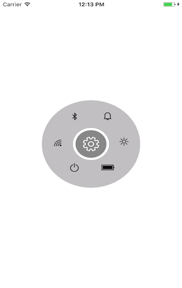

# Populating Items

This section explains the ways about populating items through radial menu item and item source with item template.

## Through radial menu items

By passing collection of `SfRadialMenuItem`, you can get the view of `SfRadialMenu` control. radial menu item class provides various options to customize the items by giving custom views, font icons, and images. It is possible to add radial menu items hierarchically. Item selection can be identified by using ItemTapped event. The ItemTapped event will be fired whenever you tap an item from radial menu.





<?xml version="1.0" encoding="UTF-8"?>
<ContentPage xmlns="http://xamarin.com/schemas/2014/forms" BackgroundColor="White"
 xmlns:x="http://schemas.microsoft.com/winfx/2009/xaml" x:Class="RadialMenuGettingStarted.RadialMenuPage"
 xmlns:radialMenu="clr-namespace:Syncfusion.SfRadialMenu.XForms;assembly=Syncfusion.SfRadialMenu.XForms">
    
<ContentPage.Content>
           <radialMenu:SfRadialMenu x:Name="radial_Menu" CenterButtonText="&#xe700;" CenterButtonBackText="&#xe72b;" CenterButtonFontFamily="Segoe MDL2 Assets.ttf" CenterButtonRadius="32">
				<radialMenu:SfRadialMenu.Items>
					<radialMenu:SfRadialMenuItem ItemTapped="Handle_ItemTapped" FontIconText="&#xe734;" IconFontFamily="Segoe MDL2 Assets.ttf">
						<radialMenu:SfRadialMenuItem.Items>
							<radialMenu:SfRadialMenuItem ItemTapped="Handle_ItemTapped" 
							FontIconText="&#xe734;" IconFontFamily="Segoe MDL2 Assets.ttf" />
							<radialMenu:SfRadialMenuItem  ItemTapped="Handle_ItemTapped" 
							FontIconText="&#xe738;" IconFontFamily="Segoe MDL2 Assets.ttf" />
							<radialMenu:SfRadialMenuItem ItemTapped="Handle_ItemTapped" 
							FontIconText="&#xe72b;" IconFontFamily="Segoe MDL2 Assets.ttf" />
							<radialMenu:SfRadialMenuItem ItemTapped="Handle_ItemTapped"
							 FontIconText="&#xe700;" IconFontFamily="Segoe MDL2 Assets.ttf" />
						</radialMenu:SfRadialMenuItem.Items>
					</radialMenu:SfRadialMenuItem>
					<radialMenu:SfRadialMenuItem ItemTapped="Handle_ItemTapped" FontIconText="&#xe700;" IconFontFamily="Segoe MDL2 Assets.ttf">
						<radialMenu:SfRadialMenuItem.Items>
							<radialMenu:SfRadialMenuItem ItemTapped="Handle_ItemTapped" 
							FontIconText="&#xe734;" IconFontFamily="Segoe MDL2 Assets.ttf" />
							<radialMenu:SfRadialMenuItem ItemTapped="Handle_ItemTapped" 
							FontIconText="&#xe738;" IconFontFamily="Segoe MDL2 Assets.ttf" />
							<radialMenu:SfRadialMenuItem ItemTapped="Handle_ItemTapped" 
							FontIconText="&#xe700;" IconFontFamily="Segoe MDL2 Assets.ttf" />
							<radialMenu:SfRadialMenuItem ItemTapped="Handle_ItemTapped" 
							FontIconText="&#xe72b;"" IconFontFamily="Segoe MDL2 Assets.ttf" />
						</radialMenu:SfRadialMenuItem.Items>
					</radialMenu:SfRadialMenuItem>
					<radialMenu:SfRadialMenuItem ItemTapped="Handle_ItemTapped" FontIconText="&#xe72d;" IconFontFamily="Segoe MDL2 Assets.ttf">
						<radialMenu:SfRadialMenuItem.Items>
							<radialMenu:SfRadialMenuItem ItemTapped="Handle_ItemTapped"
							 FontIconText="&#xe734;" IconFontFamily="Segoe MDL2 Assets.ttf" />
							<radialMenu:SfRadialMenuItem ItemTapped="Handle_ItemTapped" 
							FontIconText="&#xe72e;" IconFontFamily="Segoe MDL2 Assets.ttf" />
							<radialMenu:SfRadialMenuItem ItemTapped="Handle_ItemTapped" 
							FontIconText="&#xe734;" IconFontFamily="Segoe MDL2 Assets.ttf" />
						</radialMenu:SfRadialMenuItem.Items>
					</radialMenu:SfRadialMenuItem>
					<radialMenu:SfRadialMenuItem ItemTapped="Handle_ItemTapped" FontIconText="&#xe735;" IconFontFamily="Segoe MDL2 Assets.ttf">
						<radialMenu:SfRadialMenuItem.Items>
							<radialMenu:SfRadialMenuItem ItemTapped="Handle_ItemTapped" IconFontSize="16" FontIconText="&#xe734;" IconFontFamily="Segoe MDL2 Assets.ttf" />
							<radialMenu:SfRadialMenuItem ItemTapped="Handle_ItemTapped" IconFontSize="18" FontIconText="&#xe738;" IconFontFamily="Segoe MDL2 Assets.ttf" />
							<radialMenu:SfRadialMenuItem ItemTapped="Handle_ItemTapped" IconFontSize="20" FontIconText="&#xe72b;" IconFontFamily="Segoe MDL2 Assets.ttf" />
						</radialMenu:SfRadialMenuItem.Items>
					</radialMenu:SfRadialMenuItem>
					<radialMenu:SfRadialMenuItem ItemTapped="Handle_ItemTapped" FontIconText="&#xe700;" IconFontFamily="Segoe MDL2 Assets.ttf">
						<radialMenu:SfRadialMenuItem.Items>
							<radialMenu:SfRadialMenuItem ItemTapped="Handle_ItemTapped" 
							FontIconText="&#xe73b;" IconFontFamily="Segoe MDL2 Assets.ttf" />
							<radialMenu:SfRadialMenuItem ItemTapped="Handle_ItemTapped" 
							FontIconText="&#xe73a;"" IconFontFamily="Segoe MDL2 Assets.ttf" />
							<radialMenu:SfRadialMenuItem ItemTapped="Handle_ItemTapped" 
							FontIconText="&#xe739;" IconFontFamily="Segoe MDL2 Assets.ttf" />
						</radialMenu:SfRadialMenuItem.Items>
					</radialMenu:SfRadialMenuItem>
					<radialMenu:SfRadialMenuItem ItemTapped="Handle_ItemTapped" FontIconText="&#xe73a;" IconFontFamily="Segoe MDL2 Assets.ttf">
						<radialMenu:SfRadialMenuItem.Items>
							<radialMenu:SfRadialMenuItem ItemTapped="Handle_ItemTapped" 
							FontIconText="&#xe73d;" IconFontFamily="Segoe MDL2 Assets.ttf" />
							<radialMenu:SfRadialMenuItem ItemTapped="Handle_ItemTapped" 
							FontIconText="&#xe73c;" IconFontFamily="Segoe MDL2 Assets.ttf" />
							<radialMenu:SfRadialMenuItem ItemTapped="Handle_ItemTapped" 
							FontIconText="&#xe734;" IconFontFamily="Segoe MDL2 Assets.ttf" />
						</radialMenu:SfRadialMenuItem.Items>
					</radialMenu:SfRadialMenuItem>
				</radialMenu:SfRadialMenu.Items>
			</radialMenu:SfRadialMenu>
    </ContentPage.Content>
</ContentPage> 





using Syncfusion.XForms.SfRadialMenu;
using Xamarin.Forms;

public class App : Application
    {
        public App()
        {
            MainPage = new RadialMenuPage ();
        }

    }
Public class RadialMenuPage : ContentPage
{
	public RadialMenuPage ()
	{
        InitializeComponent();
		//Creating instance for RadialMenu
			SfRadialMenu radialMenu = new SfRadialMenu();

			//Initializing RadialMenu's properties
			radialMenu.CenterButtonText = "\uE713";
			radialMenu.CenterButtonBackText = "\uE72B";
			radialMenu.CenterButtonFontFamily = "Segoe MDL2 Assets.ttf";
			radialMenu.CenterButtonBackFontFamily = "Segoe MDL2 Assets.ttf";
			radialMenu.CenterButtonRadius = 32;
			radialMenu.CenterButtonBorderColor = Color.White;

			//Adding RadialMenu items

			string[] layer = new string[] { "\uE701", "\uE702", "\uEA8F", "\uE706", "\uEBAA", "\uE7E8" };
			string[] Wi-Fi = new string[] { "\uEC3B", "\uEC3A", "\uEC39", "\uEC38", "\uEC37" };
			string[] battery = new string[] { "\uEBB8", "\uEBBC", "\uEBC0" };
			string[] brightness = new string[] { "\uEC8A", "\uEC8A", "\uE706" };
			string[] profile = new string[] { "\uE7ED", "\uE877", "\uEA8F" };
			string[] power = new string[] { "\uE708", "\uE777", "\uE7E8" };

			//Adding radialMenu main menu items
			for (int i = 0; i < 6; i++)
			{
				SfRadialMenuItem mainMenuItems = new SfRadialMenuItem();
				mainMenuItems.IconFontSize = 20;
				mainMenuItems.FontIconText = layer[i];
				mainMenuItems.ItemHeight = 30;
				mainMenuItems.ItemWidth = 40;
				mainMenuItems.TextColor = Color.White;
				mainMenuItems.ItemTapped += Handle_ItemTapped;
				mainMenuItems.IconFontFamily = "Segoe MDL2 Assets.ttf";
				radialMenu.Items.Add(mainMenuItems);
			}

			// Adding Wi-Fi  submenu items
			for (int i = 0; i < 5; i++)
			{
				SfRadialMenuItem Wi-FiSubMenuItems = new SfRadialMenuItem();
				Wi-FiSubMenuItems.IconFontSize = 20;
				Wi-FiSubMenuItems.FontIconText = wifi[i];
				Wi-FiSubMenuItems.ItemHeight = 30;
				Wi-FiSubMenuItems.ItemWidth = 40;
				Wi-FiSubMenuItems.TextColor = Color.White;
				Wi-FiSubMenuItems.ItemTapped += Handle_ItemTapped;
				Wi-FiSubMenuItems.IconFontFamily = "Segoe MDL2 Assets.ttf";
				radialMenu.Items[0].Items.Add(Wi-FiSubMenuItems);
			}

			//Adding bluetooth submenu items
			for (int i = 0; i < 5; i++)
			{
				SfRadialMenuItem bluetoothSubMenuItems = new SfRadialMenuItem();
				bluetoothSubMenuItems.IconFontSize = 20;
				bluetoothSubMenuItems.FontIconText = Wi-Fi[i];
				bluetoothSubMenuItems.ItemHeight = 30;
				bluetoothSubMenuItems.ItemWidth = 40;
				bluetoothSubMenuItems.TextColor = Color.White;
				bluetoothSubMenuItems.ItemTapped += Handle_ItemTapped;
				bluetoothSubMenuItems.IconFontFamily = "Segoe MDL2 Assets.ttf";
				radialMenu.Items[1].Items.Add(bluetoothSubMenuItems);
			}

			//Adding profile submenu items
			for (int i = 0; i < 3; i++)
			{
				SfRadialMenuItem profileSubMenuItems = new SfRadialMenuItem();
				profileSubMenuItems.IconFontSize = 20;
				profileSubMenuItems.FontIconText = profile[i];
				profileSubMenuItems.ItemHeight = 30;
				profileSubMenuItems.ItemWidth = 40;
				profileSubMenuItems.TextColor = Color.White;
				profileSubMenuItems.ItemTapped += Handle_ItemTapped;
				profileSubMenuItems.IconFontFamily = "Segoe MDL2 Assets.ttf";
				radialMenu.Items[2].Items.Add(profileSubMenuItems);
			}

			//Adding brightness submenu items
			for (int i = 0; i < 3; i++)
			{
				SfRadialMenuItem brightnessSubMenuItems = new SfRadialMenuItem();
				brightnessSubMenuItems.IconFontSize = 20;
				brightnessSubMenuItems.FontIconText = brightness[i];
				brightnessSubMenuItems.ItemHeight = 30;
				brightnessSubMenuItems.ItemWidth = 40;
				brightnessSubMenuItems.TextColor = Color.White;
				brightnessSubMenuItems.IconFontFamily = "Segoe MDL2 Assets.ttf";
				brightnessSubMenuItems.ItemTapped += Handle_ItemTapped;
				radialMenu.Items[3].Items.Add(brightnessSubMenuItems);
			}

			//Adding battery submenu items
			for (int i = 0; i < 3; i++)
			{
				SfRadialMenuItem batterySubMenuItems = new SfRadialMenuItem();
				batterySubMenuItems.IconFontSize = 20;
				batterySubMenuItems.FontIconText = battery[i];
				batterySubMenuItems.ItemHeight = 30;
				batterySubMenuItems.ItemWidth = 40;
				batterySubMenuItems.TextColor = Color.White;
				batterySubMenuItems.IconFontFamily = "Segoe MDL2 Assets.ttf";
				batterySubMenuItems.ItemTapped += Handle_ItemTapped;
				radialMenu.Items[4].Items.Add(batterySubMenuItems);
			}

			//Adding power submenu items
			for (int i = 0; i < 3; i++)
			{
				SfRadialMenuItem powerSubMenuItems = new SfRadialMenuItem();
				powerSubMenuItems.IconFontSize = 20;
				powerSubMenuItems.FontIconText = power[i];
				powerSubMenuItems.ItemHeight = 30;
				powerSubMenuItems.ItemWidth = 40;
				powerSubMenuItems.TextColor = Color.White;
				powerSubMenuItems.IconFontFamily = "Segoe MDL2 Assets.ttf";
				powerSubMenuItems.ItemTapped += Handle_ItemTapped;
				radialMenu.Items[5].Items.Add(powerSubMenuItems);
			}

            this.Content = radialMenu;
	}
}




void Handle_ItemTapped(object sender, Syncfusion.SfRadialMenu.XForms.ItemTappedEventArgs e)
	{
		DisplayAlert("ItemTapped", "RadialMenu Item is tapped", "ok");
	}


N> To use FontIcons, add respective FontFamily name in `info.plist` file under fonts provided by application category.

## Through ItemsSource and ItemTemplate





    <radialmenu:SfRadialMenu x:Name="radilaMenu" ItemWidth="30" ItemHeight="50" SeparatorThickness="2" SeparatorColor="#DDDDDD">
        <radialmenu:SfRadialMenu.CenterButtonView>
            <Grid WidthRequest="30" BackgroundColor="Transparent">
                <Image Source="friendadd.png" 
                       HeightRequest="35" 
                       WidthRequest="35" 
                       HorizontalOptions="Center" 
                       VerticalOptions="Center"/>
            </Grid>
        </radialmenu:SfRadialMenu.CenterButtonView>
        <radialmenu:SfRadialMenu.ItemTemplate>
             <DataTemplate>
                <StackLayout>
                    <Image Source="user.png" Margin="2,0" WidthRequest="25" HorizontalOptions="Center" />
                    <Label HorizontalOptions="Center"  Text="{Binding NickName}"/>
                </StackLayout>
            </DataTemplate>
        </radialmenu:SfRadialMenu.ItemTemplate>
    </radialmenu:SfRadialMenu>
    



    public partial class MainPage : ContentPage
    {
        public MainPage()
        {
            InitializeComponent();
            this.BindingContext = this;
            radilaMenu.ItemsSource = new List<User>()
            {
                new User(){NickName= "Alex"},
                new User(){NickName= "Lee"},
                new User(){NickName= "Ben"},
                new User(){NickName= "Carl"},
                new User(){NickName= "Yang"}
            };
        }

        public List<User> UserList { get; set; }
    }

    public class User
    {
        public string NickName { get; set; }
    }
    
    
    
