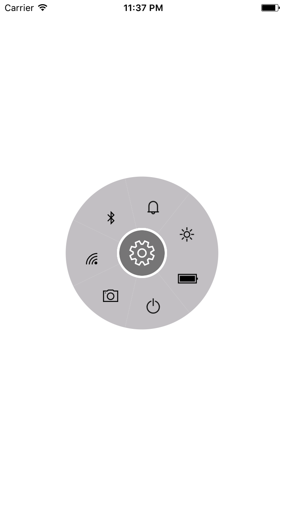
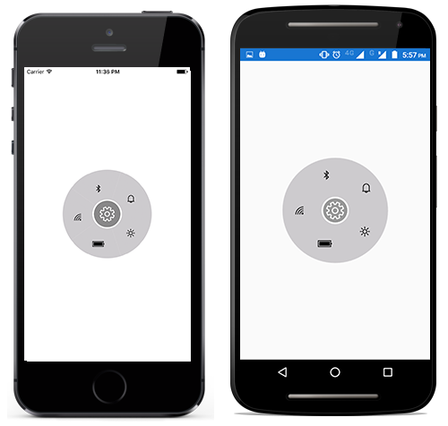
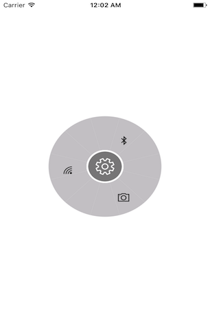

# Layout types

There are two different layout types available for radial menu:

* Default
* Custom

Both the layout types divide the available space equally among all the children in the circular panel.

## Default

Number of segments in the panel is determined by children count in the level. Hence, segment count in each hierarchical level differs, radial menu items are arranged in the sequential order as added in the radial menu.




<?xml version="1.0" encoding="utf-8" ?>
<ContentPage xmlns="http://xamarin.com/schemas/2014/forms"
             xmlns:x="http://schemas.microsoft.com/winfx/2009/xaml"
             xmlns:local="clr-namespace:RadialSample"
             xmlns:radialMenu="clr-namespace:Syncfusion.SfRadialMenu.XForms;assembly=Syncfusion.SfRadialMenu.XForms"
             x:Class="RadialSample.MainPage">
    <radialMenu:SfRadialMenu LayoutType="Default">
        <radialMenu:SfRadialMenu.Items>
            <radialMenu:SfRadialMenuItem Text="Bold" FontSize="12"/>
            <radialMenu:SfRadialMenuItem Text="Copy" FontSize="12"/>
            <radialMenu:SfRadialMenuItem Text="Undo" FontSize="12"/>
            <radialMenu:SfRadialMenuItem Text="Paste" FontSize="12"/>
            <radialMenu:SfRadialMenuItem Text="Color" FontSize="12"/>
        </radialMenu:SfRadialMenu.Items>
    </radialMenu:SfRadialMenu>
</ContentPage>





using Syncfusion.SfRadialMenu.XForms;
using System.Collections.ObjectModel;
using Xamarin.Forms;

namespace RadialSample
{
    public partial class MainPage : ContentPage
    {
        public MainPage()
        {
            InitializeComponent();
            SfRadialMenu radialMenu = new SfRadialMenu()
            {
                LayoutType = LayoutType.Default
            };

            ObservableCollection<SfRadialMenuItem> itemCollection = new ObservableCollection<SfRadialMenuItem>();
            itemCollection.Add(new SfRadialMenuItem() { Text = "Bold", FontSize = 12 });
            itemCollection.Add(new SfRadialMenuItem() { Text = "Copy", FontSize = 12 });
            itemCollection.Add(new SfRadialMenuItem() { Text = "Paste", FontSize = 12 });
            itemCollection.Add(new SfRadialMenuItem() { Text = "Undo", FontSize = 12 });
            itemCollection.Add(new SfRadialMenuItem() { Text = "Color", FontSize = 12 });
            radialMenu.Items = itemCollection;
            this.Content = radialMenu;
        }
    }
}




## Custom

The number of segments in the panel is determined using the `VisibleSegmentsCount` property. Since the segment count in all the hierarchical levels are same, radial menu items are arranged in any order based on the `SegmentIndex` property.





<?xml version="1.0" encoding="utf-8" ?>
<ContentPage xmlns="http://xamarin.com/schemas/2014/forms"
             xmlns:x="http://schemas.microsoft.com/winfx/2009/xaml"
             xmlns:local="clr-namespace:RadialSample"
             xmlns:radialMenu="clr-namespace:Syncfusion.SfRadialMenu.XForms;assembly=Syncfusion.SfRadialMenu.XForms"
             x:Class="RadialSample.MainPage">
    <radialMenu:SfRadialMenu LayoutType="Custom">
        <radialMenu:SfRadialMenu.Items>
            <radialMenu:SfRadialMenuItem Text="Bold" FontSize="12"/>
            <radialMenu:SfRadialMenuItem Text="Copy" FontSize="12"/>
            <radialMenu:SfRadialMenuItem Text="Undo" FontSize="12"/>
            <radialMenu:SfRadialMenuItem Text="Paste" FontSize="12"/>
            <radialMenu:SfRadialMenuItem Text="Color" FontSize="12"/>
        </radialMenu:SfRadialMenu.Items>
    </radialMenu:SfRadialMenu>
</ContentPage>





using Syncfusion.SfRadialMenu.XForms;
using System.Collections.ObjectModel;
using Xamarin.Forms;

namespace RadialSample
{
    public partial class MainPage : ContentPage
    {
        public MainPage()
        {
            InitializeComponent();
            SfRadialMenu radialMenu = new SfRadialMenu()
            {
                LayoutType = LayoutType.Custom
            };

            ObservableCollection<SfRadialMenuItem> itemCollection = new ObservableCollection<SfRadialMenuItem>();
            itemCollection.Add(new SfRadialMenuItem() { Text = "Bold", FontSize = 12 });
            itemCollection.Add(new SfRadialMenuItem() { Text = "Copy", FontSize = 12 });
            itemCollection.Add(new SfRadialMenuItem() { Text = "Paste", FontSize = 12 });
            itemCollection.Add(new SfRadialMenuItem() { Text = "Undo", FontSize = 12 });
            itemCollection.Add(new SfRadialMenuItem() { Text = "Color", FontSize = 12 });
            radialMenu.Items = itemCollection;
            this.Content = radialMenu;
        }
    }
}





### VisibleSegmentsCount

The `VisibleSegmentsCount` property is used to specify the number of segments available in circular panel. When children count is greater than the value given in the VisibleSegmentsCount property, the overflowing children are not arranged in the panel. When children count is lesser than the VisibleSegmentsCount property, then remaining segments are left free.

If number of item count is higher than VisibleItemCount, excessive items will not be shown.

### SegmentIndex

`SegmentIndex` property is used to specify the index of the radial menu item in circular panel. Based on the index, the radial menu items are inserted in the segment. When the SegmentIndex is not specified for a RadialMenuItem the menu item is arranged in the next available free segment.

## Code snippet for VisibleSegmentCount and SegmentIndex





<?xml version="1.0" encoding="utf-8" ?>
<ContentPage xmlns="http://xamarin.com/schemas/2014/forms"
             xmlns:x="http://schemas.microsoft.com/winfx/2009/xaml"
             xmlns:local="clr-namespace:RadialSample"
             xmlns:radialMenu="clr-namespace:Syncfusion.SfRadialMenu.XForms;assembly=Syncfusion.SfRadialMenu.XForms"
             x:Class="RadialSample.MainPage">
    <ContentPage.Resources>
        <ResourceDictionary>
            <OnPlatform x:TypeArguments="x:String"
                        x:Key="customfontfamily" 
                        iOS="Segoe MDL2 Assets" 
                        Android="radialmenu_Segoe MDL2 Assets.ttf" 
                        UWP="radialmenu_Segoe_MDL2_Assets.ttf#Segoe MDL2 Assets"/>
        </ResourceDictionary>
    </ContentPage.Resources>
    <radialMenu:SfRadialMenu x:Name="radialMenu" LayoutType="Custom" VisibleSegmentsCount="3">
        <radialMenu:SfRadialMenu.Items>
            <radialMenu:SfRadialMenuItem 
                    FontIconText="&#xe734;" 
                    IconFontColor="Orange"
                    SegmentIndex="1"
                    IconFontFamily="{StaticResource customfontfamily}">
            </radialMenu:SfRadialMenuItem>
            <radialMenu:SfRadialMenuItem  
                    FontIconText="&#xe700;" 
                    IconFontColor="White"
                    SegmentIndex="0"
                    IconFontFamily="{StaticResource customfontfamily}">
            </radialMenu:SfRadialMenuItem>
            <radialMenu:SfRadialMenuItem 
                        FontIconText="&#xe72d;" 
                        IconFontColor="Green"
                        SegmentIndex="2"
                        IconFontFamily="{StaticResource customfontfamily}">
            </radialMenu:SfRadialMenuItem>
            <radialMenu:SfRadialMenuItem  
                    FontIconText="&#xe735;"
                    IconFontColor="#A52A2A"
                    IconFontFamily="{StaticResource customfontfamily}">
            </radialMenu:SfRadialMenuItem>
        </radialMenu:SfRadialMenu.Items>
    </radialMenu:SfRadialMenu>
</ContentPage>





using Syncfusion.SfRadialMenu.XForms;
using System.Collections.Generic;
using System.Collections.ObjectModel;
using Xamarin.Forms;

namespace RadialSample
{
    public partial class MainPage : ContentPage
    {
        public MainPage()
        {
            InitializeComponent();
            SfRadialMenu radialMenu = new SfRadialMenu()
            {
                LayoutType = LayoutType.Custom,
                VisibleSegmentsCount = 3
            };

            // Adding radial menu items

            string[] layer = new string[]
            {
                "\uE734",
                "\uE700",
                "\uE72d"
            };

            List<int> segmentIndex = new List<int>() { 1, 0, 2 };

            List<Color> iconColor = new List<Color>() { Color.White, Color.Orange, Color.Green };

            // Adding radial menu main menu items
            for (int i = 0; i < radialMenu.VisibleSegmentsCount; i++)
            {
                SfRadialMenuItem mainMenuItems = new SfRadialMenuItem();
                mainMenuItems.IconFontSize = 20;
                mainMenuItems.FontIconText = layer[i];
                mainMenuItems.IconFontFamily = Device.RuntimePlatform == "iOS" ? "Segoe MDL2 Assets" : Device.RuntimePlatform == "Android" ? "radialmenu_Segoe MDL2 Assets.ttf" : "radialmenu_Segoe_MDL2_Assets.ttf#Segoe MDL2 Assets";
                mainMenuItems.IconFontColor = iconColor[i];
                mainMenuItems.SegmentIndex = segmentIndex[i];
                radialMenu.Items.Add(mainMenuItems);
            }

            this.Content = radialMenu;
        }
}
			



