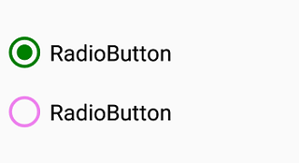

# Visual Customization

## Customizing state color
The default state colors can be customized using `CheckedColor` and `UncheckedColor `properties. The checked state color is updated to `CheckedColor` property value when the state is changed to the checked and unchecked state color is updated to `UncheckedColor` property value when the state is changed to unchecked.



<syncfusion:SfRadioGroup x:Name="radioGroup">
<syncfusion:SfRadioButton x:Name="check" Text="RadioButton" IsChecked="True" CheckedColor="Green"/>
<syncfusion:SfRadioButton x:Name="uncheck" Text="RadioButton" UncheckedColor="Violet"/>
</syncfusion:SfRadioGroup>


SfRadioGroup radioGroup = new SfRadioGroup();
SfRadioButton check = new SfRadioButton();
check.Text = "RadioButton";
check.IsChecked = true;
check.CheckedColor = Color.Green;
SfRadioButton uncheck = new SfRadioButton();
uncheck.Text = "RadioButton";
uncheck.UncheckedColor = Color.Violet;
radioGroup.Children.Add(check);
radioGroup.Children.Add(uncheck);



## Setting appearance of caption text

You can customize the display text appearance of `SfRadioButton` control using the following properties:

* `TextColor` : Changes the color of the text.
* `HorizontalTextAlignment`: Changes the horizontal alignment of the caption text.
* `FontFamily`: Changes the font family of the caption text.
* `FontAttributes`: Sets font attributes(bold/italic/none) of the caption text.
* `FontSize`: Sets font size of the caption text.



<syncfusion:SfRadioButton x:Name="radioButton" Text="RadioButton" IsChecked="True" TextColor="Violet" HorizontalTextAlignment="Center" FontFamily="Arial" FontAttributes="Bold" FontSize="20"/>


SfRadioButton radioButton = new SfRadioButton();
radioButton.Text = "RadioButton";
radioButton.IsChecked = true;
radioButton.TextColor = Color.Violet;
radioButton.HorizontalTextAlignment = TextAlignment.Center;
radioButton.FontFamily = "Arial";
radioButton.FontAttributes = FontAttributes.Bold;
radioButton.FontSize = 20;



This demo can be downloaded from this [link](http://files2.syncfusion.com/Xamarin.Android/Samples/MaskedEdit_VisualCustomize.zip).
