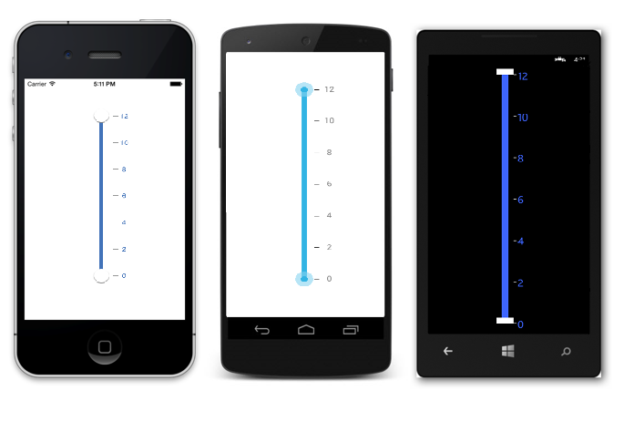

# Getting Started

This section explains you the steps to configure a RangeSlider control in a real-time scenario and also provides a walk-through on some of the customization features available in RangeSlider control.

## Referencing Essential Studio Components in Your Solution	

If you had acquired Essential Studio components through the Xamarin component store interface from within your IDE, then after adding the components to your Xamarin.iOS, Xamarin.Android and Windows Phone projects through the Component manager, you will still need to manually reference the PCL (Portable Class Library) assemblies in the Xamarin.Forms PCL project in your solution. You can do this by manually adding the relevant PCL assembly references to your PCL project contained in the following path inside of your solution folder.

Components/syncfusionessentialstudio-version/lib/pcl/

Alternatively if you had downloaded Essential Studio from Syncfusion.com or through the Xamarin store web interface then all assembly references need to be added manually.

After installing Essential Studio for Xamarin, all the required assemblies can be found in the installation folders, typically

{Syncfusion Installed location}\Essential Studio\syncfusionessentialstudio-version\lib

Eg: C:\Program Files (x86)\Syncfusion\Essential Studio\{{ site.releaseversion }}\lib

Or after downloading through the Xamarin store web interface, all the required assemblies can be found in the below folder

{Download location}\syncfusionessentialstudio-version\lib

You can then add the assembly references to the respective projects as shown below

<table>
<tr>
<th>Project</th>
<th>Required assemblies</th>
</tr>
<tr>
<td>PCL</td>
<td>pcl\Syncfusion.SfRangeSlider.XForms.dll</td>
</tr>
<tr>
<td>Android</td>
<td>android\Syncfusion.SfRangeSlider.Android.dll android\Syncfusion.SfRangeSlider.XForms.Android.dll</td>
</tr>
<tr>
<td>iOS (Classic)</td>
<td>ios\Syncfusion.SfRangeSlider.iOS.dll ios\Syncfusion.SfRangeSlider.XForms.iOS.dll ios\Syncfusion.SfRangeSlider.XForms.dll</td>
</tr>
<tr>
<td>iOS (Unified)</td>
<td>ios-unified\Syncfusion.SfRangeSlider.iOS.dll ios-unified\Syncfusion.SfRangeSlider.XForms.iOS.dll ios-unified\Syncfusion.SfRangeSlider.XForms.dll</td>
</tr>
<tr>
<td>WindowsPhone</td>
<td>wp8\Syncfusion.SfInput.WP8.dll wp8\Syncfusion.SfShared.WP8.dll wp8\Syncfusion.SfRangeSlider.XForms.dll wp8\Syncfusion.SfRangeSlider.XForms.WinPhone.dll</td>
</tr>
<tr>
<td>WindowsPhone 8.1</td>
<td>wp81\Syncfusion.SfInput.WP.dll wp81\Syncfusion.SfShared.WP.dll wp81\Syncfusion.SfRangeSlider.XForms.dll wp81\Syncfusion.SfRangeSlider.XForms.WinPhone.dll</td>
</tr>
<tr>
<td>WinRT</td>
<td>winrt\Syncfusion.SfInput.WinRT.dll winrt\Syncfusion.SfShared.WinRT.dll winrt\Syncfusion.SfRangeSlider.XForms.dll winrt\Syncfusion.SfRangeSlider.XForms.WinRT.dll</td>
</tr>
</table>

Currently an additional step is required for Windows Phone, WindowsPhone 8.1, WinRT and iOS projects. We need to create an instance of the rangeslider custom renderer as shown below. 

Create an instance of SfRangeSliderRenderer in MainPage constructor of the Windows Phone , WindowsPhone 8.1 and WinRT project as shown 



public MainPage()

{

    new SfRangeSliderRenderer();

    ...    

}



Create an instance of SfRangeSliderRenderer in FinishedLaunching overridden method of AppDelegate class in iOS Project as shown below



public override bool FinishedLaunching(UIApplication app, NSDictionary options)

{

    ...

    new SfRangeSliderRenderer ();

    ...

}	



## Add and Configure the RangeSlider

* Adding reference to rangeSlider.



	using Syncfusion.SfRangeSlider.XForms;



* Create an instance of SfRangeSlider.



	SfRangeSlider sfRangeSlider=new SfRangeSlider();
	


## Add Values and Scale

You can set the minimum value for the slider by using the `setMinimum()` and `setMaximum()` properties in the RangeSlider. It can be Numerical values.



	range.Minimum=0; 
	range.Maximum=24; 
	range.DirectionReversed=false; 
	range.RangeEnd=20; 
	range.RangeStart=4;
	range.ShowRange=true; 
	range.Orientation=Orientation.Horizontal;



N> Likewise, `RangeStart` and `RangeEnd` can be set that denote the start range and end range values while dual thumb is used. The `ShowRange` property is used to switch between a single thumb and double thumb. The `Orientation` property sets the type of orientation.

## Add Ticks and Labels for RangeSlider

The ticks can be set by setting the `TickFrequency` and `TickPlacement`. Likewise, value labels can be set by setting the `ShowValueLabel` property to true. The position of label can be varied by the `LabelPlacement` property.



	range.TickFrequency=4; 
	range.ShowValueLabel=true; 
	range.ValuePlacement=ValuePlacement.TopLeft; 
	range.TickPlacement=TickPlacement.BottomRight;



N> The TickFrequency determines the interval between the ticks.

## Add Snapping Type for RangeSlider

The movement of the thumb can be varied in different ways. This is achieved by setting the SnapsTo property.



	range.SnapsTo=SnapsTo.Ticks; 
	range.StepFrequency=6;



## Configure the properties of RangeSlider.



	SfRangeSlider sfRangeSlider = new SfRangeSlider ();
	sfRangeSlider.Minimum=0;
	sfRangeSlider.Maximum=24;
	sfRangeSlider.RangeStart=4;
	sfRangeSlider.RangeEnd=20;
	sfRangeSlider.TickFrequency=4;
	sfRangeSlider.TickPlacement=TickPlacement.Outside;
	sfRangeSlider.SnapsTo=SnapsTo.Ticks;
	sfRangeSlider.ValuePlacement=ValuePlacement.TopLeft;
	sfRangeSlider.ShowRange=True;
	sfRangeSlider.LabelPlacement=LabelPlacement.TopLeft;
	sfRangeSlider.ToolTipPlacement=ToolTipPlacement.TopLeft;



    
                                    
