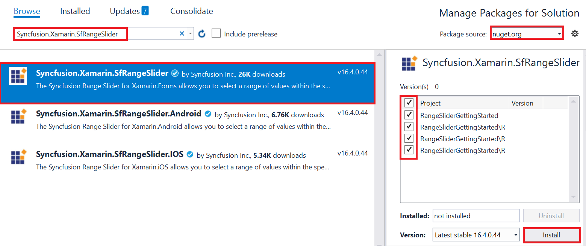

# Getting Started

This section explains you the steps to configure a SfRangeSlider control in a real-time scenario and also provides a walk-through on some of the customization features available in SfRangeSlider control.

## Adding SfRangeSlider Reference

Syncfusion Xamarin components are available in [nuget.org](https://www.nuget.org/). To add SfRangeSlider to your project, open the NuGet package manager in Visual Studio, and search for [Syncfusion.Xamarin.SfRangeSlider](https://www.nuget.org/packages/Syncfusion.Xamarin.SfRangeSlider), and then install it. 

To know more about obtaining our components, refer to these links: [Mac](https://help.syncfusion.com/xamarin/introduction/download-and-installation/mac) and [Windows](https://help.syncfusion.com/xamarin/introduction/download-and-installation/windows). Also, if you prefer to manually refer the assemblies instead of NuGet, refer to this [link](https://help.syncfusion.com/xamarin/introduction/control-dependencies#sfrangeslider) to know about the dependent assemblies for SfRangeSlider. 

N>Install the same version of the SfRangeSlider NUGET in all the projects.

I> Starting with v16.2.0.x, if you reference Syncfusion assemblies from trial setup or from the NuGet feed, you also have to include a license key in your projects. Please refer to this [`link`](https://help.syncfusion.com/common/essential-studio/licensing/license-key) to know about registering Syncfusion license key in your Xamarin application to use our components.

Currently an additional step is required for iOS project. We need to create an instance of the RangeSlider custom renderer as shown below. 

Create an instance of SfRangeSliderRenderer in FinishedLaunching overridden method of AppDelegate class in iOS Project as shown below





public override bool FinishedLaunching(UIApplication app, NSDictionary options)
{
    new SfRangeSliderRenderer ();
}	





* Adding namespace for the added assemblies. 





	<xmlns:range="clr-namespace:Syncfusion.SfRangeSlider.XForms;assembly=Syncfusion.SfRangeSlider.XForms"/>
	




	using Syncfusion.SfRangeSlider.XForms;





* Now instantiate and add the SfRangeSlider control with a required optimal name.





	<range:SfRangeSlider x:Name="rangeSlider"/>
	




	SfRangeSlider rangeSlider=new SfRangeSlider();
	this.Content = rangeSlider;
	




## Set Range

SfRangeSlider provides option to set single thumb and double thumb. While setting the double thumb, each thumb value can be set using `RangeStart` and `RangeEnd` properties.

N> The `ShowRange` property is used to switch between a single thumb and double thumb. 





	<range:SfRangeSlider x:Name="rangeslider" RangeEnd="20" RangeStart="4"  ShowRange="true"/>
	




SfRangeSlider rangeSlider=new SfRangeSlider();
	rangeSlider.RangeEnd=20; 
	rangeSlider.RangeStart=4;
	rangeSlider.ShowRange=true; 
	this.Content = rangeSlider;





## Restricting Values

SfRangeSlider provides option to restrict slider range between minimum and maximum values. Following code explains how to set the range using `Minimum` and `Maximum` properties in the SfRangeSlider.





	<range:SfRangeSlider x:Name="rangeslider" Minimum="0" Maximum="24"/>
	




SfRangeSlider rangeSlider=new SfRangeSlider();
	rangeSlider.RangeEnd=20; 
	rangeSlider.RangeStart=4;
	rangeSlider.ShowRange=true; 
	rangeSlider.Minimum=0; 
	rangeSlider.Maximum=24; 
	this.Content = rangeSlider;




## Adding Snapping Mode

The movement of the thumb can be varied in different ways. This is achieved by setting the `SnapsTo` property.





	<range:SfRangeSlider x:Name="rangeslider" SnapsTo="Ticks" StepFrequency="6"/>
	




SfRangeSlider rangeSlider=new SfRangeSlider();
	rangeSlider.RangeEnd=20; 
	rangeSlider.RangeStart=4;
	rangeSlider.ShowRange=true; 
	rangeSlider.Minimum=0; 
	rangeSlider.Maximum=24; 
	rangeSlider.SnapsTo=SnapsTo.Ticks; 
	rangeSlider.StepFrequency=6;
	this.Content = rangeSlider;



  
                                    
